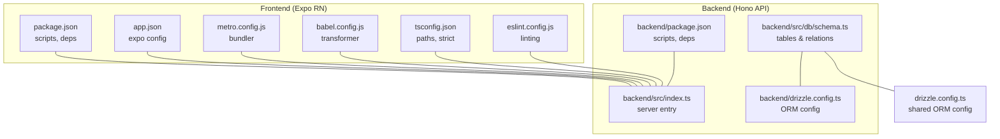
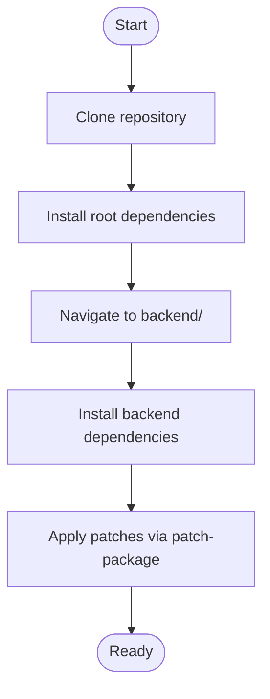
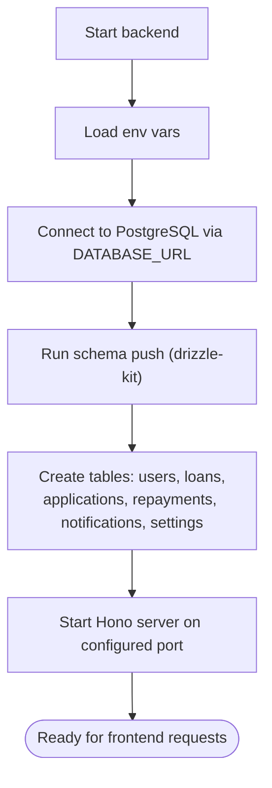
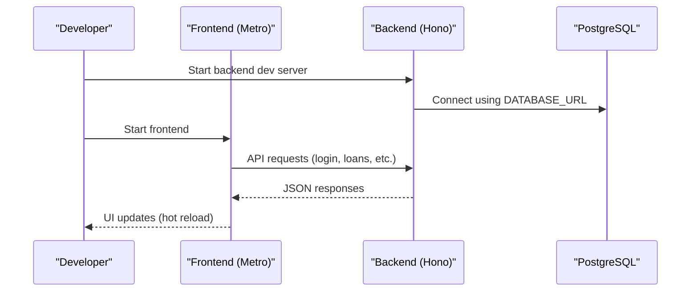
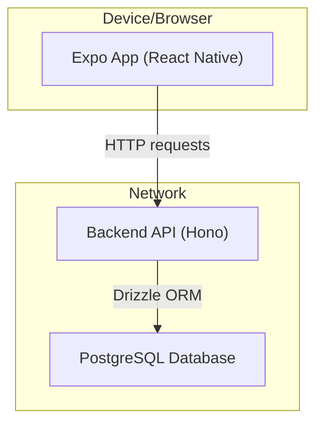

# Getting Started

<cite>
**Referenced Files in This Document**
- [README.md](file://README.md)
- [package.json](file://package.json)
- [backend/package.json](file://backend/package.json)
- [app.json](file://app.json)
- [BACKEND_SETUP.md](file://BACKEND_SETUP.md)
- [drizzle.config.ts](file://drizzle.config.ts)
- [backend/drizzle.config.ts](file://backend/drizzle.config.ts)
- [backend/src/db/schema.ts](file://backend/src/db/schema.ts)
- [backend/src/index.ts](file://backend/src/index.ts)
- [eas.json](file://eas.json)
- [metro.config.js](file://metro.config.js)
- [babel.config.js](file://babel.config.js)
- [tsconfig.json](file://tsconfig.json)
- [eslint.config.js](file://eslint.config.js)
- [patches/expo-asset+12.0.12.patch](file://patches/expo-asset+12.0.12.patch)
</cite>

## Table of Contents
1. [Introduction](#introduction)
2. [Project Structure](#project-structure)
3. [Prerequisites](#prerequisites)
4. [Installation](#installation)
5. [Environment Configuration](#environment-configuration)
6. [Database Setup](#database-setup)
7. [Development Workflow](#development-workflow)
8. [Testing Options](#testing-options)
9. [Architecture Overview](#architecture-overview)
10. [Troubleshooting Guide](#troubleshooting-guide)
11. [Conclusion](#conclusion)

## Introduction
This guide walks you through setting up the PHOENIX development environment from scratch. You will configure prerequisites, install dependencies for both the frontend and backend, set up the database with PostgreSQL, run migrations, and start both the backend server and the React Native frontend. It also covers testing options including Expo Go, development builds, web preview, and simulator testing.

## Project Structure
PHOENIX follows a monorepo-like structure with a React Native frontend and a separate backend service:
- Frontend: Expo + React Native application under the repository root
- Backend: Node.js/Hono API under the backend/ directory
- Shared configuration: Drizzle ORM configuration and TypeScript paths
- Tooling: Metro bundler, Babel, ESLint, and EAS Build configuration

**Diagram sources**
- [package.json:1-84](file://package.json#L1-L84)
- [backend/package.json:1-46](file://backend/package.json#L1-L46)
- [app.json:1-69](file://app.json#L1-L69)
- [drizzle.config.ts:1-15](file://drizzle.config.ts#L1-L15)
- [backend/drizzle.config.ts:1-14](file://backend/drizzle.config.ts#L1-L14)
- [backend/src/db/schema.ts:1-146](file://backend/src/db/schema.ts#L1-L146)
- [backend/src/index.ts:1-76](file://backend/src/index.ts#L1-L76)

**Section sources**
- [README.md:117-204](file://README.md#L117-L204)
- [package.json:1-84](file://package.json#L1-L84)
- [backend/package.json:1-46](file://backend/package.json#L1-L46)
- [app.json:1-69](file://app.json#L1-L69)

## Prerequisites
Ensure your development machine meets the following requirements:
- Node.js 18 or newer
- A physical iOS or Android device for testing with Expo Go
- Expo Go app installed on your device
- A PostgreSQL-compatible database (Neon recommended for backend setup)

Note: While web browsers can run the Expo web export, full native capabilities (e.g., push notifications, device APIs) require a physical device or a simulator/emulator.

**Section sources**
- [README.md:124-127](file://README.md#L124-L127)
- [BACKEND_SETUP.md:61-67](file://BACKEND_SETUP.md#L61-L67)

## Installation
Follow these steps to clone and install dependencies:

1. Clone the repository
   - Use the repository URL and clone into a local directory

2. Install root dependencies
   - Run the package manager install script at the repository root

3. Install backend dependencies
   - Navigate to the backend directory and install its dependencies

4. Apply patches (if needed)
   - The project includes a patch for asset loading in development; the postinstall script runs patch-package automatically

**Diagram sources**
- [package.json:5-7](file://package.json#L5-L7)
- [README.md:129-142](file://README.md#L129-L142)

**Section sources**
- [README.md:129-142](file://README.md#L129-L142)
- [package.json:5-7](file://package.json#L5-L7)

## Environment Configuration
Configure environment variables for the backend:

1. Copy the environment template to create .env
2. Edit the copied file with your database connection string and secrets
3. Ensure the frontend can reach the backend server

Key environment variables (backend):
- DATABASE_URL: PostgreSQL connection string
- JWT_SECRET: Secret key for signing tokens
- PORT: Backend server port (default 5000)
- FRONTEND_URL: Origin of your frontend (used for CORS)

Notes:
- The backend loads environment variables at startup
- The frontend uses Metro to proxy API requests during development

**Section sources**
- [README.md:144-152](file://README.md#L144-L152)
- [BACKEND_SETUP.md:69-83](file://BACKEND_SETUP.md#L69-L83)
- [backend/src/index.ts:14-15](file://backend/src/index.ts#L14-L15)

## Database Setup
Set up the database schema and start the backend server:

1. Navigate to the backend directory
2. Push the schema to your PostgreSQL database
3. Generate migrations (optional, for future schema changes)
4. Start the backend server in development mode

What gets created:
- Users table (authentication and profiles)
- Loans table (loan lifecycle)
- Loan applications table (applications and admin reviews)
- Repayments table (payment tracking)
- Notifications table (user alerts)
- Settings table (system configuration keys)

**Diagram sources**
- [BACKEND_SETUP.md:85-106](file://BACKEND_SETUP.md#L85-L106)
- [backend/src/index.ts:14-15](file://backend/src/index.ts#L14-L15)
- [backend/src/db/schema.ts:1-146](file://backend/src/db/schema.ts#L1-L146)

**Section sources**
- [README.md:156-182](file://README.md#L156-L182)
- [BACKEND_SETUP.md:85-106](file://BACKEND_SETUP.md#L85-L106)
- [backend/src/db/schema.ts:1-146](file://backend/src/db/schema.ts#L1-L146)

## Development Workflow
Start the backend and frontend servers concurrently:

1. Terminal 1: Start the backend server
   - Use the development script in the backend directory

2. Terminal 2: Start the frontend
   - Use the Expo start command at the repository root

During development:
- The frontend connects to the backend via the configured API base URL
- Hot reload is enabled for rapid iteration
- Web preview is available for quick browser testing

**Diagram sources**
- [README.md:184-204](file://README.md#L184-L204)
- [backend/src/index.ts:63-76](file://backend/src/index.ts#L63-L76)

**Section sources**
- [README.md:184-204](file://README.md#L184-L204)
- [package.json:12-18](file://package.json#L12-L18)

## Testing Options
Choose the most appropriate testing method for your workflow:

- Expo Go (physical device)
  - Scan the QR code from the Metro terminal to run on your device
  - Limited by Expo Go’s runtime constraints

- Development build (physical device)
  - Use EAS Build to create internal distribution builds
  - Enables full native capabilities and faster iteration than Expo Go

- Web preview (browser)
  - Use the web export option to test in desktop browsers
  - Useful for UI and non-native features

- Simulator/emulator
  - iOS Simulator or Android Emulator for device-specific testing
  - Requires platform-specific setup

Build configuration:
- EAS Build profiles are preconfigured for development, preview, and production distributions

**Section sources**
- [README.md:198-202](file://README.md#L198-L202)
- [eas.json:6-17](file://eas.json#L6-L17)

## Architecture Overview
High-level architecture showing how the frontend and backend interact:

**Diagram sources**
- [backend/src/index.ts:54-61](file://backend/src/index.ts#L54-L61)
- [drizzle.config.ts:7-14](file://drizzle.config.ts#L7-L14)

**Section sources**
- [backend/src/index.ts:1-76](file://backend/src/index.ts#L1-L76)
- [drizzle.config.ts:1-15](file://drizzle.config.ts#L1-L15)

## Troubleshooting Guide
Common setup issues and resolutions:

- Database connection failures
  - Verify the DATABASE_URL is correct and the database is active
  - Ensure SSL mode is enabled in the connection string

- Port already in use
  - Change the PORT environment variable
  - Identify and terminate the conflicting process

- CORS errors
  - Ensure FRONTEND_URL matches the origin of your frontend
  - Restart the backend after updating environment variables

- Asset loading in development
  - The project includes a patch to support HTTPS development servers
  - The postinstall script applies the patch automatically

- Backend health and docs
  - Health endpoint: GET /health
  - API documentation: GET /docs

**Section sources**
- [BACKEND_SETUP.md:172-185](file://BACKEND_SETUP.md#L172-L185)
- [patches/expo-asset+12.0.12.patch:1-17](file://patches/expo-asset+12.0.12.patch#L1-L17)
- [backend/src/index.ts:28-52](file://backend/src/index.ts#L28-L52)

## Conclusion
You now have a complete understanding of how to set up PHOENIX locally, configure the backend database, and run both the backend and frontend. Use the testing options that best fit your workflow, and refer to the troubleshooting section when encountering common issues. For advanced customization, explore the frontend configuration files and backend route definitions.