# Administrative Loan Controls

<cite>
**Referenced Files in This Document**
- [applications.ts](file://backend/src/routes/applications.ts)
- [loans.ts](file://backend/src/routes/loans.ts)
- [admin.ts](file://backend/src/routes/admin.ts)
- [notifications.ts](file://backend/src/routes/notifications.ts)
- [auth.ts](file://backend/src/middleware/auth.ts)
- [schema.ts](file://backend/src/db/schema.ts)
- [index.ts](file://backend/src/index.ts)
- [AdminContext.tsx](file://contexts/AdminContext.tsx)
- [applications.tsx](file://app/admin/(tabs)/applications.tsx)
- [index.tsx](file://app/admin/(tabs)/index.tsx)
- [settings.tsx](file://app/admin/(tabs)/settings.tsx)
- [users.tsx](file://app/admin/(tabs)/users.tsx)
- [login.tsx](file://app/admin/login.tsx)
- [NotificationService.ts](file://services/NotificationService.ts)
</cite>

## Table of Contents
1. [Introduction](#introduction)
2. [Project Structure](#project-structure)
3. [Core Components](#core-components)
4. [Architecture Overview](#architecture-overview)
5. [Detailed Component Analysis](#detailed-component-analysis)
6. [Dependency Analysis](#dependency-analysis)
7. [Performance Considerations](#performance-considerations)
8. [Troubleshooting Guide](#troubleshooting-guide)
9. [Conclusion](#conclusion)
10. [Appendices](#appendices)

## Introduction
This document describes the administrative loan management controls for the Phoenix Loan platform. It covers staff workflows for reviewing and approving loan applications, managing users, configuring rates and channels, and monitoring dashboards. It also documents backend administrative endpoints for updating loan statuses, disbursement and repayment authorizations, and retrieving aggregated statistics. The document explains risk assessment considerations, collateral evaluation, and disbursement authorization. It includes examples of administrative actions, approval decision matrices, and audit trail documentation. Finally, it addresses integration between the admin interface and user notification systems, along with security measures, role-based access controls, and administrative logging for compliance.

## Project Structure
The administrative system spans a React Native front end and a Hono-based backend with PostgreSQL persistence:
- Front end: Admin screens for applications, users, settings, and overview/dashboard.
- Back end: REST-like routes for applications, loans, admin, notifications, and authentication middleware.
- Shared data model: Drizzle ORM schema defining users, loan applications, loans, repayments, notifications, and settings.

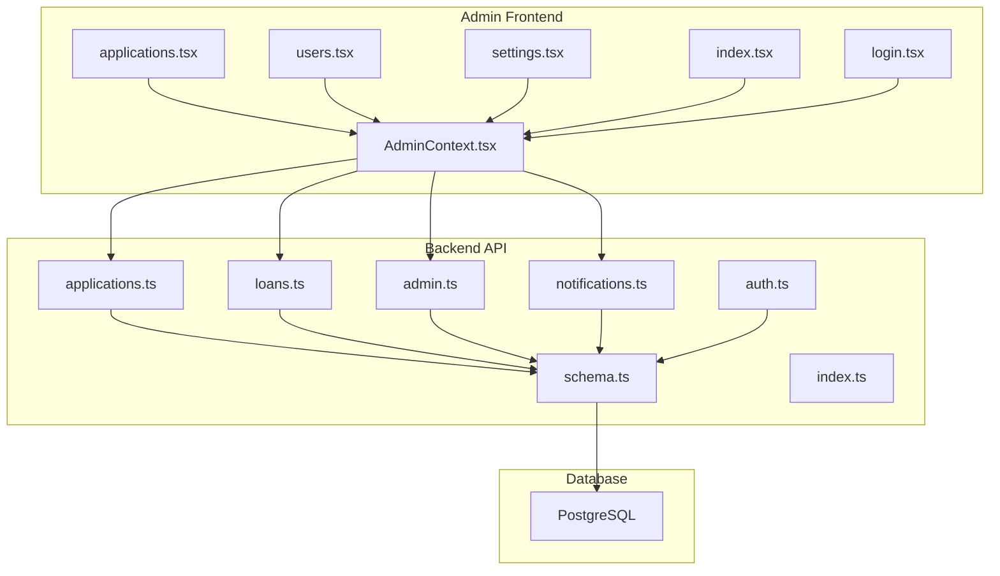

**Diagram sources**
- [applications.tsx](file://app/admin/(tabs)/applications.tsx)
- [users.tsx](file://app/admin/(tabs)/users.tsx)
- [settings.tsx](file://app/admin/(tabs)/settings.tsx)
- [index.tsx](file://app/admin/(tabs)/index.tsx)
- [login.tsx](file://app/admin/login.tsx)
- [AdminContext.tsx](file://contexts/AdminContext.tsx)
- [applications.ts](file://backend/src/routes/applications.ts)
- [loans.ts](file://backend/src/routes/loans.ts)
- [admin.ts](file://backend/src/routes/admin.ts)
- [notifications.ts](file://backend/src/routes/notifications.ts)
- [auth.ts](file://backend/src/middleware/auth.ts)
- [schema.ts](file://backend/src/db/schema.ts)
- [index.ts](file://backend/src/index.ts)

**Section sources**
- [index.ts:54-61](file://backend/src/index.ts#L54-L61)
- [schema.ts:1-146](file://backend/src/db/schema.ts#L1-L146)

## Core Components
- AdminContext: Centralizes admin state, session management, and administrative actions (approve, reject, disburse, complete). It orchestrates API calls to backend endpoints and persists local caches for offline resilience.
- Admin Screens:
  - Applications: List and manage loan applications with status filters, expandable details, and action buttons.
  - Users: Manage user profiles, KYC verification, credit scores, loan limits, blacklisting, and password resets.
  - Settings: Configure interest rates, penalties, processing fees, loan parameters, and disbursement channels.
  - Overview: Dashboard with stats, recent applications, and quick actions.
- Backend Routes:
  - Applications: Retrieve, create, and review applications; supports status transitions.
  - Loans: Status updates, disbursement, marking as repaid, and completion.
  - Admin: Users, loans, stats, and settings retrieval and updates.
  - Notifications: CRUD operations for user notifications.
  - Auth: JWT-based middleware for user and admin roles.

**Section sources**
- [AdminContext.tsx:135-521](file://contexts/AdminContext.tsx#L135-L521)
- [applications.tsx](file://app/admin/(tabs)/applications.tsx#L155-L328)
- [users.tsx](file://app/admin/(tabs)/users.tsx#L278-L399)
- [settings.tsx](file://app/admin/(tabs)/settings.tsx#L174-L407)
- [index.tsx](file://app/admin/(tabs)/index.tsx#L121-L298)
- [applications.ts:24-167](file://backend/src/routes/applications.ts#L24-L167)
- [loans.ts:92-317](file://backend/src/routes/loans.ts#L92-L317)
- [admin.ts:8-171](file://backend/src/routes/admin.ts#L8-L171)
- [notifications.ts:8-105](file://backend/src/routes/notifications.ts#L8-L105)

## Architecture Overview
The admin workflow integrates the front end and back end through typed requests and responses. AdminContext encapsulates business logic and user notifications. Backend routes enforce role-based access for admin-only operations and maintain audit trails via timestamps and reviewer metadata.

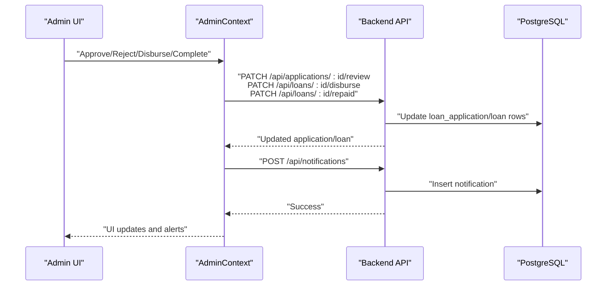

**Diagram sources**
- [AdminContext.tsx:311-413](file://contexts/AdminContext.tsx#L311-L413)
- [applications.ts:140-165](file://backend/src/routes/applications.ts#L140-L165)
- [loans.ts:224-290](file://backend/src/routes/loans.ts#L224-L290)
- [notifications.ts:71-90](file://backend/src/routes/notifications.ts#L71-L90)

**Section sources**
- [AdminContext.tsx:304-413](file://contexts/AdminContext.tsx#L304-L413)
- [applications.ts:140-165](file://backend/src/routes/applications.ts#L140-L165)
- [loans.ts:224-290](file://backend/src/routes/loans.ts#L224-L290)
- [notifications.ts:71-90](file://backend/src/routes/notifications.ts#L71-L90)

## Detailed Component Analysis

### Administrative Loan Application Review and Approval
- Pending applications are displayed with status badges, requested amount, repayment, duration, and interest rate. Expandable cards show employment, income, disbursement method, account details, next of kin, processing fee, interest, and collateral presence.
- Action buttons:
  - Approve: Transitions application status to approved and sends a success notification to the applicant.
  - Reject: Marks application as rejected and notifies the applicant.
  - Disburse: Updates loan status to disbursed with disbursement metadata.
  - Mark as Repaid: Completes the loan with repayment details and records a repayment entry.

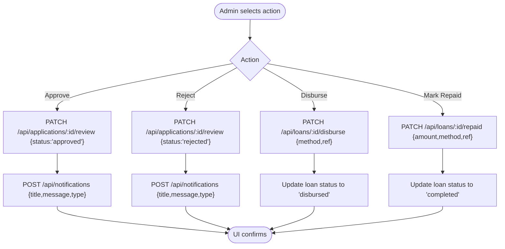

**Diagram sources**
- [applications.tsx](file://app/admin/(tabs)/applications.tsx#L170-L250)
- [AdminContext.tsx:311-413](file://contexts/AdminContext.tsx#L311-L413)
- [applications.ts:140-165](file://backend/src/routes/applications.ts#L140-L165)
- [loans.ts:224-290](file://backend/src/routes/loans.ts#L224-L290)
- [notifications.ts:71-90](file://backend/src/routes/notifications.ts#L71-L90)

**Section sources**
- [applications.tsx](file://app/admin/(tabs)/applications.tsx#L25-L153)
- [AdminContext.tsx:311-413](file://contexts/AdminContext.tsx#L311-L413)
- [applications.ts:140-165](file://backend/src/routes/applications.ts#L140-L165)
- [loans.ts:224-290](file://backend/src/routes/loans.ts#L224-L290)

### Loan Officer Dashboard
- Overview screen displays total revenue, user counts, pending approvals, and quick actions to applications, users, and settings.
- Recent applications list allows quick navigation to the applications screen.
- Pending approvals alert highlights urgent tasks.

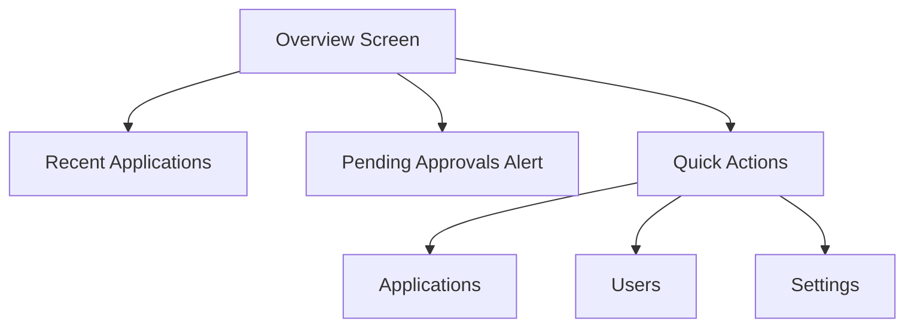

**Diagram sources**
- [index.tsx](file://app/admin/(tabs)/index.tsx#L121-L298)

**Section sources**
- [index.tsx](file://app/admin/(tabs)/index.tsx#L121-L298)

### Administrative Login and Session Management
- Admin login validates credentials against a predefined admin account and stores a session flag locally.
- On successful login, the admin is redirected to the overview dashboard.

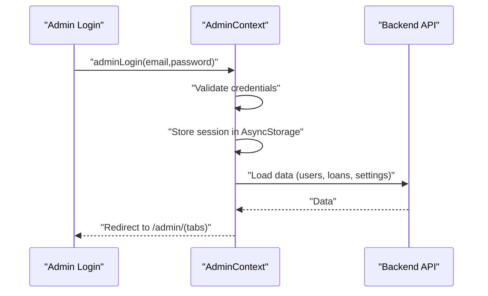

**Diagram sources**
- [login.tsx:17-59](file://app/admin/login.tsx#L17-L59)
- [AdminContext.tsx:287-302](file://contexts/AdminContext.tsx#L287-L302)
- [AdminContext.tsx:199-285](file://contexts/AdminContext.tsx#L199-L285)

**Section sources**
- [login.tsx:17-59](file://app/admin/login.tsx#L17-L59)
- [AdminContext.tsx:287-302](file://contexts/AdminContext.tsx#L287-L302)
- [AdminContext.tsx:199-285](file://contexts/AdminContext.tsx#L199-L285)

### User Management and Risk Controls
- Users screen lists registered users with quick info (credit score, loan limit, number of loans).
- Admin actions per user:
  - Verify KYC
  - Set loan limit
  - Edit credit score
  - Change password
  - Blacklist/unblacklist
- These actions update user attributes and can influence future loan eligibility and risk scoring.

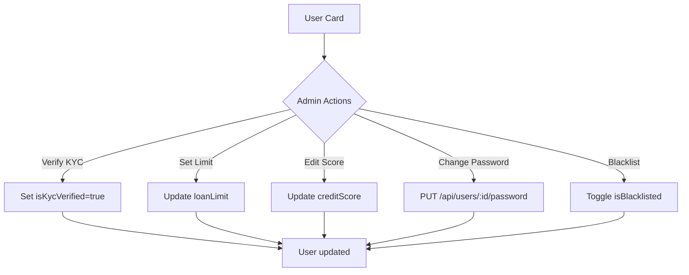

**Diagram sources**
- [users.tsx](file://app/admin/(tabs)/users.tsx#L111-L276)
- [users.tsx](file://app/admin/(tabs)/users.tsx#L318-L335)
- [AdminContext.tsx:415-440](file://contexts/AdminContext.tsx#L415-L440)

**Section sources**
- [users.tsx](file://app/admin/(tabs)/users.tsx#L111-L276)
- [users.tsx](file://app/admin/(tabs)/users.tsx#L318-L335)
- [AdminContext.tsx:415-440](file://contexts/AdminContext.tsx#L415-L440)

### Settings and Configuration
- Interest rate configuration per term, late penalty rate, processing fee percentage, loan parameters (min/max amounts and durations), and disbursement channel numbers.
- Changes are persisted to backend settings and reflected immediately in the admin UI.

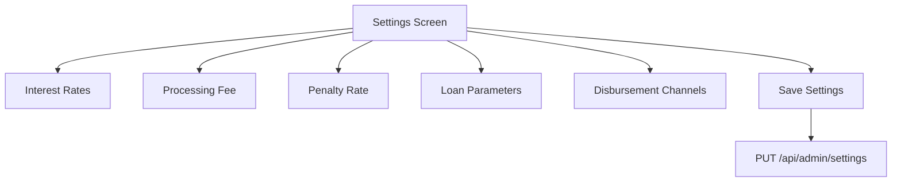

**Diagram sources**
- [settings.tsx](file://app/admin/(tabs)/settings.tsx#L174-L407)
- [AdminContext.tsx:462-478](file://contexts/AdminContext.tsx#L462-L478)
- [admin.ts:146-168](file://backend/src/routes/admin.ts#L146-L168)

**Section sources**
- [settings.tsx](file://app/admin/(tabs)/settings.tsx#L174-L407)
- [AdminContext.tsx:462-478](file://contexts/AdminContext.tsx#L462-L478)
- [admin.ts:146-168](file://backend/src/routes/admin.ts#L146-L168)

### Backend Administrative Endpoints
- Applications:
  - GET /api/applications: Admin view of all applications with user and loan relations.
  - GET /api/applications/my-applications: User’s applications.
  - GET /api/applications/:id: Single application with relations.
  - POST /api/applications: Create application (requires user context).
  - PATCH /api/applications/:id/review: Review application (admin).
- Loans:
  - GET /api/loans: Admin view of all loans with user and repayments.
  - GET /api/loans/my-loans: User’s loans.
  - GET /api/loans/:id: Single loan with relations.
  - POST /api/loans: Create loan (requires user context).
  - PATCH /api/loans/:id/status: Update loan status (admin).
  - PATCH /api/loans/:id/disburse: Disburse loan (admin).
  - PATCH /api/loans/:id/repaid: Mark as repaid (admin).
  - PATCH /api/loans/:id/complete: Complete loan (admin).
- Admin:
  - GET /api/admin/users: Paginated users with derived fields.
  - GET /api/admin/loans: Paginated loans with user relations.
  - GET /api/admin/stats: Aggregated stats (users, loans, active, completed, total disbursed).
  - GET /api/admin/settings: Current settings.
  - PUT /api/admin/settings: Update settings.
- Notifications:
  - GET /api/notifications: User notifications with unread count.
  - PATCH /api/notifications/:id/read: Mark as read.
  - PATCH /api/notifications/read-all: Mark all as read.
  - POST /api/notifications: Create notification.
  - DELETE /api/notifications/read: Delete read notifications.

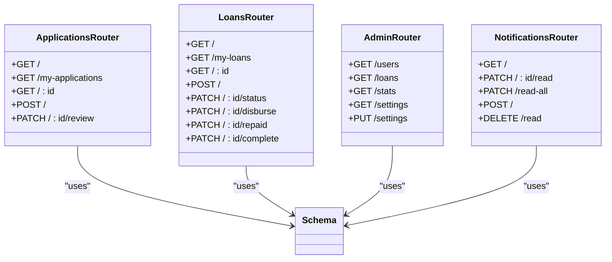

**Diagram sources**
- [applications.ts:24-167](file://backend/src/routes/applications.ts#L24-L167)
- [loans.ts:92-317](file://backend/src/routes/loans.ts#L92-L317)
- [admin.ts:8-171](file://backend/src/routes/admin.ts#L8-L171)
- [notifications.ts:8-105](file://backend/src/routes/notifications.ts#L8-L105)
- [schema.ts:1-146](file://backend/src/db/schema.ts#L1-L146)

**Section sources**
- [applications.ts:24-167](file://backend/src/routes/applications.ts#L24-L167)
- [loans.ts:92-317](file://backend/src/routes/loans.ts#L92-L317)
- [admin.ts:8-171](file://backend/src/routes/admin.ts#L8-L171)
- [notifications.ts:8-105](file://backend/src/routes/notifications.ts#L8-L105)

### Risk Assessment, Collateral Evaluation, and Disbursement Authorization
- Risk assessment considerations:
  - Employment status and monthly income are captured in applications.
  - Credit score and loan limits are maintained per user.
  - Late penalty and processing fee rates are configurable.
- Collateral evaluation:
  - Collateral presence is recorded in the application model; the admin UI surfaces this indicator.
- Disbursement authorization:
  - Admin must approve applications before disbursement.
  - Disbursement endpoint sets status to disbursed and records method/reference.

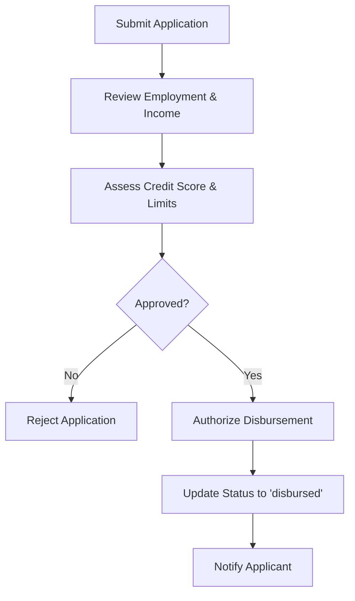

**Diagram sources**
- [applications.ts:19-22](file://backend/src/routes/applications.ts#L19-L22)
- [schema.ts:48-63](file://backend/src/db/schema.ts#L48-L63)
- [AdminContext.tsx:311-386](file://contexts/AdminContext.tsx#L311-L386)

**Section sources**
- [applications.ts:19-22](file://backend/src/routes/applications.ts#L19-L22)
- [schema.ts:48-63](file://backend/src/db/schema.ts#L48-L63)
- [AdminContext.tsx:311-386](file://contexts/AdminContext.tsx#L311-L386)

### Approval Decision Matrices
- Example decision matrix for application review:
  - If employment status verified and monthly income meets threshold → Approve.
  - If credit score below threshold → Reject.
  - If collateral present and app amount within user limit → Approve.
  - Otherwise → Reject.
- Disbursement matrix:
  - If application approved and funds transferred → Disburse.
  - If overdue without repayment → Hold disbursement until resolution.
- Completion matrix:
  - If full repayment received → Complete.
  - If partial repayment → Update status to active with updated totals.

[No sources needed since this section provides conceptual guidance]

### Audit Trail Documentation
- Backend maintains timestamps for creation, review, and updates.
- Reviewer identity is recorded on application reviews.
- Loan status transitions are auditable via backend logs and database updates.

**Section sources**
- [applications.ts:140-165](file://backend/src/routes/applications.ts#L140-L165)
- [loans.ts:224-290](file://backend/src/routes/loans.ts#L224-L290)
- [schema.ts:48-63](file://backend/src/db/schema.ts#L48-L63)

### Integration with User Notification Systems
- Admin actions trigger notifications to applicants:
  - Approved: Success notification.
  - Rejected: Warning notification.
- Notifications are persisted to the database and can be retrieved by users.
- Local and backend notification delivery is supported.

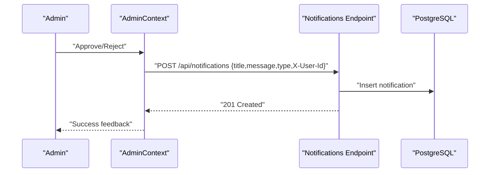

**Diagram sources**
- [AdminContext.tsx:319-357](file://contexts/AdminContext.tsx#L319-L357)
- [notifications.ts:71-90](file://backend/src/routes/notifications.ts#L71-L90)
- [NotificationService.ts:93-114](file://services/NotificationService.ts#L93-L114)

**Section sources**
- [AdminContext.tsx:319-357](file://contexts/AdminContext.tsx#L319-L357)
- [notifications.ts:71-90](file://backend/src/routes/notifications.ts#L71-L90)
- [NotificationService.ts:93-114](file://services/NotificationService.ts#L93-L114)

### Security Measures and Role-Based Access Control
- Authentication middleware verifies JWT tokens and attaches user context.
- Admin-only routes require role=admin.
- CORS configuration restricts origins and headers.
- Environment variables load database credentials securely.

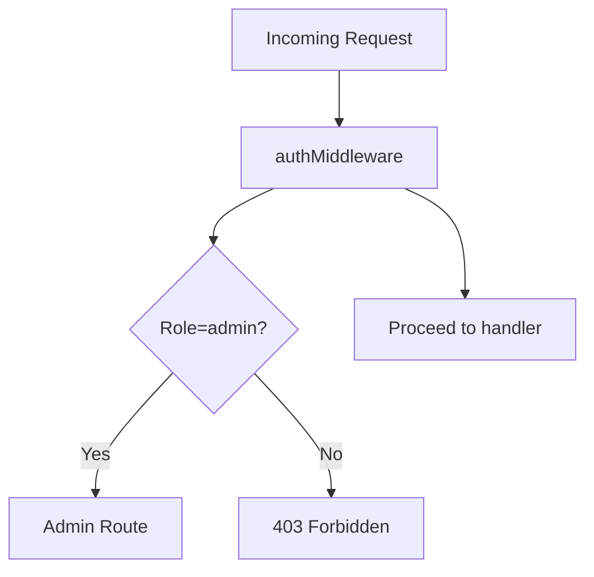

**Diagram sources**
- [auth.ts:10-47](file://backend/src/middleware/auth.ts#L10-L47)
- [index.ts:20-26](file://backend/src/index.ts#L20-L26)

**Section sources**
- [auth.ts:10-47](file://backend/src/middleware/auth.ts#L10-L47)
- [index.ts:20-26](file://backend/src/index.ts#L20-L26)

## Dependency Analysis
- AdminContext depends on backend routes for all administrative operations and on AsyncStorage for offline caching.
- Admin screens depend on AdminContext for state and actions.
- Backend routes depend on Drizzle ORM schema for database operations.
- Notifications integrate with both backend routes and local notification service.

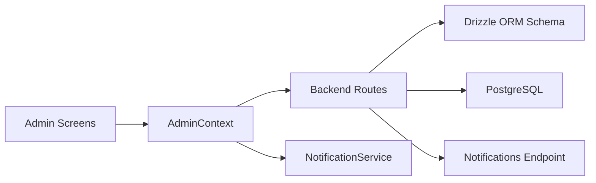

**Diagram sources**
- [AdminContext.tsx:199-285](file://contexts/AdminContext.tsx#L199-L285)
- [applications.tsx](file://app/admin/(tabs)/applications.tsx#L155-L328)
- [users.tsx](file://app/admin/(tabs)/users.tsx#L278-L399)
- [settings.tsx](file://app/admin/(tabs)/settings.tsx#L174-L407)
- [index.tsx](file://app/admin/(tabs)/index.tsx#L121-L298)
- [applications.ts:24-167](file://backend/src/routes/applications.ts#L24-L167)
- [loans.ts:92-317](file://backend/src/routes/loans.ts#L92-L317)
- [admin.ts:8-171](file://backend/src/routes/admin.ts#L8-L171)
- [notifications.ts:8-105](file://backend/src/routes/notifications.ts#L8-L105)
- [schema.ts:1-146](file://backend/src/db/schema.ts#L1-L146)
- [NotificationService.ts:93-114](file://services/NotificationService.ts#L93-L114)

**Section sources**
- [AdminContext.tsx:199-285](file://contexts/AdminContext.tsx#L199-L285)
- [applications.ts:24-167](file://backend/src/routes/applications.ts#L24-L167)
- [loans.ts:92-317](file://backend/src/routes/loans.ts#L92-L317)
- [admin.ts:8-171](file://backend/src/routes/admin.ts#L8-L171)
- [notifications.ts:8-105](file://backend/src/routes/notifications.ts#L8-L105)
- [schema.ts:1-146](file://backend/src/db/schema.ts#L1-L146)
- [NotificationService.ts:93-114](file://services/NotificationService.ts#L93-L114)

## Performance Considerations
- Pagination for users and loans reduces payload sizes and improves responsiveness.
- Aggregation queries for stats minimize round trips and compute on the database layer.
- Offline caching with AsyncStorage ensures admin UI remains usable during network interruptions.
- Local animations and haptics enhance UX without impacting backend throughput.

[No sources needed since this section provides general guidance]

## Troubleshooting Guide
- Unauthorized access: Ensure proper JWT token is attached; admin routes require role=admin.
- Notification failures: Local notifications may succeed even if backend fails; verify backend connectivity and user ID header.
- Disbursement errors: Confirm loan exists and status transitions are valid; check backend logs for SQL errors.
- Settings not saving: Verify PUT to admin settings succeeds and client-side state updates accordingly.

**Section sources**
- [auth.ts:10-47](file://backend/src/middleware/auth.ts#L10-L47)
- [notifications.ts:71-90](file://backend/src/routes/notifications.ts#L71-L90)
- [AdminContext.tsx:363-413](file://contexts/AdminContext.tsx#L363-L413)
- [admin.ts:146-168](file://backend/src/routes/admin.ts#L146-L168)

## Conclusion
The administrative loan controls provide a comprehensive, role-based system for reviewing applications, managing users, configuring rates and channels, and authorizing disbursements and completions. The integration with user notifications ensures timely communication, while backend endpoints and schema support robust auditing and compliance. AdminContext centralizes business logic and enhances resilience with offline caching, enabling efficient loan officer workflows.

## Appendices
- Data Model Overview

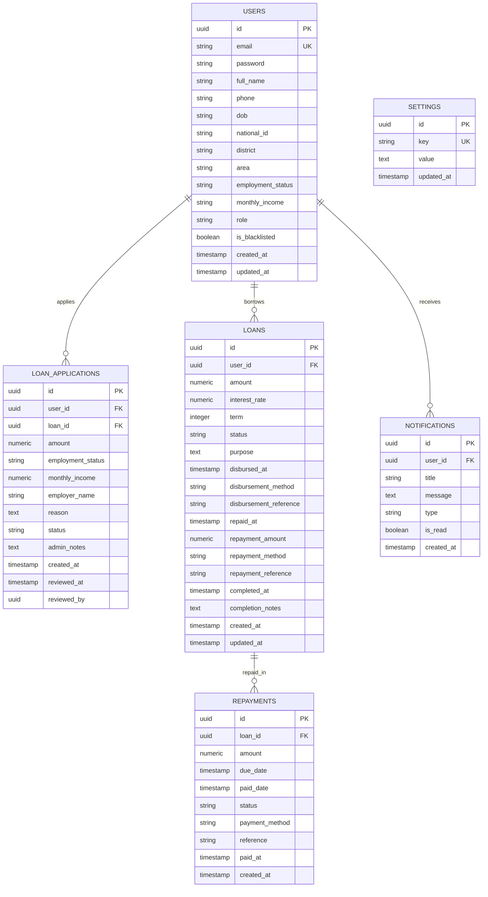

**Diagram sources**
- [schema.ts:4-96](file://backend/src/db/schema.ts#L4-L96)