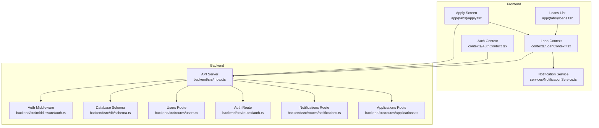
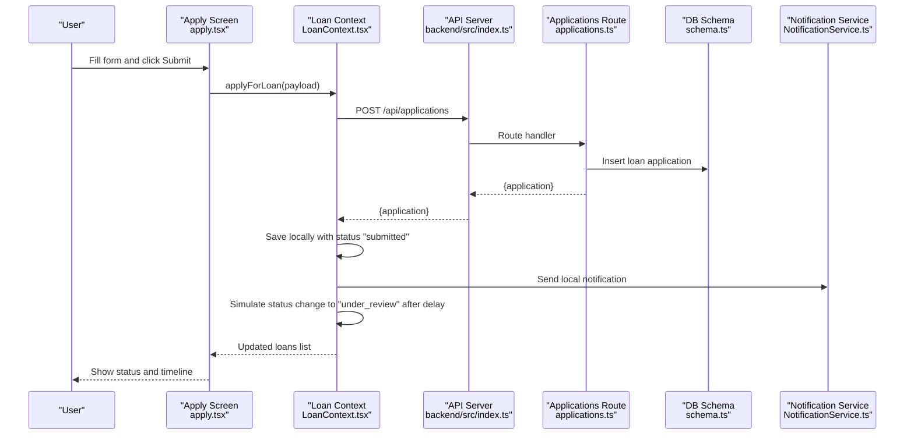
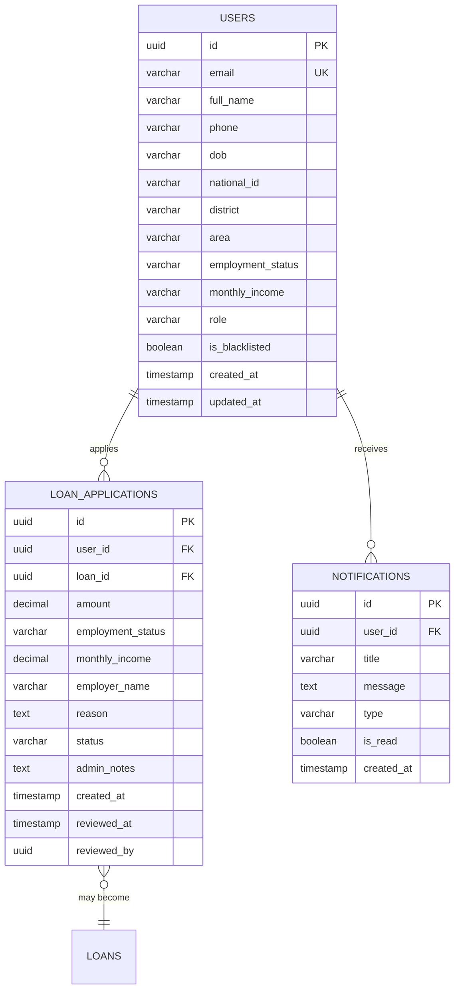
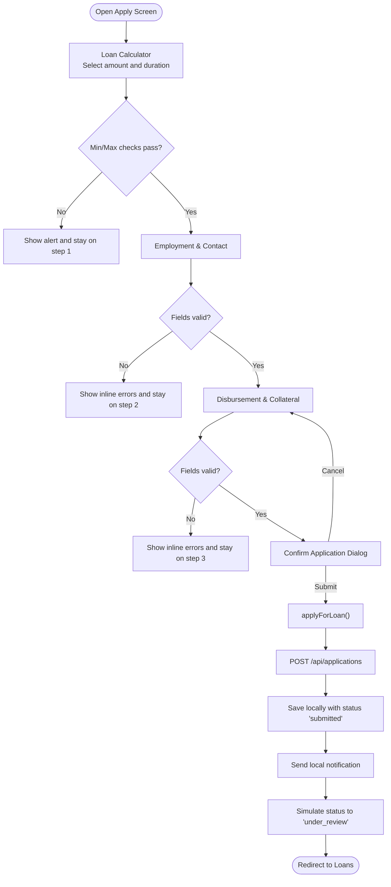
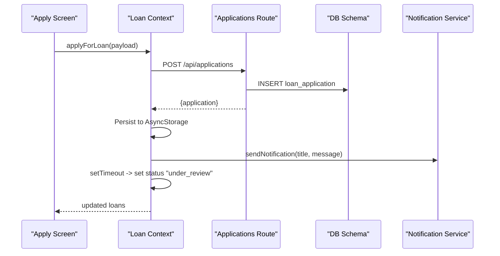
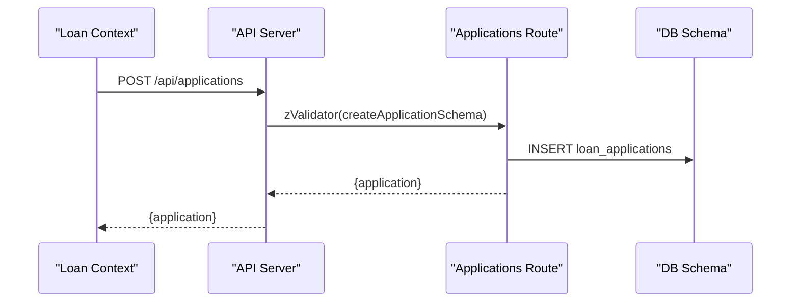
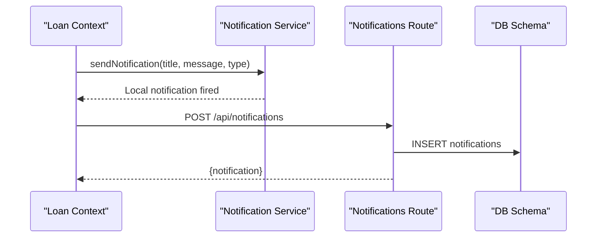
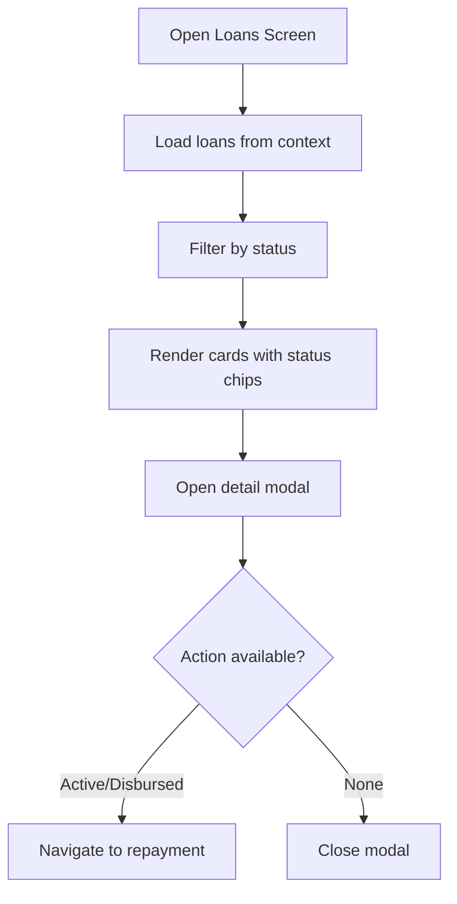
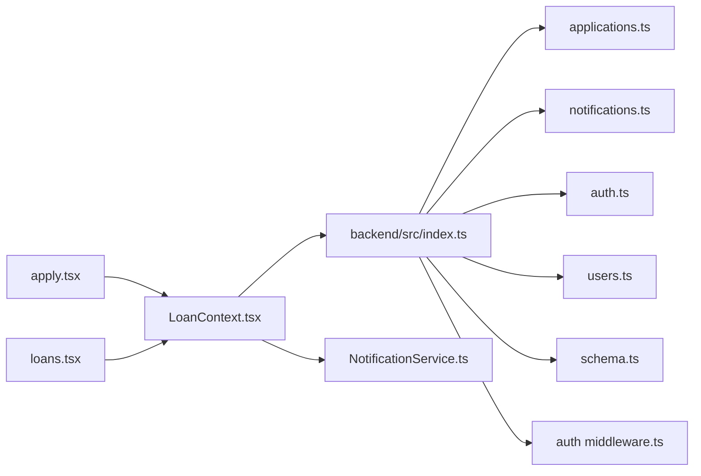

# Loan Application Process

<cite>
**Referenced Files in This Document**
- [apply.tsx](file://app/(tabs)/apply.tsx)
- [LoanContext.tsx](file://contexts/LoanContext.tsx)
- [loans.tsx](file://app/(tabs)/loans.tsx)
- [applications.ts](file://backend/src/routes/applications.ts)
- [schema.ts](file://backend/src/db/schema.ts)
- [notifications.ts](file://backend/src/routes/notifications.ts)
- [NotificationService.ts](file://services/NotificationService.ts)
- [auth.ts](file://contexts/AuthContext.tsx)
- [index.ts](file://backend/src/index.ts)
- [auth.ts](file://backend/src/routes/auth.ts)
- [users.ts](file://backend/src/routes/users.ts)
- [auth middleware.ts](file://backend/src/middleware/auth.ts)
</cite>

## Table of Contents
1. [Introduction](#introduction)
2. [Project Structure](#project-structure)
3. [Core Components](#core-components)
4. [Architecture Overview](#architecture-overview)
5. [Detailed Component Analysis](#detailed-component-analysis)
6. [Dependency Analysis](#dependency-analysis)
7. [Performance Considerations](#performance-considerations)
8. [Troubleshooting Guide](#troubleshooting-guide)
9. [Conclusion](#conclusion)

## Introduction
This document explains the end-to-end loan application process, from initiation to submission and ongoing status tracking. It covers the multi-step application workflow, form validation, backend integration, real-time status updates, and user notifications. It also documents the application lifecycle from submission through under_review and beyond, including automatic transitions and user-facing feedback.

## Project Structure
The loan application spans three main areas:
- Frontend screens and contexts that collect user input, validate it, and orchestrate submission
- Backend API that validates and persists applications, manages statuses, and emits notifications
- Shared data models and schemas that define the application record and its lifecycle

**Diagram sources**
- [apply.tsx](file://app/(tabs)/apply.tsx#L125-L515)
- [LoanContext.tsx:82-336](file://contexts/LoanContext.tsx#L82-L336)
- [loans.tsx](file://app/(tabs)/loans.tsx#L309-L441)
- [index.ts:1-76](file://backend/src/index.ts#L1-L76)
- [applications.ts:1-168](file://backend/src/routes/applications.ts#L1-L168)
- [notifications.ts:1-106](file://backend/src/routes/notifications.ts#L1-L106)
- [schema.ts:1-146](file://backend/src/db/schema.ts#L1-L146)
- [auth.ts:1-146](file://backend/src/routes/auth.ts#L1-L146)
- [users.ts:1-197](file://backend/src/routes/users.ts#L1-L197)
- [auth middleware.ts:1-48](file://backend/src/middleware/auth.ts#L1-L48)
- [NotificationService.ts:1-135](file://services/NotificationService.ts#L1-L135)
- [auth.ts:1-135](file://contexts/AuthContext.tsx#L1-L135)

**Section sources**
- [apply.tsx](file://app/(tabs)/apply.tsx#L125-L515)
- [LoanContext.tsx:82-336](file://contexts/LoanContext.tsx#L82-L336)
- [loans.tsx](file://app/(tabs)/loans.tsx#L309-L441)
- [index.ts:1-76](file://backend/src/index.ts#L1-L76)

## Core Components
- LoanApplication interface defines the shape of a loan application record, including amount, duration, employment details, personal information, and status.
- LoanContext orchestrates application creation, local caching, and real-time status updates via simulated transitions and notifications.
- Apply Screen implements a guided, multi-step form with client-side validation and submission flow.
- Backend routes validate and persist applications, expose user application lists, and manage notifications.

Key responsibilities:
- Form collection and validation (frontend)
- Submission and persistence (backend)
- Status transitions and notifications (frontend/backend)
- Offline-first caching and fallbacks (frontend)

**Section sources**
- [LoanContext.tsx:11-62](file://contexts/LoanContext.tsx#L11-L62)
- [apply.tsx](file://app/(tabs)/apply.tsx#L125-L515)
- [applications.ts:110-138](file://backend/src/routes/applications.ts#L110-L138)

## Architecture Overview
The loan application follows a client-server architecture:
- The frontend collects user input, performs basic validation, and submits to the backend.
- The backend validates the payload, persists the application, and returns a confirmation.
- The frontend stores a local copy, marks the status as submitted, and simulates a transition to under_review after a short delay.
- Notifications are sent locally and persisted to the backend for user visibility.

**Diagram sources**
- [apply.tsx](file://app/(tabs)/apply.tsx#L209-L254)
- [LoanContext.tsx:198-261](file://contexts/LoanContext.tsx#L198-L261)
- [applications.ts:110-138](file://backend/src/routes/applications.ts#L110-L138)
- [schema.ts:48-63](file://backend/src/db/schema.ts#L48-L63)
- [NotificationService.ts:116-135](file://services/NotificationService.ts#L116-L135)

## Detailed Component Analysis

### LoanApplication Interface and Data Model
The LoanApplication interface captures all required fields for a loan application, including:
- Identity and ownership: id, userId
- Loan specifics: amount, durationDays, interestRate, interest, processingFee, totalRepayment, dueDate
- Status and timestamps: status, appliedAt, disbursedAt, completedAt
- Employment and income: employmentStatus, employer, monthlyIncome
- Next of kin: nextOfKinName, nextOfKinPhone
- Disbursement and collateral: disbursementMethod, accountNumber, accountName, hasCollateral, collateralDescription, collateralValue
- Optional metadata: paymentProofUploaded, rating, review

Backend schema mirrors the application model with additional fields for auditability and relationships.

**Diagram sources**
- [schema.ts:48-88](file://backend/src/db/schema.ts#L48-L88)

**Section sources**
- [LoanContext.tsx:11-39](file://contexts/LoanContext.tsx#L11-L39)
- [schema.ts:48-88](file://backend/src/db/schema.ts#L48-L88)

### Apply Screen: Multi-Step Workflow and Validation
The Apply Screen implements a guided, three-step process:
- Step 1: Loan calculator with amount selection, quick amounts, and duration selection. Interest and processing fee are computed and displayed.
- Step 2: Employment and contact details including employment status, employer, monthly income, next of kin name, and phone.
- Step 3: Disbursement method selection (mobile money or bank), account details, and optional collateral.

Validation rules:
- Step 1 enforces minimum and maximum loan limits based on user profile.
- Step 2 requires employment status, monthly income, next of kin name (minimum length), and a valid phone number pattern.
- Step 3 requires disbursement method, account number/name, and collateral fields when collateral is selected.

Submission flow:
- On “Submit Application”, the form displays a confirmation dialog with calculated totals and due date.
- On confirmation, the frontend calls the Loan Context to submit the application.
- The context posts to the backend endpoint and saves a local copy with status “submitted”.
- A local notification is triggered, and after a short delay, the status is advanced to “under_review”.

**Diagram sources**
- [apply.tsx](file://app/(tabs)/apply.tsx#L184-L255)

**Section sources**
- [apply.tsx](file://app/(tabs)/apply.tsx#L18-L38)
- [apply.tsx](file://app/(tabs)/apply.tsx#L163-L182)
- [apply.tsx](file://app/(tabs)/apply.tsx#L209-L254)

### Loan Context: Submission Mechanics and Status Transitions
LoanContext coordinates:
- applyForLoan: Submits to backend, merges backend-provided ID if available, saves locally, triggers a notification, and schedules a local status transition to “under_review”.
- Local storage: Uses AsyncStorage keys for loans and notifications to provide offline-first behavior.
- Notifications: Sends local push notifications and persists them to the backend for retrieval.

**Diagram sources**
- [LoanContext.tsx:198-261](file://contexts/LoanContext.tsx#L198-L261)
- [applications.ts:110-138](file://backend/src/routes/applications.ts#L110-L138)
- [NotificationService.ts:116-135](file://services/NotificationService.ts#L116-L135)

**Section sources**
- [LoanContext.tsx:198-261](file://contexts/LoanContext.tsx#L198-L261)

### Backend Integration: Application Creation and API Endpoints
Backend routes:
- POST /api/applications: Validates payload, extracts X-User-Id, inserts a new application with status “pending”, and returns the created record.
- GET /api/applications/my-applications: Returns the current user’s applications with related loan data.
- PATCH /api/applications/:id/review: Updates application status and reviewer metadata (admin-only flow).

**Diagram sources**
- [applications.ts:110-138](file://backend/src/routes/applications.ts#L110-L138)

**Section sources**
- [applications.ts:11-22](file://backend/src/routes/applications.ts#L11-L22)
- [applications.ts:55-77](file://backend/src/routes/applications.ts#L55-L77)
- [applications.ts:140-165](file://backend/src/routes/applications.ts#L140-L165)

### Real-Time Status Updates and Notifications
- Frontend: After submission, a local notification is shown and the status is set to “submitted”. A timer advances the status to “under_review”.
- Backend: Notifications are stored in the notifications table and can be retrieved via GET /api/notifications. Individual notifications can be marked as read.

**Diagram sources**
- [LoanContext.tsx:242-246](file://contexts/LoanContext.tsx#L242-L246)
- [NotificationService.ts:93-135](file://services/NotificationService.ts#L93-L135)
- [notifications.ts:72-90](file://backend/src/routes/notifications.ts#L72-L90)
- [schema.ts:79-88](file://backend/src/db/schema.ts#L79-L88)

**Section sources**
- [LoanContext.tsx:183-196](file://contexts/LoanContext.tsx#L183-L196)
- [notifications.ts:8-33](file://backend/src/routes/notifications.ts#L8-L33)

### Loans Screen: Status Tracking and Timeline
The Loans screen displays:
- Filtered views by status
- A timeline visualization of the application lifecycle
- Detailed modals with repayment breakdown, due dates, and actions (e.g., repay)

**Diagram sources**
- [loans.tsx](file://app/(tabs)/loans.tsx#L309-L441)

**Section sources**
- [loans.tsx](file://app/(tabs)/loans.tsx#L14-L33)
- [loans.tsx](file://app/(tabs)/loans.tsx#L309-L441)

## Dependency Analysis
- Frontend depends on:
  - LoanContext for state and API interactions
  - Apply Screen and Loans Screen for UI and navigation
  - NotificationService for push/local notifications
- Backend depends on:
  - Drizzle ORM schema for database modeling
  - Hono routes for HTTP endpoints
  - Auth middleware for protected endpoints

**Diagram sources**
- [apply.tsx](file://app/(tabs)/apply.tsx#L125-L515)
- [LoanContext.tsx:82-336](file://contexts/LoanContext.tsx#L82-L336)
- [loans.tsx](file://app/(tabs)/loans.tsx#L309-L441)
- [index.ts:1-76](file://backend/src/index.ts#L1-L76)
- [applications.ts:1-168](file://backend/src/routes/applications.ts#L1-L168)
- [notifications.ts:1-106](file://backend/src/routes/notifications.ts#L1-L106)
- [auth.ts:1-146](file://backend/src/routes/auth.ts#L1-L146)
- [users.ts:1-197](file://backend/src/routes/users.ts#L1-L197)
- [auth middleware.ts:1-48](file://backend/src/middleware/auth.ts#L1-L48)
- [NotificationService.ts:1-135](file://services/NotificationService.ts#L1-L135)
- [schema.ts:1-146](file://backend/src/db/schema.ts#L1-L146)

**Section sources**
- [index.ts:54-61](file://backend/src/index.ts#L54-L61)
- [auth middleware.ts:10-47](file://backend/src/middleware/auth.ts#L10-L47)

## Performance Considerations
- Client-side caching: AsyncStorage is used to persist loans and notifications, enabling offline access and reducing network requests.
- Local notifications: Immediate feedback without backend round-trips.
- Minimal payload: The frontend sends only essential fields to the backend, keeping network overhead low.
- Debounced UI updates: Status transitions are scheduled with timeouts to avoid rapid UI flickering.

[No sources needed since this section provides general guidance]

## Troubleshooting Guide
Common issues and resolutions:
- Backend submission fails:
  - Verify X-User-Id header presence and validity.
  - Check API health endpoint and CORS configuration.
- Notifications not appearing:
  - Ensure NotificationService can reach the backend endpoint.
  - Confirm local notification permissions and device support.
- Status not advancing:
  - Confirm the frontend timeout executes and AsyncStorage writes succeed.
  - Validate that the backend status update endpoint is reachable (admin flow).

**Section sources**
- [LoanContext.tsx:201-230](file://contexts/LoanContext.tsx#L201-L230)
- [NotificationService.ts:93-135](file://services/NotificationService.ts#L93-L135)
- [index.ts:19-26](file://backend/src/index.ts#L19-L26)

## Conclusion
The loan application process integrates a guided frontend form with robust backend validation and persistence. It supports offline-first behavior, real-time notifications, and a clear status lifecycle from submission to under_review and beyond. The modular design enables easy extension for additional statuses, integrations, and administrative workflows.