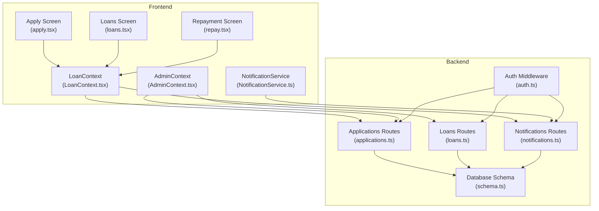
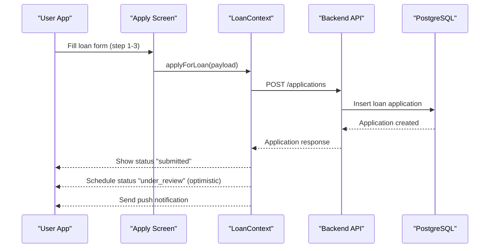
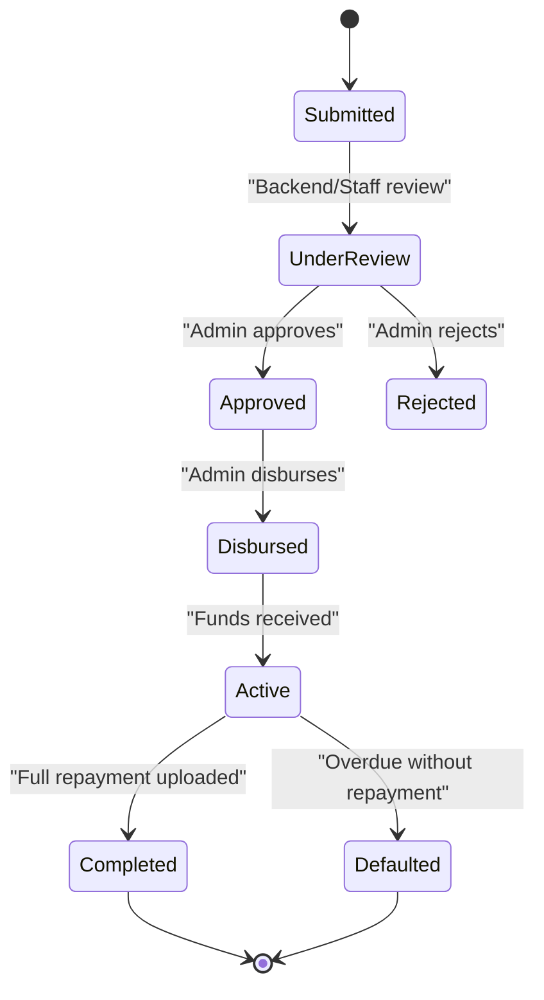
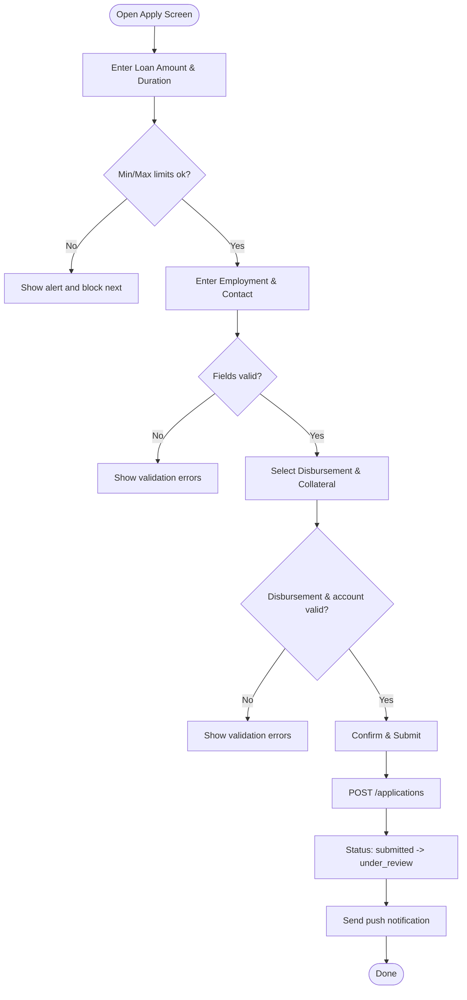
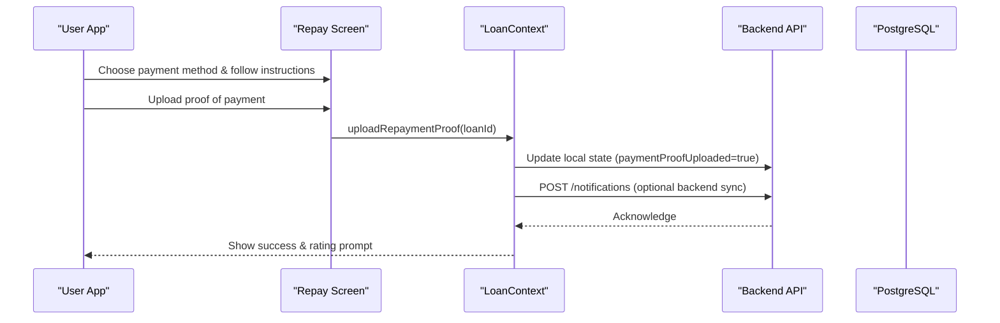
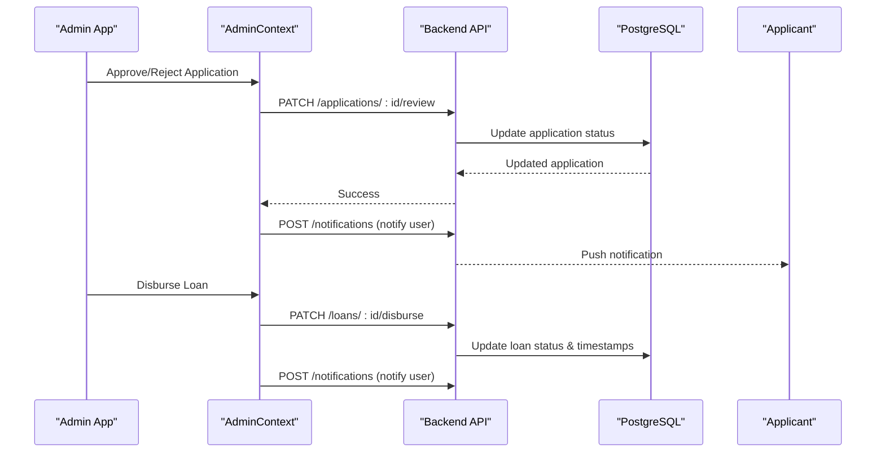
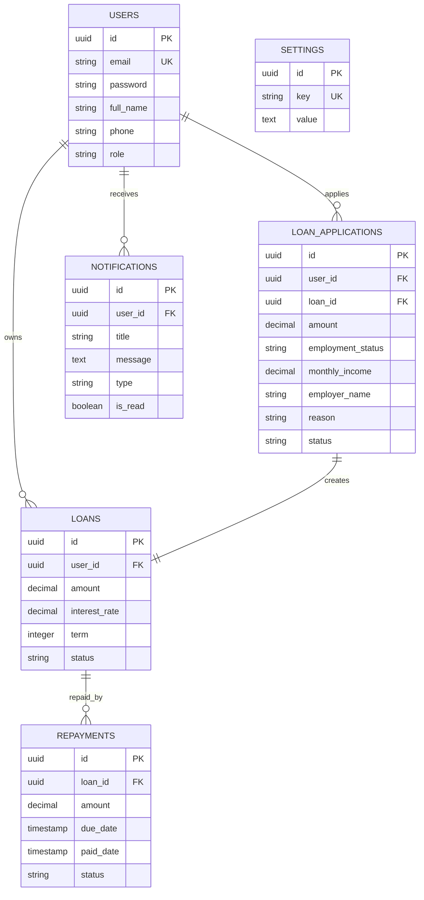
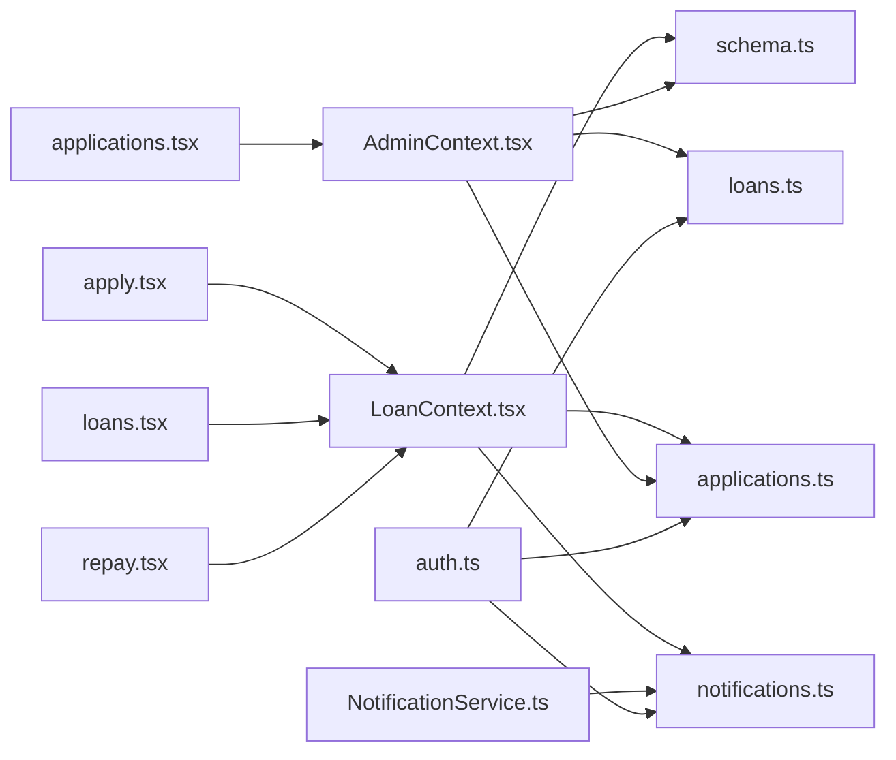

# Loan Management System

<cite>
**Referenced Files in This Document**
- [LoanContext.tsx](file://contexts/LoanContext.tsx)
- [apply.tsx](file://app/(tabs)/apply.tsx)
- [loans.tsx](file://app/(tabs)/loans.tsx)
- [repay.tsx](file://app/(tabs)/repay.tsx)
- [applications.ts](file://backend/src/routes/applications.ts)
- [loans.ts](file://backend/src/routes/loans.ts)
- [schema.ts](file://backend/src/db/schema.ts)
- [NotificationService.ts](file://services/NotificationService.ts)
- [AdminContext.tsx](file://contexts/AdminContext.tsx)
- [applications.tsx](file://app/admin/(tabs)/applications.tsx)
- [notifications.ts](file://backend/src/routes/notifications.ts)
- [_layout.tsx](file://app/_layout.tsx)
- [auth.ts](file://backend/src/middleware/auth.ts)
</cite>

## Table of Contents
1. [Introduction](#introduction)
2. [Project Structure](#project-structure)
3. [Core Components](#core-components)
4. [Architecture Overview](#architecture-overview)
5. [Detailed Component Analysis](#detailed-component-analysis)
6. [Dependency Analysis](#dependency-analysis)
7. [Performance Considerations](#performance-considerations)
8. [Troubleshooting Guide](#troubleshooting-guide)
9. [Conclusion](#conclusion)

## Introduction
This document provides comprehensive documentation for the Phoenix Loan Management System, covering the complete loan lifecycle from application to repayment. It explains the multi-step application process with form validation, document upload capabilities, and status tracking mechanisms. It documents the LoanContext implementation for state management, loan application submission workflows, and repayment schedule management. It also covers loan administration features for staff, including application review, approval/rejection processes, and disbursement tracking. The document outlines user experience patterns, error handling, and offline capability considerations, along with integration between frontend loan forms and backend processing, data validation rules, and business logic enforcement.

## Project Structure
The system is organized into three primary layers:
- Frontend (React Native): Handles user interactions, loan application forms, status tracking, repayment uploads, and notifications.
- Backend (Hono + Drizzle ORM): Manages loan applications, loan records, repayments, notifications, and administrative workflows.
- Shared/Contexts: Provide centralized state management and service integrations for both user and admin experiences.

**Diagram sources**
- [apply.tsx](file://app/(tabs)/apply.tsx#L125-L515)
- [loans.tsx](file://app/(tabs)/loans.tsx#L309-L441)
- [repay.tsx](file://app/(tabs)/repay.tsx#L225-L450)
- [LoanContext.tsx:82-336](file://contexts/LoanContext.tsx#L82-L336)
- [AdminContext.tsx:135-528](file://contexts/AdminContext.tsx#L135-L528)
- [applications.ts:110-167](file://backend/src/routes/applications.ts#L110-L167)
- [loans.ts:115-320](file://backend/src/routes/loans.ts#L115-L320)
- [notifications.ts:8-105](file://backend/src/routes/notifications.ts#L8-L105)
- [schema.ts:23-88](file://backend/src/db/schema.ts#L23-L88)
- [auth.ts:10-47](file://backend/src/middleware/auth.ts#L10-L47)

**Section sources**
- [apply.tsx](file://app/(tabs)/apply.tsx#L125-L515)
- [loans.tsx](file://app/(tabs)/loans.tsx#L309-L441)
- [repay.tsx](file://app/(tabs)/repay.tsx#L225-L450)
- [LoanContext.tsx:82-336](file://contexts/LoanContext.tsx#L82-L336)
- [AdminContext.tsx:135-528](file://contexts/AdminContext.tsx#L135-L528)
- [applications.ts:110-167](file://backend/src/routes/applications.ts#L110-L167)
- [loans.ts:115-320](file://backend/src/routes/loans.ts#L115-L320)
- [notifications.ts:8-105](file://backend/src/routes/notifications.ts#L8-L105)
- [schema.ts:23-88](file://backend/src/db/schema.ts#L23-L88)
- [auth.ts:10-47](file://backend/src/middleware/auth.ts#L10-L47)

## Core Components
- LoanContext: Central state manager for user loan lifecycle, including application submission, repayment proof upload, notifications, and active loan tracking.
- AdminContext: Central state manager for administrators to review, approve/reject, disburse, and complete loans, manage users, and configure system settings.
- NotificationService: Manages local and backend push notifications for user alerts.
- Backend Routes: Provide REST endpoints for applications, loans, and notifications with validation and CRUD operations.
- Database Schema: Defines tables for users, loans, applications, repayments, notifications, and settings with relationships.

Key responsibilities:
- Form validation and calculation of interest, processing fee, and total repayment.
- Offline-first caching with AsyncStorage fallback and optimistic updates.
- Real-time status updates and user notifications.
- Administrative controls for loan lifecycle management.

**Section sources**
- [LoanContext.tsx:50-336](file://contexts/LoanContext.tsx#L50-L336)
- [AdminContext.tsx:77-528](file://contexts/AdminContext.tsx#L77-L528)
- [NotificationService.ts:26-135](file://services/NotificationService.ts#L26-L135)
- [applications.ts:11-167](file://backend/src/routes/applications.ts#L11-L167)
- [loans.ts:84-320](file://backend/src/routes/loans.ts#L84-L320)
- [schema.ts:23-88](file://backend/src/db/schema.ts#L23-L88)

## Architecture Overview
The system follows a layered architecture:
- Presentation Layer: React Native screens for user and admin experiences.
- State Management: Context providers for user and admin states.
- Service Layer: NotificationService for push notifications.
- API Layer: Hono routes for applications, loans, and notifications.
- Persistence Layer: PostgreSQL via Drizzle ORM with migrations and schema definitions.

**Diagram sources**
- [apply.tsx](file://app/(tabs)/apply.tsx#L209-L254)
- [LoanContext.tsx:198-261](file://contexts/LoanContext.tsx#L198-L261)
- [applications.ts:110-138](file://backend/src/routes/applications.ts#L110-L138)
- [schema.ts:48-63](file://backend/src/db/schema.ts#L48-L63)

**Section sources**
- [apply.tsx](file://app/(tabs)/apply.tsx#L184-L255)
- [LoanContext.tsx:198-261](file://contexts/LoanContext.tsx#L198-L261)
- [applications.ts:110-138](file://backend/src/routes/applications.ts#L110-L138)
- [schema.ts:48-63](file://backend/src/db/schema.ts#L48-L63)

## Detailed Component Analysis

### Loan Lifecycle Management
The loan lifecycle spans application, review, approval, disbursement, active repayment, and completion. The frontend tracks status visually and optimistically updates while backend synchronization occurs.

**Diagram sources**
- [LoanContext.tsx:8-39](file://contexts/LoanContext.tsx#L8-L39)
- [loans.tsx](file://app/(tabs)/loans.tsx#L14-L23)
- [AdminContext.tsx:311-335](file://contexts/AdminContext.tsx#L311-L335)
- [loans.ts:199-317](file://backend/src/routes/loans.ts#L199-L317)

**Section sources**
- [LoanContext.tsx:8-39](file://contexts/LoanContext.tsx#L8-L39)
- [loans.tsx](file://app/(tabs)/loans.tsx#L14-L23)
- [AdminContext.tsx:311-335](file://contexts/AdminContext.tsx#L311-L335)
- [loans.ts:199-317](file://backend/src/routes/loans.ts#L199-L317)

### Multi-Step Application Process
The application form is split into three steps:
- Step 1: Loan calculator with amount selection, duration options, and repayment preview.
- Step 2: Employment and personal details with validation.
- Step 3: Disbursement method selection, account details, and optional collateral.

Validation rules:
- Minimum loan amount and user-defined loan limit enforced.
- Employment status, monthly income, and next-of-kin details validated.
- Disbursement method, account number, and account name required.
- Collateral fields conditionally required when collateral is selected.

**Diagram sources**
- [apply.tsx](file://app/(tabs)/apply.tsx#L184-L255)
- [LoanContext.tsx:198-261](file://contexts/LoanContext.tsx#L198-L261)

**Section sources**
- [apply.tsx](file://app/(tabs)/apply.tsx#L18-L515)
- [LoanContext.tsx:163-182](file://contexts/LoanContext.tsx#L163-L182)

### Repayment Workflow and Proof Upload
Users upload repayment proof after making payment. The system validates permissions, requests media library access, and upon successful upload, marks the loan as completed and prompts for rating.

**Diagram sources**
- [repay.tsx](file://app/(tabs)/repay.tsx#L238-L260)
- [LoanContext.tsx:263-273](file://contexts/LoanContext.tsx#L263-L273)
- [notifications.ts:71-90](file://backend/src/routes/notifications.ts#L71-L90)

**Section sources**
- [repay.tsx](file://app/(tabs)/repay.tsx#L225-L450)
- [LoanContext.tsx:263-273](file://contexts/LoanContext.tsx#L263-L273)
- [notifications.ts:71-90](file://backend/src/routes/notifications.ts#L71-L90)

### Admin Approval and Disbursement Workflows
Administrators review applications, approve or reject them, and then disburse funds and mark loans as repaid. Each action triggers notifications to applicants.

**Diagram sources**
- [AdminContext.tsx:311-386](file://contexts/AdminContext.tsx#L311-L386)
- [applications.ts:140-165](file://backend/src/routes/applications.ts#L140-L165)
- [loans.ts:224-250](file://backend/src/routes/loans.ts#L224-L250)
- [notifications.ts:71-90](file://backend/src/routes/notifications.ts#L71-L90)

**Section sources**
- [AdminContext.tsx:311-386](file://contexts/AdminContext.tsx#L311-L386)
- [applications.ts:140-165](file://backend/src/routes/applications.ts#L140-L165)
- [loans.ts:224-250](file://backend/src/routes/loans.ts#L224-L250)
- [notifications.ts:71-90](file://backend/src/routes/notifications.ts#L71-L90)

### Data Models and Relationships
The backend schema defines core entities and their relationships, enabling robust loan lifecycle tracking.

**Diagram sources**
- [schema.ts:4-88](file://backend/src/db/schema.ts#L4-L88)

**Section sources**
- [schema.ts:4-88](file://backend/src/db/schema.ts#L4-L88)

### Offline Capability and State Synchronization
The system supports offline-first behavior:
- Local caching via AsyncStorage for loans and notifications.
- Optimistic UI updates during application submission and status transitions.
- Backend synchronization with fallback to cached data when offline.
- Admin context merges server data with local cache and handles offline scenarios gracefully.

**Section sources**
- [LoanContext.tsx:87-176](file://contexts/LoanContext.tsx#L87-L176)
- [AdminContext.tsx:199-285](file://contexts/AdminContext.tsx#L199-L285)

## Dependency Analysis
The frontend and backend communicate through typed APIs with validation and middleware protection. Context providers encapsulate cross-cutting concerns like authentication, notifications, and state management.

**Diagram sources**
- [apply.tsx](file://app/(tabs)/apply.tsx#L125-L515)
- [loans.tsx](file://app/(tabs)/loans.tsx#L309-L441)
- [repay.tsx](file://app/(tabs)/repay.tsx#L225-L450)
- [LoanContext.tsx:82-336](file://contexts/LoanContext.tsx#L82-L336)
- [AdminContext.tsx:135-528](file://contexts/AdminContext.tsx#L135-L528)
- [applications.ts:110-167](file://backend/src/routes/applications.ts#L110-L167)
- [loans.ts:115-320](file://backend/src/routes/loans.ts#L115-L320)
- [notifications.ts:8-105](file://backend/src/routes/notifications.ts#L8-L105)
- [schema.ts:23-88](file://backend/src/db/schema.ts#L23-L88)
- [auth.ts:10-47](file://backend/src/middleware/auth.ts#L10-L47)
- [NotificationService.ts:26-135](file://services/NotificationService.ts#L26-L135)

**Section sources**
- [apply.tsx](file://app/(tabs)/apply.tsx#L125-L515)
- [loans.tsx](file://app/(tabs)/loans.tsx#L309-L441)
- [repay.tsx](file://app/(tabs)/repay.tsx#L225-L450)
- [LoanContext.tsx:82-336](file://contexts/LoanContext.tsx#L82-L336)
- [AdminContext.tsx:135-528](file://contexts/AdminContext.tsx#L135-L528)
- [applications.ts:110-167](file://backend/src/routes/applications.ts#L110-L167)
- [loans.ts:115-320](file://backend/src/routes/loans.ts#L115-L320)
- [notifications.ts:8-105](file://backend/src/routes/notifications.ts#L8-L105)
- [schema.ts:23-88](file://backend/src/db/schema.ts#L23-L88)
- [auth.ts:10-47](file://backend/src/middleware/auth.ts#L10-L47)
- [NotificationService.ts:26-135](file://services/NotificationService.ts#L26-L135)

## Performance Considerations
- Use optimistic updates for immediate UI feedback during application submission and status changes.
- Debounce or batch network requests to reduce redundant calls.
- Persist frequently accessed data (loans, notifications) to AsyncStorage to minimize backend round trips.
- Implement pagination for long lists (notifications, applications) to avoid rendering overhead.
- Cache images and receipts locally to reduce bandwidth usage.
- Minimize re-renders by using memoization and selective state updates.

## Troubleshooting Guide
Common issues and resolutions:
- Application submission fails: Verify network connectivity, check user authentication headers, and confirm backend availability.
- Notifications not received: Ensure device permissions are granted, push token registration succeeded, and backend persistence is functioning.
- Admin actions not reflected: Confirm admin credentials, verify backend endpoints, and check for CORS or middleware errors.
- Offline data inconsistencies: Clear AsyncStorage cache keys and refresh data to synchronize with backend.

**Section sources**
- [LoanContext.tsx:132-158](file://contexts/LoanContext.tsx#L132-L158)
- [NotificationService.ts:26-69](file://services/NotificationService.ts#L26-L69)
- [AdminContext.tsx:287-302](file://contexts/AdminContext.tsx#L287-L302)

## Conclusion
The Phoenix Loan Management System provides a robust, user-friendly platform for managing the complete loan lifecycle. Its layered architecture, strong validation, and offline-first design ensure reliability and responsiveness. The integration between frontend contexts and backend routes enables seamless application workflows, real-time status updates, and comprehensive administrative oversight. With clear separation of concerns, standardized data models, and resilient error handling, the system supports scalable growth and maintainability.