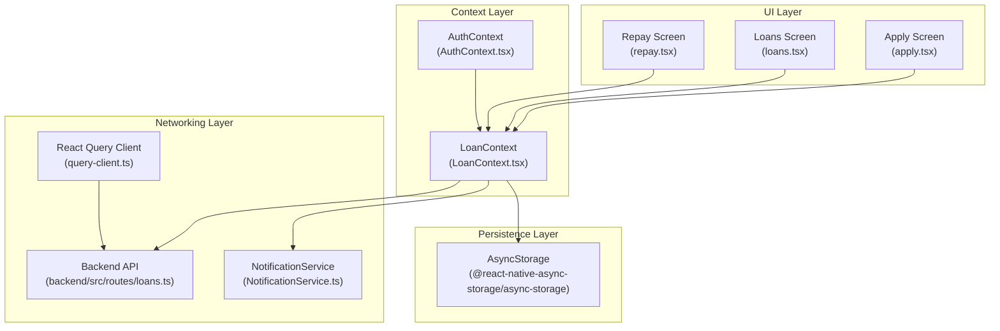
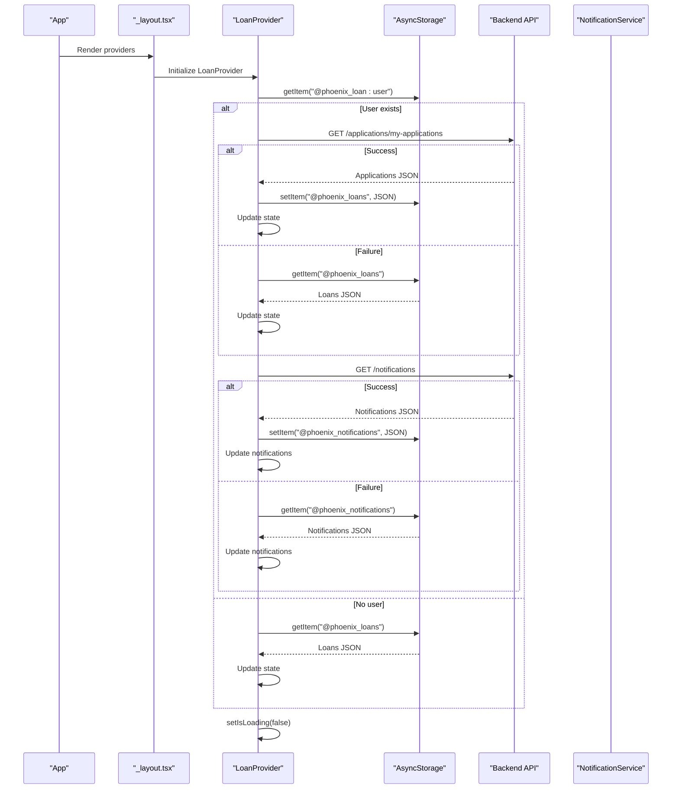
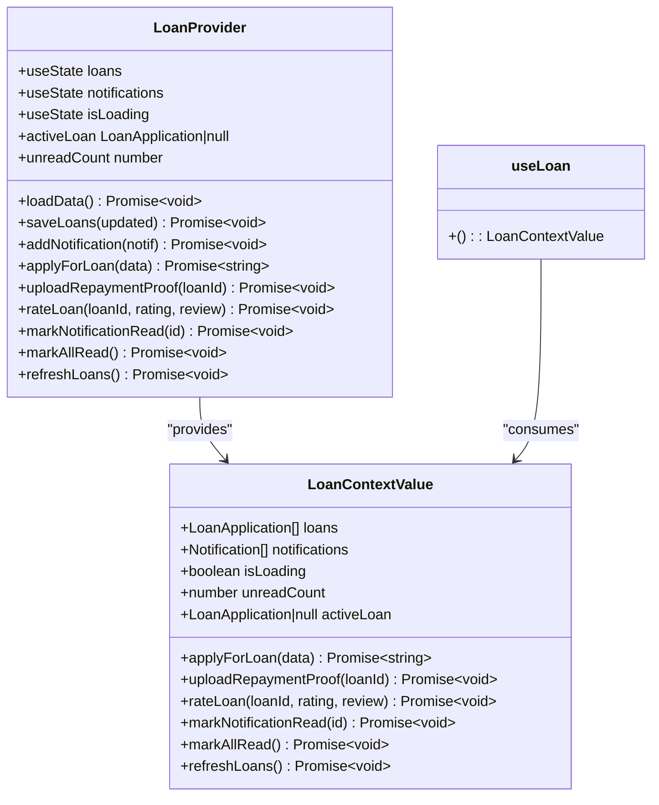
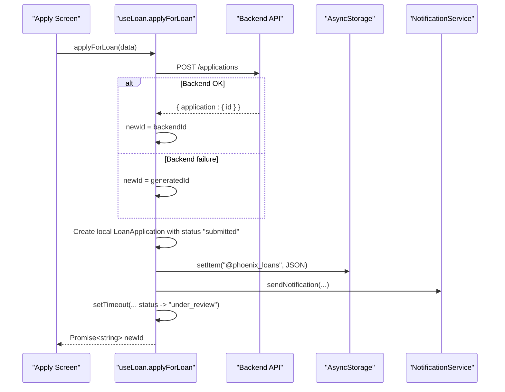
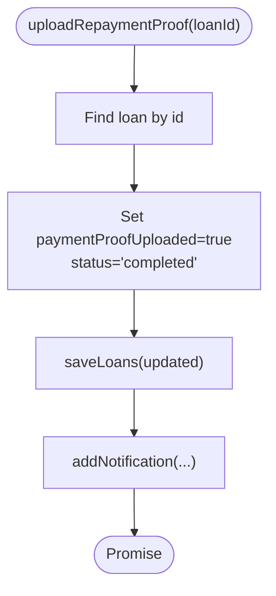
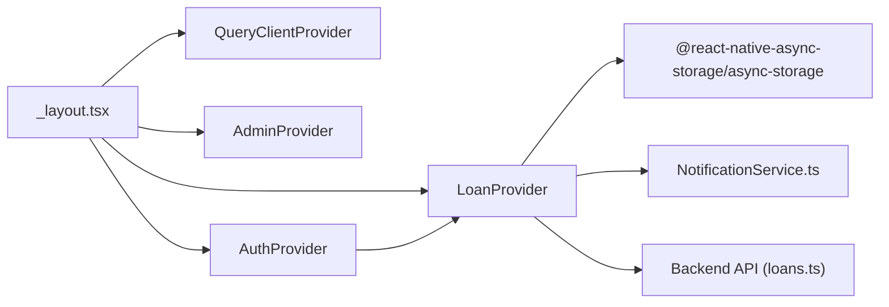

# Loan State Management

<cite>
**Referenced Files in This Document**
- [LoanContext.tsx](file://contexts/LoanContext.tsx)
- [query-client.ts](file://lib/query-client.ts)
- [_layout.tsx](file://app/_layout.tsx)
- [apply.tsx](file://app/(tabs)/apply.tsx)
- [loans.tsx](file://app/(tabs)/loans.tsx)
- [repay.tsx](file://app/(tabs)/repay.tsx)
- [AuthContext.tsx](file://contexts/AuthContext.tsx)
- [NotificationService.ts](file://services/NotificationService.ts)
- [loans.ts](file://backend/src/routes/loans.ts)
</cite>

## Table of Contents
1. [Introduction](#introduction)
2. [Project Structure](#project-structure)
3. [Core Components](#core-components)
4. [Architecture Overview](#architecture-overview)
5. [Detailed Component Analysis](#detailed-component-analysis)
6. [Dependency Analysis](#dependency-analysis)
7. [Performance Considerations](#performance-considerations)
8. [Troubleshooting Guide](#troubleshooting-guide)
9. [Conclusion](#conclusion)

## Introduction
This document provides comprehensive documentation for the LoanContext implementation, focusing on state management patterns, data persistence, and synchronization mechanisms. It explains the React Context architecture for loan data management, including provider setup, consumer hooks, and state update patterns. It documents the dual data source approach combining AsyncStorage for offline persistence with backend API for real-time data synchronization. The document details the state mutation methods applyForLoan, uploadRepaymentProof, and rateLoan with their parameters and return values, and includes concrete examples of state updates, loading states, and error handling strategies. It also addresses integration with @tanstack/react-query for data fetching and caching, offline-first design patterns, conflict resolution when local and remote data differ, performance optimizations, memory management, and data serialization strategies.

## Project Structure
The loan state management spans several layers:
- Context Provider: LoanContext manages loan and notification state, persistence, and synchronization.
- Consumers: Screens like Apply, Loans, and Repay consume the context to render UI and mutate state.
- Backend API: Provides endpoints for loan applications, status updates, and notifications.
- Persistence Layer: AsyncStorage stores local copies of loans and notifications.
- Query Client: @tanstack/react-query configuration for API requests and caching.

**Diagram sources**
- [LoanContext.tsx:82-329](file://contexts/LoanContext.tsx#L82-L329)
- [apply.tsx](file://app/(tabs)/apply.tsx#L125-L255)
- [loans.tsx](file://app/(tabs)/loans.tsx#L309-L441)
- [repay.tsx](file://app/(tabs)/repay.tsx#L245-L261)
- [AuthContext.tsx:31-126](file://contexts/AuthContext.tsx#L31-L126)
- [query-client.ts:67-81](file://lib/query-client.ts#L67-L81)
- [loans.ts:115-138](file://backend/src/routes/loans.ts#L115-L138)
- [NotificationService.ts:116-134](file://services/NotificationService.ts#L116-L134)

**Section sources**
- [LoanContext.tsx:82-329](file://contexts/LoanContext.tsx#L82-L329)
- [_layout.tsx:67-79](file://app/_layout.tsx#L67-L79)

## Core Components
- LoanContext Provider: Manages loans, notifications, loading state, and exposes mutation methods. It initializes state from AsyncStorage and synchronizes with backend APIs.
- Consumer Hooks: useLoan provides access to loans, notifications, loading state, and mutation functions to UI components.
- Persistence: AsyncStorage keys for loans and notifications ensure offline availability and fallback when backend is unavailable.
- Backend Integration: Fetches user-specific loan applications and notifications, and posts notifications to the backend.
- Notification Service: Handles local and backend notifications for user feedback.

Key responsibilities:
- Load initial state from AsyncStorage and backend.
- Persist state updates to AsyncStorage.
- Synchronize with backend APIs for real-time updates.
- Provide computed values like activeLoan and unreadCount.
- Expose mutation methods for loan lifecycle actions.

**Section sources**
- [LoanContext.tsx:50-62](file://contexts/LoanContext.tsx#L50-L62)
- [LoanContext.tsx:82-329](file://contexts/LoanContext.tsx#L82-L329)
- [LoanContext.tsx:178-181](file://contexts/LoanContext.tsx#L178-L181)
- [LoanContext.tsx:315-320](file://contexts/LoanContext.tsx#L315-L320)

## Architecture Overview
The LoanContext follows an offline-first architecture:
- On mount, it attempts to load data from the backend using the user ID from AsyncStorage.
- If backend fetch succeeds, it stores the result in AsyncStorage and updates state.
- If backend fetch fails, it falls back to AsyncStorage.
- All state mutations are persisted to AsyncStorage immediately.
- Some mutations also trigger backend API calls and push notifications.

**Diagram sources**
- [LoanContext.tsx:91-176](file://contexts/LoanContext.tsx#L91-L176)

**Section sources**
- [LoanContext.tsx:91-176](file://contexts/LoanContext.tsx#L91-L176)

## Detailed Component Analysis

### LoanContext Provider and Consumer Hooks
- Provider setup: Creates state for loans, notifications, and isLoading. Uses useMemo to memoize the context value to prevent unnecessary re-renders.
- Consumer hook: useLoan throws an error if used outside LoanProvider, ensuring proper usage.

**Diagram sources**
- [LoanContext.tsx:50-62](file://contexts/LoanContext.tsx#L50-L62)
- [LoanContext.tsx:82-329](file://contexts/LoanContext.tsx#L82-L329)
- [LoanContext.tsx:331-335](file://contexts/LoanContext.tsx#L331-L335)

**Section sources**
- [LoanContext.tsx:50-62](file://contexts/LoanContext.tsx#L50-L62)
- [LoanContext.tsx:82-329](file://contexts/LoanContext.tsx#L82-L329)
- [LoanContext.tsx:331-335](file://contexts/LoanContext.tsx#L331-L335)

### State Mutation Methods

#### applyForLoan
- Purpose: Submit a new loan application.
- Parameters:
  - data: Omit<LoanApplication, 'id' | 'appliedAt' | 'status'>
- Behavior:
  - Attempts to POST to backend endpoint for application creation.
  - On success, uses the backend-assigned ID; otherwise generates a local ID.
  - Immediately adds a local loan entry with status 'submitted'.
  - Persists to AsyncStorage.
  - Triggers a local notification.
  - Simulates status change to 'under_review' after a delay if backend integration is not fully synchronized.

**Diagram sources**
- [LoanContext.tsx:198-261](file://contexts/LoanContext.tsx#L198-L261)
- [apply.tsx](file://app/(tabs)/apply.tsx#L209-L250)
- [NotificationService.ts:116-134](file://services/NotificationService.ts#L116-L134)

**Section sources**
- [LoanContext.tsx:198-261](file://contexts/LoanContext.tsx#L198-L261)
- [apply.tsx](file://app/(tabs)/apply.tsx#L209-L250)

#### uploadRepaymentProof
- Purpose: Upload repayment proof for a loan.
- Parameters:
  - loanId: string
- Behavior:
  - Updates the loan's paymentProofUploaded flag and sets status to 'completed'.
  - Persists to AsyncStorage.
  - Triggers a local notification.

**Diagram sources**
- [LoanContext.tsx:263-273](file://contexts/LoanContext.tsx#L263-L273)

**Section sources**
- [LoanContext.tsx:263-273](file://contexts/LoanContext.tsx#L263-L273)
- [repay.tsx](file://app/(tabs)/repay.tsx#L245-L261)

#### rateLoan
- Purpose: Rate a loan and add a review.
- Parameters:
  - loanId: string
  - rating: number
  - review: string
- Behavior:
  - Updates the loan's rating and review fields.
  - Persists to AsyncStorage.

**Section sources**
- [LoanContext.tsx:275-280](file://contexts/LoanContext.tsx#L275-L280)

### Data Persistence and Synchronization
- Keys:
  - '@phoenix_loans' for loan applications.
  - '@phoenix_notifications' for notifications.
  - '@phoenix_loan:user' for user context used in backend calls.
- Loading Strategy:
  - On initialization, tries to fetch from backend; if successful, stores in AsyncStorage and updates state.
  - If backend fails, reads from AsyncStorage.
- Notifications:
  - Loads notifications from backend; on failure, falls back to AsyncStorage.
  - Adds notifications locally and persists immediately.
  - Optionally marks notifications as read on backend.

**Section sources**
- [LoanContext.tsx:5-7](file://contexts/LoanContext.tsx#L5-L7)
- [LoanContext.tsx:91-176](file://contexts/LoanContext.tsx#L91-L176)
- [LoanContext.tsx:183-196](file://contexts/LoanContext.tsx#L183-L196)
- [LoanContext.tsx:282-309](file://contexts/LoanContext.tsx#L282-L309)

### Integration with @tanstack/react-query
- The project includes a query client configured for API requests, but LoanContext does not currently use react-query for loan data. Instead, it uses direct fetch calls and AsyncStorage.
- The query client defines:
  - Base URL resolution from environment variables.
  - A reusable apiRequest function.
  - A getQueryFn for standardized query functions with 401 handling.
  - Global defaults for queries and mutations (no refetch on window focus, infinite staleTime, no retries).

Implications:
- For future enhancements, LoanContext could adopt react-query to centralize data fetching, caching, and invalidation.
- Current implementation remains independent of react-query for loan data.

**Section sources**
- [query-client.ts:8-18](file://lib/query-client.ts#L8-L18)
- [query-client.ts:27-44](file://lib/query-client.ts#L27-L44)
- [query-client.ts:47-65](file://lib/query-client.ts#L47-L65)
- [query-client.ts:67-81](file://lib/query-client.ts#L67-L81)

### Offline-First Design Patterns and Conflict Resolution
- Offline-first:
  - UI renders immediately using AsyncStorage data while attempting backend sync.
  - Mutations are persisted locally first, then optionally synced to backend.
- Conflict resolution:
  - When backend fetch succeeds, AsyncStorage is overwritten with fresh data.
  - When backend fetch fails, AsyncStorage is used as-is.
  - Notifications are merged with backend data; on failure, local notifications are restored.

**Section sources**
- [LoanContext.tsx:164-170](file://contexts/LoanContext.tsx#L164-L170)
- [LoanContext.tsx:154-158](file://contexts/LoanContext.tsx#L154-L158)

### Consumer Usage Examples
- Apply Screen:
  - Uses useLoan.applyForLoan to submit applications.
  - Validates form data and handles loading states.
- Loans Screen:
  - Uses useLoan.refreshLoans to pull latest data.
  - Displays filtered loan lists and computed active loan.
- Repay Screen:
  - Uses useLoan.uploadRepaymentProof to mark repayment.

**Section sources**
- [apply.tsx](file://app/(tabs)/apply.tsx#L125-L255)
- [loans.tsx](file://app/(tabs)/loans.tsx#L309-L331)
- [repay.tsx](file://app/(tabs)/repay.tsx#L245-L261)

## Dependency Analysis
- Context Provider Chain:
  - _layout.tsx composes providers in order: QueryClientProvider -> AdminProvider -> AuthProvider -> LoanProvider -> Children.
  - AuthContext provides user context used by LoanContext for backend calls.
- Internal Dependencies:
  - LoanContext depends on AsyncStorage for persistence and NotificationService for notifications.
  - Backend endpoints are consumed via direct fetch calls with X-User-Id header.

**Diagram sources**
- [_layout.tsx:67-79](file://app/_layout.tsx#L67-L79)
- [AuthContext.tsx:31-126](file://contexts/AuthContext.tsx#L31-L126)
- [LoanContext.tsx:82-329](file://contexts/LoanContext.tsx#L82-L329)
- [NotificationService.ts:116-134](file://services/NotificationService.ts#L116-L134)
- [loans.ts:115-138](file://backend/src/routes/loans.ts#L115-L138)

**Section sources**
- [_layout.tsx:67-79](file://app/_layout.tsx#L67-L79)
- [AuthContext.tsx:31-126](file://contexts/AuthContext.tsx#L31-L126)
- [LoanContext.tsx:82-329](file://contexts/LoanContext.tsx#L82-L329)

## Performance Considerations
- Memoization:
  - useMemo is used for context value and derived values (activeLoan, unreadCount) to minimize re-renders.
- Serialization:
  - Data is serialized to JSON for AsyncStorage storage; ensure minimal payload sizes.
- Network Efficiency:
  - Direct fetch calls are used; consider batching or caching if performance becomes a concern.
- Memory Management:
  - Avoid storing large datasets; keep only necessary fields.
- UI Responsiveness:
  - Loading states are managed to prevent blocking UI during initial load and refresh.

[No sources needed since this section provides general guidance]

## Troubleshooting Guide
Common issues and resolutions:
- Backend Unavailable:
  - LoanContext falls back to AsyncStorage; ensure keys exist and are valid JSON.
- Missing User Context:
  - Backend calls require '@phoenix_loan:user' in AsyncStorage; verify login flow.
- Notification Delivery:
  - Local notifications work in Expo Go; backend notifications require network connectivity.
- State Not Updating:
  - Verify AsyncStorage writes succeed and context consumers are wrapped in LoanProvider.

**Section sources**
- [LoanContext.tsx:95-176](file://contexts/LoanContext.tsx#L95-L176)
- [LoanContext.tsx:183-196](file://contexts/LoanContext.tsx#L183-L196)
- [NotificationService.ts:26-69](file://services/NotificationService.ts#L26-L69)

## Conclusion
The LoanContext implements a robust offline-first state management solution with clear separation of concerns. It combines AsyncStorage for persistence with backend APIs for real-time synchronization, exposing a simple hook-based API for consumers. While the current implementation does not integrate with @tanstack/react-query, it provides predictable state updates, comprehensive error handling, and efficient memory usage. Future enhancements could leverage react-query for centralized data management, but the existing design already supports scalable and maintainable loan state handling.