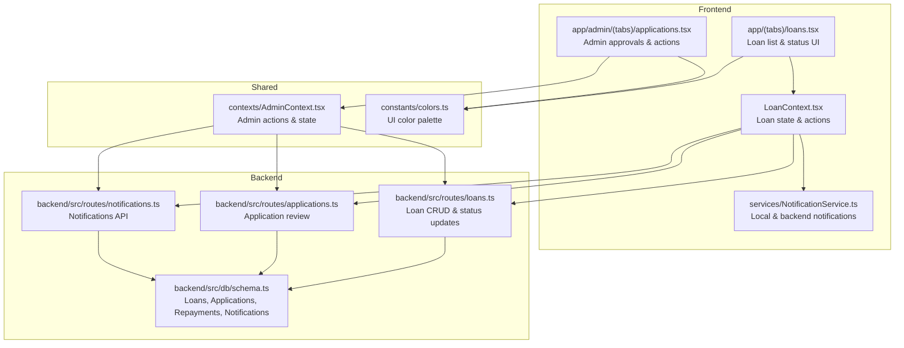
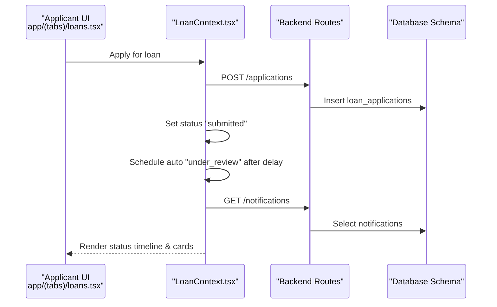
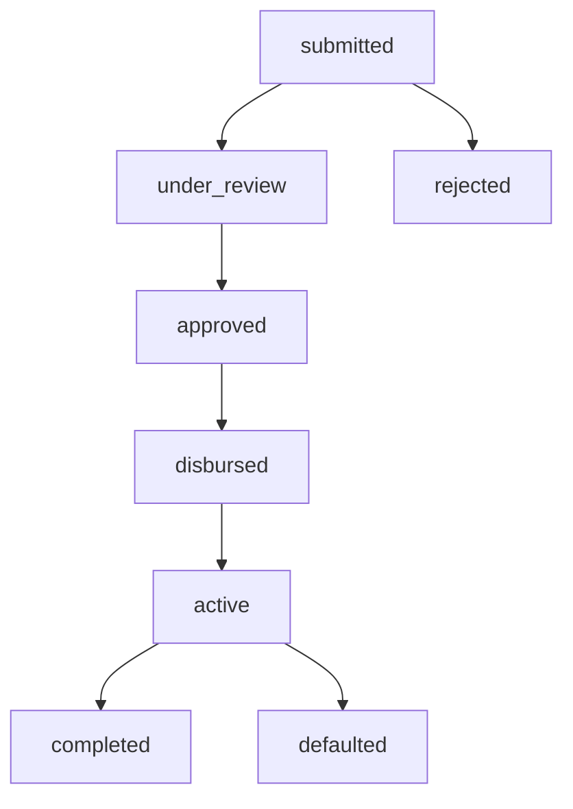
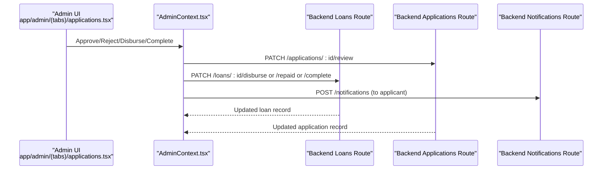
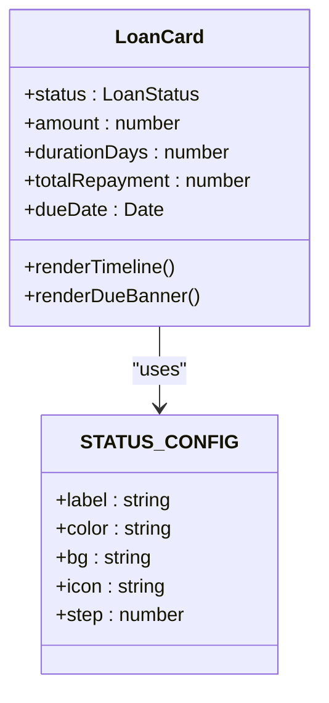
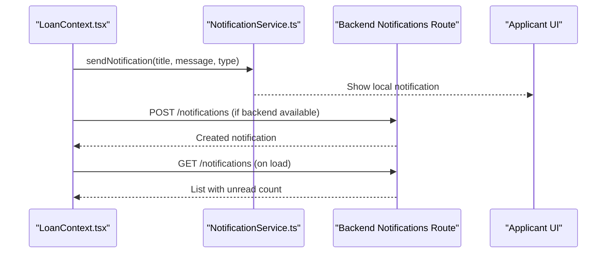
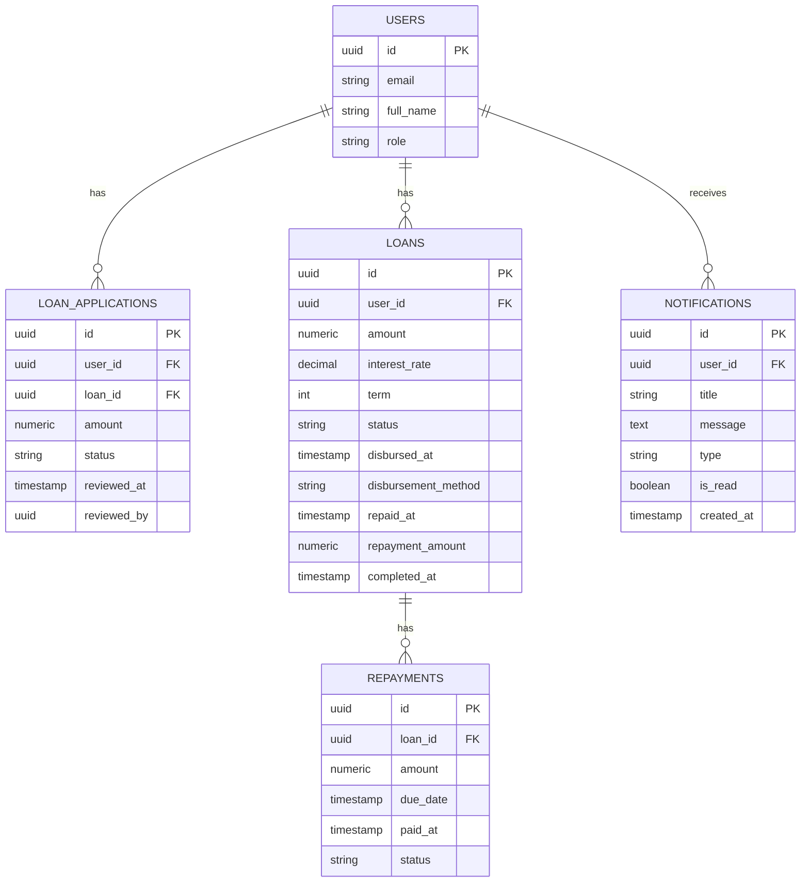
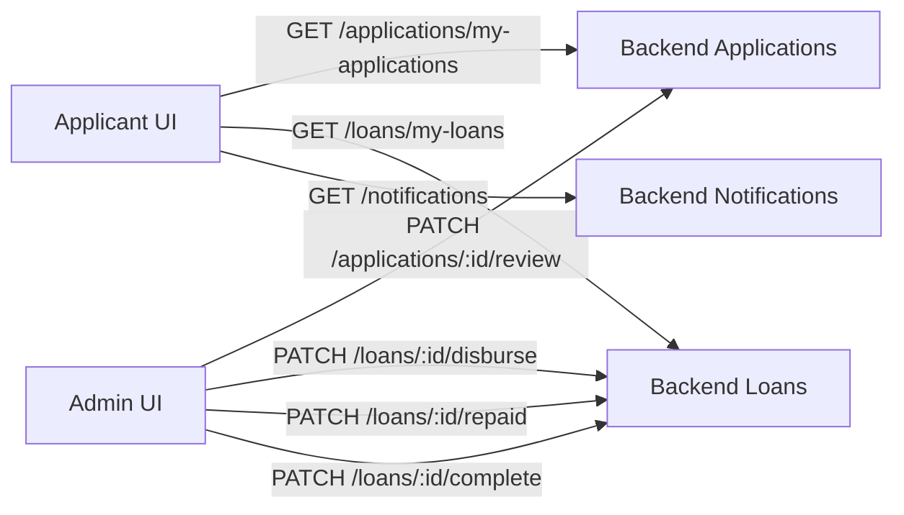
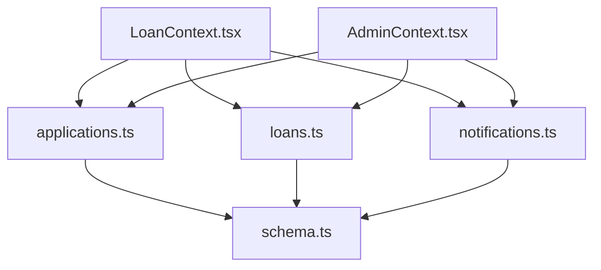

# Loan Status Tracking

<cite>
**Referenced Files in This Document**
- [LoanContext.tsx](file://contexts/LoanContext.tsx)
- [loans.tsx](file://app/(tabs)/loans.tsx)
- [schema.ts](file://backend/src/db/schema.ts)
- [loans.ts](file://backend/src/routes/loans.ts)
- [applications.ts](file://backend/src/routes/applications.ts)
- [notifications.ts](file://backend/src/routes/notifications.ts)
- [applications.tsx](file://app/admin/(tabs)/applications.tsx)
- [AdminContext.tsx](file://contexts/AdminContext.tsx)
- [NotificationService.ts](file://services/NotificationService.ts)
- [colors.ts](file://constants/colors.ts)
</cite>

## Table of Contents
1. [Introduction](#introduction)
2. [Project Structure](#project-structure)
3. [Core Components](#core-components)
4. [Architecture Overview](#architecture-overview)
5. [Detailed Component Analysis](#detailed-component-analysis)
6. [Dependency Analysis](#dependency-analysis)
7. [Performance Considerations](#performance-considerations)
8. [Troubleshooting Guide](#troubleshooting-guide)
9. [Conclusion](#conclusion)

## Introduction
This document explains the end-to-end loan status tracking and management system in the Phoenix loan platform. It covers the LoanStatus model, state transitions, both automatic and manual updates, UI indicators, notification triggers, and the data structures that support auditability and historical tracking. It also outlines how user roles (applicant vs. administrator) influence visibility and actions across the loan lifecycle.

## Project Structure
The loan lifecycle spans three layers:
- Frontend (React Native): Displays status, timelines, and actionable UI for applicants and admins.
- Backend (Hono + Drizzle ORM): Manages loan records, application reviews, and notifications.
- Shared data models: Define database schema and TypeScript types for consistent state.

**Diagram sources**
- [LoanContext.tsx:1-336](file://contexts/LoanContext.tsx#L1-L336)
- [loans.tsx](file://app/(tabs)/loans.tsx#L1-L545)
- [applications.tsx](file://app/admin/(tabs)/applications.tsx#L1-L457)
- [AdminContext.tsx:1-528](file://contexts/AdminContext.tsx#L1-L528)
- [loans.ts:1-320](file://backend/src/routes/loans.ts#L1-L320)
- [applications.ts:1-168](file://backend/src/routes/applications.ts#L1-L168)
- [notifications.ts:1-106](file://backend/src/routes/notifications.ts#L1-L106)
- [schema.ts:1-146](file://backend/src/db/schema.ts#L1-L146)
- [NotificationService.ts:1-135](file://services/NotificationService.ts#L1-L135)
- [colors.ts:1-64](file://constants/colors.ts#L1-L64)

**Section sources**
- [LoanContext.tsx:1-336](file://contexts/LoanContext.tsx#L1-L336)
- [loans.tsx](file://app/(tabs)/loans.tsx#L1-L545)
- [applications.tsx](file://app/admin/(tabs)/applications.tsx#L1-L457)
- [AdminContext.tsx:1-528](file://contexts/AdminContext.tsx#L1-L528)
- [loans.ts:1-320](file://backend/src/routes/loans.ts#L1-L320)
- [applications.ts:1-168](file://backend/src/routes/applications.ts#L1-L168)
- [notifications.ts:1-106](file://backend/src/routes/notifications.ts#L1-L106)
- [schema.ts:1-146](file://backend/src/db/schema.ts#L1-L146)
- [NotificationService.ts:1-135](file://services/NotificationService.ts#L1-L135)
- [colors.ts:1-64](file://constants/colors.ts#L1-L64)

## Core Components
- LoanStatus enum and UI mapping:
  - Enum values: submitted, under_review, approved, rejected, disbursed, active, completed, defaulted.
  - Each status maps to a color, background, icon, and a step for timeline rendering.
- Data models:
  - Frontend LoanApplication captures per-loan fields and timestamps.
  - Backend schema defines loans, loan_applications, repayments, and notifications tables with appropriate statuses and audit fields.
- Notification system:
  - Local notifications and backend persistence for user alerts.

Key responsibilities:
- Automatic transitions: simulated locally for demo and persisted in backend for real scenarios.
- Manual transitions: initiated by administrators via admin screens and backend routes.
- UI indicators: color-coded badges, icons, progress timelines, and due-date banners.

**Section sources**
- [LoanContext.tsx:8-39](file://contexts/LoanContext.tsx#L8-L39)
- [loans.tsx](file://app/(tabs)/loans.tsx#L14-L33)
- [schema.ts:24-88](file://backend/src/db/schema.ts#L24-L88)
- [NotificationService.ts:1-135](file://services/NotificationService.ts#L1-L135)

## Architecture Overview
The system separates concerns across layers:
- Frontend state and UI render status and timelines.
- Backend routes expose CRUD and lifecycle operations for loans and applications.
- Notifications bridge local and remote alerting.

**Diagram sources**
- [loans.tsx](file://app/(tabs)/loans.tsx#L309-L441)
- [LoanContext.tsx:198-261](file://contexts/LoanContext.tsx#L198-L261)
- [applications.ts:111-138](file://backend/src/routes/applications.ts#L111-L138)
- [notifications.ts:8-33](file://backend/src/routes/notifications.ts#L8-L33)
- [schema.ts:49-88](file://backend/src/db/schema.ts#L49-L88)

## Detailed Component Analysis

### LoanStatus Enum and Transitions
The system defines eight statuses across the lifecycle:
- submitted → under_review → approved → disbursed → active → completed
- rejected and defaulted are terminal or special-case states

**Diagram sources**
- [LoanContext.tsx:8-8](file://contexts/LoanContext.tsx#L8-L8)
- [loans.tsx](file://app/(tabs)/loans.tsx#L14-L23)
- [applications.ts:19-22](file://backend/src/routes/applications.ts#L19-L22)
- [loans.ts:199-222](file://backend/src/routes/loans.ts#L199-L222)

Business rules and triggers:
- submitted: created when an application is posted; immediately followed by under_review.
- under_review: automatic simulation in the frontend after a short delay; admin review in backend.
- approved: admin action; triggers notification to applicant.
- disbursed: admin action; sets disbursement metadata and moves to active.
- active: awaiting repayments; due-date banner highlights upcoming deadlines.
- completed: repayment recorded; optional explicit completion endpoint.
- rejected: admin action; notification to applicant.
- defaulted: overdue active/disbursed loans move to defaulted.

**Section sources**
- [LoanContext.tsx:198-273](file://contexts/LoanContext.tsx#L198-L273)
- [loans.tsx](file://app/(tabs)/loans.tsx#L14-L23)
- [applications.ts:140-165](file://backend/src/routes/applications.ts#L140-L165)
- [loans.ts:224-317](file://backend/src/routes/loans.ts#L224-L317)

### Status Update Mechanisms
- Automatic (frontend):
  - After submission, a timer advances status to under_review if still in submitted.
- Manual (backend/admin):
  - Admin approves/rejects applications.
  - Admin disburses loans and marks them repaid/completed.
  - Backend routes enforce status transitions and update timestamps.

**Diagram sources**
- [applications.tsx](file://app/admin/(tabs)/applications.tsx#L170-L250)
- [AdminContext.tsx:311-413](file://contexts/AdminContext.tsx#L311-L413)
- [applications.ts:140-165](file://backend/src/routes/applications.ts#L140-L165)
- [loans.ts:224-317](file://backend/src/routes/loans.ts#L224-L317)
- [notifications.ts:71-90](file://backend/src/routes/notifications.ts#L71-L90)

**Section sources**
- [AdminContext.tsx:311-413](file://contexts/AdminContext.tsx#L311-L413)
- [applications.ts:140-165](file://backend/src/routes/applications.ts#L140-L165)
- [loans.ts:224-317](file://backend/src/routes/loans.ts#L224-L317)

### Visual Indicators and UI Components
- Color coding and backgrounds:
  - Each status maps to a color and background for consistent visual cues.
- Progress timeline:
  - Ordered stages show current and past steps; rejected/defaulted show a simplified indicator.
- Due-date banners:
  - Active/disbursed cards display days remaining or overdue warnings.
- Action buttons:
  - Admin screens present contextual actions (approve, reject, disburse, mark repaid).

**Diagram sources**
- [loans.tsx](file://app/(tabs)/loans.tsx#L14-L84)
- [colors.ts:1-64](file://constants/colors.ts#L1-L64)

**Section sources**
- [loans.tsx](file://app/(tabs)/loans.tsx#L14-L131)
- [colors.ts:1-64](file://constants/colors.ts#L1-L64)

### Notification Triggers and Delivery
- Local notifications:
  - Immediate alerts with sound and badge when app is in foreground.
- Backend notifications:
  - Persisted in the notifications table and retrievable by user.
- Triggers:
  - Application submitted, approval/rejection, disbursement, repayment receipt, and completion.

**Diagram sources**
- [LoanContext.tsx:183-196](file://contexts/LoanContext.tsx#L183-L196)
- [NotificationService.ts:116-135](file://services/NotificationService.ts#L116-L135)
- [notifications.ts:8-33](file://backend/src/routes/notifications.ts#L8-L33)

**Section sources**
- [LoanContext.tsx:183-196](file://contexts/LoanContext.tsx#L183-L196)
- [NotificationService.ts:116-135](file://services/NotificationService.ts#L116-L135)
- [notifications.ts:8-33](file://backend/src/routes/notifications.ts#L8-L33)

### Data Structures Supporting Status Tracking
- Frontend:
  - LoanApplication includes status, appliedAt, dueDate, and optional timestamps for disbursement/repayment/completion.
- Backend:
  - loans table tracks status, disbursement fields, repayment fields, and completion fields.
  - loan_applications table tracks application status and review metadata.
  - notifications table stores user-specific alerts with read state.
  - repayments table captures individual repayment events.

**Diagram sources**
- [schema.ts:5-146](file://backend/src/db/schema.ts#L5-L146)

**Section sources**
- [LoanContext.tsx:11-39](file://contexts/LoanContext.tsx#L11-L39)
- [schema.ts:24-88](file://backend/src/db/schema.ts#L24-L88)

### Role-Based Views and Permissions
- Applicants:
  - View personal loans, status timeline, due banners, and repayment actions when applicable.
  - Receive notifications for lifecycle events.
- Administrators:
  - Approve/reject applications, mark disbursements, and mark repayments/completions.
  - See overdue indicators and manage user settings.

**Diagram sources**
- [applications.ts:55-77](file://backend/src/routes/applications.ts#L55-L77)
- [loans.ts:115-138](file://backend/src/routes/loans.ts#L115-L138)
- [notifications.ts:8-33](file://backend/src/routes/notifications.ts#L8-L33)
- [applications.tsx](file://app/admin/(tabs)/applications.tsx#L155-L327)

**Section sources**
- [applications.ts:55-77](file://backend/src/routes/applications.ts#L55-L77)
- [loans.ts:115-138](file://backend/src/routes/loans.ts#L115-L138)
- [applications.tsx](file://app/admin/(tabs)/applications.tsx#L155-L327)

## Dependency Analysis
- Frontend depends on backend APIs for application and loan data, and on the notification service for alerts.
- Backend routes depend on the schema for database operations.
- Admin context orchestrates admin actions and synchronizes UI state with backend.

**Diagram sources**
- [LoanContext.tsx:1-336](file://contexts/LoanContext.tsx#L1-L336)
- [AdminContext.tsx:1-528](file://contexts/AdminContext.tsx#L1-L528)
- [applications.ts:1-168](file://backend/src/routes/applications.ts#L1-L168)
- [loans.ts:1-320](file://backend/src/routes/loans.ts#L1-L320)
- [notifications.ts:1-106](file://backend/src/routes/notifications.ts#L1-L106)
- [schema.ts:1-146](file://backend/src/db/schema.ts#L1-L146)

**Section sources**
- [LoanContext.tsx:1-336](file://contexts/LoanContext.tsx#L1-L336)
- [AdminContext.tsx:1-528](file://contexts/AdminContext.tsx#L1-L528)
- [applications.ts:1-168](file://backend/src/routes/applications.ts#L1-L168)
- [loans.ts:1-320](file://backend/src/routes/loans.ts#L1-L320)
- [notifications.ts:1-106](file://backend/src/routes/notifications.ts#L1-L106)
- [schema.ts:1-146](file://backend/src/db/schema.ts#L1-L146)

## Performance Considerations
- Minimize network calls by caching recent loan lists in AsyncStorage and refreshing on demand.
- Batch admin data loads using Promise.allSettled to avoid blocking UI while some endpoints may be slow.
- Debounce frequent UI refreshes and avoid unnecessary re-renders by memoizing derived values (unread counts, active loan).
- Use pagination or limits for notifications to reduce payload sizes.

## Troubleshooting Guide
- Notifications not appearing:
  - Verify permissions and device support; local notifications require device testing.
  - Confirm backend notification creation succeeds and frontend fetches notifications.
- Status not updating:
  - Ensure backend routes are invoked with correct headers and IDs.
  - Check that frontend timers are not overriding persisted state unexpectedly.
- Overdue state not reflected:
  - Confirm dueDate is calculated correctly and current date comparisons are timezone-aware.
- Admin actions failing:
  - Validate X-User-Id headers and that endpoints are reachable.

**Section sources**
- [NotificationService.ts:26-69](file://services/NotificationService.ts#L26-L69)
- [notifications.ts:8-33](file://backend/src/routes/notifications.ts#L8-L33)
- [AdminContext.tsx:311-413](file://contexts/AdminContext.tsx#L311-L413)
- [loans.tsx](file://app/(tabs)/loans.tsx#L373-L426)

## Conclusion
The Phoenix loan status tracking system combines frontend-driven simulations with robust backend orchestration. It provides clear visual feedback, timely notifications, and role-specific capabilities for both applicants and administrators. The schema and context types ensure consistent state handling across the lifecycle, enabling reliable audits and future enhancements.