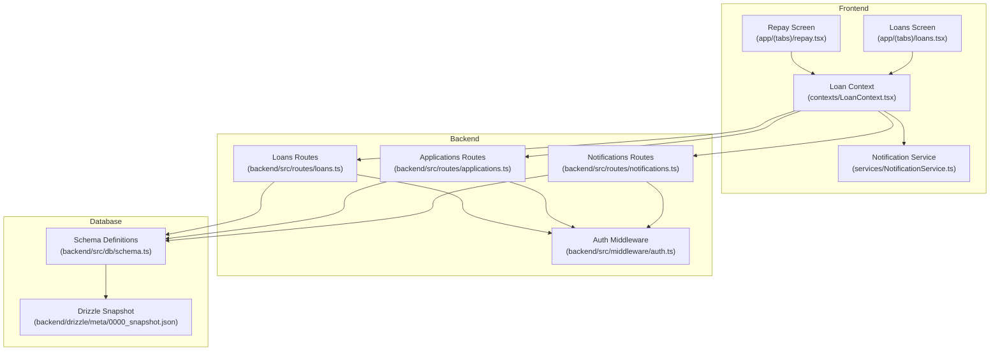
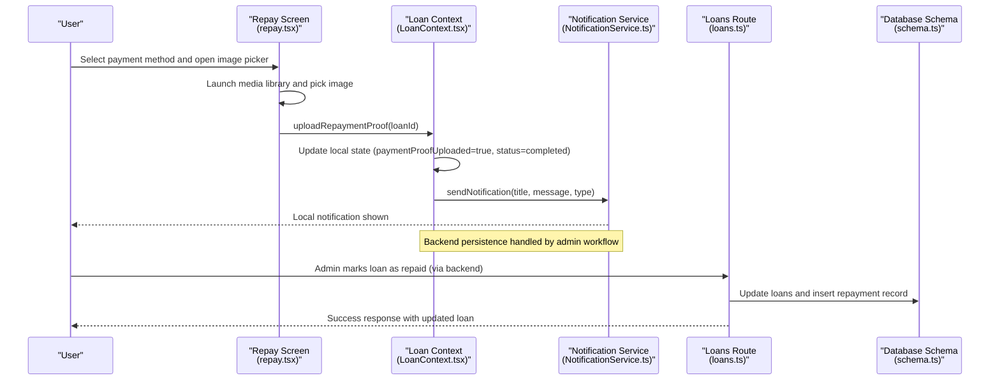
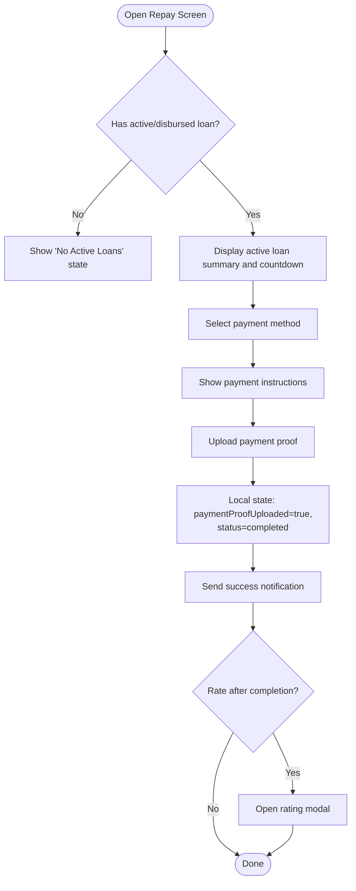
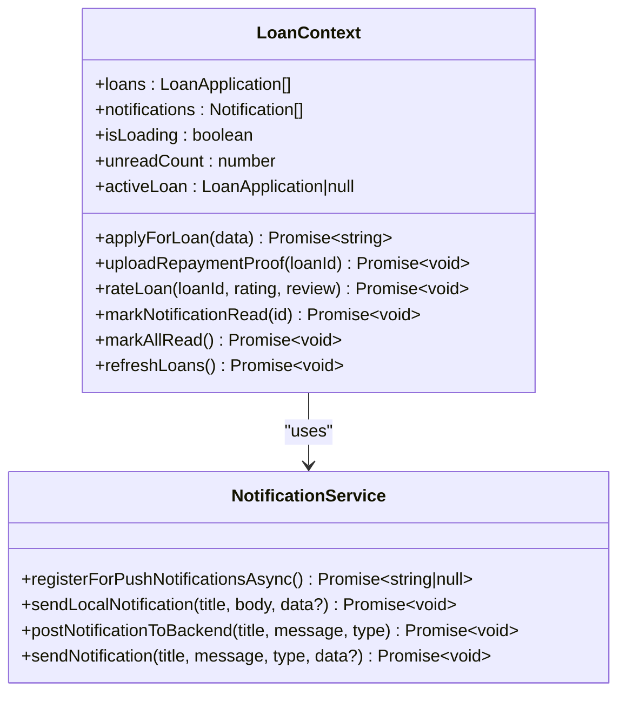
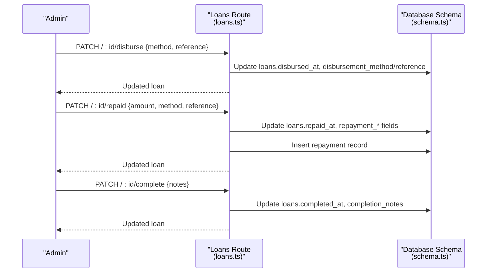
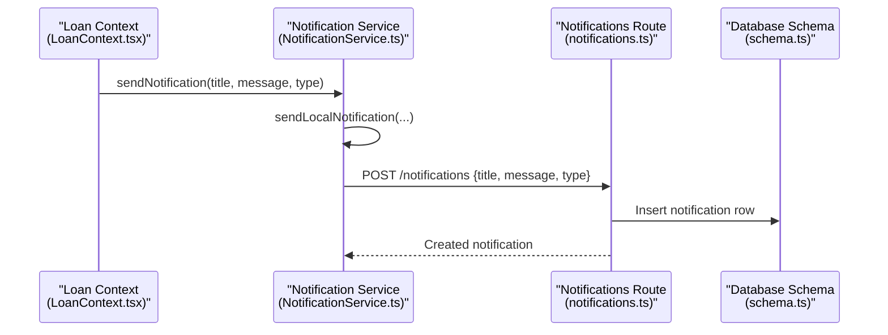
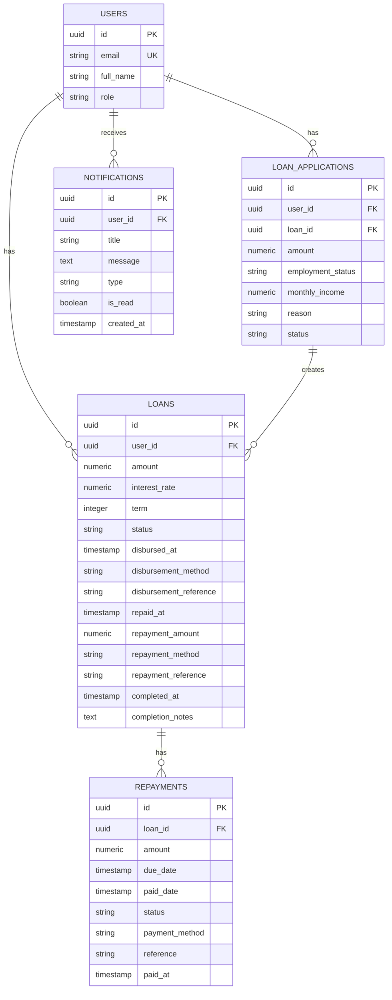
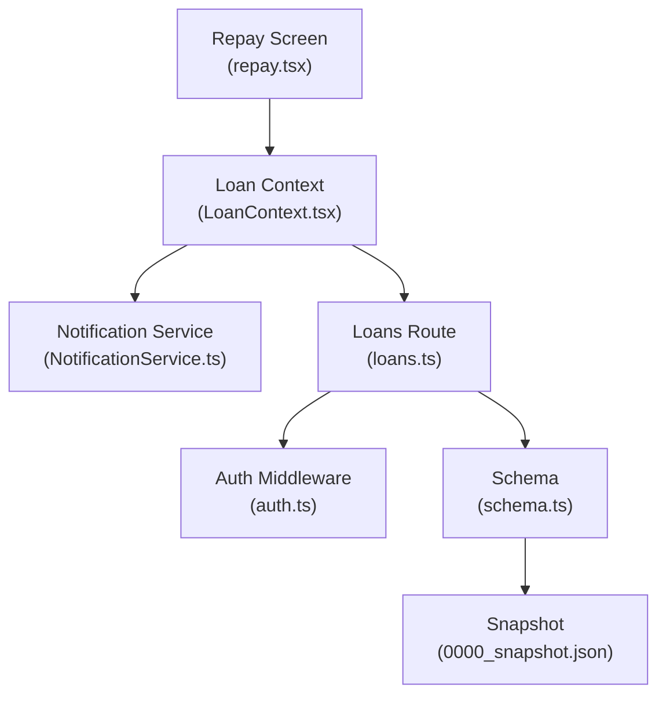

# Repayment Management

<cite>
**Referenced Files in This Document**
- [repay.tsx](file://app/(tabs)/repay.tsx)
- [LoanContext.tsx](file://contexts/LoanContext.tsx)
- [NotificationService.ts](file://services/NotificationService.ts)
- [loans.tsx](file://app/(tabs)/loans.tsx)
- [loans.ts](file://backend/src/routes/loans.ts)
- [applications.ts](file://backend/src/routes/applications.ts)
- [notifications.ts](file://backend/src/routes/notifications.ts)
- [schema.ts](file://backend/src/db/schema.ts)
- [auth.ts](file://backend/src/middleware/auth.ts)
- [0000_snapshot.json](file://backend/drizzle/meta/0000_snapshot.json)
- [add_loan_columns.sql](file://backend/add_loan_columns.sql)
- [create-notifications-table.sql](file://backend/create-notifications-table.sql)
</cite>

## Table of Contents
1. [Introduction](#introduction)
2. [Project Structure](#project-structure)
3. [Core Components](#core-components)
4. [Architecture Overview](#architecture-overview)
5. [Detailed Component Analysis](#detailed-component-analysis)
6. [Dependency Analysis](#dependency-analysis)
7. [Performance Considerations](#performance-considerations)
8. [Troubleshooting Guide](#troubleshooting-guide)
9. [Conclusion](#conclusion)

## Introduction
This document describes the repayment management system for the Phoenix loan platform. It covers the end-to-end repayment workflow from active loan status through payment verification to loan completion, including payment proof upload, verification mechanisms, automated status updates, calculation of repayment amounts, interest accrual, late payment handling, user notifications, and integration with loan status management. It also documents error handling, retry mechanisms, and customer support workflows.

## Project Structure
The repayment system spans three primary areas:
- Frontend screens and state management for user interactions
- Backend APIs for loan lifecycle and notifications
- Database schema supporting loan, application, repayment, and notification records

**Diagram sources**
- [repay.tsx](file://app/(tabs)/repay.tsx#L225-L450)
- [LoanContext.tsx:82-336](file://contexts/LoanContext.tsx#L82-L336)
- [NotificationService.ts:1-135](file://services/NotificationService.ts#L1-L135)
- [loans.tsx](file://app/(tabs)/loans.tsx#L309-L441)
- [loans.ts:1-320](file://backend/src/routes/loans.ts#L1-L320)
- [applications.ts:1-168](file://backend/src/routes/applications.ts#L1-L168)
- [notifications.ts:1-106](file://backend/src/routes/notifications.ts#L1-L106)
- [schema.ts:23-88](file://backend/src/db/schema.ts#L23-L88)
- [auth.ts:10-47](file://backend/src/middleware/auth.ts#L10-L47)
- [0000_snapshot.json:141-279](file://backend/drizzle/meta/0000_snapshot.json#L141-L279)

**Section sources**
- [repay.tsx](file://app/(tabs)/repay.tsx#L1-L671)
- [LoanContext.tsx:1-336](file://contexts/LoanContext.tsx#L1-L336)
- [NotificationService.ts:1-135](file://services/NotificationService.ts#L1-L135)
- [loans.tsx](file://app/(tabs)/loans.tsx#L1-L545)
- [loans.ts:1-320](file://backend/src/routes/loans.ts#L1-L320)
- [applications.ts:1-168](file://backend/src/routes/applications.ts#L1-L168)
- [notifications.ts:1-106](file://backend/src/routes/notifications.ts#L1-L106)
- [schema.ts:1-146](file://backend/src/db/schema.ts#L1-L146)
- [auth.ts:1-48](file://backend/src/middleware/auth.ts#L1-L48)
- [0000_snapshot.json:1-617](file://backend/drizzle/meta/0000_snapshot.json#L1-L617)

## Core Components
- Repayment UI and workflow:
  - Payment method selection and instructions
  - Payment proof upload with image picker
  - Countdown timer and overdue warnings
  - Payment history and rating after completion
- Loan state management:
  - Local state updates for payment proof uploads
  - Notification dispatch for payment events
  - Active loan filtering and due date calculations
- Backend loan lifecycle:
  - Disbursement and repayment marking endpoints
  - Repayment record creation
  - Status transitions and audit timestamps
- Notifications:
  - Local and backend notification persistence
  - Push notification delivery and channels
- Database schema:
  - Loans, loan applications, repayments, and notifications tables
  - Supporting columns for disbursement, repayment, and completion tracking

**Section sources**
- [repay.tsx](file://app/(tabs)/repay.tsx#L17-L59)
- [repay.tsx](file://app/(tabs)/repay.tsx#L225-L450)
- [LoanContext.tsx:263-273](file://contexts/LoanContext.tsx#L263-L273)
- [LoanContext.tsx:315-318](file://contexts/LoanContext.tsx#L315-L318)
- [loans.ts:224-290](file://backend/src/routes/loans.ts#L224-L290)
- [schema.ts:23-88](file://backend/src/db/schema.ts#L23-L88)
- [NotificationService.ts:93-134](file://services/NotificationService.ts#L93-L134)

## Architecture Overview
The repayment workflow integrates frontend and backend components to manage payment proof uploads, verification, and status updates. The frontend captures user intent and uploads proofs, while the backend validates and persists loan and repayment records. Notifications bridge user awareness and system actions.

**Diagram sources**
- [repay.tsx](file://app/(tabs)/repay.tsx#L238-L260)
- [LoanContext.tsx:263-273](file://contexts/LoanContext.tsx#L263-L273)
- [NotificationService.ts:116-134](file://services/NotificationService.ts#L116-L134)
- [loans.ts:252-290](file://backend/src/routes/loans.ts#L252-L290)
- [schema.ts:23-88](file://backend/src/db/schema.ts#L23-L88)

## Detailed Component Analysis

### Repayment UI and Workflow
The repayment screen presents:
- Active loan summary with principal, interest, due date, and countdown
- Payment method cards and step-by-step instructions
- Payment proof upload with accepted formats
- Payment history and rating flow

Key behaviors:
- Countdown turns warning/error when overdue; displays penalty banner
- Payment proof upload triggers local state update and success notification
- Rating modal allows post-completion feedback

**Diagram sources**
- [repay.tsx](file://app/(tabs)/repay.tsx#L225-L450)
- [LoanContext.tsx:263-273](file://contexts/LoanContext.tsx#L263-L273)
- [NotificationService.ts:116-134](file://services/NotificationService.ts#L116-L134)

**Section sources**
- [repay.tsx](file://app/(tabs)/repay.tsx#L17-L59)
- [repay.tsx](file://app/(tabs)/repay.tsx#L225-L450)

### Loan Context and State Updates
The Loan Context manages:
- Local state for loans and notifications
- Payment proof upload handler that sets paymentProofUploaded and status
- Notification dispatch for payment-related events
- Active loan derivation from status filters

**Diagram sources**
- [LoanContext.tsx:50-62](file://contexts/LoanContext.tsx#L50-L62)
- [NotificationService.ts:26-134](file://services/NotificationService.ts#L26-L134)

**Section sources**
- [LoanContext.tsx:82-336](file://contexts/LoanContext.tsx#L82-L336)
- [NotificationService.ts:1-135](file://services/NotificationService.ts#L1-L135)

### Backend Loan Lifecycle and Repayment
Backend endpoints support:
- Disbursement: sets status to disbursed and records disbursement metadata
- Repayment: marks loan as repaid, stores repayment details, and inserts a repayment record
- Completion: finalizes loan with completion notes and timestamps

**Diagram sources**
- [loans.ts:224-290](file://backend/src/routes/loans.ts#L224-L290)
- [schema.ts:23-88](file://backend/src/db/schema.ts#L23-L88)

**Section sources**
- [loans.ts:224-290](file://backend/src/routes/loans.ts#L224-L290)
- [schema.ts:23-88](file://backend/src/db/schema.ts#L23-L88)

### Notifications and User Awareness
The notification system supports:
- Local notifications for immediate user feedback
- Backend persistence for historical tracking
- Channel configuration and permission handling

**Diagram sources**
- [LoanContext.tsx:183-196](file://contexts/LoanContext.tsx#L183-L196)
- [NotificationService.ts:93-134](file://services/NotificationService.ts#L93-L134)
- [notifications.ts:72-90](file://backend/src/routes/notifications.ts#L72-L90)
- [schema.ts:79-88](file://backend/src/db/schema.ts#L79-L88)

**Section sources**
- [LoanContext.tsx:183-196](file://contexts/LoanContext.tsx#L183-L196)
- [NotificationService.ts:93-134](file://services/NotificationService.ts#L93-L134)
- [notifications.ts:1-106](file://backend/src/routes/notifications.ts#L1-L106)
- [schema.ts:79-88](file://backend/src/db/schema.ts#L79-L88)

### Database Schema and Migration Support
The schema defines:
- Loans with disbursement, repayment, and completion fields
- Repayments with due/paid dates and status
- Notifications with read/unread tracking
- Migrations and snapshot files ensure consistent schema across environments

**Diagram sources**
- [schema.ts:4-88](file://backend/src/db/schema.ts#L4-L88)
- [0000_snapshot.json:6-441](file://backend/drizzle/meta/0000_snapshot.json#L6-L441)

**Section sources**
- [schema.ts:23-88](file://backend/src/db/schema.ts#L23-L88)
- [0000_snapshot.json:141-279](file://backend/drizzle/meta/0000_snapshot.json#L141-L279)
- [add_loan_columns.sql:1-12](file://backend/add_loan_columns.sql#L1-L12)
- [create-notifications-table.sql:1-30](file://backend/create-notifications-table.sql#L1-L30)

## Dependency Analysis
- Frontend-to-backend:
  - Repayment UI calls Loan Context for state updates
  - Loan Context triggers Notification Service and backend routes
  - Backend routes depend on schema definitions and auth middleware
- Data consistency:
  - Loans endpoint updates multiple fields for lifecycle tracking
  - Repayment endpoint creates a child record linking to the loan
- Security:
  - Auth middleware enforces token-based access for protected routes

**Diagram sources**
- [repay.tsx](file://app/(tabs)/repay.tsx#L225-L450)
- [LoanContext.tsx:82-336](file://contexts/LoanContext.tsx#L82-L336)
- [NotificationService.ts:1-135](file://services/NotificationService.ts#L1-L135)
- [loans.ts:1-320](file://backend/src/routes/loans.ts#L1-L320)
- [auth.ts:10-47](file://backend/src/middleware/auth.ts#L10-L47)
- [schema.ts:23-88](file://backend/src/db/schema.ts#L23-L88)
- [0000_snapshot.json:141-279](file://backend/drizzle/meta/0000_snapshot.json#L141-L279)

**Section sources**
- [repay.tsx](file://app/(tabs)/repay.tsx#L225-L450)
- [LoanContext.tsx:82-336](file://contexts/LoanContext.tsx#L82-L336)
- [loans.ts:1-320](file://backend/src/routes/loans.ts#L1-L320)
- [auth.ts:10-47](file://backend/src/middleware/auth.ts#L10-L47)
- [schema.ts:23-88](file://backend/src/db/schema.ts#L23-L88)

## Performance Considerations
- Local-first UX:
  - Immediate UI updates for payment proof uploads reduce perceived latency
  - Notifications are sent locally first, with backend persistence as a fallback
- Database indexing:
  - Indexes on notifications improve retrieval performance for user-specific queries
- Network efficiency:
  - Minimal payload sizes for status updates and notifications
  - Batch operations for notification reads when supported by backend

## Troubleshooting Guide
Common issues and resolutions:
- Payment proof upload permissions:
  - If media library permission is denied, the UI prompts the user to grant access
- Backend connectivity:
  - Notification posting to backend may fail; local notifications still deliver
  - Loan status updates require proper authentication tokens
- Schema mismatches:
  - Ensure migrations are applied to add missing loan columns and notifications table
- Overdue handling:
  - Countdown banner indicates overdue state; UI displays penalty notice

Operational checks:
- Verify JWT secret and auth middleware configuration
- Confirm notification channel setup and device permissions
- Validate repayment endpoint payloads (amount, method, reference)

**Section sources**
- [repay.tsx](file://app/(tabs)/repay.tsx#L241-L245)
- [NotificationService.ts:26-69](file://services/NotificationService.ts#L26-L69)
- [auth.ts:10-36](file://backend/src/middleware/auth.ts#L10-L36)
- [add_loan_columns.sql:1-12](file://backend/add_loan_columns.sql#L1-L12)
- [create-notifications-table.sql:1-30](file://backend/create-notifications-table.sql#L1-L30)

## Conclusion
The repayment management system combines a responsive frontend with robust backend endpoints and a well-structured database schema. It enables users to upload payment proofs, receive timely notifications, and track repayment progress, while administrators can finalize loans and maintain audit trails. The design balances user experience with operational reliability, including graceful handling of network failures and schema evolution.