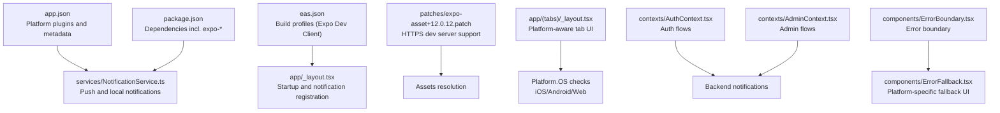
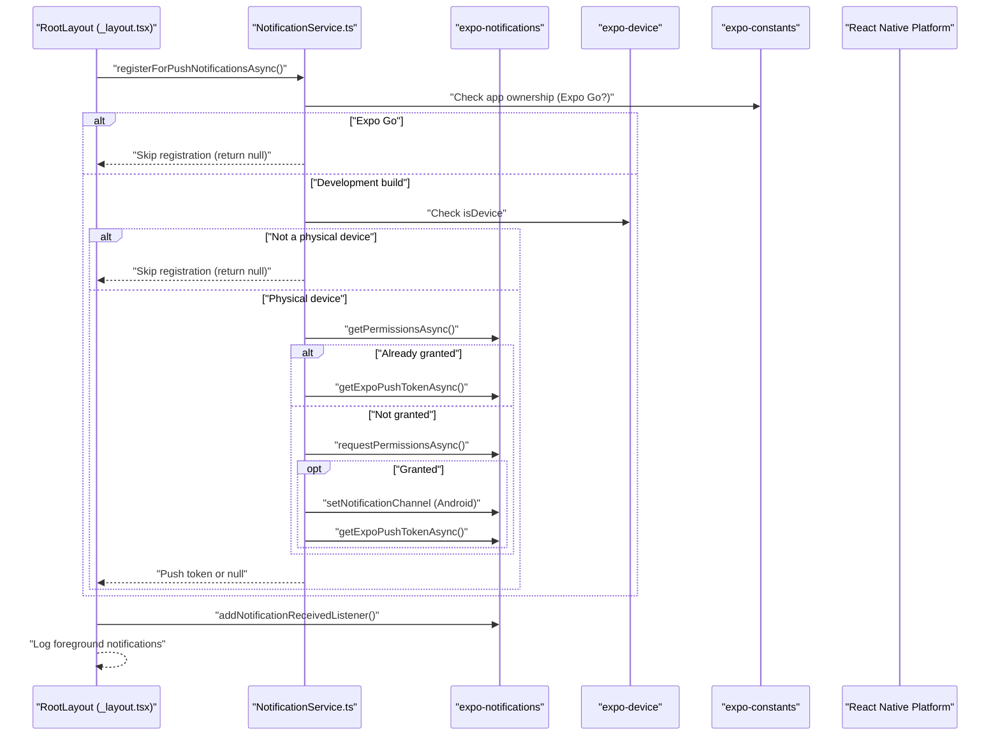
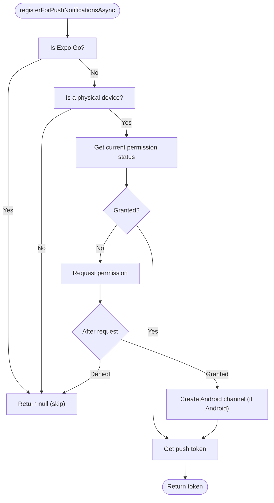
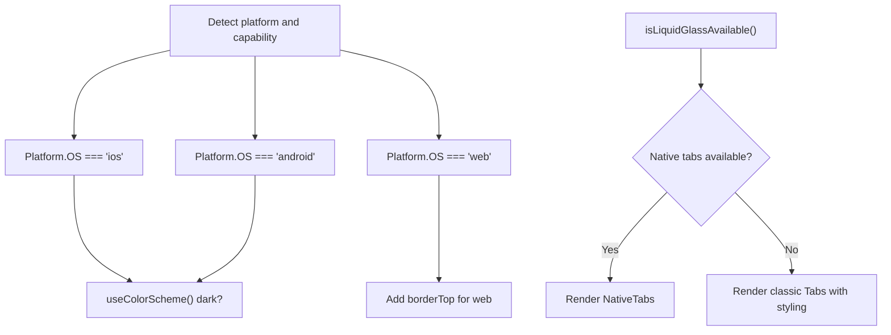
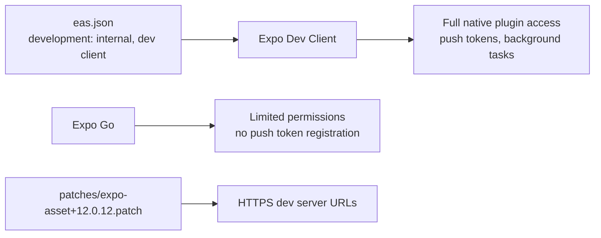
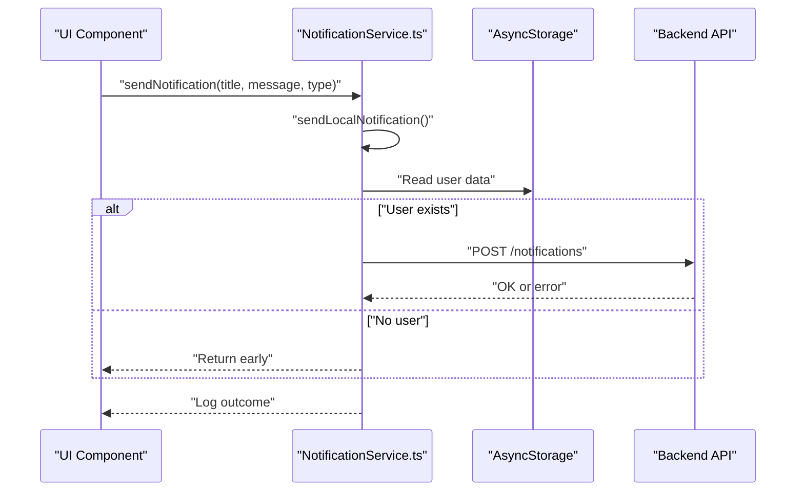
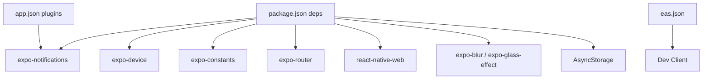

# Device Permissions & Platform Integration

<cite>
**Referenced Files in This Document**
- [app.json](file://app.json)
- [eas.json](file://eas.json)
- [package.json](file://package.json)
- [patches/expo-asset+12.0.12.patch](file://patches/expo-asset+12.0.12.patch)
- [services/NotificationService.ts](file://services/NotificationService.ts)
- [components/NotificationTest.tsx](file://components/NotificationTest.tsx)
- [contexts/AuthContext.tsx](file://contexts/AuthContext.tsx)
- [contexts/AdminContext.tsx](file://contexts/AdminContext.tsx)
- [app/_layout.tsx](file://app/_layout.tsx)
- [app/(tabs)/_layout.tsx](file://app/(tabs)/_layout.tsx)
- [components/ErrorBoundary.tsx](file://components/ErrorBoundary.tsx)
- [components/ErrorFallback.tsx](file://components/ErrorFallback.tsx)
</cite>

## Table of Contents
1. [Introduction](#introduction)
2. [Project Structure](#project-structure)
3. [Core Components](#core-components)
4. [Architecture Overview](#architecture-overview)
5. [Detailed Component Analysis](#detailed-component-analysis)
6. [Dependency Analysis](#dependency-analysis)
7. [Performance Considerations](#performance-considerations)
8. [Troubleshooting Guide](#troubleshooting-guide)
9. [Conclusion](#conclusion)
10. [Appendices](#appendices)

## Introduction
This document explains how the application handles device permissions and integrates with platform-specific capabilities across iOS, Android, and Web targets. It covers the notification permission system, platform detection logic, Expo Go versus development builds, graceful degradation strategies, asset handling, and UI adaptations. It also documents backend integration points for notifications and outlines progressive enhancement patterns for device features.

## Project Structure
The application is an Expo Router-based React Native app with platform-specific configurations and runtime behaviors. Key areas relevant to permissions and platform integration include:
- Configuration files for platform plugins and build profiles
- Services for push/local notifications
- Layouts and tabs with platform-aware UI
- Context providers for authentication and admin workflows
- Error handling with platform-specific fallbacks

**Diagram sources**
- [app.json:1-77](file://app.json#L1-L77)
- [eas.json:1-22](file://eas.json#L1-L22)
- [package.json:22-68](file://package.json#L22-L68)
- [services/NotificationService.ts:1-135](file://services/NotificationService.ts#L1-L135)
- [patches/expo-asset+12.0.12.patch:1-17](file://patches/expo-asset+12.0.12.patch#L1-L17)
- [app/_layout.tsx:1-83](file://app/_layout.tsx#L1-L83)
- [app/(tabs)/_layout.tsx:1-163](file://app/(tabs)/_layout.tsx#L1-L163)
- [contexts/AuthContext.tsx:1-135](file://contexts/AuthContext.tsx#L1-L135)
- [contexts/AdminContext.tsx:1-528](file://contexts/AdminContext.tsx#L1-L528)
- [components/ErrorBoundary.tsx:1-55](file://components/ErrorBoundary.tsx#L1-L55)
- [components/ErrorFallback.tsx:1-287](file://components/ErrorFallback.tsx#L1-L287)

**Section sources**
- [app.json:1-77](file://app.json#L1-L77)
- [eas.json:1-22](file://eas.json#L1-L22)
- [package.json:22-68](file://package.json#L22-L68)

## Core Components
- Notification service orchestrating permission checks, channel creation, token retrieval, and local/backend notifications
- Root layout registering push notifications and listening to foreground events
- Platform-aware tab layout switching between native and classic UI depending on device capabilities
- Build configuration enabling Expo Dev Client for development builds
- Asset patch ensuring HTTPS-compatible development server URLs
- Error boundary and fallback UI for robust platform-specific error handling

**Section sources**
- [services/NotificationService.ts:1-135](file://services/NotificationService.ts#L1-L135)
- [app/_layout.tsx:31-83](file://app/_layout.tsx#L31-L83)
- [app/(tabs)/_layout.tsx:141-146](file://app/(tabs)/_layout.tsx#L141-L146)
- [eas.json:7-10](file://eas.json#L7-L10)
- [patches/expo-asset+12.0.12.patch:1-17](file://patches/expo-asset+12.0.12.patch#L1-L17)
- [components/ErrorBoundary.tsx:16-55](file://components/ErrorBoundary.tsx#L16-L55)
- [components/ErrorFallback.tsx:21-180](file://components/ErrorFallback.tsx#L21-L180)

## Architecture Overview
The permission and platform integration architecture centers on:
- Platform detection via React Native’s Platform and Expo Device constants
- Conditional logic for permissions and UI adaptations
- Build-time differentiation between Expo Go and development builds
- Runtime fallbacks for unavailable features and network errors

**Diagram sources**
- [app/_layout.tsx:50-61](file://app/_layout.tsx#L50-L61)
- [services/NotificationService.ts:26-69](file://services/NotificationService.ts#L26-L69)

## Detailed Component Analysis

### Notification Permission System
- Determines whether the app runs in Expo Go and skips push registration accordingly
- Requests notification permissions on physical devices and sets up Android channels
- Provides local notifications and backend persistence with graceful fallbacks

**Diagram sources**
- [services/NotificationService.ts:26-69](file://services/NotificationService.ts#L26-L69)

**Section sources**
- [services/NotificationService.ts:1-135](file://services/NotificationService.ts#L1-L135)
- [app/_layout.tsx:50-61](file://app/_layout.tsx#L50-L61)

### Platform Detection and UI Adaptations
- Uses Platform.OS to adapt tab bar styling and background rendering
- Chooses between native tabs and classic tabs based on capability detection
- Applies platform-specific fonts and safe area insets

**Diagram sources**
- [app/(tabs)/_layout.tsx:44-146](file://app/(tabs)/_layout.tsx#L44-L146)

**Section sources**
- [app/(tabs)/_layout.tsx:1-163](file://app/(tabs)/_layout.tsx#L1-L163)

### Expo Go vs Development Build Differences
- Build profiles enable development client distribution for internal testing
- Push token registration is skipped in Expo Go; requires a development build
- Asset resolution patch ensures HTTPS-compatible development server URLs

**Diagram sources**
- [eas.json:7-10](file://eas.json#L7-L10)
- [patches/expo-asset+12.0.12.patch:8-10](file://patches/expo-asset+12.0.12.patch#L8-L10)

**Section sources**
- [eas.json:1-22](file://eas.json#L1-L22)
- [services/NotificationService.ts:27-31](file://services/NotificationService.ts#L27-L31)
- [patches/expo-asset+12.0.12.patch:1-17](file://patches/expo-asset+12.0.12.patch#L1-L17)

### Asset Handling and Patch Application
- The patch modifies asset source selection to respect HTTPS scheme from the manifest base URL
- Ensures development server URLs use the appropriate scheme for secure connections

**Section sources**
- [patches/expo-asset+12.0.12.patch:1-17](file://patches/expo-asset+12.0.12.patch#L1-L17)

### Backend Integration for Notifications
- Local notifications are sent immediately
- Backend persistence attempts to POST notifications and logs success/failure
- Admin and user contexts integrate notification endpoints for application updates

**Diagram sources**
- [services/NotificationService.ts:116-135](file://services/NotificationService.ts#L116-L135)
- [contexts/AdminContext.tsx:313-331](file://contexts/AdminContext.tsx#L313-L331)
- [contexts/AdminContext.tsx:337-361](file://contexts/AdminContext.tsx#L337-L361)

**Section sources**
- [services/NotificationService.ts:71-135](file://services/NotificationService.ts#L71-L135)
- [contexts/AdminContext.tsx:304-361](file://contexts/AdminContext.tsx#L304-L361)

### Progressive Enhancement Patterns and Graceful Degradation
- Feature flags and capability checks gate advanced UI and behavior
- Local notifications serve as a fallback when backend persistence fails
- Error boundaries and platform-specific fallback UI ensure resilience

**Section sources**
- [app/(tabs)/_layout.tsx:141-146](file://app/(tabs)/_layout.tsx#L141-L146)
- [services/NotificationService.ts:122-134](file://services/NotificationService.ts#L122-L134)
- [components/ErrorBoundary.tsx:16-55](file://components/ErrorBoundary.tsx#L16-L55)
- [components/ErrorFallback.tsx:21-180](file://components/ErrorFallback.tsx#L21-L180)

## Dependency Analysis
Key dependencies impacting permissions and platform integration:
- Notifications: expo-notifications, expo-device, expo-constants
- Platform UI: react-native, react-native-web, expo-blur, expo-glass-effect
- Routing and layouts: expo-router, react-native-gesture-handler
- Storage: @react-native-async-storage/async-storage
- Build/runtime: expo-dev-client, eas build profiles

**Diagram sources**
- [package.json:22-68](file://package.json#L22-L68)
- [eas.json:7-10](file://eas.json#L7-L10)
- [app.json:35-61](file://app.json#L35-L61)

**Section sources**
- [package.json:22-68](file://package.json#L22-L68)
- [app.json:35-61](file://app.json#L35-L61)
- [eas.json:1-22](file://eas.json#L1-L22)

## Performance Considerations
- Minimize repeated permission prompts by caching statuses and tokens
- Defer heavy initialization until fonts and splash are handled
- Use capability checks to avoid unnecessary work on unsupported platforms
- Prefer local notifications for immediate feedback while background persistence continues asynchronously

## Troubleshooting Guide
Common issues and remedies:
- Push token registration returns null in Expo Go: Expected behavior; use a development build for push tokens
- Permission denied: Log the denial and guide users to open system settings if canAskAgain is false
- Android channel missing: Ensure channel creation runs on Android after permission grant
- Backend notification failures: Local notifications still succeed; log and continue gracefully
- Error boundaries: Use the error boundary to capture and present platform-specific fallback UI

**Section sources**
- [services/NotificationService.ts:27-31](file://services/NotificationService.ts#L27-L31)
- [services/NotificationService.ts:46-49](file://services/NotificationService.ts#L46-L49)
- [services/NotificationService.ts:51-60](file://services/NotificationService.ts#L51-L60)
- [services/NotificationService.ts:116-134](file://services/NotificationService.ts#L116-L134)
- [components/ErrorBoundary.tsx:16-55](file://components/ErrorBoundary.tsx#L16-L55)
- [components/ErrorFallback.tsx:21-180](file://components/ErrorFallback.tsx#L21-L180)

## Conclusion
The application implements a robust, platform-aware permission and integration strategy. It leverages Expo’s ecosystem to detect capabilities, request permissions, and adapt UI across iOS, Android, and Web. Development builds unlock advanced features like push tokens, while graceful degradation ensures a smooth user experience in Expo Go and offline scenarios. The backend integration for notifications provides persistence with resilient fallbacks, and error handling is designed to be informative and recoverable.

## Appendices
- Example usage references:
  - [components/NotificationTest.tsx:6-28](file://components/NotificationTest.tsx#L6-L28)
  - [contexts/AuthContext.tsx:56-112](file://contexts/AuthContext.tsx#L56-L112)
  - [contexts/AdminContext.tsx:311-361](file://contexts/AdminContext.tsx#L311-L361)