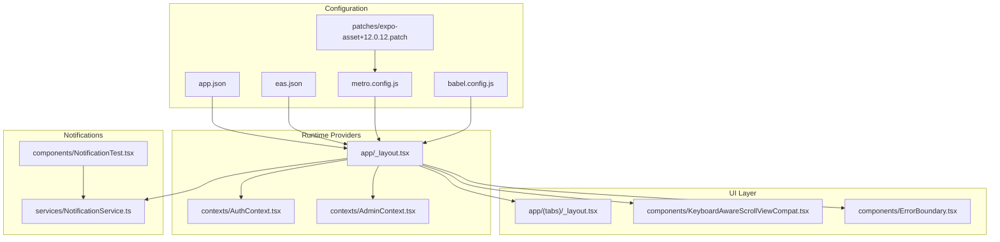
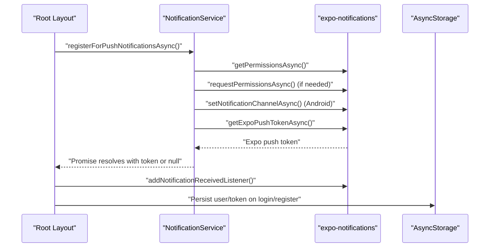
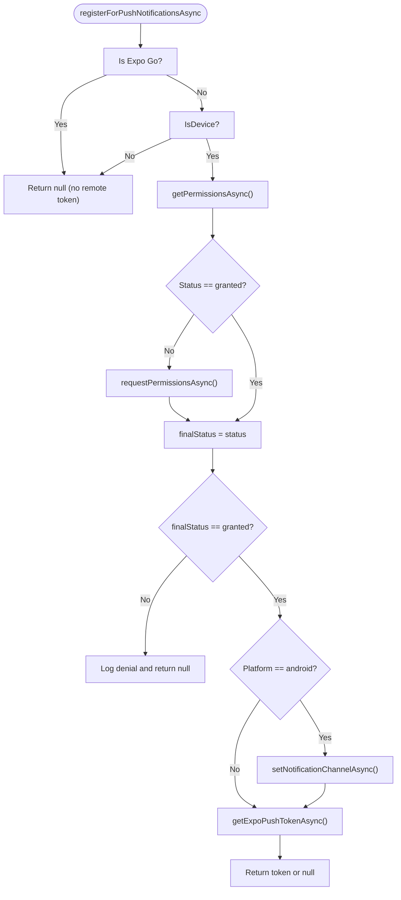
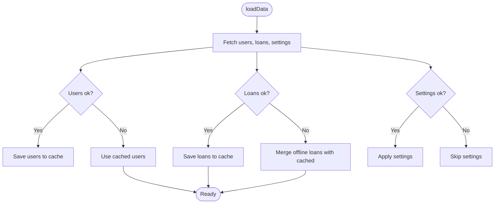
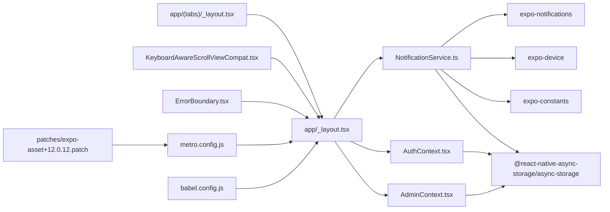

# Mobile-Specific Features

<cite>
**Referenced Files in This Document**
- [app.json](file://app.json)
- [eas.json](file://eas.json)
- [patches/expo-asset+12.0.12.patch](file://patches/expo-asset+12.0.12.patch)
- [services/NotificationService.ts](file://services/NotificationService.ts)
- [PUSH_NOTIFICATIONS_SETUP.md](file://PUSH_NOTIFICATIONS_SETUP.md)
- [contexts/AuthContext.tsx](file://contexts/AuthContext.tsx)
- [contexts/AdminContext.tsx](file://contexts/AdminContext.tsx)
- [components/ErrorBoundary.tsx](file://components/ErrorBoundary.tsx)
- [components/KeyboardAwareScrollViewCompat.tsx](file://components/KeyboardAwareScrollViewCompat.tsx)
- [components/NotificationTest.tsx](file://components/NotificationTest.tsx)
- [app/_layout.tsx](file://app/_layout.tsx)
- [app/(tabs)/_layout.tsx](file://app/(tabs)/_layout.tsx)
- [app/+native-intent.tsx](file://app/+native-intent.tsx)
- [metro.config.js](file://metro.config.js)
- [babel.config.js](file://babel.config.js)
</cite>

## Table of Contents
1. [Introduction](#introduction)
2. [Project Structure](#project-structure)
3. [Core Components](#core-components)
4. [Architecture Overview](#architecture-overview)
5. [Detailed Component Analysis](#detailed-component-analysis)
6. [Dependency Analysis](#dependency-analysis)
7. [Performance Considerations](#performance-considerations)
8. [Troubleshooting Guide](#troubleshooting-guide)
9. [Conclusion](#conclusion)
10. [Appendices](#appendices)

## Introduction
This document focuses on mobile-specific features and optimizations implemented in the Phoenix Loan application. It explains push notification implementation, device permission handling, offline data management strategies, the patch system for package compatibility, asset handling for different platforms, and mobile performance optimization techniques. It also covers mobile-specific UI patterns, gesture handling, platform integration, and testing and deployment considerations. The goal is to provide a practical guide for building robust, user-friendly mobile experiences while maintaining a strong foundation for progressive enhancement across web and mobile.

## Project Structure
The mobile application is built with Expo Router and React Native, with a focus on platform-specific integrations and performance. Key areas relevant to mobile features include:
- Configuration and plugin setup for notifications and fonts
- Authentication and admin contexts leveraging AsyncStorage for offline persistence
- Notification service for local and remote notifications
- Tab navigation with native and classic layouts
- Keyboard-aware scroll handling for cross-platform forms
- Metro and Babel configurations for asset and transform optimization
- Patch for asset resolution under HTTPS development servers

**Diagram sources**
- [app.json:1-77](file://app.json#L1-L77)
- [eas.json:1-22](file://eas.json#L1-L22)
- [metro.config.js:1-18](file://metro.config.js#L1-L18)
- [babel.config.js:1-7](file://babel.config.js#L1-L7)
- [patches/expo-asset+12.0.12.patch:1-17](file://patches/expo-asset+12.0.12.patch#L1-L17)
- [app/_layout.tsx:1-83](file://app/_layout.tsx#L1-L83)
- [contexts/AuthContext.tsx:1-135](file://contexts/AuthContext.tsx#L1-L135)
- [contexts/AdminContext.tsx:1-528](file://contexts/AdminContext.tsx#L1-L528)
- [app/(tabs)/_layout.tsx:1-163](file://app/(tabs)/_layout.tsx#L1-L163)
- [components/KeyboardAwareScrollViewCompat.tsx:1-31](file://components/KeyboardAwareScrollViewCompat.tsx#L1-L31)
- [components/ErrorBoundary.tsx:1-55](file://components/ErrorBoundary.tsx#L1-L55)
- [services/NotificationService.ts:1-135](file://services/NotificationService.ts#L1-L135)
- [components/NotificationTest.tsx:1-29](file://components/NotificationTest.tsx#L1-L29)

**Section sources**
- [app.json:1-77](file://app.json#L1-L77)
- [eas.json:1-22](file://eas.json#L1-L22)
- [metro.config.js:1-18](file://metro.config.js#L1-L18)
- [babel.config.js:1-7](file://babel.config.js#L1-L7)
- [patches/expo-asset+12.0.12.patch:1-17](file://patches/expo-asset+12.0.12.patch#L1-L17)
- [app/_layout.tsx:1-83](file://app/_layout.tsx#L1-L83)
- [app/(tabs)/_layout.tsx:1-163](file://app/(tabs)/_layout.tsx#L1-L163)
- [components/KeyboardAwareScrollViewCompat.tsx:1-31](file://components/KeyboardAwareScrollViewCompat.tsx#L1-L31)
- [components/ErrorBoundary.tsx:1-55](file://components/ErrorBoundary.tsx#L1-L55)
- [services/NotificationService.ts:1-135](file://services/NotificationService.ts#L1-L135)
- [components/NotificationTest.tsx:1-29](file://components/NotificationTest.tsx#L1-L29)

## Core Components
- Push notification service with permission handling, channel creation, and dual-path delivery (local and backend)
- Authentication and admin contexts with AsyncStorage-backed offline persistence
- Tab navigation supporting native tabs on compatible devices and fallback classic layout
- Keyboard-aware scroll container with platform-specific behavior
- Error boundary for graceful degradation
- Asset and transform configuration for optimal mobile builds

**Section sources**
- [services/NotificationService.ts:1-135](file://services/NotificationService.ts#L1-L135)
- [contexts/AuthContext.tsx:1-135](file://contexts/AuthContext.tsx#L1-L135)
- [contexts/AdminContext.tsx:1-528](file://contexts/AdminContext.tsx#L1-L528)
- [app/(tabs)/_layout.tsx:1-163](file://app/(tabs)/_layout.tsx#L1-L163)
- [components/KeyboardAwareScrollViewCompat.tsx:1-31](file://components/KeyboardAwareScrollViewCompat.tsx#L1-L31)
- [components/ErrorBoundary.tsx:1-55](file://components/ErrorBoundary.tsx#L1-L55)

## Architecture Overview
The mobile runtime initializes providers and navigation, registers for push notifications, and sets up platform-specific UI and input handling. Offline-first strategies are integrated via AsyncStorage for authentication and admin data caching.

**Diagram sources**
- [app/_layout.tsx:50-61](file://app/_layout.tsx#L50-L61)
- [services/NotificationService.ts:26-69](file://services/NotificationService.ts#L26-L69)
- [contexts/AuthContext.tsx:56-119](file://contexts/AuthContext.tsx#L56-L119)

## Detailed Component Analysis

### Push Notification Implementation
- Permission handling: checks existing permissions, requests if needed, and handles denial gracefully
- Foreground notification appearance: configured for non-Expo Go environments
- Android channel creation: sets importance, vibration pattern, and sound
- Token acquisition: retrieves Expo push token for remote messaging
- Local notifications: immediate scheduling for immediate feedback
- Backend persistence: posts notifications to backend with user context
- Development build requirement: remote push tokens require development builds; local notifications work in Expo Go

**Diagram sources**
- [services/NotificationService.ts:26-69](file://services/NotificationService.ts#L26-L69)

**Section sources**
- [services/NotificationService.ts:1-135](file://services/NotificationService.ts#L1-L135)
- [PUSH_NOTIFICATIONS_SETUP.md:1-45](file://PUSH_NOTIFICATIONS_SETUP.md#L1-L45)
- [app/_layout.tsx:50-61](file://app/_layout.tsx#L50-L61)

### Device Permission Handling
- Exemption for Expo Go: remote push token registration is skipped in Expo Go
- Device-only behavior: push notifications require a physical device
- Permissions API usage: checks and requests notification permissions
- Android-specific channel configuration: ensures consistent alert behavior

**Section sources**
- [services/NotificationService.ts:9-69](file://services/NotificationService.ts#L9-L69)

### Offline Data Management Strategies
- Authentication persistence: stores token and user data in AsyncStorage for offline sessions
- Admin data caching: caches loans and users locally; merges offline changes with server data when available
- Fallback mechanisms: loads cached data when network requests fail
- Refresh strategy: clears caches and reloads fresh data on demand

**Diagram sources**
- [contexts/AdminContext.tsx:199-285](file://contexts/AdminContext.tsx#L199-L285)

**Section sources**
- [contexts/AuthContext.tsx:40-54](file://contexts/AuthContext.tsx#L40-L54)
- [contexts/AdminContext.tsx:199-285](file://contexts/AdminContext.tsx#L199-L285)

### Asset Handling for Different Platforms
- Vector icon fonts: adds TTF/OTF extensions to asset resolver for consistent icon rendering
- Transform options: disables experimental import support and enables inline requires for performance
- HTTPS development server compatibility: patch adjusts asset source scheme for secure dev servers

**Section sources**
- [metro.config.js:5-15](file://metro.config.js#L5-L15)
- [patches/expo-asset+12.0.12.patch:1-17](file://patches/expo-asset+12.0.12.patch#L1-L17)

### Mobile Performance Optimization Techniques
- Gesture handling: wraps root view with GestureHandlerRootView for smooth tab interactions
- Keyboard handling: platform-aware keyboard provider for form usability
- Splash screen: prevents auto-hide until fonts are loaded or timeout elapses
- Font loading: preloads DM Sans fonts to avoid layout shifts
- Error boundary: catches rendering errors early and provides fallback UI

**Section sources**
- [app/_layout.tsx:5-14](file://app/_layout.tsx#L5-L14)
- [app/_layout.tsx:32-48](file://app/_layout.tsx#L32-L48)
- [components/ErrorBoundary.tsx:16-54](file://components/ErrorBoundary.tsx#L16-L54)

### Mobile-Specific UI Patterns and Gesture Handling
- Native tabs: detects liquid glass availability and falls back to classic tabs with blur/backdrops
- Safe area insets: integrates with safe area for proper layout on notched devices
- Badge indicators: displays unread counts on profile tab
- Platform differences: adapts tab bar style and background per OS and web

**Section sources**
- [app/(tabs)/_layout.tsx:12-146](file://app/(tabs)/_layout.tsx#L12-L146)

### Platform Integration
- Native intent redirection: provides a hook for system path redirection
- Web and mobile parity: maintains consistent navigation and UI across platforms

**Section sources**
- [app/+native-intent.tsx:1-7](file://app/+native-intent.tsx#L1-L7)

### Testing Approaches and Debugging Techniques
- Local notification testing: dedicated component to trigger and verify local notifications
- Backend notification posting: persists notifications to backend with user context
- Error logging: comprehensive console logs for token retrieval, permission handling, and backend failures
- Development build testing: remote push tokens require development builds; local notifications work in Expo Go

**Section sources**
- [components/NotificationTest.tsx:1-29](file://components/NotificationTest.tsx#L1-L29)
- [services/NotificationService.ts:93-134](file://services/NotificationService.ts#L93-L134)
- [PUSH_NOTIFICATIONS_SETUP.md:40-45](file://PUSH_NOTIFICATIONS_SETUP.md#L40-L45)

### Deployment Considerations
- EAS build profiles: development, preview, and production with internal distribution and auto-increment
- App configuration: Expo plugins for router, fonts, web browser, and notifications
- Project ID: placeholder in app.json must be replaced with actual Expo project ID

**Section sources**
- [eas.json:1-22](file://eas.json#L1-L22)
- [app.json:35-62](file://app.json#L35-L62)
- [PUSH_NOTIFICATIONS_SETUP.md:3-14](file://PUSH_NOTIFICATIONS_SETUP.md#L3-L14)

## Dependency Analysis
The following diagram shows key dependencies among mobile-specific components and configuration files.

**Diagram sources**
- [services/NotificationService.ts:1-10](file://services/NotificationService.ts#L1-L10)
- [contexts/AuthContext.tsx:1-4](file://contexts/AuthContext.tsx#L1-L4)
- [contexts/AdminContext.tsx:1-4](file://contexts/AdminContext.tsx#L1-L4)
- [app/_layout.tsx:1-14](file://app/_layout.tsx#L1-L14)
- [app/(tabs)/_layout.tsx:1-10](file://app/(tabs)/_layout.tsx#L1-L10)
- [components/KeyboardAwareScrollViewCompat.tsx:1-7](file://components/KeyboardAwareScrollViewCompat.tsx#L1-L7)
- [components/ErrorBoundary.tsx:1-3](file://components/ErrorBoundary.tsx#L1-L3)
- [metro.config.js:1-18](file://metro.config.js#L1-L18)
- [babel.config.js:1-7](file://babel.config.js#L1-L7)
- [patches/expo-asset+12.0.12.patch:1-17](file://patches/expo-asset+12.0.12.patch#L1-L17)

**Section sources**
- [services/NotificationService.ts:1-135](file://services/NotificationService.ts#L1-L135)
- [contexts/AuthContext.tsx:1-135](file://contexts/AuthContext.tsx#L1-L135)
- [contexts/AdminContext.tsx:1-528](file://contexts/AdminContext.tsx#L1-L528)
- [app/_layout.tsx:1-83](file://app/_layout.tsx#L1-L83)
- [app/(tabs)/_layout.tsx:1-163](file://app/(tabs)/_layout.tsx#L1-L163)
- [components/KeyboardAwareScrollViewCompat.tsx:1-31](file://components/KeyboardAwareScrollViewCompat.tsx#L1-L31)
- [components/ErrorBoundary.tsx:1-55](file://components/ErrorBoundary.tsx#L1-L55)
- [metro.config.js:1-18](file://metro.config.js#L1-L18)
- [babel.config.js:1-7](file://babel.config.js#L1-L7)
- [patches/expo-asset+12.0.12.patch:1-17](file://patches/expo-asset+12.0.12.patch#L1-L17)

## Performance Considerations
- Inline requires: enabled in Metro to reduce initial bundle size
- Import meta transformation: enabled in Babel for modern module behavior
- Font preloading: avoids layout shifts and improves perceived performance
- Gesture handler root: ensures smooth animations and interactions
- Keyboard provider: reduces jank during keyboard transitions

[No sources needed since this section provides general guidance]

## Troubleshooting Guide
- Push notifications not working in Expo Go: expected; use development builds for remote tokens
- Permission denied: handle gracefully and log; token will be null
- Remote token retrieval failure: network or device limitations; fallback to local notifications
- Backend notification posting errors: network down; local notification still fires
- Asset loading issues: ensure TTF/OTF extensions are included in resolver
- HTTPS development server: patch ensures correct scheme for asset URLs

**Section sources**
- [services/NotificationService.ts:26-69](file://services/NotificationService.ts#L26-L69)
- [PUSH_NOTIFICATIONS_SETUP.md:15-45](file://PUSH_NOTIFICATIONS_SETUP.md#L15-L45)
- [metro.config.js:5-15](file://metro.config.js#L5-L15)
- [patches/expo-asset+12.0.12.patch:8-10](file://patches/expo-asset+12.0.12.patch#L8-L10)

## Conclusion
The Phoenix Loan application implements a comprehensive set of mobile-specific features centered around reliable push notifications, robust offline data management, and platform-aware UI. The configuration and service layers ensure consistent behavior across iOS and Android while providing fallbacks for web. Performance optimizations and careful error handling contribute to a resilient user experience, with clear guidance for testing and deployment using EAS.

[No sources needed since this section summarizes without analyzing specific files]

## Appendices
- Progressive enhancement: native tabs as primary, classic tabs as fallback; blur backgrounds on iOS; badges for unread items
- Platform-specific feature detection: liquid glass availability, safe area insets, and platform OS checks
- Relationship between web and mobile: shared navigation and contexts, with platform-specific adaptations

[No sources needed since this section provides general guidance]