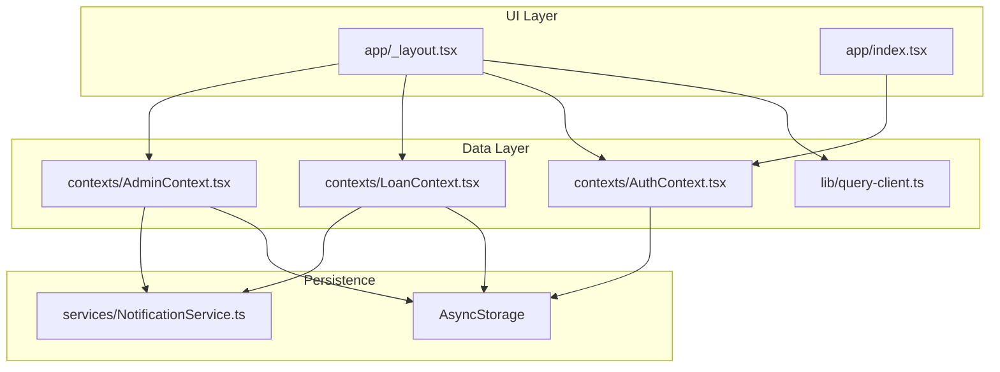
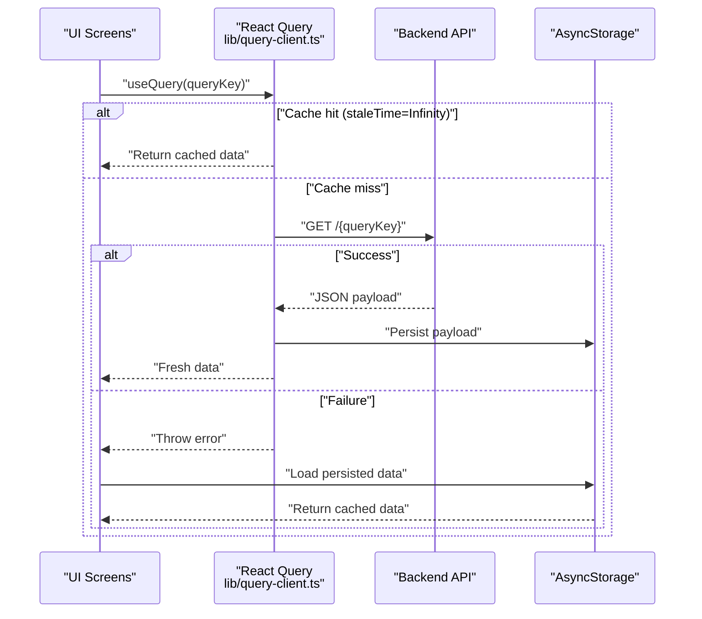
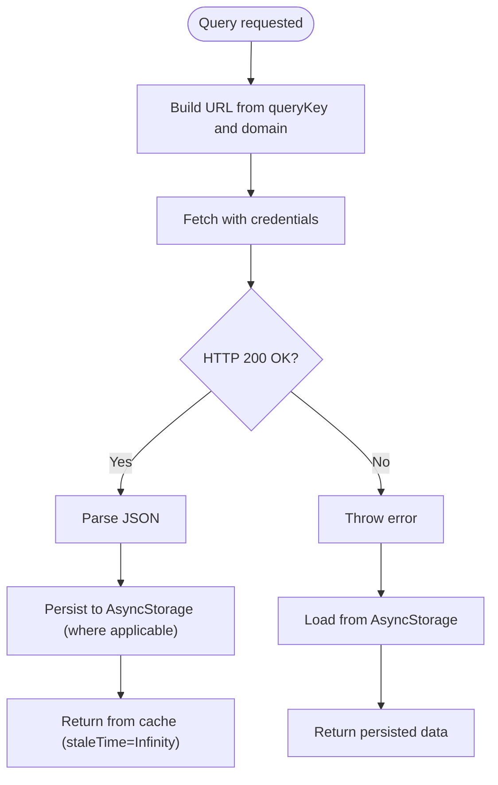
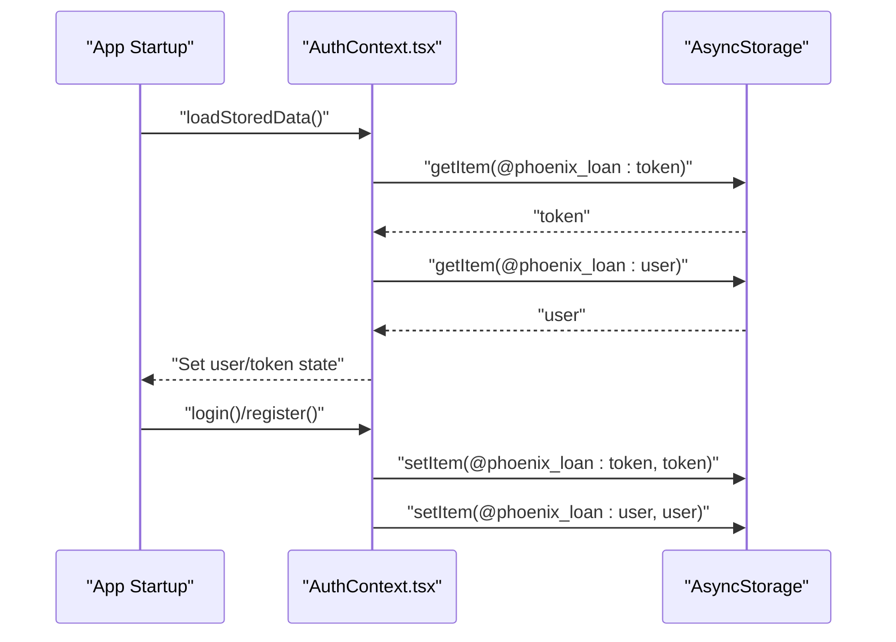
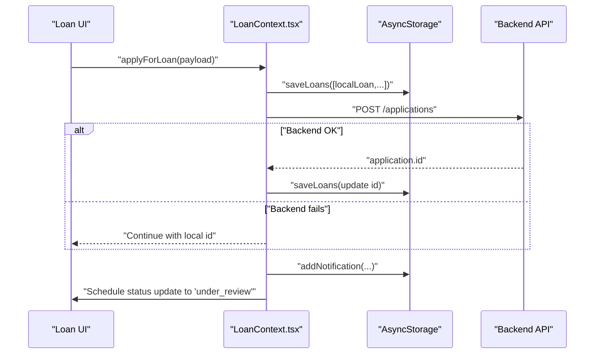
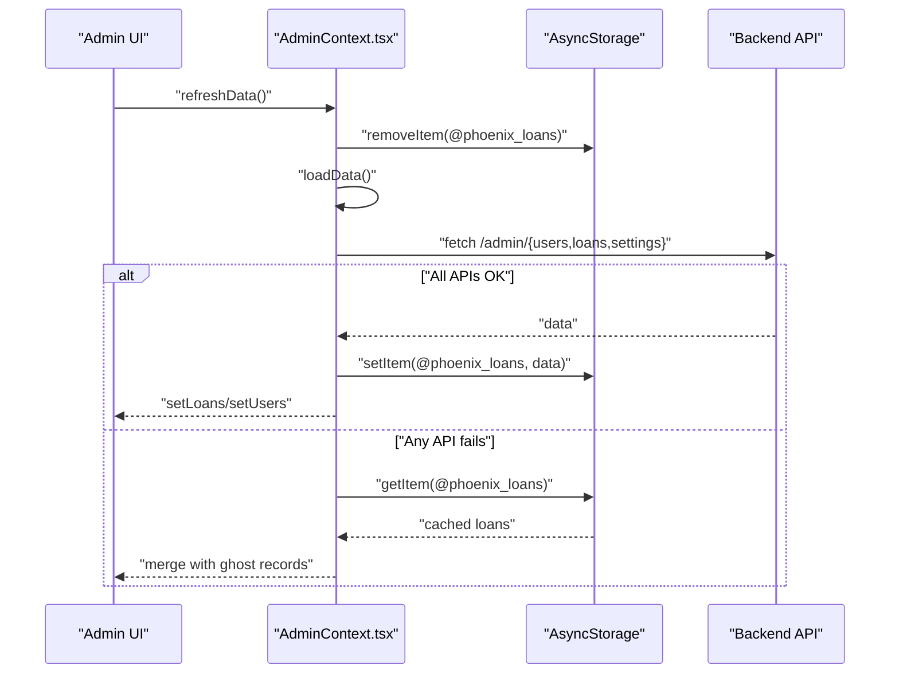
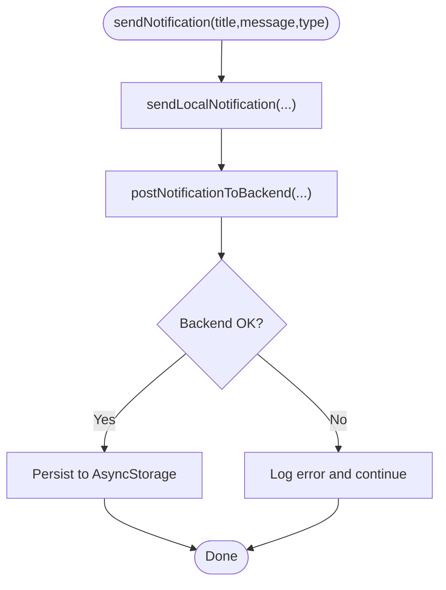
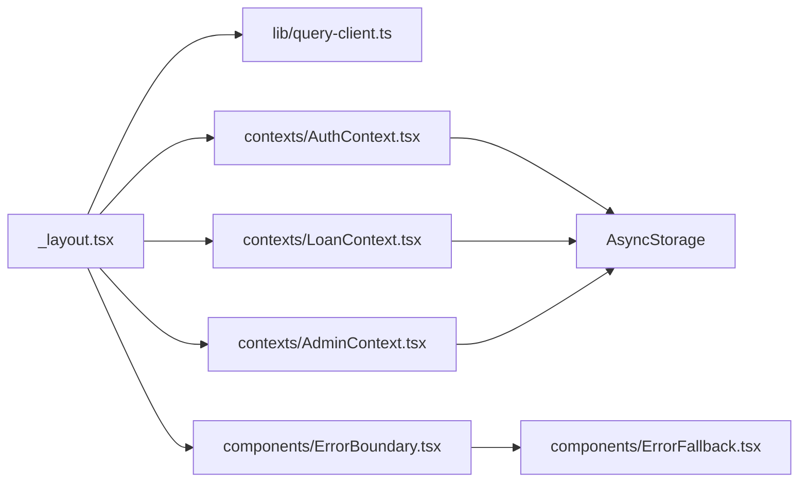

# Offline Data Management

<cite>
**Referenced Files in This Document**
- [query-client.ts](file://lib/query-client.ts)
- [AuthContext.tsx](file://contexts/AuthContext.tsx)
- [LoanContext.tsx](file://contexts/LoanContext.tsx)
- [AdminContext.tsx](file://contexts/AdminContext.tsx)
- [_layout.tsx](file://app/_layout.tsx)
- [index.tsx](file://app/index.tsx)
- [NotificationService.ts](file://services/NotificationService.ts)
- [ErrorBoundary.tsx](file://components/ErrorBoundary.tsx)
- [ErrorFallback.tsx](file://components/ErrorFallback.tsx)
</cite>

## Table of Contents
1. [Introduction](#introduction)
2. [Project Structure](#project-structure)
3. [Core Components](#core-components)
4. [Architecture Overview](#architecture-overview)
5. [Detailed Component Analysis](#detailed-component-analysis)
6. [Dependency Analysis](#dependency-analysis)
7. [Performance Considerations](#performance-considerations)
8. [Troubleshooting Guide](#troubleshooting-guide)
9. [Conclusion](#conclusion)

## Introduction
This document explains the offline-first data management and caching strategies implemented in the application. It covers how React Query is configured for offline resilience, how AsyncStorage persists critical data, and how the app handles authentication, loan applications, and administrative operations while offline. It also documents optimistic updates, cache invalidation patterns, synchronization strategies, conflict resolution, and user feedback during offline periods.

## Project Structure
The offline-first approach is implemented across three primary layers:
- Global React Query configuration for centralized data fetching and caching
- Context providers for authentication, loan applications, and administration
- AsyncStorage-backed persistence for offline availability and cross-session continuity

**Diagram sources**
- [_layout.tsx:1-83](file://app/_layout.tsx#L1-L83)
- [query-client.ts:1-81](file://lib/query-client.ts#L1-L81)
- [AuthContext.tsx:1-135](file://contexts/AuthContext.tsx#L1-L135)
- [LoanContext.tsx:1-336](file://contexts/LoanContext.tsx#L1-L336)
- [AdminContext.tsx:1-548](file://contexts/AdminContext.tsx#L1-L548)
- [NotificationService.ts:1-135](file://services/NotificationService.ts#L1-L135)

**Section sources**
- [_layout.tsx:1-83](file://app/_layout.tsx#L1-L83)
- [query-client.ts:1-81](file://lib/query-client.ts#L1-L81)

## Core Components
- React Query client configured with long-lived caches, disabled automatic refetch, and centralized query functions.
- Authentication context that loads tokens and user profiles from AsyncStorage and persists login state.
- Loan application context that merges backend data with local AsyncStorage cache, supports optimistic updates, and schedules local status transitions.
- Admin context that synchronizes users, loans, and settings with AsyncStorage fallback and refresh mechanisms.
- Notification service that sends local notifications and persists messages to the backend when available.

**Section sources**
- [query-client.ts:46-81](file://lib/query-client.ts#L46-L81)
- [AuthContext.tsx:31-135](file://contexts/AuthContext.tsx#L31-L135)
- [LoanContext.tsx:82-336](file://contexts/LoanContext.tsx#L82-L336)
- [AdminContext.tsx:135-548](file://contexts/AdminContext.tsx#L135-L548)
- [NotificationService.ts:1-135](file://services/NotificationService.ts#L1-L135)

## Architecture Overview
The offline-first architecture combines:
- Centralized React Query cache with infinite staleness and manual invalidation
- AsyncStorage-backed persistence for user, loan, and admin data
- Optimistic UI updates with eventual consistency
- Background-friendly fetch patterns and graceful degradation

**Diagram sources**
- [query-client.ts:46-81](file://lib/query-client.ts#L46-L81)
- [LoanContext.tsx:91-176](file://contexts/LoanContext.tsx#L91-L176)
- [AdminContext.tsx:199-285](file://contexts/AdminContext.tsx#L199-L285)

## Detailed Component Analysis

### React Query Integration and Offline Caching
- Centralized query function resolves to a URL built from the query key and environment-provided domain.
- Automatic 401 handling returns null when configured to support guest-mode fallbacks.
- Default cache behavior disables refetch on window focus and sets staleTime to Infinity for offline-first stability.
- Retry is disabled globally to prevent aggressive reattempts during offline periods.

**Diagram sources**
- [query-client.ts:46-81](file://lib/query-client.ts#L46-L81)
- [LoanContext.tsx:91-176](file://contexts/LoanContext.tsx#L91-L176)
- [AdminContext.tsx:199-285](file://contexts/AdminContext.tsx#L199-L285)

**Section sources**
- [query-client.ts:46-81](file://lib/query-client.ts#L46-L81)

### Authentication Offline Persistence
- On app start, tokens and user profiles are loaded from AsyncStorage.
- Login and registration persist tokens and user data to AsyncStorage for continuity.
- Logout removes persisted credentials.

**Diagram sources**
- [AuthContext.tsx:36-54](file://contexts/AuthContext.tsx#L36-L54)
- [AuthContext.tsx:56-112](file://contexts/AuthContext.tsx#L56-L112)

**Section sources**
- [AuthContext.tsx:31-135](file://contexts/AuthContext.tsx#L31-L135)

### Loan Applications: Optimistic Updates and Synchronization
- On application submission, the UI optimistically creates a local loan record and persists it to AsyncStorage.
- A backend request is attempted; if successful, the server’s application ID is used; otherwise, the local record remains.
- A short delay simulates backend processing and updates the local status to “under_review”.
- Notifications are shown locally and persisted to AsyncStorage; backend posting is best-effort.

**Diagram sources**
- [LoanContext.tsx:198-261](file://contexts/LoanContext.tsx#L198-L261)
- [LoanContext.tsx:183-196](file://contexts/LoanContext.tsx#L183-L196)

**Section sources**
- [LoanContext.tsx:82-336](file://contexts/LoanContext.tsx#L82-L336)

### Administrative Operations: Offline Merge and Refresh
- Admin data loading performs parallel fetches for users, loans, and settings.
- On success, AsyncStorage is updated with fresh data; on failure, the app falls back to AsyncStorage.
- During offline periods, newly created or modified records are merged into the fetched dataset to maintain consistency.
- Manual refresh clears AsyncStorage caches and reloads data.

**Diagram sources**
- [AdminContext.tsx:500-511](file://contexts/AdminContext.tsx#L500-L511)
- [AdminContext.tsx:199-285](file://contexts/AdminContext.tsx#L199-L285)

**Section sources**
- [AdminContext.tsx:135-548](file://contexts/AdminContext.tsx#L135-L548)

### Notifications: Local and Backend Persistence
- Local notifications are scheduled immediately and shown on screen.
- Backend notifications are posted asynchronously; failures do not block local delivery.
- Notifications are persisted to AsyncStorage for offline viewing.

**Diagram sources**
- [NotificationService.ts:116-135](file://services/NotificationService.ts#L116-L135)
- [LoanContext.tsx:183-196](file://contexts/LoanContext.tsx#L183-L196)
- [AdminContext.tsx:320-331](file://contexts/AdminContext.tsx#L320-L331)

**Section sources**
- [NotificationService.ts:1-135](file://services/NotificationService.ts#L1-L135)
- [LoanContext.tsx:183-196](file://contexts/LoanContext.tsx#L183-L196)
- [AdminContext.tsx:320-331](file://contexts/AdminContext.tsx#L320-L331)

## Dependency Analysis
- The root layout composes providers in a strict order: QueryClientProvider → AdminProvider → AuthProvider → LoanProvider → UI.
- React Query is configured centrally and reused across contexts.
- AsyncStorage is a shared dependency for persistence across contexts.
- Error boundaries wrap the entire tree to gracefully handle rendering errors.

**Diagram sources**
- [_layout.tsx:67-79](file://app/_layout.tsx#L67-L79)
- [query-client.ts:1-81](file://lib/query-client.ts#L1-L81)
- [AuthContext.tsx:1-135](file://contexts/AuthContext.tsx#L1-L135)
- [LoanContext.tsx:1-336](file://contexts/LoanContext.tsx#L1-L336)
- [AdminContext.tsx:1-548](file://contexts/AdminContext.tsx#L1-L548)
- [ErrorBoundary.tsx:1-55](file://components/ErrorBoundary.tsx#L1-L55)
- [ErrorFallback.tsx:1-287](file://components/ErrorFallback.tsx#L1-L287)

**Section sources**
- [_layout.tsx:1-83](file://app/_layout.tsx#L1-L83)
- [ErrorBoundary.tsx:1-55](file://components/ErrorBoundary.tsx#L1-L55)
- [ErrorFallback.tsx:1-287](file://components/ErrorFallback.tsx#L1-L287)

## Performance Considerations
- Infinite staleTime reduces unnecessary refetches and improves perceived performance in offline scenarios.
- Centralized query function avoids per-request duplication and ensures consistent error handling.
- AsyncStorage writes occur after UI updates to minimize perceived latency.
- Parallel fetches in admin contexts reduce total load time when online.

[No sources needed since this section provides general guidance]

## Troubleshooting Guide
- If the app appears stuck on loading, verify AsyncStorage keys and ensure the app can read persisted tokens and user data.
- If loan submissions seem to hang, confirm that the backend endpoint is reachable; the UI remains responsive due to optimistic updates.
- If admin data does not reflect recent changes, trigger a manual refresh to clear caches and reload from backend.
- For network failures, the app falls back to AsyncStorage; ensure keys exist and are readable.
- Use the error boundary to capture and log exceptions; the fallback UI provides a restart option.

**Section sources**
- [AuthContext.tsx:40-54](file://contexts/AuthContext.tsx#L40-L54)
- [LoanContext.tsx:198-261](file://contexts/LoanContext.tsx#L198-L261)
- [AdminContext.tsx:500-511](file://contexts/AdminContext.tsx#L500-L511)
- [ErrorBoundary.tsx:16-55](file://components/ErrorBoundary.tsx#L16-L55)
- [ErrorFallback.tsx:37-104](file://components/ErrorFallback.tsx#L37-L104)

## Conclusion
The application implements a robust offline-first architecture by combining a centralized React Query cache with AsyncStorage-backed persistence. Authentication, loan applications, and administrative operations are resilient to network failures, with optimistic updates ensuring responsiveness and eventual consistency. The design emphasizes predictable cache behavior, explicit fallbacks, and user feedback during offline periods.