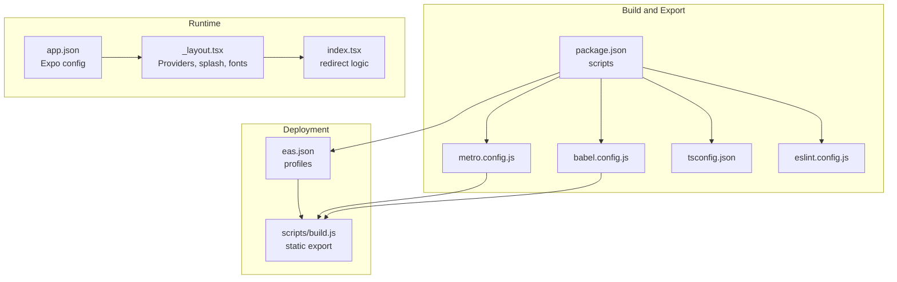
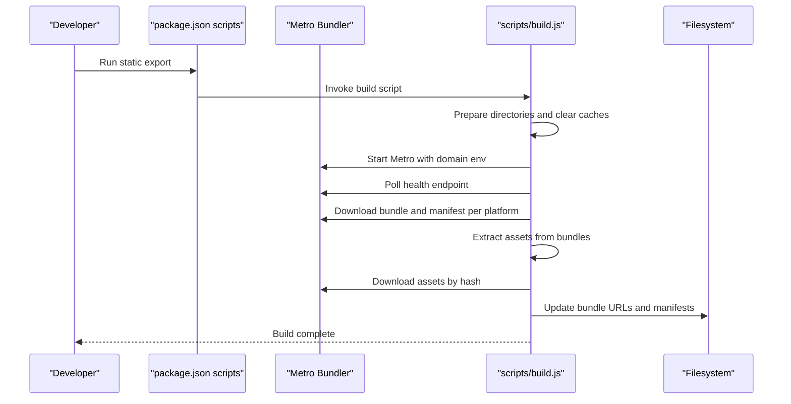
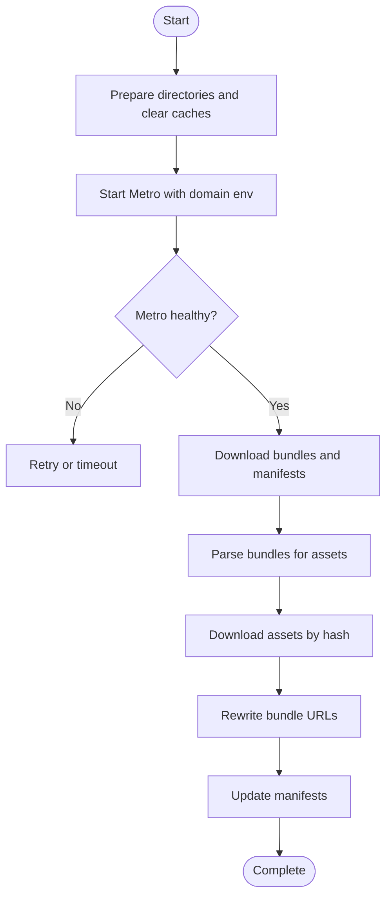
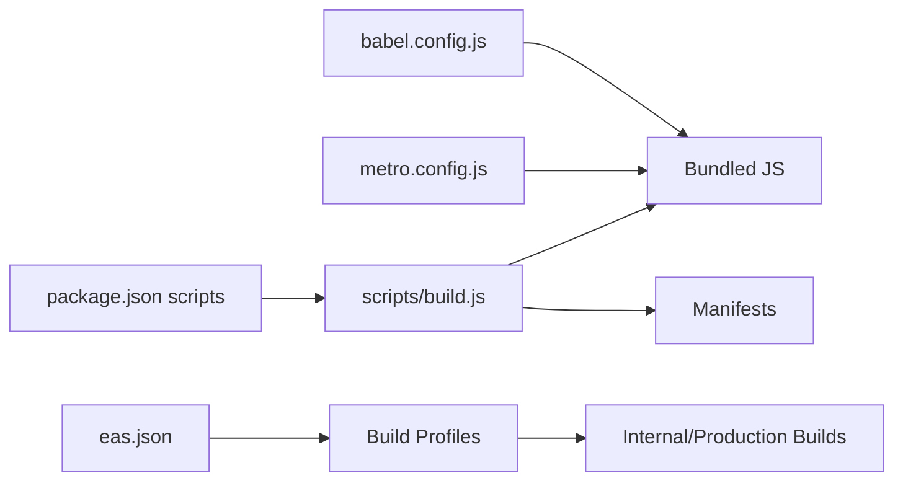

# Performance Optimization

<cite>
**Referenced Files in This Document**
- [metro.config.js](file://metro.config.js)
- [babel.config.js](file://babel.config.js)
- [eas.json](file://eas.json)
- [package.json](file://package.json)
- [app.json](file://app.json)
- [scripts/build.js](file://scripts/build.js)
- [tsconfig.json](file://tsconfig.json)
- [eslint.config.js](file://eslint.config.js)
- [app/_layout.tsx](file://app/_layout.tsx)
- [app/index.tsx](file://app/index.tsx)
</cite>

## Table of Contents
1. [Introduction](#introduction)
2. [Project Structure](#project-structure)
3. [Core Components](#core-components)
4. [Architecture Overview](#architecture-overview)
5. [Detailed Component Analysis](#detailed-component-analysis)
6. [Dependency Analysis](#dependency-analysis)
7. [Performance Considerations](#performance-considerations)
8. [Troubleshooting Guide](#troubleshooting-guide)
9. [Conclusion](#conclusion)
10. [Appendices](#appendices)

## Introduction
This document provides a comprehensive guide to performance optimization for the React Native application, focusing on build configurations, transpilation settings, runtime performance, and deployment strategies. It covers Metro bundler configuration, Babel transpilation, EAS build setup, bundle size optimization, memory management, code splitting and lazy loading opportunities, profiling and monitoring, platform-specific optimizations for iOS and Android, CI considerations, and debugging tools. The goal is to help teams reduce startup time, minimize memory pressure, and improve overall runtime responsiveness while maintaining a robust build pipeline.

## Project Structure
The project follows an Expo Router-based React Native architecture with a clear separation of concerns:
- Application entry and routing via Expo Router
- Build-time configuration for Metro and Babel
- Static export and deployment automation via a custom build script
- EAS build profiles for development, preview, and production
- TypeScript configuration and ESLint rules

**Diagram sources**
- [package.json](file://package.json)
- [metro.config.js](file://metro.config.js)
- [babel.config.js](file://babel.config.js)
- [tsconfig.json](file://tsconfig.json)
- [eslint.config.js](file://eslint.config.js)
- [app.json](file://app.json)
- [app/_layout.tsx](file://app/_layout.tsx)
- [app/index.tsx](file://app/index.tsx)
- [eas.json](file://eas.json)
- [scripts/build.js](file://scripts/build.js)

**Section sources**
- [package.json](file://package.json)
- [app.json](file://app.json)

## Core Components
- Metro bundler configuration controls asset resolution and transform options, including inline requires and font asset support.
- Babel preset for Expo enables modern JS features and optional experimental features.
- EAS build profiles define distribution modes and auto-increment behavior for production.
- Static export build script orchestrates Metro health checks, bundle and manifest downloads, asset extraction, and manifest updates for deployment.
- Runtime providers and splash screen management influence startup performance and perceived load time.
- TypeScript and ESLint configurations enforce code quality and maintainability.

**Section sources**
- [metro.config.js](file://metro.config.js)
- [babel.config.js](file://babel.config.js)
- [eas.json](file://eas.json)
- [scripts/build.js](file://scripts/build.js)
- [app/_layout.tsx](file://app/_layout.tsx)
- [app/index.tsx](file://app/index.tsx)
- [tsconfig.json](file://tsconfig.json)
- [eslint.config.js](file://eslint.config.js)

## Architecture Overview
The performance-critical pipeline integrates build-time transforms, static export generation, and deployment orchestration. The static export flow ensures minimized runtime overhead by pre-bundling and serving assets from a CDN-like structure.

**Diagram sources**
- [scripts/build.js](file://scripts/build.js)
- [package.json](file://package.json)

## Detailed Component Analysis

### Metro Bundler Configuration
Key performance-relevant settings:
- Asset extensions include TrueType/OpenType fonts to prevent runtime font loading issues.
- Transform options enable inline requires for smaller runtime bundles and disable experimental import meta transformations.
- Default Expo Metro configuration is extended to align with the project’s needs.

Optimization opportunities:
- Keep inline requires enabled for production builds to reduce dynamic require overhead.
- Consider enabling code splitting via dynamic imports for route-level lazy loading.
- Monitor assetExts additions to avoid unnecessary asset scanning.

**Section sources**
- [metro.config.js](file://metro.config.js)

### Babel Transpilation Settings
Highlights:
- Uses the Expo Babel preset with caching enabled.
- Includes an experimental flag for import meta transformation.

Recommendations:
- Evaluate the experimental import meta flag impact on bundle size and compatibility.
- Ensure transpile targets align with target devices to avoid polyfills for unsupported features.

**Section sources**
- [babel.config.js](file://babel.config.js)

### EAS Build Configuration
Profiles:
- Development: internal distribution with development client enabled.
- Preview: internal distribution for testing.
- Production: auto-increment enabled for versioning.

Implications:
- Internal distributions streamline QA and reduce external dependency on app stores.
- Auto-increment simplifies release cadence but requires CI automation to manage builds consistently.

**Section sources**
- [eas.json](file://eas.json)

### Static Export Build Script
Responsibilities:
- Health checks for Metro, controlled timeouts, and graceful cleanup on signals.
- Downloads iOS and Android bundles and manifests with concurrency.
- Parses bundles to extract asset metadata and downloads assets by hash.
- Rewrites bundle URLs and updates manifests for deployment.

Performance characteristics:
- Parallel downloads reduce total export time.
- Asset extraction avoids redundant downloads by deduplicating by hash.
- Manifest updates ensure correct launch asset and host URIs for deployed clients.

**Diagram sources**
- [scripts/build.js](file://scripts/build.js)

**Section sources**
- [scripts/build.js](file://scripts/build.js)

### Runtime Providers and Startup
- Splash screen prevents premature UI rendering until fonts and resources are ready.
- Providers (QueryClient, Auth, Loan, Admin) wrap the navigation tree; ensure minimal work in root layout to reduce initial render cost.
- Font loading uses a timeout fallback to avoid indefinite blocking.

Optimization tips:
- Defer heavy initialization to screens that require it.
- Preload critical assets and split non-essential providers into route-level wrappers.

**Section sources**
- [app/_layout.tsx](file://app/_layout.tsx)

### Navigation and Redirect Logic
- Centralized redirect logic in the home screen reduces branching and improves predictability.
- Consider lazy loading route modules to defer heavy imports.

**Section sources**
- [app/index.tsx](file://app/index.tsx)

### TypeScript and Linting
- Strict mode and path aliases improve type safety and maintainability.
- ESLint config extends Expo’s recommended rules to keep code consistent.

**Section sources**
- [tsconfig.json](file://tsconfig.json)
- [eslint.config.js](file://eslint.config.js)

## Dependency Analysis
Build-time dependencies and their roles:
- Metro and Babel are configured via project files; the static export script depends on Metro’s HTTP endpoints.
- EAS profiles drive distribution and versioning.
- Runtime dependencies (React, React Native, Expo ecosystem) influence bundle size and performance characteristics.

**Diagram sources**
- [babel.config.js](file://babel.config.js)
- [metro.config.js](file://metro.config.js)
- [package.json](file://package.json)
- [scripts/build.js](file://scripts/build.js)
- [eas.json](file://eas.json)

**Section sources**
- [package.json](file://package.json)
- [scripts/build.js](file://scripts/build.js)
- [eas.json](file://eas.json)

## Performance Considerations

### Bundle Size Optimization
- Inline requires: Enabled in Metro to reduce dynamic require overhead.
- Minification: Static export uses minified bundles; ensure production builds leverage this.
- Asset management: The static export script extracts and downloads assets by hash, avoiding duplication and ensuring correct caching.
- Dynamic imports: Prefer lazy loading for non-critical routes and components to reduce initial bundle size.

### Memory Management
- Avoid heavy synchronous work in root layout; defer to route-level initialization.
- Use lightweight splash and font loading strategies; the current setup hides the splash after fonts load or after a timeout.
- Limit global providers’ work during mount; move heavy tasks to background threads or lazy initialization.

### Runtime Performance Improvements
- Keep transform options aligned with device capabilities; avoid unnecessary polyfills.
- Use React and React Native primitives efficiently; avoid excessive re-renders in top-level components.
- Leverage Expo’s built-in optimizations (e.g., image, font plugins) configured in app.json.

### Platform-Specific Optimizations
- iOS: Configure bundle identifiers and InfoPlist settings in app.json; ensure adaptive icons and splash align with platform guidelines.
- Android: Package name and adaptive icon configuration in app.json; verify resource management and permissions.
- Native modules: Integrate only necessary modules; monitor their impact on bundle size and startup.

### Code Splitting and Lazy Loading
- Route-level lazy loading: Split heavy screens into separate chunks and load them on demand.
- Component-level lazy loading: Use dynamic imports for non-critical components.
- Asset chunking: The static export script already handles asset downloads by hash; ensure assets are referenced via hashed URLs.

### Profiling and Monitoring
- Use React DevTools and Flipper for runtime profiling and network inspection.
- Enable logging for splash screen timing and provider initialization to identify bottlenecks.
- Monitor bundle sizes and asset counts post-deployment to track regressions.

### Build Pipeline and CI
- Automate static export and upload to a CDN or static hosting.
- Use EAS build profiles to trigger automated builds for development and preview.
- Validate Metro health and download timeouts in CI to catch build failures early.

### Debugging Tools and Metrics
- Collect metrics on startup time, bundle size, and asset count.
- Use performance monitoring libraries to track runtime performance in production.
- Instrument slow providers and heavy components to identify hotspots.

[No sources needed since this section provides general guidance]

## Troubleshooting Guide

Common issues and resolutions:
- Metro not running or unhealthy: The static export script polls a health endpoint and times out after a fixed duration. Verify environment variables and port availability.
- Empty or missing assets: The script validates downloaded files and aborts on empty content; ensure asset hashes match and unstable_path parameters are present.
- Manifest updates: The script rewrites bundle URLs and updates host URIs; confirm the base URL and timestamp structure are correct.

Operational safeguards:
- Signal handlers terminate the Metro process gracefully on SIGINT/SIGTERM/SIGHUP.
- Concurrency: Parallel downloads improve throughput; monitor for partial failures and handle them appropriately.

**Section sources**
- [scripts/build.js](file://scripts/build.js)

## Conclusion
This project’s performance strategy combines efficient build-time transforms, a robust static export pipeline, and thoughtful runtime initialization. By leveraging inline requires, minified bundles, asset hashing, and platform-specific configurations, teams can achieve faster startup times and improved runtime performance. Adopting code splitting, lazy loading, and continuous monitoring will further enhance the user experience and maintainability.

[No sources needed since this section summarizes without analyzing specific files]

## Appendices

### Appendix A: Build Commands and Scripts
- Static export for web, Android, and iOS via npm scripts.
- Development and production server commands for local iteration.
- Post-install patching for asset compatibility.

**Section sources**
- [package.json](file://package.json)

### Appendix B: Expo Configuration Highlights
- New architecture enabled.
- Plugins for router, font, web browser, and notifications.
- Experiments include typed routes and React Compiler.

**Section sources**
- [app.json](file://app.json)