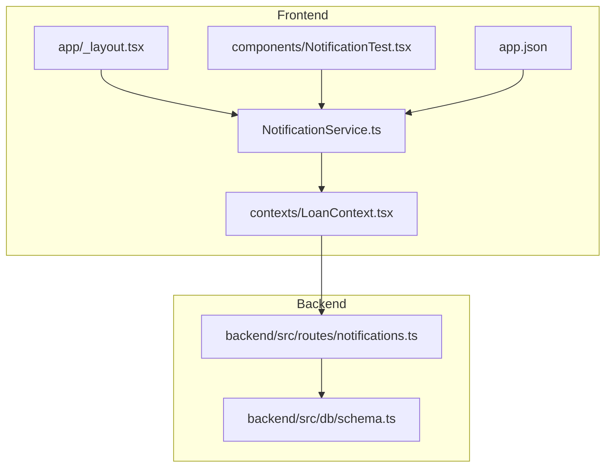
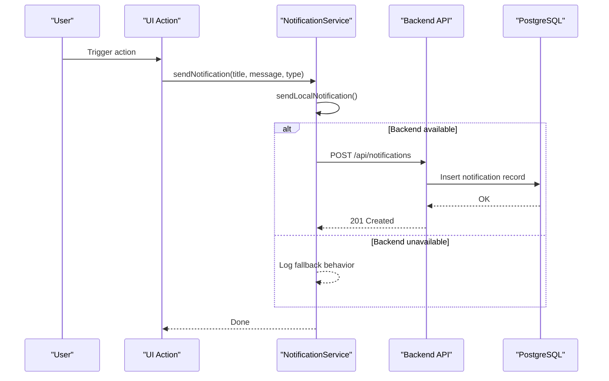
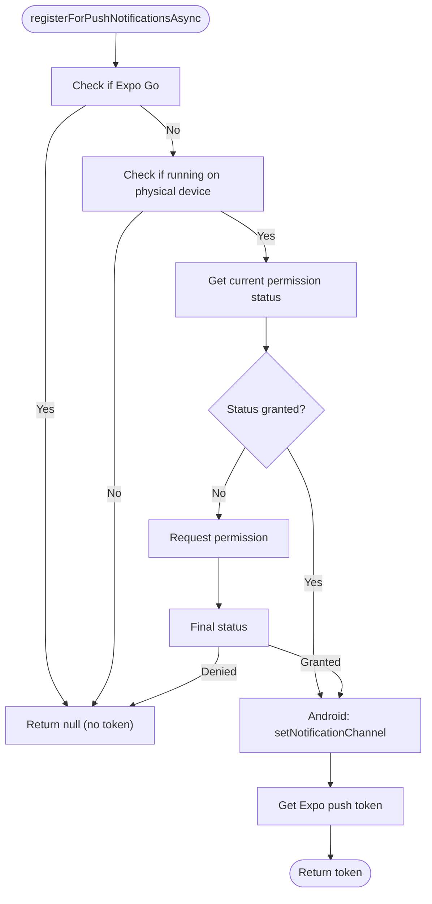
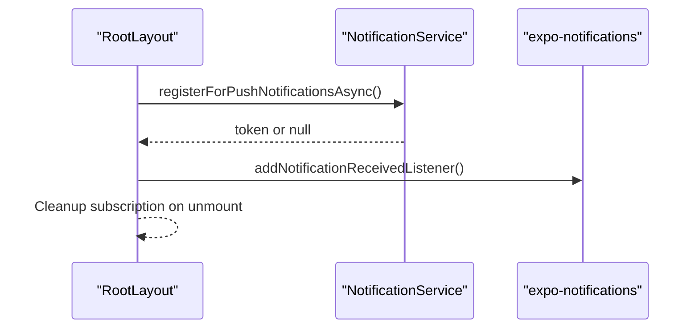
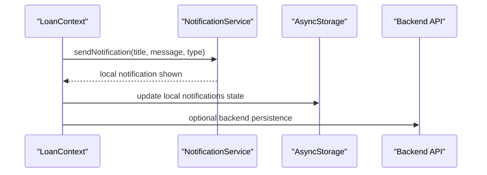
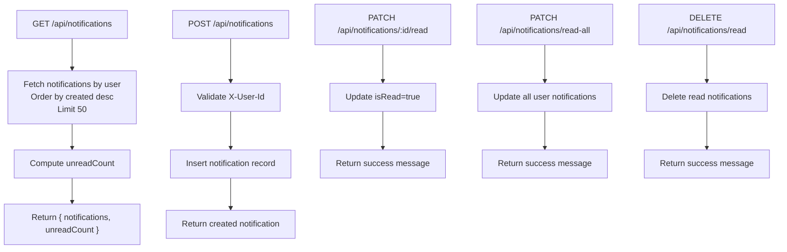
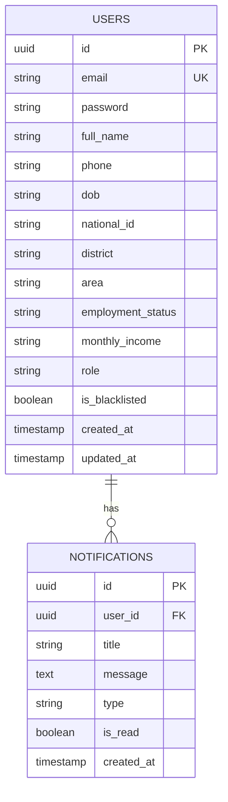
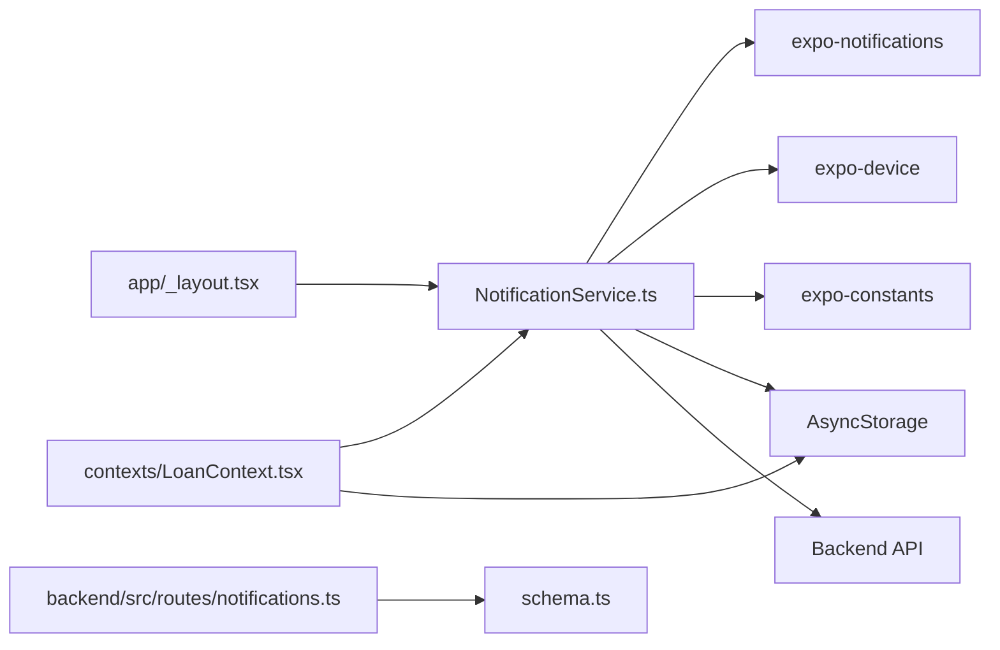

# Push Notifications

<cite>
**Referenced Files in This Document**
- [NotificationService.ts](file://services/NotificationService.ts)
- [app.json](file://app.json)
- [PUSH_NOTIFICATIONS_SETUP.md](file://PUSH_NOTIFICATIONS_SETUP.md)
- [debug-notifications.js](file://debug-notifications.js)
- [NotificationTest.tsx](file://components/NotificationTest.tsx)
- [app/_layout.tsx](file://app/_layout.tsx)
- [LoanContext.tsx](file://contexts/LoanContext.tsx)
- [notifications.ts](file://backend/src/routes/notifications.ts)
- [schema.ts](file://backend/src/db/schema.ts)
- [README_BASIC.md](file://README_BASIC.md)
</cite>

## Table of Contents
1. [Introduction](#introduction)
2. [Project Structure](#project-structure)
3. [Core Components](#core-components)
4. [Architecture Overview](#architecture-overview)
5. [Detailed Component Analysis](#detailed-component-analysis)
6. [Dependency Analysis](#dependency-analysis)
7. [Performance Considerations](#performance-considerations)
8. [Troubleshooting Guide](#troubleshooting-guide)
9. [Conclusion](#conclusion)
10. [Appendices](#appendices)

## Introduction
This document explains the push notification system implemented in the Phoenix Loan application. It covers the complete workflow from permission handling and token registration to channel configuration and message delivery. It documents the dual approach of local notifications and backend-stored notifications, platform-specific considerations for iOS and Android, fallback mechanisms, and integration with AsyncStorage for user context. It also provides practical guidance for registering notification tokens, sending local notifications, posting notifications to the backend, and debugging techniques.

## Project Structure
The notification system spans the frontend React Native application and the backend API:
- Frontend service module handles permission requests, token retrieval, local notifications, and backend posting.
- Backend routes manage retrieving, marking as read, and deleting notifications for users.
- Database schema defines the notifications table and relationships.
- Configuration files define plugin setup and project identifiers.

**Diagram sources**
- [NotificationService.ts:1-135](file://services/NotificationService.ts#L1-L135)
- [app/_layout.tsx:13-61](file://app/_layout.tsx#L13-L61)
- [LoanContext.tsx:183-196](file://contexts/LoanContext.tsx#L183-L196)
- [NotificationTest.tsx:1-29](file://components/NotificationTest.tsx#L1-L29)
- [app.json:53-61](file://app.json#L53-L61)
- [notifications.ts:1-106](file://backend/src/routes/notifications.ts#L1-L106)
- [schema.ts:79-88](file://backend/src/db/schema.ts#L79-L88)

**Section sources**
- [NotificationService.ts:1-135](file://services/NotificationService.ts#L1-L135)
- [app/_layout.tsx:13-61](file://app/_layout.tsx#L13-L61)
- [LoanContext.tsx:183-196](file://contexts/LoanContext.tsx#L183-L196)
- [NotificationTest.tsx:1-29](file://components/NotificationTest.tsx#L1-L29)
- [app.json:53-61](file://app.json#L53-L61)
- [notifications.ts:1-106](file://backend/src/routes/notifications.ts#L1-L106)
- [schema.ts:79-88](file://backend/src/db/schema.ts#L79-L88)

## Core Components
- NotificationService: Centralizes permission handling, token registration, Android channel setup, local notification scheduling, and backend posting.
- app/_layout.tsx: Initializes the app and registers for push notifications during startup.
- contexts/LoanContext.tsx: Integrates notifications into business flows, invoking the service to emit notifications and updating local state.
- components/NotificationTest.tsx: Provides a UI button to trigger test notifications.
- backend/src/routes/notifications.ts: Implements GET, POST, PATCH, and DELETE endpoints for notifications.
- backend/src/db/schema.ts: Defines the notifications table with fields for user association, title, message, type, read status, and timestamps.
- app.json: Configures the expo-notifications plugin, default channel, and project identifiers.

Key responsibilities:
- Permission handling and channel configuration for Android.
- Local notifications for immediate user feedback.
- Backend persistence via a dedicated endpoint.
- Fallback behavior when backend is unavailable.
- Integration with AsyncStorage for user context.

**Section sources**
- [NotificationService.ts:26-69](file://services/NotificationService.ts#L26-L69)
- [NotificationService.ts:71-91](file://services/NotificationService.ts#L71-L91)
- [NotificationService.ts:93-114](file://services/NotificationService.ts#L93-L114)
- [NotificationService.ts:116-134](file://services/NotificationService.ts#L116-L134)
- [app/_layout.tsx:50-61](file://app/_layout.tsx#L50-L61)
- [LoanContext.tsx:183-196](file://contexts/LoanContext.tsx#L183-L196)
- [NotificationTest.tsx:5-28](file://components/NotificationTest.tsx#L5-L28)
- [notifications.ts:8-33](file://backend/src/routes/notifications.ts#L8-L33)
- [notifications.ts:71-90](file://backend/src/routes/notifications.ts#L71-L90)
- [schema.ts:79-88](file://backend/src/db/schema.ts#L79-L88)
- [app.json:53-61](file://app.json#L53-L61)

## Architecture Overview
The notification architecture combines immediate local feedback with persistent backend storage. The frontend emits notifications locally and attempts to persist them to the backend. On the backend, notifications are associated with users and persisted in the database. Clients can retrieve, mark as read, and clear notifications.

**Diagram sources**
- [NotificationService.ts:116-134](file://services/NotificationService.ts#L116-L134)
- [notifications.ts:71-90](file://backend/src/routes/notifications.ts#L71-L90)
- [schema.ts:79-88](file://backend/src/db/schema.ts#L79-L88)

## Detailed Component Analysis

### NotificationService
Responsibilities:
- Detects Expo Go environment and adapts behavior accordingly.
- Requests and checks notification permissions.
- Creates Android notification channels with vibration and sound.
- Retrieves push tokens (skipped in Expo Go).
- Schedules local notifications immediately.
- Posts notifications to the backend with user context from AsyncStorage.

**Diagram sources**
- [NotificationService.ts:26-69](file://services/NotificationService.ts#L26-L69)

Key functions and behaviors:
- Permission handling: Requests permissions if not previously granted.
- Android channel: Sets up a named channel with MAX importance, vibration pattern, default sound, and LED color.
- Token registration: Skips token acquisition in Expo Go; otherwise retrieves an Expo push token.
- Local notifications: Uses scheduleNotificationAsync to show immediately with high priority.
- Backend posting: Sends POST to /api/notifications with X-User-Id header derived from AsyncStorage.

Integration points:
- Foreground handler configured except in Expo Go.
- Used by LoanContext for business notifications.
- Consumed by NotificationTest component for manual testing.

**Section sources**
- [NotificationService.ts:9-24](file://services/NotificationService.ts#L9-L24)
- [NotificationService.ts:26-69](file://services/NotificationService.ts#L26-L69)
- [NotificationService.ts:71-91](file://services/NotificationService.ts#L71-L91)
- [NotificationService.ts:93-114](file://services/NotificationService.ts#L93-L114)
- [NotificationService.ts:116-134](file://services/NotificationService.ts#L116-L134)

### app/_layout.tsx
Initializes the app shell and registers for push notifications on startup. It logs the push token if available and subscribes to foreground notification events.

**Diagram sources**
- [app/_layout.tsx:50-61](file://app/_layout.tsx#L50-L61)
- [NotificationService.ts:26-69](file://services/NotificationService.ts#L26-L69)

**Section sources**
- [app/_layout.tsx:50-61](file://app/_layout.tsx#L50-L61)

### contexts/LoanContext.tsx
Integrates notifications into loan-related workflows. It triggers notifications for application submissions, payment proofs, and other lifecycle events. It also updates local state and persists notifications to AsyncStorage.

**Diagram sources**
- [LoanContext.tsx:183-196](file://contexts/LoanContext.tsx#L183-L196)
- [NotificationService.ts:116-134](file://services/NotificationService.ts#L116-L134)

**Section sources**
- [LoanContext.tsx:183-196](file://contexts/LoanContext.tsx#L183-L196)

### components/NotificationTest.tsx
Provides a simple UI button to trigger a test notification using the NotificationService.

**Section sources**
- [NotificationTest.tsx:5-28](file://components/NotificationTest.tsx#L5-L28)

### backend/src/routes/notifications.ts
Implements the notification API:
- GET /api/notifications: Lists user notifications and computes unread count.
- POST /api/notifications: Creates a notification for a user.
- PATCH /api/notifications/:id/read: Marks a notification as read.
- PATCH /api/notifications/read-all: Marks all notifications as read.
- DELETE /api/notifications/read: Deletes read notifications for a user.

**Diagram sources**
- [notifications.ts:8-33](file://backend/src/routes/notifications.ts#L8-L33)
- [notifications.ts:71-90](file://backend/src/routes/notifications.ts#L71-L90)
- [notifications.ts:35-49](file://backend/src/routes/notifications.ts#L35-L49)
- [notifications.ts:51-69](file://backend/src/routes/notifications.ts#L51-L69)
- [notifications.ts:92-103](file://backend/src/routes/notifications.ts#L92-L103)

**Section sources**
- [notifications.ts:8-33](file://backend/src/routes/notifications.ts#L8-L33)
- [notifications.ts:35-49](file://backend/src/routes/notifications.ts#L35-L49)
- [notifications.ts:51-69](file://backend/src/routes/notifications.ts#L51-L69)
- [notifications.ts:71-90](file://backend/src/routes/notifications.ts#L71-L90)
- [notifications.ts:92-103](file://backend/src/routes/notifications.ts#L92-L103)

### backend/src/db/schema.ts
Defines the notifications table with:
- Primary key id
- Foreign key userId referencing users
- Fields: title, message, type, isRead, createdAt
- Cascade delete on user deletion

**Diagram sources**
- [schema.ts:4-21](file://backend/src/db/schema.ts#L4-L21)
- [schema.ts:79-88](file://backend/src/db/schema.ts#L79-L88)

**Section sources**
- [schema.ts:79-88](file://backend/src/db/schema.ts#L79-L88)

## Dependency Analysis
- NotificationService depends on:
  - expo-notifications for permissions, channels, and token handling.
  - expo-device for device checks.
  - expo-constants for environment detection.
  - AsyncStorage for user context.
  - Backend API for persistence.
- app/_layout.tsx depends on NotificationService for initial registration and foreground event listening.
- contexts/LoanContext.tsx depends on NotificationService for emitting notifications and on AsyncStorage for local caching.
- backend routes depend on Drizzle ORM and PostgreSQL for persistence.

**Diagram sources**
- [NotificationService.ts:1-10](file://services/NotificationService.ts#L1-L10)
- [app/_layout.tsx:13-14](file://app/_layout.tsx#L13-L14)
- [LoanContext.tsx:2-3](file://contexts/LoanContext.tsx#L2-L3)
- [notifications.ts:1-6](file://backend/src/routes/notifications.ts#L1-L6)
- [schema.ts:1-2](file://backend/src/db/schema.ts#L1-L2)

**Section sources**
- [NotificationService.ts:1-10](file://services/NotificationService.ts#L1-L10)
- [app/_layout.tsx:13-14](file://app/_layout.tsx#L13-L14)
- [LoanContext.tsx:2-3](file://contexts/LoanContext.tsx#L2-L3)
- [notifications.ts:1-6](file://backend/src/routes/notifications.ts#L1-L6)
- [schema.ts:1-2](file://backend/src/db/schema.ts#L1-L2)

## Performance Considerations
- Local notifications are immediate and lightweight, suitable for frequent user feedback.
- Backend posting is asynchronous and may fail due to network conditions; the service logs fallback behavior and continues.
- Android channel configuration is performed once per app session; avoid repeated channel creation.
- Prefer batching UI updates after backend operations to minimize re-renders.
- Use AsyncStorage for quick local reads/writes; rely on backend for cross-device synchronization.

## Troubleshooting Guide
Common issues and resolutions:
- Expo Go limitations:
  - Local notifications work in Expo Go; push tokens are not supported.
  - Use development builds for remote push notifications.
- Permission denials:
  - If permission is denied, token registration returns null; prompt users to enable notifications in device settings.
- Android channel not appearing:
  - Ensure the channel is created before scheduling notifications.
  - Verify importance level and sound settings.
- Backend errors:
  - Network failures are expected if the backend is not running; the service logs fallback behavior.
- Debugging:
  - Use the provided debug script to schedule a local notification and inspect console logs.
  - Use the NotificationTest component to trigger test notifications.
  - Confirm user context in AsyncStorage and API headers.

Practical references:
- Expo Go behavior and development build requirements.
- Permission flow and Android channel setup.
- Backend endpoints and error handling.
- AsyncStorage integration for user context.

**Section sources**
- [PUSH_NOTIFICATIONS_SETUP.md:15-44](file://PUSH_NOTIFICATIONS_SETUP.md#L15-L44)
- [NotificationService.ts:26-69](file://services/NotificationService.ts#L26-L69)
- [NotificationService.ts:93-114](file://services/NotificationService.ts#L93-L114)
- [debug-notifications.js:11-31](file://debug-notifications.js#L11-L31)
- [NotificationTest.tsx:5-28](file://components/NotificationTest.tsx#L5-L28)
- [README_BASIC.md:262-287](file://README_BASIC.md#L262-L287)

## Conclusion
The Phoenix Loan application implements a robust, dual-path notification system: immediate local feedback and persistent backend storage. It gracefully handles platform differences, particularly the distinction between Expo Go and development builds, and provides clear fallbacks when backend connectivity is unavailable. The system integrates cleanly with AsyncStorage and the backend API, enabling reliable user communication across the application’s workflows.

## Appendices

### API Endpoints Summary
- GET /api/notifications: Retrieve user notifications and compute unread count.
- POST /api/notifications: Create a notification for a user.
- PATCH /api/notifications/:id/read: Mark a notification as read.
- PATCH /api/notifications/read-all: Mark all notifications as read.
- DELETE /api/notifications/read: Delete read notifications for a user.

**Section sources**
- [notifications.ts:8-33](file://backend/src/routes/notifications.ts#L8-L33)
- [notifications.ts:71-90](file://backend/src/routes/notifications.ts#L71-L90)
- [notifications.ts:35-49](file://backend/src/routes/notifications.ts#L35-L49)
- [notifications.ts:51-69](file://backend/src/routes/notifications.ts#L51-L69)
- [notifications.ts:92-103](file://backend/src/routes/notifications.ts#L92-L103)

### Notification Types and Visual Representation
- info: General informational messages.
- success: Positive outcomes and confirmations.
- warning: Cautionary notices.
- error: Error conditions and failures.

These types are passed to the notification emission function and stored with the notification record.

**Section sources**
- [LoanContext.tsx:41-48](file://contexts/LoanContext.tsx#L41-L48)
- [NotificationService.ts:96](file://services/NotificationService.ts#L96)

### Platform-Specific Considerations
- iOS:
  - Permissions are requested through the system prompt; ensure Info.plist and project configuration align with Apple push notification requirements.
- Android:
  - Notification channels are created programmatically with MAX importance, vibration, sound, and LED color.
  - Default channel is configured in app.json for expo-notifications.

**Section sources**
- [NotificationService.ts:51-60](file://services/NotificationService.ts#L51-L60)
- [app.json:53-61](file://app.json#L53-L61)

### Code Example References
- Registering notification tokens:
  - See [NotificationService.ts:26-69](file://services/NotificationService.ts#L26-L69)
- Sending local notifications:
  - See [NotificationService.ts:71-91](file://services/NotificationService.ts#L71-L91)
- Posting notifications to the backend:
  - See [NotificationService.ts:93-114](file://services/NotificationService.ts#L93-L114)
- Emitting a combined notification (local + backend):
  - See [NotificationService.ts:116-134](file://services/NotificationService.ts#L116-L134)