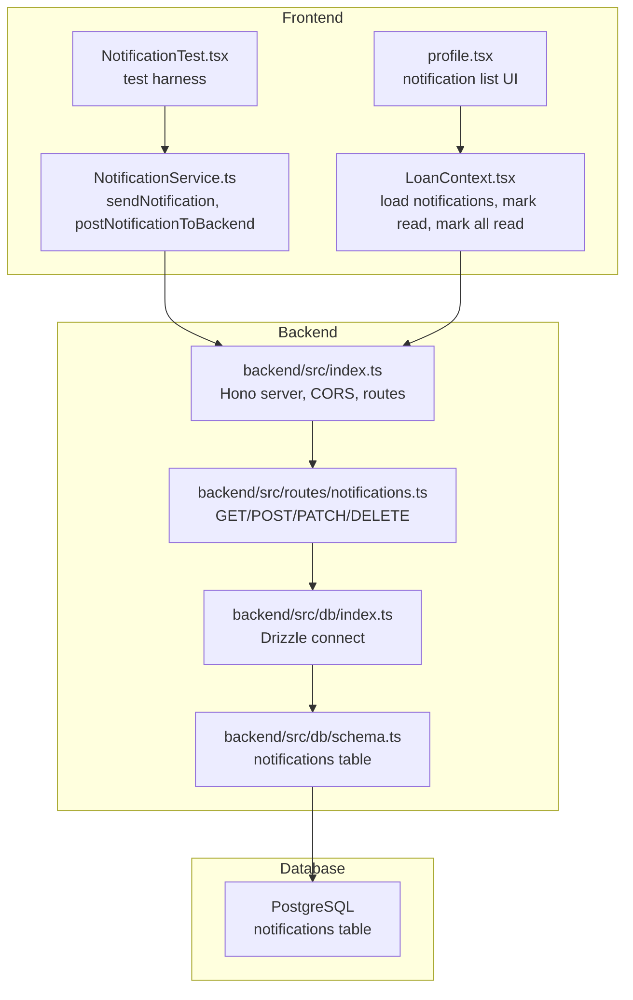
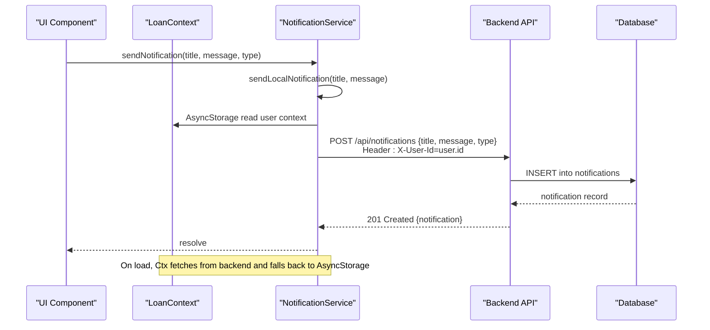
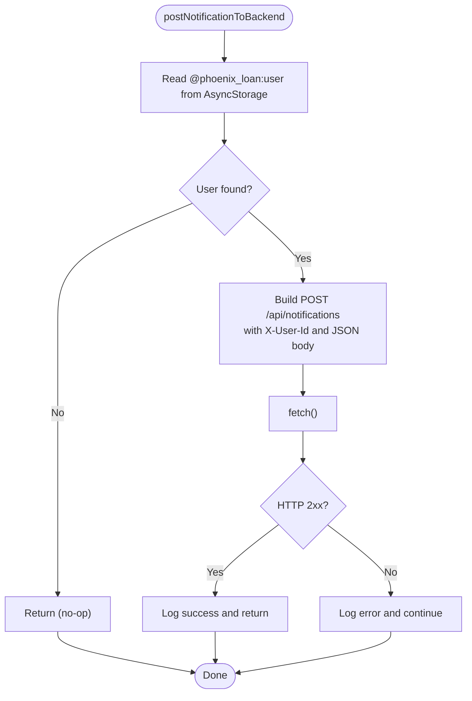
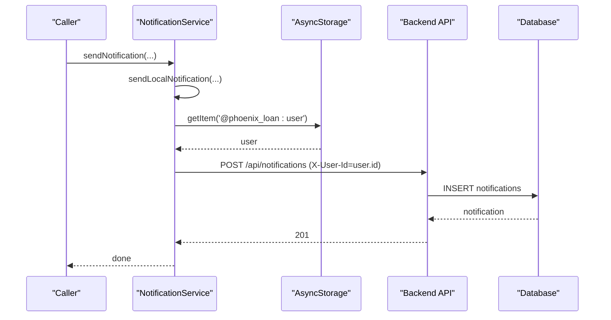
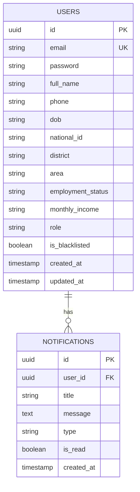
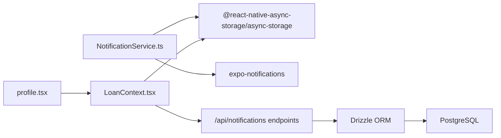

# Backend Notification Storage

<cite>
**Referenced Files in This Document**
- [NotificationService.ts](file://services/NotificationService.ts)
- [notifications.ts](file://backend/src/routes/nofitications.ts)
- [schema.ts](file://backend/src/db/schema.ts)
- [index.ts](file://backend/src/db/index.ts)
- [index.ts](file://backend/src/index.ts)
- [LoanContext.tsx](file://contexts/LoanContext.tsx)
- [profile.tsx](file://app/(tabs)/profile.tsx)
- [NotificationTest.tsx](file://components/NotificationTest.tsx)
- [create-notifications-table.sql](file://backend/create-notifications-table.sql)
</cite>

## Table of Contents
1. [Introduction](#introduction)
2. [Project Structure](#project-structure)
3. [Core Components](#core-components)
4. [Architecture Overview](#architecture-overview)
5. [Detailed Component Analysis](#detailed-component-analysis)
6. [Dependency Analysis](#dependency-analysis)
7. [Performance Considerations](#performance-considerations)
8. [Troubleshooting Guide](#troubleshooting-guide)
9. [Conclusion](#conclusion)
10. [Appendices](#appendices)

## Introduction
This document explains the backend notification storage and management system. It focuses on the postNotificationToBackend function, API integration patterns, user context handling via AsyncStorage, and the end-to-end notification persistence workflow. It also documents database storage mechanisms, retrieval patterns, API endpoint specifications, request/response formats, error handling strategies, notification types, user association, data validation processes, offline scenarios, retry mechanisms, notification history management, and integration with the frontend notification system.

## Project Structure
The notification system spans three layers:
- Frontend service layer: a dedicated service module handles local and backend notifications.
- Backend API layer: Hono routes expose endpoints for CRUD and management of notifications.
- Database layer: Drizzle ORM with PostgreSQL persists notifications and enforces referential integrity.

**Diagram sources**
- [NotificationService.ts:93-134](file://services/NotificationService.ts#L93-L134)
- [notifications.ts:1-106](file://backend/src/routes/notifications.ts#L1-L106)
- [index.ts:1-76](file://backend/src/index.ts#L1-L76)
- [index.ts:1-44](file://backend/src/db/index.ts#L1-L44)
- [schema.ts:79-88](file://backend/src/db/schema.ts#L79-L88)

**Section sources**
- [NotificationService.ts:1-135](file://services/NotificationService.ts#L1-L135)
- [notifications.ts:1-106](file://backend/src/routes/notifications.ts#L1-L106)
- [index.ts:1-76](file://backend/src/index.ts#L1-L76)
- [index.ts:1-44](file://backend/src/db/index.ts#L1-L44)
- [schema.ts:79-88](file://backend/src/db/schema.ts#L79-L88)

## Core Components
- NotificationService.ts
  - Provides sendNotification and postNotificationToBackend functions.
  - Uses AsyncStorage to read user context and injects X-User-Id header for backend requests.
  - Sends local notifications via expo-notifications and persists to backend when available.
- backend/src/routes/notifications.ts
  - Exposes GET /, POST /, PATCH /:id/read, PATCH /read-all, DELETE /read endpoints.
  - Enforces user identity via X-User-Id header and performs CRUD operations against the notifications table.
- backend/src/db/schema.ts
  - Defines the notifications table with foreign key to users, fields for title, message, type, isRead, and timestamps.
- backend/src/db/index.ts
  - Initializes Drizzle with Neon HTTP client and loads environment variables.
- backend/src/index.ts
  - Configures CORS allowing X-User-Id header and mounts notification routes.
- contexts/LoanContext.tsx
  - Loads notifications from backend, falls back to AsyncStorage, and updates UI state.
  - Implements markNotificationRead and markAllRead with optimistic UI and backend sync.
- app/(tabs)/profile.tsx
  - Renders notification items with type-specific styling and unread indicators.
- components/NotificationTest.tsx
  - Demonstrates invoking sendNotification for testing.

**Section sources**
- [NotificationService.ts:93-134](file://services/NotificationService.ts#L93-L134)
- [notifications.ts:8-103](file://backend/src/routes/notifications.ts#L8-L103)
- [schema.ts:79-88](file://backend/src/db/schema.ts#L79-L88)
- [index.ts:31-42](file://backend/src/db/index.ts#L31-L42)
- [index.ts:20-26](file://backend/src/index.ts#L20-L26)
- [LoanContext.tsx:136-158](file://contexts/LoanContext.tsx#L136-L158)
- [profile.tsx](file://app/(tabs)/profile.tsx#L15-L45)
- [NotificationTest.tsx:1-29](file://components/NotificationTest.tsx#L1-L29)

## Architecture Overview
The notification lifecycle integrates local and remote persistence:
- Local delivery: sendLocalNotification triggers immediate in-app alerts.
- Backend persistence: postNotificationToBackend stores notifications in the database.
- Offline resilience: LoanContext fetches from backend when available, otherwise reads AsyncStorage.
- UI synchronization: markNotificationRead and markAllRead update UI and sync with backend.

**Diagram sources**
- [NotificationService.ts:116-134](file://services/NotificationService.ts#L116-L134)
- [NotificationService.ts:93-114](file://services/NotificationService.ts#L93-L114)
- [notifications.ts:72-90](file://backend/src/routes/notifications.ts#L72-L90)
- [LoanContext.tsx:136-158](file://contexts/LoanContext.tsx#L136-L158)

## Detailed Component Analysis

### postNotificationToBackend Function
- Purpose: Persist a notification to the backend using the current user’s context.
- User context handling:
  - Reads @phoenix_loan:user from AsyncStorage.
  - Extracts user.id and passes it in the X-User-Id header.
- Request specification:
  - Endpoint: POST /api/notifications
  - Headers: Content-Type: application/json, X-User-Id: <user.id>
  - Body: { title, message, type }
- Response:
  - 201 Created with { notification } on success.
  - 401 Unauthorized if X-User-Id is missing.
  - 500 Internal Server Error on failure.
- Error handling:
  - Errors are logged; the function does not throw to the caller to avoid breaking local delivery.

**Diagram sources**
- [NotificationService.ts:93-114](file://services/NotificationService.ts#L93-L114)

**Section sources**
- [NotificationService.ts:93-114](file://services/NotificationService.ts#L93-L114)
- [index.ts:20-26](file://backend/src/index.ts#L20-L26)
- [notifications.ts:72-90](file://backend/src/routes/notifications.ts#L72-L90)

### API Integration Patterns
- GET /api/notifications
  - Purpose: Retrieve paginated notifications for the current user.
  - Headers: X-User-Id (required).
  - Query: None.
  - Response: { notifications: [...], unreadCount: number }.
  - Notes: Returns up to 50 most recent notifications ordered by created_at descending.
- POST /api/notifications
  - Purpose: Create a notification for the user.
  - Headers: X-User-Id (required), Content-Type: application/json.
  - Body: { title, message, type }.
  - Validation: type defaults to 'info' if omitted.
  - Response: 201 Created with { notification }.
- PATCH /api/notifications/:id/read
  - Purpose: Mark a single notification as read.
  - Headers: X-User-Id (required).
  - Path params: id.
  - Response: 200 OK with { message }.
- PATCH /api/notifications/read-all
  - Purpose: Mark all user notifications as read.
  - Headers: X-User-Id (required).
  - Response: 200 OK with { message }.
- DELETE /api/notifications/read
  - Purpose: Delete all read notifications for the user.
  - Headers: X-User-Id (required).
  - Response: 200 OK with { message }.

**Section sources**
- [notifications.ts:8-33](file://backend/src/routes/notifications.ts#L8-L33)
- [notifications.ts:35-69](file://backend/src/routes/notifications.ts#L35-L69)
- [notifications.ts:71-90](file://backend/src/routes/notifications.ts#L71-L90)
- [notifications.ts:92-103](file://backend/src/routes/notifications.ts#L92-L103)

### User Context Handling Through AsyncStorage
- Frontend:
  - NotificationService reads @phoenix_loan:user to obtain user.id for X-User-Id.
  - LoanContext fetches notifications from backend and writes to AsyncStorage for offline fallback.
  - markNotificationRead and markAllRead update AsyncStorage and call backend PATCH endpoints.
- Backend:
  - Routes require X-User-Id header; missing or invalid values return 401/403-like errors depending on route.

**Section sources**
- [NotificationService.ts:98-110](file://services/NotificationService.ts#L98-L110)
- [LoanContext.tsx:136-158](file://contexts/LoanContext.tsx#L136-L158)
- [LoanContext.tsx:282-309](file://contexts/LoanContext.tsx#L282-L309)
- [notifications.ts:11-15](file://backend/src/routes/notifications.ts#L11-L15)

### Notification Persistence Workflow
- Local delivery: sendLocalNotification schedules an immediate in-app alert.
- Backend persistence: postNotificationToBackend inserts a record into the notifications table.
- Offline scenarios:
  - On load, LoanContext attempts to fetch from backend; on failure, it reads AsyncStorage.
  - Subsequent actions (mark read, mark all read) update AsyncStorage optimistically and sync with backend.

**Diagram sources**
- [NotificationService.ts:116-134](file://services/NotificationService.ts#L116-L134)
- [NotificationService.ts:93-114](file://services/NotificationService.ts#L93-L114)
- [LoanContext.tsx:136-158](file://contexts/LoanContext.tsx#L136-L158)

**Section sources**
- [NotificationService.ts:116-134](file://services/NotificationService.ts#L116-L134)
- [LoanContext.tsx:136-158](file://contexts/LoanContext.tsx#L136-L158)

### Database Storage Mechanisms
- Table: notifications
  - Columns: id (UUID), userId (UUID, FK users.id), title (VARCHAR), message (TEXT), type (VARCHAR), isRead (BOOLEAN), created_at (TIMESTAMP).
  - Indexes: user_id, created_at, type, is_read.
- Schema and initialization:
  - Drizzle schema defines the table and relations.
  - Environment variable DATABASE_URL configures the connection.
  - SQL migration script creates the table and indexes.

**Diagram sources**
- [schema.ts:4-21](file://backend/src/db/schema.ts#L4-L21)
- [schema.ts:79-88](file://backend/src/db/schema.ts#L79-L88)

**Section sources**
- [schema.ts:79-88](file://backend/src/db/schema.ts#L79-L88)
- [index.ts:31-42](file://backend/src/db/index.ts#L31-L42)
- [create-notifications-table.sql:1-30](file://backend/create-notifications-table.sql#L1-L30)

### Retrieval Patterns and Filtering Options
- GET /api/notifications
  - Filters: userId via X-User-Id header.
  - Sorting: created_at DESC.
  - Pagination: LIMIT 50.
  - Computed field: unreadCount derived client-side by counting isRead=false.
- Filtering options:
  - Type-based filtering can be added by extending the route to accept a query parameter and adding WHERE clauses.
  - Date range filtering can be added similarly.

**Section sources**
- [notifications.ts:17-28](file://backend/src/routes/notifications.ts#L17-L28)

### Notification Types and Data Validation
- Types: info, success, warning, error.
- Validation:
  - POST /api/notifications accepts { title, message, type }.
  - type defaults to 'info' if omitted.
  - isRead defaults to false on insert.
- Frontend types:
  - UI maps type to icon, color, and background for visual differentiation.

**Section sources**
- [NotificationService.ts:96-96](file://services/NotificationService.ts#L96-L96)
- [notifications.ts:77-83](file://backend/src/routes/notifications.ts#L77-L83)
- [profile.tsx](file://app/(tabs)/profile.tsx#L19-L24)

### Offline Scenarios, Retry Mechanisms, and History Management
- Offline scenarios:
  - Backend failures: LoanContext falls back to AsyncStorage for notifications.
  - Network errors: sendNotification logs and continues; local notification still fires.
- Retry mechanisms:
  - No automatic retry loop is implemented in the current code.
  - Recommendation: Introduce exponential backoff and queue for failed POST requests.
- History management:
  - DELETE /api/notifications/read clears read notifications for a user.
  - UI maintains a local list and AsyncStorage backup for seamless UX.

**Section sources**
- [LoanContext.tsx:136-158](file://contexts/LoanContext.tsx#L136-L158)
- [LoanContext.tsx:297-309](file://contexts/LoanContext.tsx#L297-L309)
- [NotificationService.ts:128-133](file://services/NotificationService.ts#L128-L133)
- [notifications.ts:92-103](file://backend/src/routes/notifications.ts#L92-L103)

### Integration with the Frontend Notification System
- Loading notifications:
  - LoanContext fetches from backend and writes to AsyncStorage for offline access.
- Marking read:
  - markNotificationRead updates UI and calls PATCH /api/notifications/:id/read.
- Marking all read:
  - markAllRead updates UI and calls PATCH /api/notifications/read-all.
- UI rendering:
  - profile.tsx displays notifications with type-specific styling and unread indicators.

**Section sources**
- [LoanContext.tsx:136-158](file://contexts/LoanContext.tsx#L136-L158)
- [LoanContext.tsx:282-309](file://contexts/LoanContext.tsx#L282-L309)
- [profile.tsx](file://app/(tabs)/profile.tsx#L15-L45)

## Dependency Analysis
- Frontend dependencies:
  - NotificationService depends on AsyncStorage and expo-notifications.
  - LoanContext depends on AsyncStorage and backend endpoints.
- Backend dependencies:
  - Routes depend on Drizzle ORM and database schema.
  - Server configures CORS and mounts routes.

**Diagram sources**
- [NotificationService.ts:1-11](file://services/NotificationService.ts#L1-L11)
- [LoanContext.tsx:136-158](file://contexts/LoanContext.tsx#L136-L158)
- [notifications.ts:1-6](file://backend/src/routes/notifications.ts#L1-L6)

**Section sources**
- [NotificationService.ts:1-11](file://services/NotificationService.ts#L1-L11)
- [LoanContext.tsx:136-158](file://contexts/LoanContext.tsx#L136-L158)
- [notifications.ts:1-6](file://backend/src/routes/notifications.ts#L1-L6)

## Performance Considerations
- Database:
  - Indexes on user_id, created_at, type, and is_read improve query performance.
  - Consider partitioning or materialized views for very large histories.
- API:
  - Limit response size (current 50 notifications) to reduce payload.
  - Add pagination parameters for deeper navigation.
- Frontend:
  - Cache frequently accessed notifications in AsyncStorage to minimize network calls.
  - Debounce mark read operations to batch updates.

## Troubleshooting Guide
- Unauthorized errors (401):
  - Ensure X-User-Id header is present and matches the logged-in user.
  - Confirm AsyncStorage contains @phoenix_loan:user.
- Internal server errors (500):
  - Check DATABASE_URL and environment configuration.
  - Verify database connectivity and migrations.
- Local notifications not firing:
  - On Expo Go, push tokens are not supported; local notifications still work.
  - Ensure permissions are granted and device is physical for push tokens.
- Notifications not appearing in UI:
  - Confirm AsyncStorage keys (@phoenix_loan:user, @phoenix_loans) are populated.
  - Verify backend fetch succeeded; otherwise, UI falls back to AsyncStorage.

**Section sources**
- [notifications.ts:13-15](file://backend/src/routes/notifications.ts#L13-L15)
- [index.ts:31-38](file://backend/src/db/index.ts#L31-L38)
- [NotificationService.ts:26-69](file://services/NotificationService.ts#L26-L69)
- [LoanContext.tsx:136-158](file://contexts/LoanContext.tsx#L136-L158)

## Conclusion
The notification system combines immediate local delivery with robust backend persistence. It leverages AsyncStorage for user context and offline resilience, while backend endpoints provide reliable CRUD and management capabilities. Extending the system with typed filters, retry queues, and improved error reporting would further enhance reliability and maintainability.

## Appendices

### API Endpoint Reference
- GET /api/notifications
  - Headers: X-User-Id
  - Response: { notifications: [...], unreadCount: number }
- POST /api/notifications
  - Headers: X-User-Id, Content-Type: application/json
  - Body: { title, message, type }
  - Response: 201 Created { notification }
- PATCH /api/notifications/:id/read
  - Headers: X-User-Id
  - Response: 200 OK { message }
- PATCH /api/notifications/read-all
  - Headers: X-User-Id
  - Response: 200 OK { message }
- DELETE /api/notifications/read
  - Headers: X-User-Id
  - Response: 200 OK { message }

**Section sources**
- [notifications.ts:8-33](file://backend/src/routes/notifications.ts#L8-L33)
- [notifications.ts:35-69](file://backend/src/routes/notifications.ts#L35-L69)
- [notifications.ts:71-90](file://backend/src/routes/notifications.ts#L71-L90)
- [notifications.ts:92-103](file://backend/src/routes/notifications.ts#L92-L103)