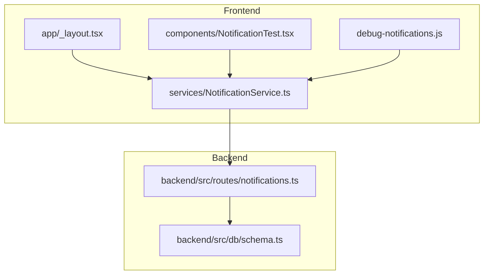
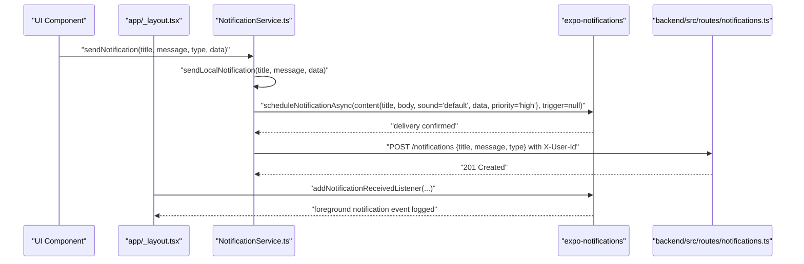
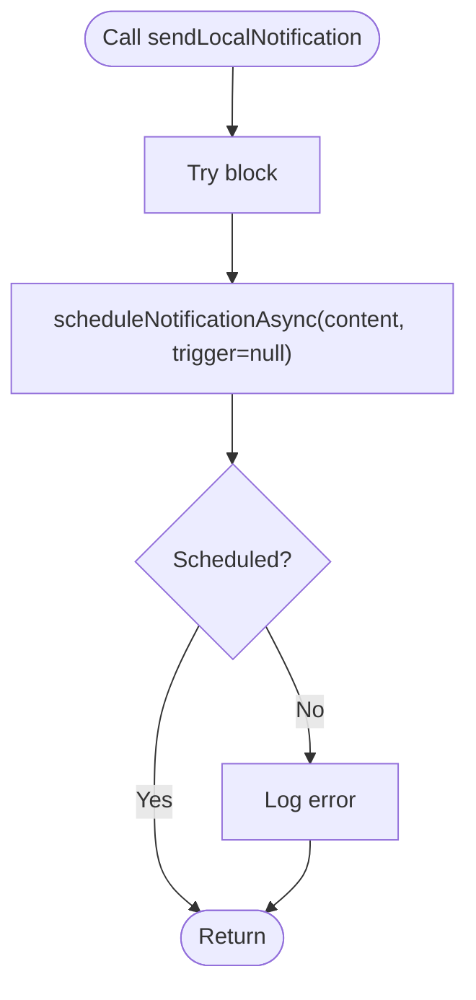
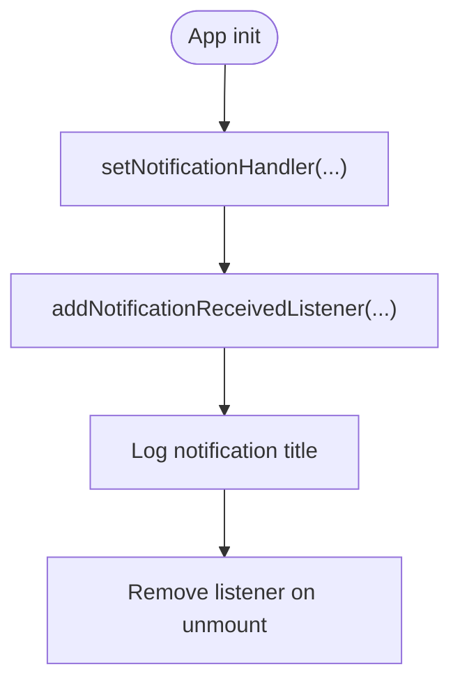
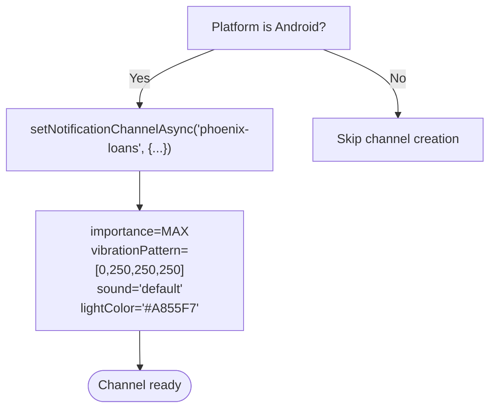
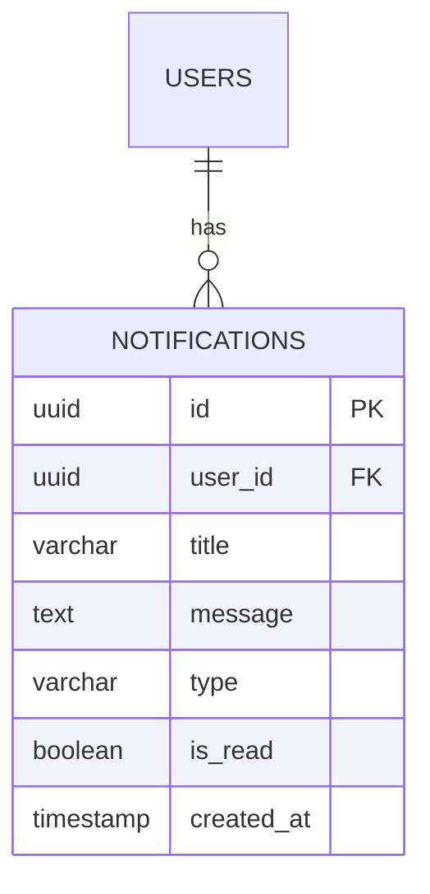
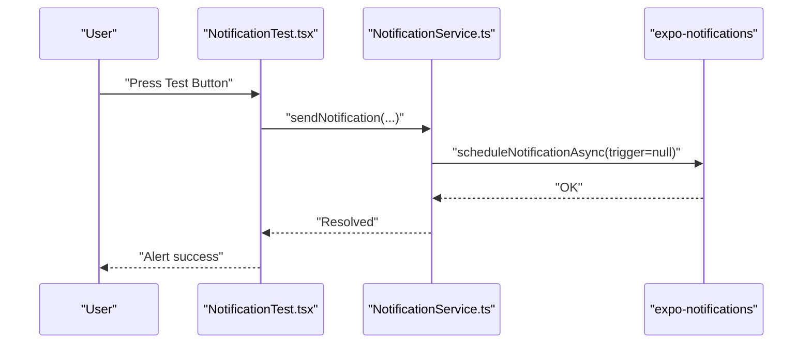
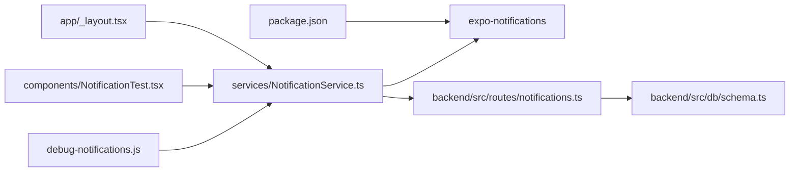

# Local Notification Handling

<cite>
**Referenced Files in This Document**
- [NotificationService.ts](file://services/NotificationService.ts)
- [debug-notifications.js](file://debug-notifications.js)
- [NotificationTest.tsx](file://components/NotificationTest.tsx)
- [app/_layout.tsx](file://app/_layout.tsx)
- [PUSH_NOTIFICATIONS_SETUP.md](file://PUSH_NOTIFICATIONS_SETUP.md)
- [notifications.ts](file://backend/src/routes/notications.ts)
- [schema.ts](file://backend/src/db/schema.ts)
- [package.json](file://package.json)
</cite>

## Table of Contents
1. [Introduction](#introduction)
2. [Project Structure](#project-structure)
3. [Core Components](#core-components)
4. [Architecture Overview](#architecture-overview)
5. [Detailed Component Analysis](#detailed-component-analysis)
6. [Dependency Analysis](#dependency-analysis)
7. [Performance Considerations](#performance-considerations)
8. [Troubleshooting Guide](#troubleshooting-guide)
9. [Conclusion](#conclusion)
10. [Appendices](#appendices)

## Introduction
This document explains the local notification implementation and management in the Phoenix Loan App. It focuses on how notifications are scheduled and delivered locally, how content and metadata are formatted, and how the system persists notifications to the backend. It also covers Android channel configuration, foreground/background behavior, and practical guidance for styling, priority, and platform-specific customization. Finally, it provides troubleshooting steps and performance optimization tips.

## Project Structure
The notification system spans the frontend service module, a small test component, a layout-level listener, and the backend routes and schema for persisted notifications.

**Diagram sources**
- [NotificationService.ts:1-135](file://services/NotificationService.ts#L1-L135)
- [app/_layout.tsx:13-61](file://app/_layout.tsx#L13-L61)
- [NotificationTest.tsx:1-29](file://components/NotificationTest.tsx#L1-L29)
- [debug-notifications.js:1-32](file://debug-notifications.js#L1-L32)
- [notifications.ts:1-106](file://backend/src/routes/notifications.ts#L1-L106)
- [schema.ts:79-88](file://backend/src/db/schema.ts#L79-L88)

**Section sources**
- [NotificationService.ts:1-135](file://services/NotificationService.ts#L1-L135)
- [app/_layout.tsx:13-61](file://app/_layout.tsx#L13-L61)
- [NotificationTest.tsx:1-29](file://components/NotificationTest.tsx#L1-L29)
- [debug-notifications.js:1-32](file://debug-notifications.js#L1-L32)
- [notifications.ts:1-106](file://backend/src/routes/notifications.ts#L1-L106)
- [schema.ts:79-88](file://backend/src/db/schema.ts#L79-L88)

## Core Components
- Local notification sender: schedules and delivers notifications immediately with default sound and high priority.
- Foreground handler: logs received notifications while the app is active.
- Android channel: configures importance, vibration pattern, sound, and LED color.
- Backend persistence: stores notifications per user with type and read state.
- Test utilities: quick local tests via script and UI button.

Key responsibilities:
- Immediate delivery: trigger is null to fire instantly.
- Content formatting: title, body, sound, priority, and optional data payload.
- Persistence: optional backend storage with user-scoped notifications.
- Platform specifics: Android channel configuration and foreground behavior logging.

**Section sources**
- [NotificationService.ts:71-91](file://services/NotificationService.ts#L71-L91)
- [NotificationService.ts:14-24](file://services/NotificationService.ts#L14-L24)
- [NotificationService.ts:51-60](file://services/NotificationService.ts#L51-L60)
- [NotificationService.ts:116-134](file://services/NotificationService.ts#L116-L134)
- [app/_layout.tsx:56-61](file://app/_layout.tsx#L56-L61)
- [debug-notifications.js:11-31](file://debug-notifications.js#L11-L31)
- [NotificationTest.tsx:5-17](file://components/NotificationTest.tsx#L5-L17)

## Architecture Overview
The notification pipeline combines local delivery and optional backend persistence. The frontend service sends a local notification immediately and optionally posts to the backend. The backend exposes routes to list, mark read, and delete notifications for a user.

**Diagram sources**
- [NotificationService.ts:71-91](file://services/NotificationService.ts#L71-L91)
- [NotificationService.ts:116-134](file://services/NotificationService.ts#L116-L134)
- [app/_layout.tsx:56-61](file://app/_layout.tsx#L56-L61)
- [notifications.ts:71-90](file://backend/src/routes/notifications.ts#L71-L90)

## Detailed Component Analysis

### Local Notification Sender
Implements immediate delivery with high priority and default sound. The content object accepts a data payload that can carry arbitrary key/value pairs for downstream handling.

**Diagram sources**
- [NotificationService.ts:71-91](file://services/NotificationService.ts#L71-L91)

**Section sources**
- [NotificationService.ts:71-91](file://services/NotificationService.ts#L71-L91)

### Notification Handler for Foreground
Configures how notifications appear when the app is in the foreground and logs received events.

**Diagram sources**
- [NotificationService.ts:14-24](file://services/NotificationService.ts#L14-L24)
- [app/_layout.tsx:56-61](file://app/_layout.tsx#L56-L61)

**Section sources**
- [NotificationService.ts:14-24](file://services/NotificationService.ts#L14-L24)
- [app/_layout.tsx:56-61](file://app/_layout.tsx#L56-L61)

### Android Channel Configuration
Sets up a notification channel with max importance, vibration pattern, default sound, and LED color for Android.

**Diagram sources**
- [NotificationService.ts:51-60](file://services/NotificationService.ts#L51-L60)

**Section sources**
- [NotificationService.ts:51-60](file://services/NotificationService.ts#L51-L60)

### Backend Persistence Routes
Provides endpoints to:
- List user notifications with unread count
- Mark a notification as read
- Mark all notifications as read
- Create a notification
- Delete read notifications

**Diagram sources**
- [schema.ts:79-88](file://backend/src/db/schema.ts#L79-L88)

**Section sources**
- [notifications.ts:8-33](file://backend/src/routes/notifications.ts#L8-L33)
- [notifications.ts:35-49](file://backend/src/routes/notifications.ts#L35-L49)
- [notifications.ts:51-69](file://backend/src/routes/notifications.ts#L51-L69)
- [notifications.ts:71-90](file://backend/src/routes/notifications.ts#L71-L90)
- [notifications.ts:92-103](file://backend/src/routes/notifications.ts#L92-L103)
- [schema.ts:79-88](file://backend/src/db/schema.ts#L79-L88)

### Test Utilities
- Script-based test: runs a local notification outside the app context.
- UI test component: triggers a notification via the service and shows an alert.

**Diagram sources**
- [NotificationTest.tsx:5-17](file://components/NotificationTest.tsx#L5-L17)
- [NotificationService.ts:116-134](file://services/NotificationService.ts#L116-L134)

**Section sources**
- [debug-notifications.js:11-31](file://debug-notifications.js#L11-L31)
- [NotificationTest.tsx:5-17](file://components/NotificationTest.tsx#L5-L17)

## Dependency Analysis
- Frontend depends on expo-notifications for scheduling and foreground handling.
- Android-specific channel configuration is guarded by platform detection.
- Backend routes depend on Drizzle ORM and the notifications table schema.
- The service uses AsyncStorage to read the current user and attaches the user ID via a request header.

**Diagram sources**
- [package.json:44](file://package.json#L44)
- [NotificationService.ts:1-10](file://services/NotificationService.ts#L1-L10)
- [notifications.ts:1-6](file://backend/src/routes/notifications.ts#L1-L6)
- [schema.ts:1-4](file://backend/src/db/schema.ts#L1-L4)
- [app/_layout.tsx:13-14](file://app/_layout.tsx#L13-L14)
- [NotificationTest.tsx:3](file://components/NotificationTest.tsx#L3)
- [debug-notifications.js:9](file://debug-notifications.js#L9)

**Section sources**
- [package.json:44](file://package.json#L44)
- [NotificationService.ts:1-10](file://services/NotificationService.ts#L1-L10)
- [notifications.ts:1-6](file://backend/src/routes/notifications.ts#L1-L6)
- [schema.ts:1-4](file://backend/src/db/schema.ts#L1-L4)
- [app/_layout.tsx:13-14](file://app/_layout.tsx#L13-L14)
- [NotificationTest.tsx:3](file://components/NotificationTest.tsx#L3)
- [debug-notifications.js:9](file://debug-notifications.js#L9)

## Performance Considerations
- Immediate delivery: Using trigger null ensures zero delay, which is efficient for urgent alerts but avoid excessive bursts.
- Payload size: Keep the data payload minimal to reduce overhead.
- Foreground logging: Logging received notifications is helpful for debugging but avoid heavy operations in listeners.
- Channel configuration: Android channel settings are one-time; keep them tuned to avoid battery drain from frequent vibrations or lights.
- Backend calls: Network requests are best-effort; consider batching or throttling if sending many notifications rapidly.

[No sources needed since this section provides general guidance]

## Troubleshooting Guide
Common issues and resolutions:
- Local notifications not firing in Expo Go:
  - Local notifications are supported in Expo Go; confirm the test script executes successfully.
  - Verify the sendLocalNotification call completes without throwing.
- Permission denied for push notifications:
  - On physical devices, permissions must be granted. The service checks and requests permissions; ensure the user grants them.
- Android channel not applied:
  - Channel creation is only executed on Android. Confirm platform detection and channel creation paths.
- Backend persistence failures:
  - Network errors are expected if the backend is unreachable. The service continues to show local notifications even if backend posting fails.
- Foreground notification not visible:
  - Foreground handler logs events; ensure the listener is registered during app initialization.

**Section sources**
- [PUSH_NOTIFICATIONS_SETUP.md:17-21](file://PUSH_NOTIFICATIONS_SETUP.md#L17-L21)
- [NotificationService.ts:38-49](file://services/NotificationService.ts#L38-L49)
- [NotificationService.ts:51-60](file://services/NotificationService.ts#L51-L60)
- [NotificationService.ts:127-133](file://services/NotificationService.ts#L127-L133)
- [app/_layout.tsx:56-61](file://app/_layout.tsx#L56-L61)

## Conclusion
The Phoenix Loan App implements a robust local notification system with immediate delivery, Android channel configuration, and optional backend persistence. The service centralizes scheduling and content formatting, while the backend provides user-scoped storage and read-state management. The included test utilities and setup guide streamline development and debugging.

[No sources needed since this section summarizes without analyzing specific files]

## Appendices

### Notification Content Formatting
- Title and body are required for visibility.
- Sound is set to default; adjust per platform preferences.
- Priority is set to high for urgent alerts.
- Data payload supports arbitrary key/value pairs for downstream handling.

**Section sources**
- [NotificationService.ts:78-87](file://services/NotificationService.ts#L78-L87)

### Scheduling Patterns
- Immediate delivery: trigger null.
- Future scheduling: pass a trigger object with date or interval (not implemented in current code).

**Section sources**
- [NotificationService.ts:86](file://services/NotificationService.ts#L86)

### User Interaction Handling
- Foreground listener logs notifications; extend to show banners or navigate on tap.
- Backend routes support marking as read and bulk clearing.

**Section sources**
- [app/_layout.tsx:56-61](file://app/_layout.tsx#L56-L61)
- [notifications.ts:35-49](file://backend/src/routes/notifications.ts#L35-L49)
- [notifications.ts:51-69](file://backend/src/routes/notifications.ts#L51-L69)

### Platform-Specific Customization
- Android: channel importance, vibration pattern, sound, and LED color configured once.
- iOS: default behavior applies; configure presentation options via the handler.

**Section sources**
- [NotificationService.ts:51-60](file://services/NotificationService.ts#L51-L60)
- [NotificationService.ts:14-24](file://services/NotificationService.ts#L14-L24)