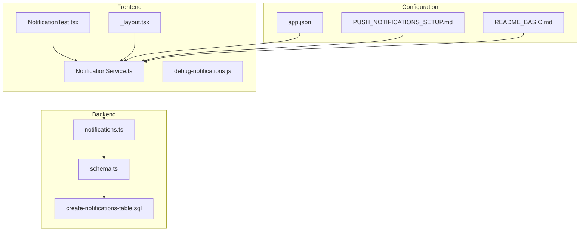
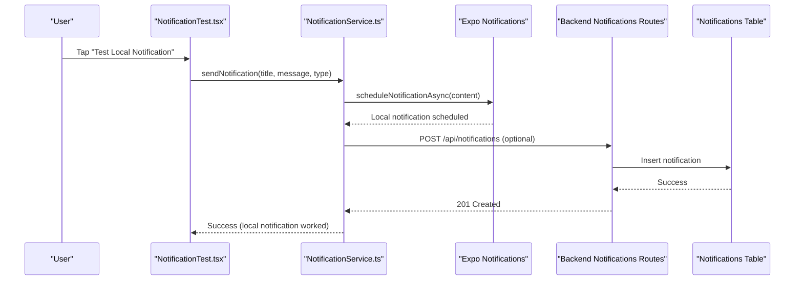
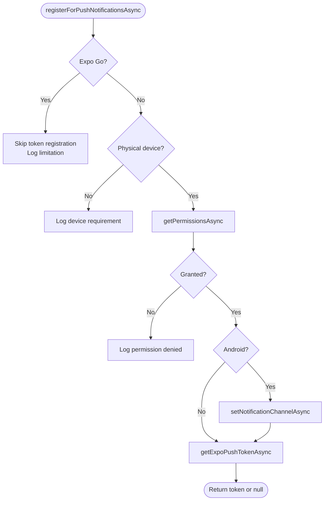
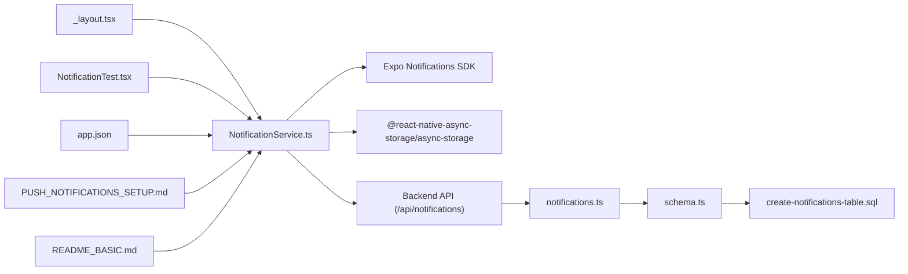
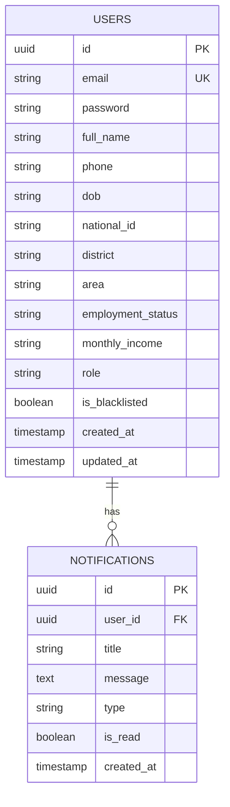

# Notification Debugging and Testing

<cite>
**Referenced Files in This Document**
- [debug-notifications.js](file://debug-notifications.js)
- [NotificationService.ts](file://services/NotificationService.ts)
- [NotificationTest.tsx](file://components/NotificationTest.tsx)
- [_layout.tsx](file://app/_layout.tsx)
- [notifications.ts](file://backend/src/routes/norifications.ts)
- [schema.ts](file://backend/src/db/schema.ts)
- [create-notifications-table.sql](file://backend/create-notifications-table.sql)
- [PUSH_NOTIFICATIONS_SETUP.md](file://PUSH_NOTIFICATIONS_SETUP.md)
- [README_BASIC.md](file://README_BASIC.md)
- [app.json](file://app.json)
</cite>

## Table of Contents
1. [Introduction](#introduction)
2. [Project Structure](#project-structure)
3. [Core Components](#core-components)
4. [Architecture Overview](#architecture-overview)
5. [Detailed Component Analysis](#detailed-component-analysis)
6. [Dependency Analysis](#dependency-analysis)
7. [Performance Considerations](#performance-considerations)
8. [Troubleshooting Guide](#troubleshooting-guide)
9. [Conclusion](#conclusion)
10. [Appendices](#appendices)

## Introduction
This document provides comprehensive guidance for debugging, testing, and troubleshooting notifications in the Phoenix Loan application. It covers the debug-notifications.js script functionality, notification testing workflows, backend delivery tracking, error logging mechanisms, and diagnostic tools. It also includes step-by-step procedures for diagnosing push notification failures, permission issues, delivery problems, timing issues, device-specific problems, and network connectivity challenges. Testing strategies for notification scenarios, mock data handling, and automated testing approaches are documented alongside performance monitoring, analytics, and user feedback collection methods.

## Project Structure
The notification system spans the frontend React Native application and the backend Hono server:
- Frontend services and UI components handle local and push notifications, permission checks, and UI testing helpers.
- Backend routes manage notification persistence, retrieval, marking as read, and deletion.
- Database schema defines the notifications table and indexes for efficient querying.
- Configuration files define project identifiers and notification channel defaults.

**Diagram sources**
- [NotificationTest.tsx:1-29](file://components/NotificationTest.tsx#L1-L29)
- [_layout.tsx:1-83](file://app/_layout.tsx#L1-L83)
- [NotificationService.ts:1-135](file://services/NotificationService.ts#L1-L135)
- [debug-notifications.js:1-32](file://debug-notifications.js#L1-L32)
- [notifications.ts:1-106](file://backend/src/routes/notifications.ts#L1-L106)
- [schema.ts:79-88](file://backend/src/db/schema.ts#L79-L88)
- [create-notifications-table.sql:1-30](file://backend/create-notifications-table.sql#L1-L30)
- [app.json:53-61](file://app.json#L53-L61)
- [PUSH_NOTIFICATIONS_SETUP.md:1-45](file://PUSH_NOTIFICATIONS_SETUP.md#L1-L45)
- [README_BASIC.md:269-288](file://README_BASIC.md#L269-L288)

**Section sources**
- [NotificationService.ts:1-135](file://services/NotificationService.ts#L1-L135)
- [notifications.ts:1-106](file://backend/src/routes/notifications.ts#L1-L106)
- [schema.ts:79-88](file://backend/src/db/schema.ts#L79-L88)
- [create-notifications-table.sql:1-30](file://backend/create-notifications-table.sql#L1-L30)
- [app.json:53-61](file://app.json#L53-L61)
- [PUSH_NOTIFICATIONS_SETUP.md:1-45](file://PUSH_NOTIFICATIONS_SETUP.md#L1-L45)
- [README_BASIC.md:269-288](file://README_BASIC.md#L269-L288)

## Core Components
- NotificationService: Centralizes notification logic including permission handling, local notification scheduling, push token acquisition, and backend posting.
- NotificationTest: Provides a UI button to trigger local notifications for quick testing.
- Backend Notifications Routes: Implements CRUD-like endpoints for retrieving, marking as read, bulk marking as read, creating, and deleting notifications.
- Database Schema: Defines the notifications table with foreign key constraints and indexes for performance.
- Configuration: app.json configures notification plugin defaults and project identifiers.

Key responsibilities:
- Local notifications: Immediate presentation with sound and priority.
- Push notifications: Requires development builds and proper permissions; token registration is skipped in Expo Go.
- Backend persistence: Stores notifications per user with read/unread tracking and type categorization.

**Section sources**
- [NotificationService.ts:26-134](file://services/NotificationService.ts#L26-L134)
- [NotificationTest.tsx:1-29](file://components/NotificationTest.tsx#L1-L29)
- [notifications.ts:8-103](file://backend/src/routes/notifications.ts#L8-L103)
- [schema.ts:79-88](file://backend/src/db/schema.ts#L79-L88)
- [app.json:53-61](file://app.json#L53-L61)

## Architecture Overview
The notification architecture integrates frontend and backend components with platform-specific behavior:

**Diagram sources**
- [NotificationTest.tsx:5-17](file://components/NotificationTest.tsx#L5-L17)
- [NotificationService.ts:116-134](file://services/NotificationService.ts#L116-L134)
- [notifications.ts:72-89](file://backend/src/routes/notifications.ts#L72-L89)
- [schema.ts:79-88](file://backend/src/db/schema.ts#L79-L88)

## Detailed Component Analysis

### NotificationService.ts
Responsibilities:
- Permission handling: Requests and checks notification permissions, skipping push token registration in Expo Go.
- Local notifications: Schedules immediate local notifications with high priority and sound.
- Push token acquisition: Retrieves Expo push tokens on supported environments, logs failures.
- Backend posting: Sends notification data to backend with user context header.
- Foreground notification handling: Configures notification appearance when app is in foreground (non-Expo Go).

Implementation highlights:
- Conditional logic for Expo Go vs. development builds.
- Android notification channel creation for consistent alerts.
- Robust error logging for token retrieval and backend posting.

**Diagram sources**
- [NotificationService.ts:26-69](file://services/NotificationService.ts#L26-L69)

**Section sources**
- [NotificationService.ts:1-135](file://services/NotificationService.ts#L1-L135)

### debug-notifications.js
Purpose:
- Quick local notification test script for development and debugging.
- Logs app ownership and basic environment details.
- Schedules a high-priority local notification with default sound.

Usage:
- Run the script in a Node.js environment compatible with the project.
- Observe console logs and verify local notification delivery.

**Section sources**
- [debug-notifications.js:1-32](file://debug-notifications.js#L1-L32)

### NotificationTest.tsx
Purpose:
- Provides a UI button to trigger local notifications for manual testing.
- Displays success/error alerts after attempting to send a notification.

Integration:
- Calls NotificationService.sendNotification with predefined parameters.
- Useful for validating local notification behavior during development.

**Section sources**
- [NotificationTest.tsx:1-29](file://components/NotificationTest.tsx#L1-L29)

### Backend Notifications Routes
Endpoints:
- GET /notifications: Lists user notifications with unread count, ordered by creation date.
- PATCH /notifications/:id/read: Marks a specific notification as read.
- PATCH /notifications/read-all: Marks all user notifications as read.
- POST /notifications: Creates a notification for the user.
- DELETE /notifications/read: Deletes all read notifications for the user.

Error handling:
- Unauthorized requests return 401.
- Internal server errors return 500 with error message.
- Logging occurs on errors for diagnostics.

**Section sources**
- [notifications.ts:8-103](file://backend/src/routes/notifications.ts#L8-L103)

### Database Schema and Migration
Schema:
- notifications table with UUID primary key, foreign key to users, type, read flag, and timestamps.
- Indexes on user_id, created_at, type, and is_read for efficient queries.

Migration:
- Additional columns for loan lifecycle events exist in migrate.sql, unrelated to notifications but part of the broader data model.

**Section sources**
- [schema.ts:79-88](file://backend/src/db/schema.ts#L79-L88)
- [create-notifications-table.sql:1-30](file://backend/create-notifications-table.sql#L1-L30)
- [migrate.sql:1-12](file://backend/migrate.sql#L1-L12)

### Configuration and Setup
- app.json configures the expo-notifications plugin with default channel, icon, color, and project identifiers.
- PUSH_NOTIFICATIONS_SETUP.md outlines project ID configuration, development build requirements, and testing expectations.
- README_BASIC.md includes manual testing steps and notification setup guidance.

**Section sources**
- [app.json:53-61](file://app.json#L53-L61)
- [PUSH_NOTIFICATIONS_SETUP.md:1-45](file://PUSH_NOTIFICATIONS_SETUP.md#L1-L45)
- [README_BASIC.md:269-288](file://README_BASIC.md#L269-L288)

## Dependency Analysis
Notification dependencies and relationships:

**Diagram sources**
- [NotificationService.ts:1-135](file://services/NotificationService.ts#L1-L135)
- [notifications.ts:1-106](file://backend/src/routes/notifications.ts#L1-L106)
- [schema.ts:79-88](file://backend/src/db/schema.ts#L79-L88)
- [create-notifications-table.sql:1-30](file://backend/create-notifications-table.sql#L1-L30)
- [_layout.tsx:13-61](file://app/_layout.tsx#L13-L61)
- [NotificationTest.tsx:1-29](file://components/NotificationTest.tsx#L1-L29)
- [app.json:53-61](file://app.json#L53-L61)
- [PUSH_NOTIFICATIONS_SETUP.md:1-45](file://PUSH_NOTIFICATIONS_SETUP.md#L1-L45)
- [README_BASIC.md:269-288](file://README_BASIC.md#L269-L288)

**Section sources**
- [NotificationService.ts:1-135](file://services/NotificationService.ts#L1-L135)
- [notifications.ts:1-106](file://backend/src/routes/notifications.ts#L1-L106)
- [schema.ts:79-88](file://backend/src/db/schema.ts#L79-L88)
- [create-notifications-table.sql:1-30](file://backend/create-notifications-table.sql#L1-L30)
- [_layout.tsx:13-61](file://app/_layout.tsx#L13-L61)
- [NotificationTest.tsx:1-29](file://components/NotificationTest.tsx#L1-L29)
- [app.json:53-61](file://app.json#L53-L61)
- [PUSH_NOTIFICATIONS_SETUP.md:1-45](file://PUSH_NOTIFICATIONS_SETUP.md#L1-L45)
- [README_BASIC.md:269-288](file://README_BASIC.md#L269-L288)

## Performance Considerations
- Local notifications: Immediate delivery with minimal overhead; suitable for frequent user feedback.
- Backend persistence: Indexes on user_id, created_at, type, and is_read improve query performance for notification lists and filtering.
- Push token updates: Automatic server registration is enabled by default; network errors are handled gracefully with retries and logging.
- Foreground notification handling: Configured to show banners/alerts/sounds for better user engagement on supported platforms.

[No sources needed since this section provides general guidance]

## Troubleshooting Guide

### Step-by-Step Debugging Procedures

#### Push Notification Failures
1. Verify environment:
   - Confirm you are using a development build on a physical device for push notifications.
   - Ensure project ID is configured in app.json and matches backend expectations.
2. Check permissions:
   - Request notification permissions at runtime; verify status is granted.
   - On Android, confirm notification channel exists and is properly configured.
3. Token acquisition:
   - Attempt to retrieve an Expo push token; inspect logs for errors.
   - If token retrieval fails, retry after ensuring network connectivity.
4. Backend posting:
   - Send a test notification; observe backend logs for errors.
   - Verify user context header is present and valid.

**Section sources**
- [PUSH_NOTIFICATIONS_SETUP.md:15-44](file://PUSH_NOTIFICATIONS_SETUP.md#L15-L44)
- [NotificationService.ts:26-69](file://services/NotificationService.ts#L26-L69)
- [app.json:53-61](file://app.json#L53-L61)

#### Permission Issues
1. Detect permission state:
   - Use getPermissionsAsync to check current status.
   - If not granted, request permissions and handle denial gracefully.
2. Device requirements:
   - Push notifications require a physical device; skip token registration in Expo Go.
3. Android specifics:
   - Ensure notification channel is created with appropriate importance and vibration pattern.

**Section sources**
- [NotificationService.ts:33-60](file://services/NotificationService.ts#L33-L60)
- [PUSH_NOTIFICATIONS_SETUP.md:17-20](file://PUSH_NOTIFICATIONS_SETUP.md#L17-L20)

#### Delivery Problems
1. Local delivery:
   - Use debug-notifications.js to schedule a local notification and verify receipt.
   - Confirm sound and priority settings are applied.
2. Backend delivery:
   - Trigger sendNotification and check backend logs for POST /api/notifications.
   - Validate user context header and response status.
3. Read/unread tracking:
   - Use PATCH endpoints to mark notifications as read and verify counts.

**Section sources**
- [debug-notifications.js:11-29](file://debug-notifications.js#L11-L29)
- [NotificationService.ts:116-134](file://services/NotificationService.ts#L116-L134)
- [notifications.ts:35-69](file://backend/src/routes/notifications.ts#L35-L69)

#### Timing Issues
1. Immediate delivery:
   - Local notifications are scheduled with trigger null for immediate firing.
2. Scheduled notifications:
   - Use scheduleNotificationAsync with appropriate triggers for future delivery.
   - Validate trigger parsing and platform-specific constraints.

**Section sources**
- [NotificationService.ts:71-91](file://services/NotificationService.ts#L71-L91)
- [scheduleNotificationAsync:71-91](file://services/NotificationService.ts#L71-L91)

#### Device-Specific Problems
1. Expo Go limitations:
   - Push tokens are not supported; local notifications are sufficient for testing.
2. Physical device requirements:
   - Install development build and enable notifications in device settings.
3. Android channel configuration:
   - Ensure channel exists with correct importance and sound settings.

**Section sources**
- [PUSH_NOTIFICATIONS_SETUP.md:17-20](file://PUSH_NOTIFICATIONS_SETUP.md#L17-L20)
- [NotificationService.ts:51-60](file://services/NotificationService.ts#L51-L60)

#### Network Connectivity Challenges
1. Backend availability:
   - Expect network errors if backend is not running; local notifications still work.
2. Token registration:
   - Network failures during getExpoPushTokenAsync should be retried after connectivity is restored.
3. Logging:
   - Inspect console logs for network-related errors and retry attempts.

**Section sources**
- [PUSH_NOTIFICATIONS_SETUP.md:42-44](file://PUSH_NOTIFICATIONS_SETUP.md#L42-L44)
- [NotificationService.ts:62-68](file://services/NotificationService.ts#L62-L68)

### Testing Strategies

#### Manual Testing
- Trigger notifications from app actions and verify both local and push delivery.
- Use NotificationTest component to quickly validate local notification behavior.
- Follow README_BASIC.md manual testing steps for environment setup.

**Section sources**
- [NotificationTest.tsx:5-17](file://components/NotificationTest.tsx#L5-L17)
- [README_BASIC.md:261-266](file://README_BASIC.md#L261-L266)

#### Mock Data Handling
- For backend tests, inject test user data and verify notification creation and retrieval.
- Use unique identifiers to avoid conflicts across test runs.

**Section sources**
- [database-testing.md:6-12](file://.local/skills/testing/database-testing.md#L6-L12)

#### Automated Testing Approaches
- UI automation: Use the testing skill to simulate user interactions and verify notification displays.
- API tests: Validate backend endpoints for creating, listing, and managing notifications.
- Database verification: Confirm notification records exist and are correctly associated with users.

**Section sources**
- [testing SKILL.md:63-162](file://.local/skills/testing/SKILL.md#L63-L162)

### Performance Monitoring and Analytics
- Monitor notification delivery latency and success rates.
- Track backend API response times for notification endpoints.
- Use logs to identify bottlenecks in token acquisition and backend posting.

[No sources needed since this section provides general guidance]

### User Feedback Collection
- Integrate an agent inbox skill to collect user feedback, bug reports, and feature requests.
- Use feedback to refine notification content, timing, and delivery preferences.

**Section sources**
- [.local/skills/agent-inbox/SKILL.md:1-108](file://.local/skills/agent-inbox/SKILL.md#L1-L108)

## Conclusion
The Phoenix Loan notification system combines robust frontend logic with backend persistence and configuration-driven setup. By following the debugging procedures, testing strategies, and troubleshooting steps outlined above, developers can effectively diagnose and resolve notification issues across local and push delivery, permissions, timing, device-specific constraints, and network conditions. Integrating performance monitoring and user feedback ensures continuous improvement of the notification experience.

[No sources needed since this section summarizes without analyzing specific files]

## Appendices

### API Definitions
- GET /api/notifications: Returns notifications array and unreadCount for the authenticated user.
- PATCH /api/notifications/:id/read: Marks a notification as read.
- PATCH /api/notifications/read-all: Marks all notifications as read.
- POST /api/notifications: Creates a notification for the user.
- DELETE /api/notifications/read: Deletes all read notifications for the user.

Headers:
- X-User-Id: Required for user context in backend operations.

**Section sources**
- [notifications.ts:8-103](file://backend/src/routes/notifications.ts#L8-L103)

### Data Model

**Diagram sources**
- [schema.ts:4-21](file://backend/src/db/schema.ts#L4-L21)
- [schema.ts:79-88](file://backend/src/db/schema.ts#L79-L88)