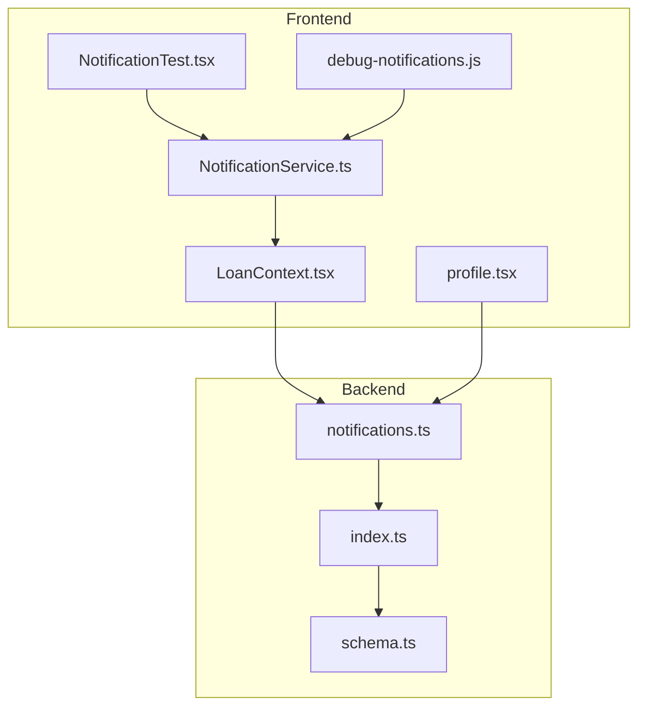
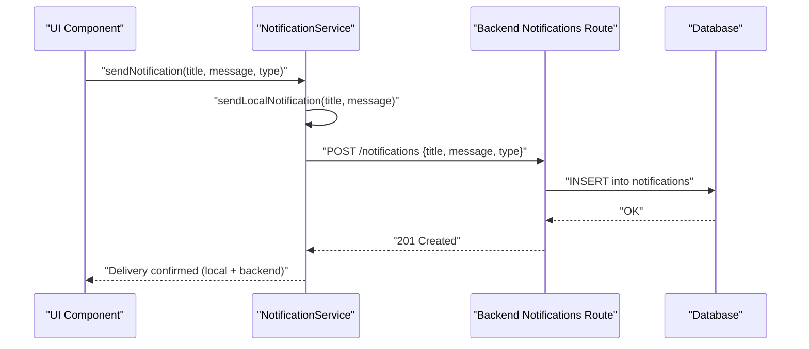
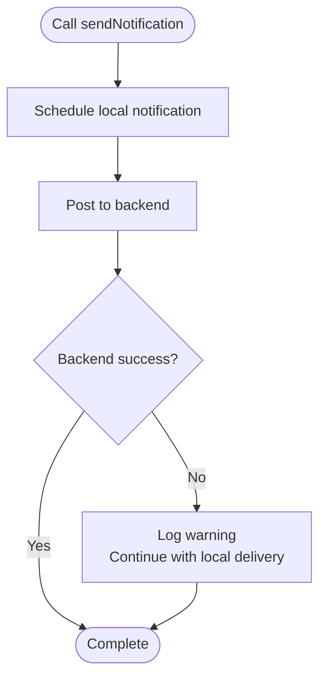
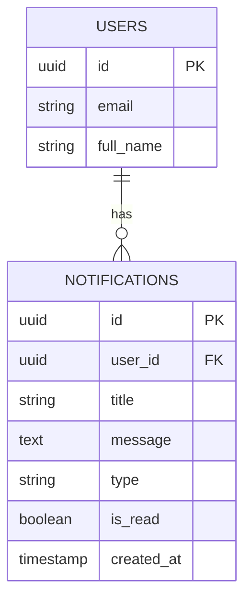
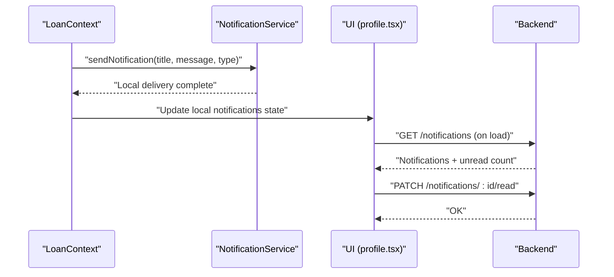
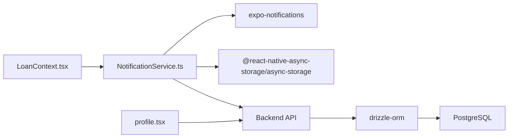

# Notification System

<cite>
**Referenced Files in This Document**
- [NotificationService.ts](file://services/NotificationService.ts)
- [PUSH_NOTIFICATIONS_SETUP.md](file://PUSH_NOTIFICATIONS_SETUP.md)
- [notifications.ts](file://backend/src/routes/notifications.ts)
- [schema.ts](file://backend/src/db/schema.ts)
- [index.ts](file://backend/src/db/index.ts)
- [NotificationTest.tsx](file://components/NotificationTest.tsx)
- [debug-notifications.js](file://debug-notifications.js)
- [app.json](file://app.json)
- [LoanContext.tsx](file://contexts/LoanContext.tsx)
- [profile.tsx](file://app/(tabs)/profile.tsx)
- [AuthContext.tsx](file://contexts/AuthContext.tsx)
</cite>

## Table of Contents
1. [Introduction](#introduction)
2. [Project Structure](#project-structure)
3. [Core Components](#core-components)
4. [Architecture Overview](#architecture-overview)
5. [Detailed Component Analysis](#detailed-component-analysis)
6. [Dependency Analysis](#dependency-analysis)
7. [Performance Considerations](#performance-considerations)
8. [Troubleshooting Guide](#troubleshooting-guide)
9. [Conclusion](#conclusion)
10. [Appendices](#appendices)

## Introduction
This document explains the push notification system for the Phoenix Loan application. It covers the setup process, local notification handling, backend storage, and the NotificationService implementation. It also documents how the system detects Expo Go for compatibility, handles fallbacks, integrates frontend registration with backend queuing, and delivers notifications to mobile devices. Examples include notification triggers, message formatting, and delivery tracking. Notification types covered include payment reminders, status updates, and system alerts. User preference controls, scheduling, and delivery confirmation are addressed alongside troubleshooting guidance for permissions and platform-specific considerations.

## Project Structure
The notification system spans three primary areas:
- Frontend service module that manages permissions, local notifications, and backend persistence
- Backend routes and database schema for storing and retrieving notifications
- UI integration points for displaying notifications and marking them read

**Diagram sources**
- [NotificationService.ts:1-135](file://services/NotificationService.ts#L1-L135)
- [LoanContext.tsx:1-336](file://contexts/LoanContext.tsx#L1-L336)
- [profile.tsx:1-341](file://app/(tabs)/profile.tsx#L1-L341)
- [NotificationTest.tsx:1-29](file://components/NotificationTest.tsx#L1-L29)
- [debug-notifications.js:1-32](file://debug-notifications.js#L1-L32)
- [notifications.ts:1-106](file://backend/src/routes/notifications.ts#L1-L106)
- [index.ts:1-44](file://backend/src/db/index.ts#L1-L44)
- [schema.ts:79-88](file://backend/src/db/schema.ts#L79-L88)

**Section sources**
- [NotificationService.ts:1-135](file://services/NotificationService.ts#L1-L135)
- [notifications.ts:1-106](file://backend/src/routes/notifications.ts#L1-L106)
- [schema.ts:79-88](file://backend/src/db/schema.ts#L79-L88)

## Core Components
- NotificationService: Handles permission checks, local notification scheduling, backend posting, and Expo Go detection.
- Backend Notifications Routes: Provides endpoints to list, mark read, mark all read, create, and delete read notifications.
- Database Schema: Defines the notifications table with foreign key relationship to users.
- LoanContext Integration: Triggers notifications during loan lifecycle events and synchronizes read state.
- UI Integration: Displays notifications and supports marking as read.

Key responsibilities:
- Permission flow: Request and validate notification permissions before registering tokens.
- Local delivery: Schedule immediate local notifications for instant feedback.
- Backend persistence: Post notifications to the backend with user context.
- Fallback behavior: Continue local delivery even if backend fails.
- Expo Go compatibility: Detect environment and adjust behavior accordingly.

**Section sources**
- [NotificationService.ts:26-134](file://services/NotificationService.ts#L26-L134)
- [notifications.ts:8-103](file://backend/src/routes/notifications.ts#L8-L103)
- [schema.ts:79-88](file://backend/src/db/schema.ts#L79-L88)
- [LoanContext.tsx:183-196](file://contexts/LoanContext.tsx#L183-L196)

## Architecture Overview
The notification pipeline combines local and remote mechanisms:
- Frontend requests permissions and schedules local notifications.
- Optionally posts notifications to the backend for persistent storage.
- Backend stores notifications linked to users and exposes CRUD operations.
- UI lists notifications, marks individual and all as read, and reflects unread counts.

**Diagram sources**
- [NotificationService.ts:116-134](file://services/NotificationService.ts#L116-L134)
- [notifications.ts:72-90](file://backend/src/routes/notifications.ts#L72-L90)
- [schema.ts:79-88](file://backend/src/db/schema.ts#L79-L88)

## Detailed Component Analysis

### NotificationService Implementation
Responsibilities:
- Detect Expo Go and conditionally configure handlers and token registration.
- Request and validate notification permissions.
- Create Android notification channels.
- Schedule local notifications immediately.
- Persist notifications to backend via authenticated endpoint.
- Provide unified sendNotification that orchestrates local and backend delivery.

**Diagram sources**
- [NotificationService.ts:116-134](file://services/NotificationService.ts#L116-L134)

**Section sources**
- [NotificationService.ts:9-24](file://services/NotificationService.ts#L9-L24)
- [NotificationService.ts:26-69](file://services/NotificationService.ts#L26-L69)
- [NotificationService.ts:71-91](file://services/NotificationService.ts#L71-L91)
- [NotificationService.ts:93-114](file://services/NotificationService.ts#L93-L114)
- [NotificationService.ts:116-134](file://services/NotificationService.ts#L116-L134)

### Backend Notification Storage
Endpoints:
- GET /notifications: List last 50 notifications for a user, sorted by creation date, and compute unread count.
- PATCH /notifications/:id/read: Mark a single notification as read.
- PATCH /notifications/read-all: Mark all notifications as read.
- POST /notifications: Create a notification for a user.
- DELETE /notifications/read: Remove all read notifications for a user.

Data model:
- notifications table with UUID primary key, foreign key to users, title, message, type, read flag, and timestamps.

**Diagram sources**
- [schema.ts:79-88](file://backend/src/db/schema.ts#L79-L88)
- [schema.ts:5-21](file://backend/src/db/schema.ts#L5-L21)

**Section sources**
- [notifications.ts:8-33](file://backend/src/routes/notifications.ts#L8-L33)
- [notifications.ts:35-49](file://backend/src/routes/notifications.ts#L35-L49)
- [notifications.ts:51-69](file://backend/src/routes/notifications.ts#L51-L69)
- [notifications.ts:71-90](file://backend/src/routes/notifications.ts#L71-L90)
- [notifications.ts:92-103](file://backend/src/routes/notifications.ts#L92-L103)
- [schema.ts:79-88](file://backend/src/db/schema.ts#L79-L88)

### Frontend Integration and UI
- LoanContext triggers notifications during loan lifecycle events and maintains a local in-memory list synchronized with AsyncStorage and backend.
- UI displays notifications with type-based styling, unread indicators, and actions to mark as read or clear read items.
- AuthContext provides user context used by NotificationService and LoanContext.

**Diagram sources**
- [LoanContext.tsx:183-196](file://contexts/LoanContext.tsx#L183-L196)
- [LoanContext.tsx:282-295](file://contexts/LoanContext.tsx#L282-L295)
- [LoanContext.tsx:297-309](file://contexts/LoanContext.tsx#L297-L309)
- [profile.tsx:15-45](file://app/(tabs)/profile.tsx#L15-L45)
- [profile.tsx:314-323](file://app/(tabs)/profile.tsx#L314-L323)
- [notifications.ts:8-33](file://backend/src/routes/notifications.ts#L8-L33)

**Section sources**
- [LoanContext.tsx:183-196](file://contexts/LoanContext.tsx#L183-L196)
- [LoanContext.tsx:282-309](file://contexts/LoanContext.tsx#L282-L309)
- [profile.tsx:15-45](file://app/(tabs)/profile.tsx#L15-L45)
- [profile.tsx:314-323](file://app/(tabs)/profile.tsx#L314-L323)
- [AuthContext.tsx:31-54](file://contexts/AuthContext.tsx#L31-L54)

### Notification Types and Triggers
Common notification types:
- Payment reminders
- Status updates (e.g., loan submitted, under review)
- System alerts

Triggers:
- Loan application submission
- Payment proof receipt
- Manual testing via NotificationTest component

Examples:
- Trigger: Loan application submitted → Title: "Loan Application Submitted", Message: Includes amount and status, Type: "info"
- Trigger: Payment proof received → Title: "Payment Proof Received", Message: Thank you note, Type: "success"

**Section sources**
- [LoanContext.tsx:242-246](file://contexts/LoanContext.tsx#L242-L246)
- [LoanContext.tsx:268-272](file://contexts/LoanContext.tsx#L268-L272)
- [NotificationTest.tsx:6-17](file://components/NotificationTest.tsx#L6-L17)

### Message Formatting and Delivery Tracking
- Message formatting: Title and message are passed as plain text; type is used for UI styling and categorization.
- Delivery tracking:
  - Local delivery is immediate and guaranteed by the scheduling mechanism.
  - Backend delivery is attempted after local delivery; failures are logged but do not block local delivery.
  - Unread count is computed client-side and persisted locally.

**Section sources**
- [NotificationService.ts:116-134](file://services/NotificationService.ts#L116-L134)
- [LoanContext.tsx:136-158](file://contexts/LoanContext.tsx#L136-L158)
- [profile.tsx:320](file://app/(tabs)/profile.tsx#L320)

### Expo Go Detection and Fallback Systems
- Expo Go detection: The service checks the app ownership and configures handlers only when not in Expo Go.
- Token registration: Skips push token retrieval in Expo Go; local notifications continue to work.
- Fallback behavior: If backend posting fails, local notifications still succeed.

**Section sources**
- [NotificationService.ts:9-24](file://services/NotificationService.ts#L9-L24)
- [NotificationService.ts:26-31](file://services/NotificationService.ts#L26-L31)
- [PUSH_NOTIFICATIONS_SETUP.md:15-21](file://PUSH_NOTIFICATIONS_SETUP.md#L15-L21)

### User Preference Controls and Scheduling
- User preferences: Notifications are associated with the current user via AsyncStorage and backend headers.
- Scheduling: Local notifications are scheduled immediately; backend persistence is asynchronous.
- Read state: UI supports marking individual and all notifications as read; backend updates are attempted and failures are handled gracefully.

**Section sources**
- [NotificationService.ts:98-114](file://services/NotificationService.ts#L98-L114)
- [LoanContext.tsx:282-309](file://contexts/LoanContext.tsx#L282-L309)
- [profile.tsx:314-323](file://app/(tabs)/profile.tsx#L314-L323)

## Dependency Analysis
- NotificationService depends on:
  - Expo Notifications for scheduling and permissions
  - Expo Device for device checks
  - AsyncStorage for user context
  - Backend API for persistence
- Backend routes depend on:
  - Drizzle ORM for database operations
  - PostgreSQL database connection
- UI components depend on:
  - LoanContext for notifications state
  - AuthContext for user identity

**Diagram sources**
- [NotificationService.ts:1-6](file://services/NotificationService.ts#L1-L6)
- [notifications.ts:1-6](file://backend/src/routes/notifications.ts#L1-L6)
- [index.ts:1-44](file://backend/src/db/index.ts#L1-L44)

**Section sources**
- [NotificationService.ts:1-6](file://services/NotificationService.ts#L1-L6)
- [notifications.ts:1-6](file://backend/src/routes/notifications.ts#L1-L6)
- [index.ts:1-44](file://backend/src/db/index.ts#L1-L44)

## Performance Considerations
- Local notifications are immediate and lightweight, ensuring fast user feedback.
- Backend persistence is asynchronous and does not block UI; failures are logged and do not degrade UX.
- Database indexing on notifications improves query performance for large histories.
- Using a single Android channel simplifies configuration and reduces overhead.

## Troubleshooting Guide
Common issues and resolutions:
- Permissions denied: The service logs denial and returns null; ensure users grant notification permissions.
- Expo Go limitations: Push tokens are not supported; local notifications still work. Use development builds for push tokens.
- Backend connectivity: Network errors are expected if the backend is not running; local delivery continues.
- Android channel configuration: Ensure the channel is created before sending notifications on Android.
- Debugging: Use the debug script to schedule a local notification and verify logs.

**Section sources**
- [NotificationService.ts:38-49](file://services/NotificationService.ts#L38-L49)
- [PUSH_NOTIFICATIONS_SETUP.md:15-21](file://PUSH_NOTIFICATIONS_SETUP.md#L15-L21)
- [PUSH_NOTIFICATIONS_SETUP.md:40-44](file://PUSH_NOTIFICATIONS_SETUP.md#L40-L44)
- [NotificationService.ts:51-60](file://services/NotificationService.ts#L51-L60)
- [debug-notifications.js:11-29](file://debug-notifications.js#L11-L29)

## Conclusion
The Phoenix Loan notification system provides robust local and backend delivery with graceful fallbacks. It integrates seamlessly with the loan application lifecycle, supports user-driven read states, and accommodates platform-specific constraints like Expo Go. The modular design ensures maintainability and extensibility for future notification types and delivery mechanisms.

## Appendices

### Setup Checklist
- Configure project ID in app.json for notifications plugin.
- Ensure backend database is reachable and migrations applied.
- Test local notifications using the debug script or NotificationTest component.
- Verify Android channel creation and iOS notification entitlements.

**Section sources**
- [app.json:52-61](file://app.json#L52-L61)
- [PUSH_NOTIFICATIONS_SETUP.md:3-14](file://PUSH_NOTIFICATIONS_SETUP.md#L3-L14)
- [debug-notifications.js:11-29](file://debug-notifications.js#L11-L29)
- [NotificationTest.tsx:6-17](file://components/NotificationTest.tsx#L6-L17)