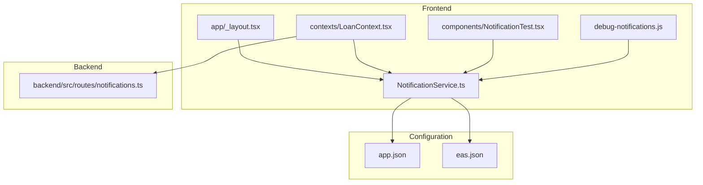
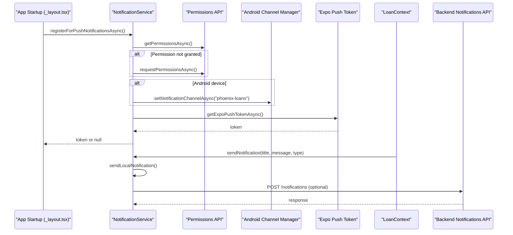
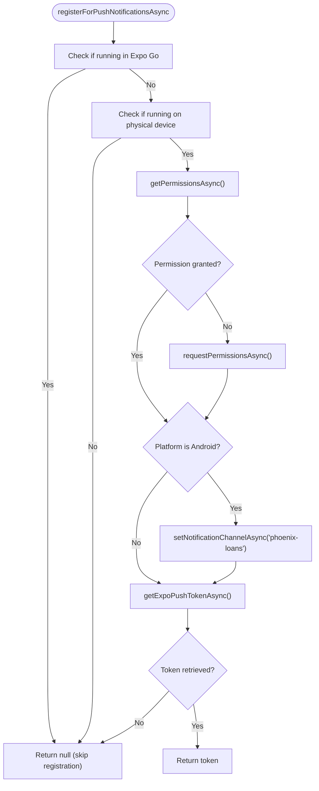
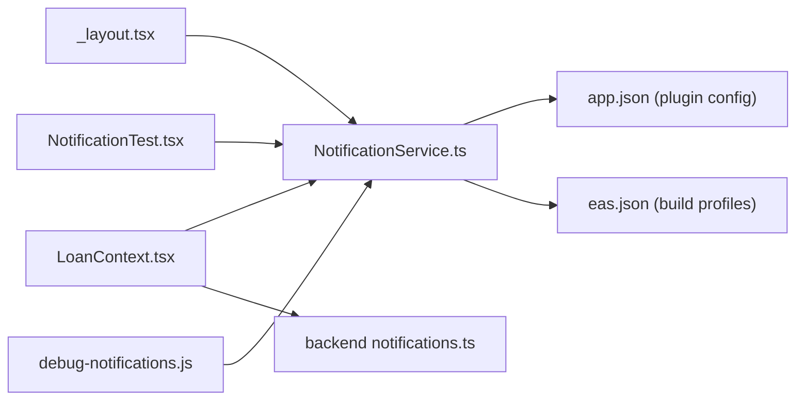

# Push Notification Setup

<cite>
**Referenced Files in This Document**
- [PUSH_NOTIFICATIONS_SETUP.md](file://PUSH_NOTIFICATIONS_SETUP.md)
- [NotificationService.ts](file://services/NotificationService.ts)
- [app.json](file://app.json)
- [eas.json](file://eas.json)
- [_layout.tsx](file://app/_layout.tsx)
- [LoanContext.tsx](file://contexts/LoanContext.tsx)
- [NotificationTest.tsx](file://components/NotificationTest.tsx)
- [debug-notifications.js](file://debug-notifications.js)
- [notifications.ts](file://backend/src/routes/norifications.ts)
- [README.md](file://README.md)
</cite>

## Table of Contents
1. [Introduction](#introduction)
2. [Project Structure](#project-structure)
3. [Core Components](#core-components)
4. [Architecture Overview](#architecture-overview)
5. [Detailed Component Analysis](#detailed-component-analysis)
6. [Dependency Analysis](#dependency-analysis)
7. [Performance Considerations](#performance-considerations)
8. [Troubleshooting Guide](#troubleshooting-guide)
9. [Conclusion](#conclusion)
10. [Appendices](#appendices)

## Introduction
This document explains how push notifications are configured and used in the Phoenix Loan application. It covers the complete setup process, including Expo push token registration, device permission handling, platform-specific configurations for iOS and Android, and the detection of Expo Go versus development builds. It also details Android notification channels, permission request flows, fallback mechanisms, and step-by-step setup instructions with troubleshooting guidance for common issues.

## Project Structure
The push notification system spans several parts of the project:
- Frontend service module that handles permission requests, token retrieval, Android channel creation, and local notifications
- Application configuration files that define plugin settings and project identifiers
- Application lifecycle hooks that initialize push registration and foreground listeners
- Business logic that triggers notifications and persists them to the backend
- Backend routes that store and manage notifications

**Diagram sources**
- [NotificationService.ts:1-135](file://services/NotificationService.ts#L1-L135)
- [_layout.tsx:13-61](file://app/_layout.tsx#L13-L61)
- [LoanContext.tsx:183-196](file://contexts/LoanContext.tsx#L183-L196)
- [NotificationTest.tsx:3-28](file://components/NotificationTest.tsx#L3-L28)
- [debug-notifications.js:1-32](file://debug-notifications.js#L1-L32)
- [app.json:35-62](file://app.json#L35-L62)
- [eas.json:6-17](file://eas.json#L6-L17)
- [notifications.ts:72-90](file://backend/src/routes/notifications.ts#L72-L90)

**Section sources**
- [NotificationService.ts:1-135](file://services/NotificationService.ts#L1-L135)
- [app.json:35-62](file://app.json#L35-L62)
- [eas.json:6-17](file://eas.json#L6-L17)
- [_layout.tsx:13-61](file://app/_layout.tsx#L13-L61)
- [LoanContext.tsx:183-196](file://contexts/LoanContext.tsx#L183-L196)
- [NotificationTest.tsx:3-28](file://components/NotificationTest.tsx#L3-L28)
- [debug-notifications.js:1-32](file://debug-notifications.js#L1-L32)
- [notifications.ts:72-90](file://backend/src/routes/notifications.ts#L72-L90)

## Core Components
- NotificationService: Centralizes push token registration, permission handling, Android channel setup, local notifications, and backend posting
- app.json: Declares the Expo Notifications plugin with project identifiers and default channel configuration
- eas.json: Defines build profiles for development, preview, and production
- _layout.tsx: Initializes push registration and foreground notification listeners during app startup
- LoanContext: Triggers notifications for business events and persists them to the backend
- NotificationTest: Provides a UI button to quickly test local notifications
- debug-notifications.js: Standalone script to verify Expo Go detection and schedule a local notification

Key responsibilities:
- Detect Expo Go vs development builds and conditionally skip push token registration
- Request and validate notification permissions
- Create Android notification channels with custom vibration and sound
- Retrieve Expo push tokens for remote delivery
- Send local notifications immediately and persist to backend
- Fallback gracefully when backend is unavailable

**Section sources**
- [NotificationService.ts:9-69](file://services/NotificationService.ts#L9-L69)
- [app.json:52-61](file://app.json#L52-L61)
- [eas.json:6-17](file://eas.json#L6-L17)
- [_layout.tsx:51-61](file://app/_layout.tsx#L51-L61)
- [LoanContext.tsx:183-196](file://contexts/LoanContext.tsx#L183-L196)
- [NotificationTest.tsx:5-28](file://components/NotificationTest.tsx#L5-L28)
- [debug-notifications.js:4-29](file://debug-notifications.js#L4-L29)

## Architecture Overview
The push notification architecture integrates frontend registration and scheduling with backend persistence and retrieval.

**Diagram sources**
- [_layout.tsx:51-61](file://app/_layout.tsx#L51-L61)
- [NotificationService.ts:26-69](file://services/NotificationService.ts#L26-L69)
- [LoanContext.tsx:183-196](file://contexts/LoanContext.tsx#L183-L196)
- [notifications.ts:72-90](file://backend/src/routes/notifications.ts#L72-L90)

## Detailed Component Analysis

### NotificationService
Responsibilities:
- Detects whether the app runs in Expo Go and skips push token registration accordingly
- Requests notification permissions and validates the result
- Creates Android notification channels with high importance, vibration pattern, sound, and LED color
- Retrieves an Expo push token for remote delivery
- Sends local notifications immediately
- Posts notifications to the backend and logs outcomes

Implementation highlights:
- Foreground notification handler configuration is applied only outside Expo Go
- Android channel named "phoenix-loans" is created with MAX importance and custom settings
- Token retrieval is wrapped in a try-catch to return null on failure
- Local notifications bypass permission checks and are scheduled immediately

**Diagram sources**
- [NotificationService.ts:26-69](file://services/NotificationService.ts#L26-L69)

**Section sources**
- [NotificationService.ts:9-69](file://services/NotificationService.ts#L9-L69)

### app.json Plugin Configuration
The Notifications plugin defines:
- Icon and color for notifications
- Default channel name
- Empty sounds array
- Project identifiers for both app and EAS builds

Important note:
- The file contains placeholder project IDs that must be replaced with real values before building

**Section sources**
- [app.json:52-61](file://app.json#L52-L61)
- [PUSH_NOTIFICATIONS_SETUP.md:3-13](file://PUSH_NOTIFICATIONS_SETUP.md#L3-L13)

### eas.json Build Profiles
Build profiles:
- development: enables development client and internal distribution
- preview: internal distribution
- production: auto-incremented versioning

These profiles support generating development builds that include push notification capabilities.

**Section sources**
- [eas.json:6-17](file://eas.json#L6-L17)

### Application Initialization and Listeners
During app startup:
- Push registration is invoked once
- A foreground notification listener logs received notifications

This ensures the app can react to incoming notifications while in the foreground.

**Section sources**
- [_layout.tsx:51-61](file://app/_layout.tsx#L51-L61)

### Business Logic Integration
LoanContext triggers notifications for key events (e.g., application submitted, payment proof received) and:
- Immediately sends a local notification
- Attempts to persist the notification to the backend
- Updates local state regardless of backend outcome

This provides immediate feedback and graceful fallback when the backend is unavailable.

**Section sources**
- [LoanContext.tsx:183-196](file://contexts/LoanContext.tsx#L183-L196)

### UI Test Component
NotificationTest provides a simple button to trigger a local notification, useful for quick verification during development.

**Section sources**
- [NotificationTest.tsx:5-28](file://components/NotificationTest.tsx#L5-L28)

### Debug Script
debug-notifications.js demonstrates:
- How to detect Expo Go via app ownership
- How to schedule a local notification for immediate testing

**Section sources**
- [debug-notifications.js:4-29](file://debug-notifications.js#L4-L29)

## Dependency Analysis
The following diagram shows how components depend on each other and external systems.

**Diagram sources**
- [_layout.tsx:13-61](file://app/_layout.tsx#L13-L61)
- [LoanContext.tsx:183-196](file://contexts/LoanContext.tsx#L183-L196)
- [NotificationTest.tsx:3-28](file://components/NotificationTest.tsx#L3-L28)
- [debug-notifications.js:1-32](file://debug-notifications.js#L1-L32)
- [NotificationService.ts:1-135](file://services/NotificationService.ts#L1-L135)
- [app.json:35-62](file://app.json#L35-L62)
- [eas.json:6-17](file://eas.json#L6-L17)
- [notifications.ts:72-90](file://backend/src/routes/notifications.ts#L72-L90)

**Section sources**
- [_layout.tsx:13-61](file://app/_layout.tsx#L13-L61)
- [LoanContext.tsx:183-196](file://contexts/LoanContext.tsx#L183-L196)
- [NotificationTest.tsx:3-28](file://components/NotificationTest.tsx#L3-L28)
- [debug-notifications.js:1-32](file://debug-notifications.js#L1-L32)
- [NotificationService.ts:1-135](file://services/NotificationService.ts#L1-L135)
- [app.json:35-62](file://app.json#L35-L62)
- [eas.json:6-17](file://eas.json#L6-L17)
- [notifications.ts:72-90](file://backend/src/routes/notifications.ts#L72-L90)

## Performance Considerations
- Local notifications are immediate and do not require network connectivity
- Backend persistence is best-effort; the app continues to show local notifications even if the backend fails
- Android channel configuration is performed once per session and does not impact runtime performance significantly
- Token retrieval is a single asynchronous operation; caching the token after successful retrieval can reduce redundant calls

## Troubleshooting Guide
Common issues and resolutions:
- Push notifications disabled in Expo Go
  - Cause: Remote push tokens are not supported in Expo Go
  - Resolution: Build a development client using EAS and install on a physical device
  - Evidence: Conditional skip of registration and logging in the service module
  - Reference: [PUSH_NOTIFICATIONS_SETUP.md:17-20](file://PUSH_NOTIFICATIONS_SETUP.md#L17-L20), [NotificationService.ts:27-31](file://services/NotificationService.ts#L27-L31)

- No push token returned
  - Cause: Permissions denied, running in Expo Go, or token retrieval failure
  - Resolution: Verify permissions, ensure device mode, and check network connectivity
  - Reference: [NotificationService.ts:46-49](file://services/NotificationService.ts#L46-L49), [NotificationService.ts:65-68](file://services/NotificationService.ts#L65-L68)

- Android notifications not appearing
  - Cause: Missing or incorrect notification channel configuration
  - Resolution: Confirm channel creation for "phoenix-loans" and verify importance level
  - Reference: [NotificationService.ts:51-60](file://services/NotificationService.ts#L51-L60)

- Backend persistence failures
  - Cause: Backend not running or network issues
  - Resolution: Start backend server and retry; local notifications will still work
  - Reference: [PUSH_NOTIFICATIONS_SETUP.md:43-44](file://PUSH_NOTIFICATIONS_SETUP.md#L43-L44), [LoanContext.tsx:183-196](file://contexts/LoanContext.tsx#L183-L196)

- Expo Go detection verification
  - Use the debug script to confirm app ownership and schedule a local notification
  - Reference: [debug-notifications.js:4-29](file://debug-notifications.js#L4-L29)

- Project ID placeholders
  - Replace placeholder project IDs in app.json with your actual Expo project IDs
  - Reference: [PUSH_NOTIFICATIONS_SETUP.md:3-13](file://PUSH_NOTIFICATIONS_SETUP.md#L3-L13), [app.json:59-73](file://app.json#L59-L73)

**Section sources**
- [PUSH_NOTIFICATIONS_SETUP.md:17-20](file://PUSH_NOTIFICATIONS_SETUP.md#L17-L20)
- [PUSH_NOTIFICATIONS_SETUP.md:43-44](file://PUSH_NOTIFICATIONS_SETUP.md#L43-L44)
- [NotificationService.ts:27-31](file://services/NotificationService.ts#L27-L31)
- [NotificationService.ts:46-49](file://services/NotificationService.ts#L46-L49)
- [NotificationService.ts:51-60](file://services/NotificationService.ts#L51-L60)
- [NotificationService.ts:65-68](file://services/NotificationService.ts#L65-L68)
- [debug-notifications.js:4-29](file://debug-notifications.js#L4-L29)
- [app.json:59-73](file://app.json#L59-L73)

## Conclusion
The Phoenix Loan application implements a robust push notification system that:
- Detects and adapts to the runtime environment (Expo Go vs development builds)
- Requests and validates permissions
- Configures Android channels for optimal user experience
- Retrieves push tokens for remote delivery
- Provides immediate local notifications and resilient backend persistence

By following the step-by-step setup instructions and troubleshooting guidance, teams can confidently deploy push notifications across iOS and Android devices.

## Appendices

### Step-by-Step Setup Instructions
1. Obtain your Expo project ID and replace placeholders in app.json
   - Reference: [PUSH_NOTIFICATIONS_SETUP.md:7-13](file://PUSH_NOTIFICATIONS_SETUP.md#L7-L13), [app.json:59-73](file://app.json#L59-L73)

2. Install EAS CLI and configure your project
   - Reference: [PUSH_NOTIFICATIONS_SETUP.md:26-38](file://PUSH_NOTIFICATIONS_SETUP.md#L26-L38)

3. Build a development client for testing
   - Reference: [eas.json:6-17](file://eas.json#L6-L17)

4. Verify local notifications in Expo Go
   - Reference: [PUSH_NOTIFICATIONS_SETUP.md:42-43](file://PUSH_NOTIFICATIONS_SETUP.md#L42-L43), [debug-notifications.js:11-29](file://debug-notifications.js#L11-L29)

5. Test backend integration
   - Reference: [README.md:189-204](file://README.md#L189-L204), [notifications.ts:72-90](file://backend/src/routes/notifications.ts#L72-L90)

6. Confirm Android channel configuration
   - Reference: [NotificationService.ts:51-60](file://services/NotificationService.ts#L51-L60)

7. Validate permission handling and token retrieval
   - Reference: [NotificationService.ts:38-49](file://services/NotificationService.ts#L38-L49), [NotificationService.ts:62-68](file://services/NotificationService.ts#L62-L68)

### Platform Differences and Requirements
- Expo Go limitations: Remote push tokens are not supported; use development builds on physical devices
  - Reference: [PUSH_NOTIFICATIONS_SETUP.md:17-20](file://PUSH_NOTIFICATIONS_SETUP.md#L17-L20), [NotificationService.ts:27-31](file://services/NotificationService.ts#L27-L31)

- Android channel customization: High importance, vibration pattern, sound, and LED color are configured
  - Reference: [NotificationService.ts:51-60](file://services/NotificationService.ts#L51-L60)

- iOS configuration: Defined in app.json under ios bundle identifier and Info.plist settings
  - Reference: [app.json:16-22](file://app.json#L16-L22)

### Security Considerations for Production
- Use development builds for push token registration and remote delivery
  - Reference: [PUSH_NOTIFICATIONS_SETUP.md:22-38](file://PUSH_NOTIFICATIONS_SETUP.md#L22-L38)

- Ensure backend endpoints are protected and use secure communication
  - Reference: [README.md:246-248](file://README.md#L246-L248), [notifications.ts:72-90](file://backend/src/routes/notifications.ts#L72-L90)

- Validate user identity headers when interacting with backend routes
  - Reference: [LoanContext.tsx:288-308](file://contexts/LoanContext.tsx#L288-L308), [notifications.ts:9-33](file://backend/src/routes/notifications.ts#L9-L33)