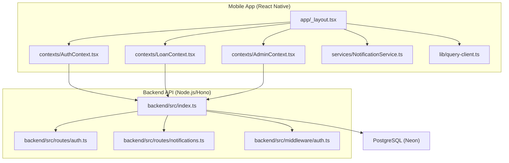
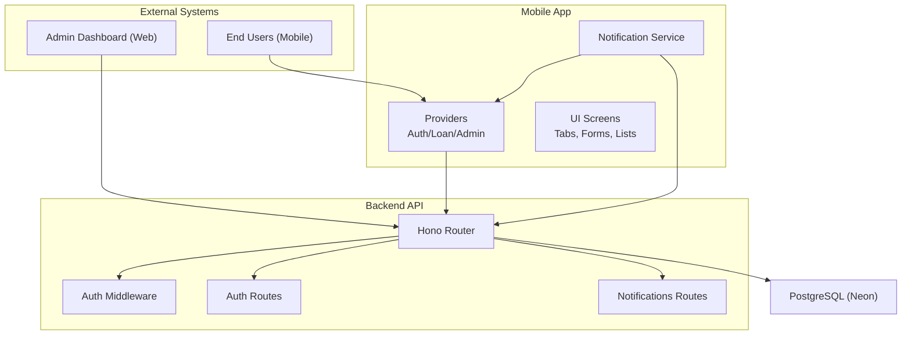
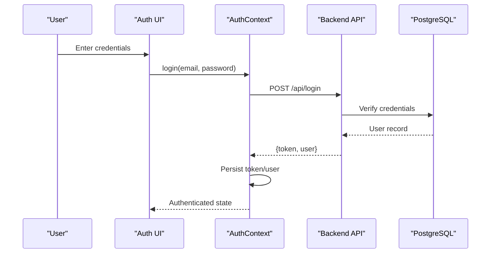
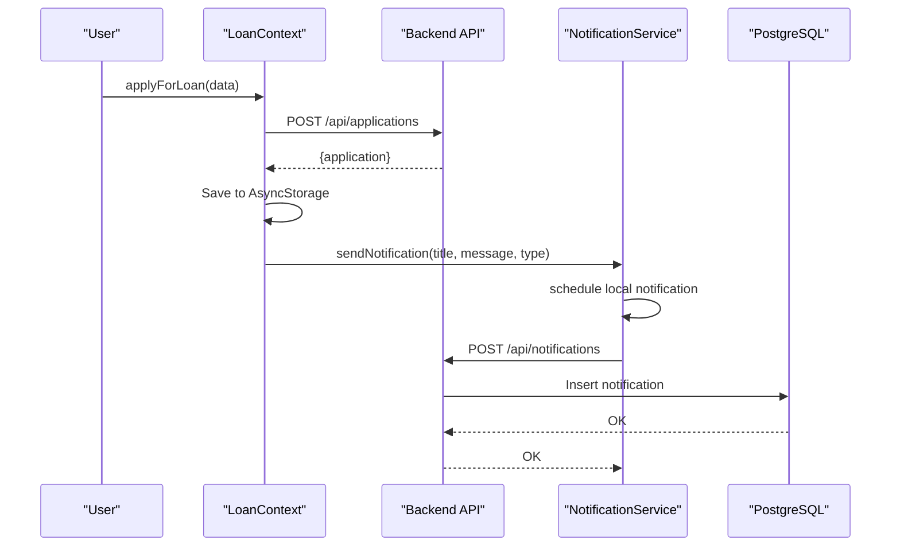
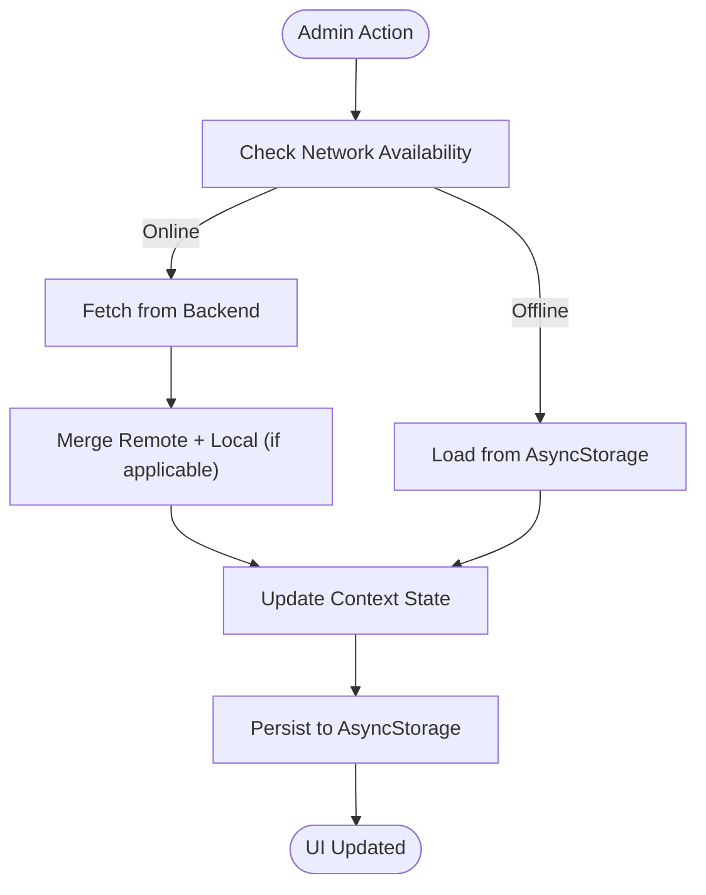
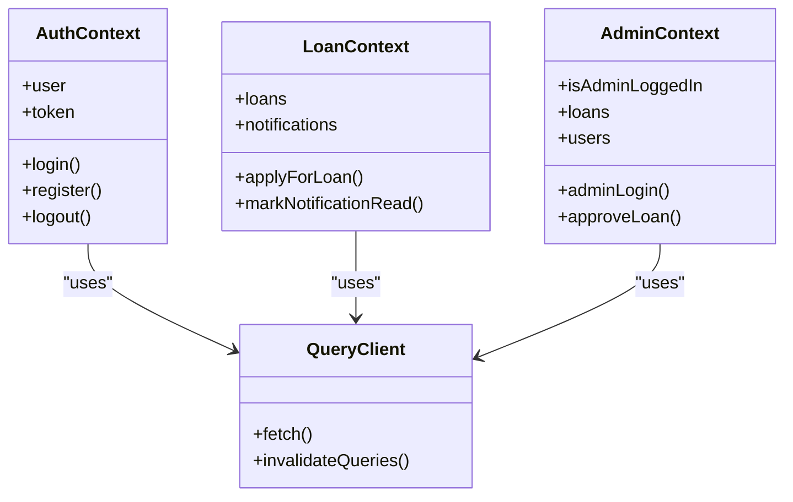
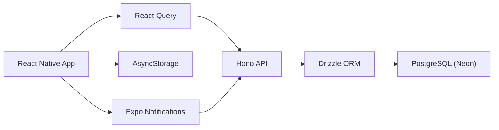
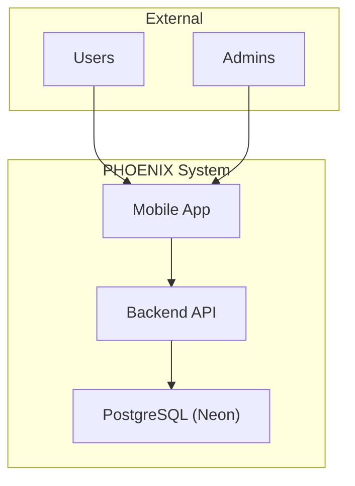

# Architecture Overview

<cite>
**Referenced Files in This Document**
- [package.json](file://package.json)
- [backend/package.json](file://backend/package.json)
- [app.json](file://app.json)
- [README.md](file://README.md)
- [backend/README.md](file://backend/README.md)
- [contexts/AuthContext.tsx](file://contexts/AuthContext.tsx)
- [contexts/AdminContext.tsx](file://contexts/AdminContext.tsx)
- [contexts/LoanContext.tsx](file://contexts/LoanContext.tsx)
- [lib/query-client.ts](file://lib/query-client.ts)
- [backend/src/index.ts](file://backend/src/index.ts)
- [backend/src/routes/auth.ts](file://backend/src/routes/auth.ts)
- [backend/src/routes/notifications.ts](file://backend/src/routes/notifications.ts)
- [services/NotificationService.ts](file://services/NotificationService.ts)
- [backend/src/middleware/auth.ts](file://backend/src/middleware/auth.ts)
- [app/_layout.tsx](file://app/_layout.tsx)
</cite>

## Table of Contents
1. [Introduction](#introduction)
2. [Project Structure](#project-structure)
3. [Core Components](#core-components)
4. [Architecture Overview](#architecture-overview)
5. [Detailed Component Analysis](#detailed-component-analysis)
6. [Dependency Analysis](#dependency-analysis)
7. [Performance Considerations](#performance-considerations)
8. [Troubleshooting Guide](#troubleshooting-guide)
9. [Conclusion](#conclusion)
10. [Appendices](#appendices)

## Introduction
This document presents the architecture of the PHOENIX loan management application. The system consists of:
- A React Native mobile application (Expo Router) with a mobile-first design
- A Node.js backend API built with Hono and Drizzle ORM
- A PostgreSQL database (Neon) for persistence
- A real-time notification system integrating Expo push notifications and backend storage
- Provider pattern using React Context for state management across the frontend
- Offline-first caching with AsyncStorage for resilience and performance

The architecture emphasizes:
- Clean separation of concerns between frontend and backend
- Scalable microservice-friendly routing and middleware
- Robust authentication and authorization
- Seamless user experience through local caching and push notifications

## Project Structure
The repository is organized into:
- Mobile app: app/, contexts/, services/, components/, constants/, shared/
- Backend API: backend/src/, backend/drizzle/, backend/*.sql
- Shared infrastructure: lib/, scripts/, server/

**Diagram sources**
- [app/_layout.tsx:1-83](file://app/_layout.tsx#L1-L83)
- [contexts/AuthContext.tsx:1-135](file://contexts/AuthContext.tsx#L1-L135)
- [contexts/LoanContext.tsx:1-336](file://contexts/LoanContext.tsx#L1-L336)
- [contexts/AdminContext.tsx:1-528](file://contexts/AdminContext.tsx#L1-L528)
- [services/NotificationService.ts:1-135](file://services/NotificationService.ts#L1-L135)
- [lib/query-client.ts:1-81](file://lib/query-client.ts#L1-L81)
- [backend/src/index.ts:1-76](file://backend/src/index.ts#L1-L76)
- [backend/src/routes/auth.ts:1-146](file://backend/src/routes/auth.ts#L1-L146)
- [backend/src/routes/notifications.ts:1-106](file://backend/src/routes/notifications.ts#L1-L106)
- [backend/src/middleware/auth.ts:1-48](file://backend/src/middleware/auth.ts#L1-L48)

**Section sources**
- [package.json:1-84](file://package.json#L1-L84)
- [backend/package.json:1-46](file://backend/package.json#L1-L46)
- [app.json:1-77](file://app.json#L1-L77)
- [README.md:1-348](file://README.md#L1-L348)
- [backend/README.md:1-176](file://backend/README.md#L1-L176)

## Core Components
- React Native application bootstrap and routing:
  - Root layout composes providers and navigation stacks.
  - Providers encapsulate state and data flows for authentication, loans, and admin.
- Context providers:
  - AuthContext: handles login, registration, token persistence, and user state.
  - LoanContext: manages loan lifecycle, notifications, and offline caching.
  - AdminContext: centralizes admin operations, settings, and offline data fallback.
- Backend API:
  - Hono-based routes for authentication, notifications, users, loans, applications, and admin.
  - Middleware for JWT-based authentication and role checks.
- Notification service:
  - Integrates Expo push notifications and persists events to the backend.
- Query client:
  - Centralized API requests with error handling and controlled retries.

**Section sources**
- [app/_layout.tsx:1-83](file://app/_layout.tsx#L1-L83)
- [contexts/AuthContext.tsx:1-135](file://contexts/AuthContext.tsx#L1-L135)
- [contexts/LoanContext.tsx:1-336](file://contexts/LoanContext.tsx#L1-L336)
- [contexts/AdminContext.tsx:1-528](file://contexts/AdminContext.tsx#L1-L528)
- [services/NotificationService.ts:1-135](file://services/NotificationService.ts#L1-L135)
- [lib/query-client.ts:1-81](file://lib/query-client.ts#L1-L81)
- [backend/src/index.ts:1-76](file://backend/src/index.ts#L1-L76)
- [backend/src/routes/auth.ts:1-146](file://backend/src/routes/auth.ts#L1-L146)
- [backend/src/routes/notifications.ts:1-106](file://backend/src/routes/notifications.ts#L1-L106)
- [backend/src/middleware/auth.ts:1-48](file://backend/src/middleware/auth.ts#L1-L48)

## Architecture Overview
The system follows a client-server model with a React Native mobile client and a Node.js backend. The frontend uses React Context providers to manage state and integrates with the backend via REST endpoints. The backend enforces authentication and authorization and persists data to a PostgreSQL database.

**Diagram sources**
- [app/_layout.tsx:1-83](file://app/_layout.tsx#L1-L83)
- [contexts/AuthContext.tsx:1-135](file://contexts/AuthContext.tsx#L1-L135)
- [contexts/LoanContext.tsx:1-336](file://contexts/LoanContext.tsx#L1-L336)
- [contexts/AdminContext.tsx:1-528](file://contexts/AdminContext.tsx#L1-L528)
- [services/NotificationService.ts:1-135](file://services/NotificationService.ts#L1-L135)
- [backend/src/index.ts:1-76](file://backend/src/index.ts#L1-L76)
- [backend/src/routes/auth.ts:1-146](file://backend/src/routes/auth.ts#L1-L146)
- [backend/src/routes/notifications.ts:1-106](file://backend/src/routes/notifications.ts#L1-L106)
- [backend/src/middleware/auth.ts:1-48](file://backend/src/middleware/auth.ts#L1-L48)

## Detailed Component Analysis

### Authentication and Authorization
- Frontend:
  - AuthContext performs login and registration against the backend and stores tokens and user data in AsyncStorage.
  - UI screens are protected by requiring an authenticated user context.
- Backend:
  - JWT-based authentication with bcrypt for password hashing.
  - Middleware validates tokens and sets user context variables; admin middleware restricts endpoints.

**Diagram sources**
- [contexts/AuthContext.tsx:56-112](file://contexts/AuthContext.tsx#L56-L112)
- [backend/src/routes/auth.ts:96-143](file://backend/src/routes/auth.ts#L96-L143)
- [backend/src/middleware/auth.ts:10-36](file://backend/src/middleware/auth.ts#L10-L36)

**Section sources**
- [contexts/AuthContext.tsx:1-135](file://contexts/AuthContext.tsx#L1-L135)
- [backend/src/routes/auth.ts:1-146](file://backend/src/routes/auth.ts#L1-L146)
- [backend/src/middleware/auth.ts:1-48](file://backend/src/middleware/auth.ts#L1-L48)

### Loan Lifecycle and Notifications
- Frontend:
  - LoanContext orchestrates loan applications, status updates, repayment proof uploads, and notification management.
  - Uses AsyncStorage for offline-first caching and immediate UI feedback.
- Backend:
  - Notifications endpoints support fetching, marking read, and posting notifications per user.
  - NotificationService integrates Expo push notifications and persists events to the backend.

**Diagram sources**
- [contexts/LoanContext.tsx:198-261](file://contexts/LoanContext.tsx#L198-L261)
- [services/NotificationService.ts:116-134](file://services/NotificationService.ts#L116-L134)
- [backend/src/routes/notifications.ts:71-90](file://backend/src/routes/notifications.ts#L71-L90)

**Section sources**
- [contexts/LoanContext.tsx:1-336](file://contexts/LoanContext.tsx#L1-L336)
- [services/NotificationService.ts:1-135](file://services/NotificationService.ts#L1-L135)
- [backend/src/routes/notifications.ts:1-106](file://backend/src/routes/notifications.ts#L1-L106)

### Admin Dashboard and Offline Data
- Frontend:
  - AdminContext centralizes admin actions (approve/reject/disburse/complete), settings, and analytics.
  - Implements offline-first data loading with AsyncStorage fallback and refresh mechanisms.
- Backend:
  - Admin routes under /api/admin expose administrative operations and settings management.

**Diagram sources**
- [contexts/AdminContext.tsx:199-285](file://contexts/AdminContext.tsx#L199-L285)

**Section sources**
- [contexts/AdminContext.tsx:1-528](file://contexts/AdminContext.tsx#L1-L528)

### Provider Pattern and Data Flows
- Providers are composed in the root layout to establish global state:
  - AdminProvider -> AuthProvider -> LoanProvider
- Each provider encapsulates:
  - State initialization and persistence
  - API interactions and error handling
  - Offline caching and fallback logic
- QueryClient centralizes network requests and error handling for optimistic UI patterns.

**Diagram sources**
- [contexts/AuthContext.tsx:1-135](file://contexts/AuthContext.tsx#L1-L135)
- [contexts/LoanContext.tsx:1-336](file://contexts/LoanContext.tsx#L1-L336)
- [contexts/AdminContext.tsx:1-528](file://contexts/AdminContext.tsx#L1-L528)
- [lib/query-client.ts:1-81](file://lib/query-client.ts#L1-L81)

**Section sources**
- [app/_layout.tsx:1-83](file://app/_layout.tsx#L1-L83)
- [lib/query-client.ts:1-81](file://lib/query-client.ts#L1-L81)

## Dependency Analysis
- Technology stack decisions:
  - Frontend: React Native with Expo, React Router, React Query for caching, AsyncStorage for offline storage, Expo Notifications for push.
  - Backend: Hono for minimal server, Drizzle ORM with PostgreSQL (Neon), JWT for auth, Zod for validation.
- Integration patterns:
  - REST APIs with explicit routes for auth, loans, applications, users, notifications, and admin.
  - CORS configured for development domains; X-User-Id header for user-scoped operations.
- Data flow architectures:
  - Request-response with optimistic updates and local cache synchronization.
  - Offline-first strategy with AsyncStorage as the single source of truth when online data is unavailable.

**Diagram sources**
- [package.json:22-68](file://package.json#L22-L68)
- [backend/package.json:22-34](file://backend/package.json#L22-L34)
- [lib/query-client.ts:1-81](file://lib/query-client.ts#L1-L81)
- [services/NotificationService.ts:1-135](file://services/NotificationService.ts#L1-L135)
- [backend/src/index.ts:1-76](file://backend/src/index.ts#L1-L76)

**Section sources**
- [package.json:1-84](file://package.json#L1-L84)
- [backend/package.json:1-46](file://backend/package.json#L1-L46)
- [lib/query-client.ts:1-81](file://lib/query-client.ts#L1-L81)
- [services/NotificationService.ts:1-135](file://services/NotificationService.ts#L1-L135)
- [backend/src/index.ts:1-76](file://backend/src/index.ts#L1-L76)

## Performance Considerations
- Mobile app:
  - Startup time optimized; bundle size managed; keyboard and gesture handlers configured for smooth UX.
- Backend API:
  - Lightweight framework (Hono) with middleware for logging and CORS; schema validation with Zod.
- Caching and offline:
  - AsyncStorage used for offline-first behavior; React Query configured to minimize refetches and retries.
- Scalability:
  - PostgreSQL via Neon supports auto-scaling; API endpoints designed for horizontal scaling.

[No sources needed since this section provides general guidance]

## Troubleshooting Guide
- Authentication failures:
  - Verify JWT secret and token validity; ensure Authorization header is present for protected routes.
- CORS errors:
  - Confirm FRONTEND_URL and allowed origins in backend CORS configuration.
- Database connectivity:
  - Validate DATABASE_URL and IP whitelist in Neon dashboard.
- Notifications:
  - On Expo Go, push tokens are not supported; use development builds for push. Local notifications still work.

**Section sources**
- [backend/src/middleware/auth.ts:10-36](file://backend/src/middleware/auth.ts#L10-L36)
- [backend/src/index.ts:21-26](file://backend/src/index.ts#L21-L26)
- [backend/README.md:142-148](file://backend/README.md#L142-L148)
- [services/NotificationService.ts:26-69](file://services/NotificationService.ts#L26-L69)

## Conclusion
PHOENIX demonstrates a cohesive, modern architecture that blends a mobile-first React Native client with a scalable Node.js backend. The provider pattern enables clean state management, while offline-first caching and robust notification systems enhance reliability and user experience. Authentication and authorization are enforced consistently across the stack, and the system is designed for scalability and maintainability.

[No sources needed since this section summarizes without analyzing specific files]

## Appendices

### System Context Diagram

[No sources needed since this diagram shows conceptual workflow, not actual code structure]

### API Endpoint Summary
- Authentication
  - POST /api/register
  - POST /api/login
- Loans
  - GET /api/loans
  - GET /api/loans/my-loans
  - GET /api/loans/:id
  - POST /api/loans
  - PATCH /api/loans/:id/status
- Applications
  - GET /api/applications
  - GET /api/applications/my-applications
  - GET /api/applications/:id
  - POST /api/applications
  - PATCH /api/applications/:id/review
- Users
  - GET /api/users
  - GET /api/users/profile
  - PUT /api/users/profile
  - GET /api/users/:id
- Notifications
  - GET /api/notifications
  - POST /api/notifications
  - PATCH /api/notifications/:id/read
  - PATCH /api/notifications/read-all
  - DELETE /api/notifications/read
- Admin
  - Routes under /api/admin for administrative operations

**Section sources**
- [backend/README.md:72-113](file://backend/README.md#L72-L113)
- [backend/src/routes/auth.ts:33-93](file://backend/src/routes/auth.ts#L33-L93)
- [backend/src/routes/notifications.ts:8-103](file://backend/src/routes/notifications.ts#L8-L103)