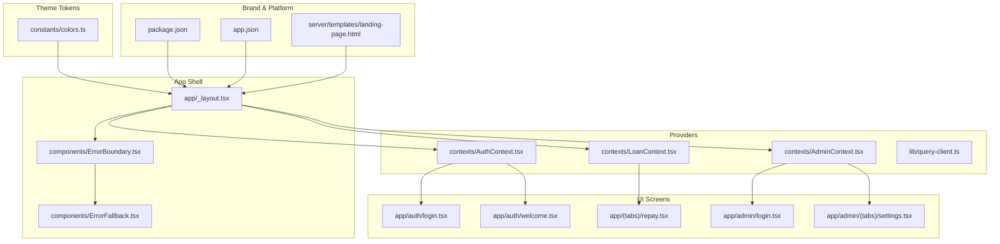
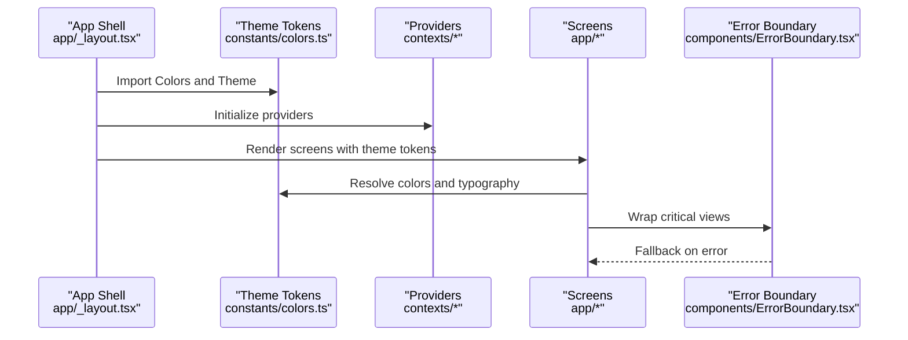
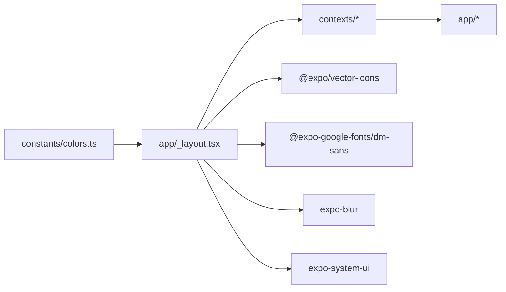

# Design System

<cite>
**Referenced Files in This Document**
- [colors.ts](file://constants/colors.ts)
- [app/_layout.tsx](file://app/_layout.tsx)
- [ErrorBoundary.tsx](file://components/ErrorBoundary.tsx)
- [ErrorFallback.tsx](file://components/ErrorFallback.tsx)
- [AuthContext.tsx](file://contexts/AuthContext.tsx)
- [LoanContext.tsx](file://contexts/LoanContext.tsx)
- [AdminContext.tsx](file://contexts/AdminContext.tsx)
- [query-client.ts](file://lib/query-client.ts)
- [login.tsx (auth)](file://app/auth/login.tsx)
- [login.tsx (admin)](file://app/admin/login.tsx)
- [repay.tsx](file://app/(tabs)/repay.tsx)
- [welcome.tsx](file://app/auth/welcome.tsx)
- [settings.tsx](file://app/admin/(tabs)/settings.tsx)
- [landing-page.html](file://server/templates/landing-page.html)
- [package.json](file://package.json)
- [app.json](file://app.json)
</cite>

## Table of Contents
1. [Introduction](#introduction)
2. [Project Structure](#project-structure)
3. [Core Components](#core-components)
4. [Architecture Overview](#architecture-overview)
5. [Detailed Component Analysis](#detailed-component-analysis)
6. [Dependency Analysis](#dependency-analysis)
7. [Performance Considerations](#performance-considerations)
8. [Troubleshooting Guide](#troubleshooting-guide)
9. [Conclusion](#conclusion)
10. [Appendices](#appendices)

## Introduction
This document defines the PHOENIX design system, covering the color palette, typography hierarchy, design principles, theming, and implementation patterns. It synthesizes the available codebase to provide practical guidance for maintaining visual consistency, accessibility, and responsive behavior across platforms (iOS, Android, Web).

## Project Structure
PHOENIX organizes design tokens and theming primarily through centralized color constants and layout-level providers. Typography is driven by Google Fonts and platform-specific iconography. The app’s theme adapts automatically to system preferences and supports both light and dark modes.

**Diagram sources**
- [colors.ts:1-64](file://constants/colors.ts#L1-L64)
- [app/_layout.tsx:1-83](file://app/_layout.tsx#L1-L83)
- [ErrorBoundary.tsx:1-55](file://components/ErrorBoundary.tsx#L1-L55)
- [ErrorFallback.tsx:1-287](file://components/ErrorFallback.tsx#L1-L287)
- [AuthContext.tsx:1-135](file://contexts/AuthContext.tsx#L1-L135)
- [LoanContext.tsx:1-336](file://contexts/LoanContext.tsx#L1-L336)
- [AdminContext.tsx:1-528](file://contexts/AdminContext.tsx#L1-L528)
- [login.tsx (auth):253-313](file://app/auth/login.tsx#L253-L313)
- [login.tsx (admin):203-305](file://app/admin/login.tsx#L203-L305)
- [repay.tsx](file://app/(tabs)/repay.tsx#L597-L649)
- [welcome.tsx:328-355](file://app/auth/welcome.tsx#L328-L355)
- [settings.tsx](file://app/admin/(tabs)/settings.tsx#L77-L116)
- [package.json:1-84](file://package.json#L1-L84)
- [app.json:1-77](file://app.json#L1-L77)
- [landing-page.html:1-331](file://server/templates/landing-page.html#L1-L331)

**Section sources**
- [colors.ts:1-64](file://constants/colors.ts#L1-L64)
- [app/_layout.tsx:1-83](file://app/_layout.tsx#L1-L83)
- [package.json:1-84](file://package.json#L1-L84)
- [app.json:1-77](file://app.json#L1-L77)

## Core Components
- Color palette: Centralized in a single module with named semantic roles and separate light/dark theme exports.
- Typography: Defined via Google Fonts and used consistently across screens.
- Theming: Automatic light/dark switching via system preference; components adapt using color scheme hooks and theme tokens.
- Accessibility: Error boundaries and fallbacks improve resilience; platform-specific handling ensures compatibility.

**Section sources**
- [colors.ts:1-64](file://constants/colors.ts#L1-L64)
- [app/_layout.tsx:10-14](file://app/_layout.tsx#L10-L14)
- [ErrorFallback.tsx:21-44](file://components/ErrorFallback.tsx#L21-L44)

## Architecture Overview
The design system is consumed at the component level through shared tokens and theme-aware rendering. Providers manage global state and integrate with backend APIs, while the layout orchestrates fonts, splash, and error handling.

**Diagram sources**
- [app/_layout.tsx:1-83](file://app/_layout.tsx#L1-L83)
- [colors.ts:1-64](file://constants/colors.ts#L1-L64)
- [AuthContext.tsx:1-135](file://contexts/AuthContext.tsx#L1-L135)
- [LoanContext.tsx:1-336](file://contexts/LoanContext.tsx#L1-L336)
- [AdminContext.tsx:1-528](file://contexts/AdminContext.tsx#L1-L528)
- [ErrorBoundary.tsx:1-55](file://components/ErrorBoundary.tsx#L1-L55)

## Detailed Component Analysis

### Color Palette and Theming
- Semantic roles: primary, secondary, accent; surface/background/text variants; borders and overlays; status colors (success, warning, error, info); gradients.
- Light and dark theme exports: provide consistent tokens for text, background, tint, and tab icons.
- Admin theme tokens: muted backgrounds, borders, placeholders, and icon states optimized for admin surfaces.

Implementation highlights:
- Centralized palette and theme exports enable consistent usage across components.
- Dark mode tokens ensure readability and contrast on dark surfaces.

Practical usage examples:
- Buttons and inputs adopt accent and text roles for active/inactive states.
- Status indicators use dedicated semantic colors.

Accessibility considerations:
- Contrast ratios should be validated against WCAG AA/AAA thresholds for text and interactive elements.
- Prefer semantic roles over arbitrary colors to maintain consistency under theme switches.

**Section sources**
- [colors.ts:1-64](file://constants/colors.ts#L1-L64)

### Typography Hierarchy
- Font family: DM Sans with weights Regular (400), Medium (500), Bold (700).
- Screen-level usage demonstrates headline/subtitle/body/small text sizes and weights.
- Consistent font selection improves readability and brand identity.

Implementation highlights:
- Typography tokens are applied directly in screen styles to maintain uniformity.
- Platform-specific icon libraries complement text-based UI.

**Section sources**
- [app/_layout.tsx:10-14](file://app/_layout.tsx#L10-L14)
- [login.tsx (auth):253-313](file://app/auth/login.tsx#L253-L313)
- [login.tsx (admin):203-305](file://app/admin/login.tsx#L203-L305)
- [repay.tsx](file://app/(tabs)/repay.tsx#L597-L649)
- [welcome.tsx:328-355](file://app/auth/welcome.tsx#L328-L355)

### Design Principles: Mobile-First, Dark Mode, Responsive Patterns
- Mobile-first: UI components emphasize compact spacing, clear affordances, and icon-driven interactions.
- Dark mode: Automatic switching via system preference; theme tokens adapt backgrounds and text.
- Responsive patterns: Platform-specific handling for tabs and navigation; web receives explicit treatment for stability.

Evidence:
- Automatic theme selection and tab bar styling vary by platform and OS.
- Web requires explicit background and height adjustments for tab bar consistency.

**Section sources**
- [app/_layout.tsx:1-83](file://app/_layout.tsx#L1-L83)
- [ErrorFallback.tsx:21-44](file://components/ErrorFallback.tsx#L21-L44)

### Component Styling Guidelines
- Buttons: Use bold labels with appropriate sizing; leverage gradients or solid fills depending on prominence.
- Inputs: Distinct focus states with accent borders and subtle backgrounds.
- Cards and surfaces: Use card and alt background tokens; maintain consistent border radii and spacing.
- Status and hints: Apply semantic colors and muted tones for clarity without visual noise.

Examples in code:
- Login screen styles demonstrate label, input, divider, and button patterns.
- Repayment screen styles show upload actions, accepted formats, and history cards.
- Admin settings sliders use accent and muted tokens for interactive controls.

**Section sources**
- [login.tsx (auth):253-313](file://app/auth/login.tsx#L253-L313)
- [repay.tsx](file://app/(tabs)/repay.tsx#L597-L649)
- [settings.tsx](file://app/admin/(tabs)/settings.tsx#L77-L116)

### Spacing Systems and Visual Consistency
- Consistent gaps between form fields, rows, and cards.
- Typography scales and line heights support readability across devices.
- Borders and overlays unify depth and hierarchy.

Guidelines:
- Use established tokens for paddings, margins, and radii.
- Maintain consistent baseline grid and alignment.

**Section sources**
- [login.tsx (auth):253-313](file://app/auth/login.tsx#L253-L313)
- [login.tsx (admin):203-305](file://app/admin/login.tsx#L203-L305)
- [repay.tsx](file://app/(tabs)/repay.tsx#L597-L649)

### Brand Guidelines and Customization
- Brand colors: Primary and accent hues define the brand identity.
- Adaptive surfaces: Backgrounds and cards adjust per theme to preserve legibility.
- Admin customization: Dedicated tokens for admin surfaces enable distinct branding within admin flows.

Customization options:
- Adjust semantic roles to reflect brand evolution.
- Extend theme exports to support additional modes or variants.

**Section sources**
- [colors.ts:1-64](file://constants/colors.ts#L1-L64)
- [login.tsx (admin):203-305](file://app/admin/login.tsx#L203-L305)

### Practical Examples Across Screen Sizes and Orientations
- Mobile portrait: Compact forms, stacked elements, and touch-friendly targets.
- Web/desktop: Explicit tab bar height and borders; responsive layouts adapt widths.
- Dark mode: All components invert to dark surfaces with adjusted contrast.

Patterns:
- Use platform checks to tailor UI behavior.
- Maintain consistent typography and spacing across breakpoints.

**Section sources**
- [landing-page.html:247-261](file://server/templates/landing-page.html#L247-L261)
- [landing-page.html:263-328](file://server/templates/landing-page.html#L263-L328)

### Accessibility Compliance and Inclusive Design
- Error boundaries and fallbacks improve resilience and user confidence.
- Platform-specific handling ensures compatibility across iOS, Android, and Web.
- Color tokens support both light and dark modes, aiding users with low vision.

Recommendations:
- Validate color contrast for text and interactive elements against WCAG guidelines.
- Provide sufficient touch target sizes and spacing for motor accessibility.
- Offer alternative text and ARIA attributes where applicable on Web.

**Section sources**
- [ErrorBoundary.tsx:1-55](file://components/ErrorBoundary.tsx#L1-L55)
- [ErrorFallback.tsx:1-287](file://components/ErrorFallback.tsx#L1-L287)
- [app.json:6-9](file://app.json#L6-L9)

## Dependency Analysis
The design system relies on:
- Theme tokens for color and typography.
- Providers for state and API integration.
- Platform packages for icons, blur, and system UI.

**Diagram sources**
- [colors.ts:1-64](file://constants/colors.ts#L1-L64)
- [app/_layout.tsx:1-83](file://app/_layout.tsx#L1-L83)
- [package.json:22-68](file://package.json#L22-L68)

**Section sources**
- [package.json:22-68](file://package.json#L22-L68)
- [app/_layout.tsx:1-83](file://app/_layout.tsx#L1-L83)

## Performance Considerations
- Keep theme computations minimal; reuse memoized values where possible.
- Avoid unnecessary re-renders by deriving styles from stable theme objects.
- Use platform-specific optimizations (e.g., BlurView on iOS) judiciously.

## Troubleshooting Guide
Common issues and resolutions:
- Theme mismatch on Web: Ensure explicit background and tab bar styles for Web.
- Dark mode contrast: Verify semantic tokens meet contrast requirements.
- Error handling: Use the error boundary to gracefully recover from runtime errors.

**Section sources**
- [ErrorBoundary.tsx:1-55](file://components/ErrorBoundary.tsx#L1-L55)
- [ErrorFallback.tsx:1-287](file://components/ErrorFallback.tsx#L1-L287)

## Conclusion
PHOENIX’s design system centers on a coherent color palette, consistent typography, and adaptive theming. By leveraging centralized tokens and provider-driven state, the system remains maintainable and scalable. Extending the design system should prioritize accessibility, responsive behavior, and brand alignment.

## Appendices
- Token reference: See color roles and theme exports for usage guidance.
- Platform notes: Review platform-specific handling for tabs and navigation.

**Section sources**
- [colors.ts:1-64](file://constants/colors.ts#L1-L64)
- [app/_layout.tsx:1-83](file://app/_layout.tsx#L1-L83)