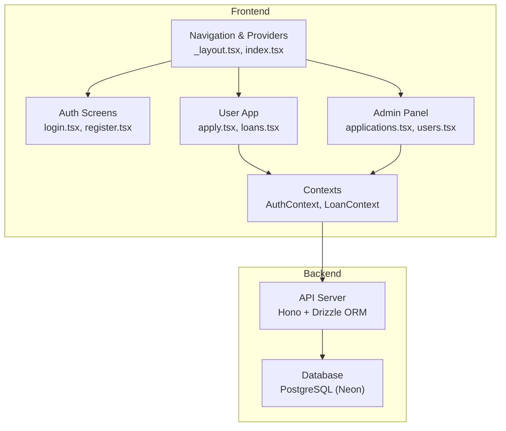
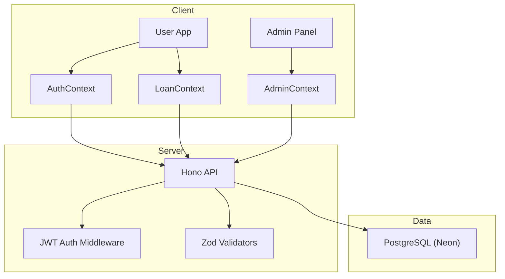
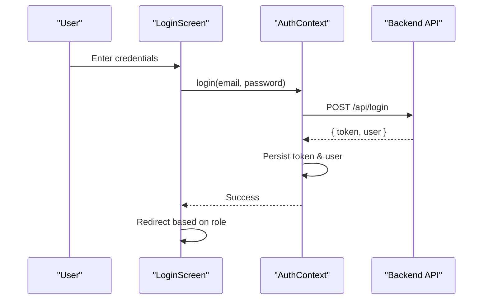
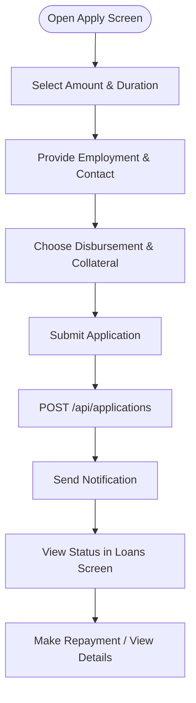
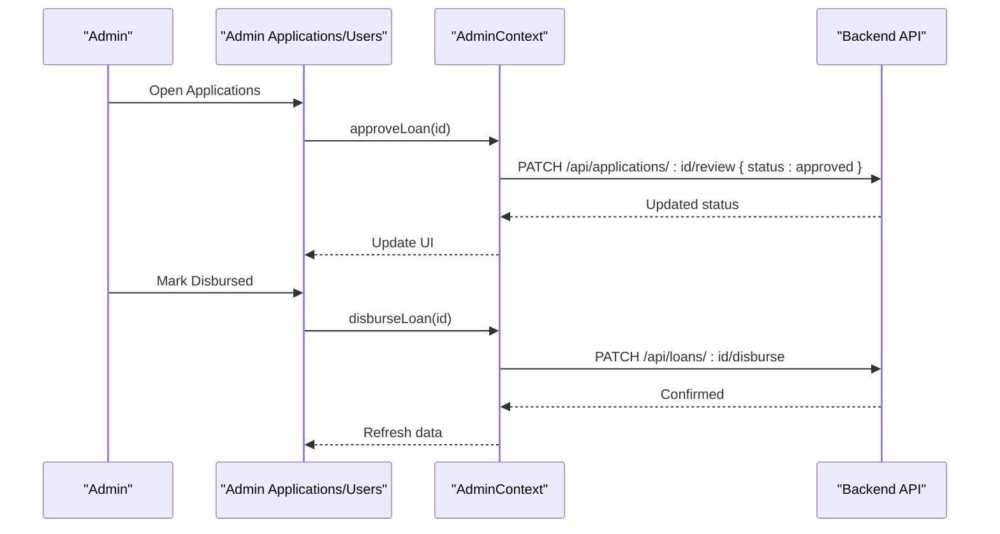
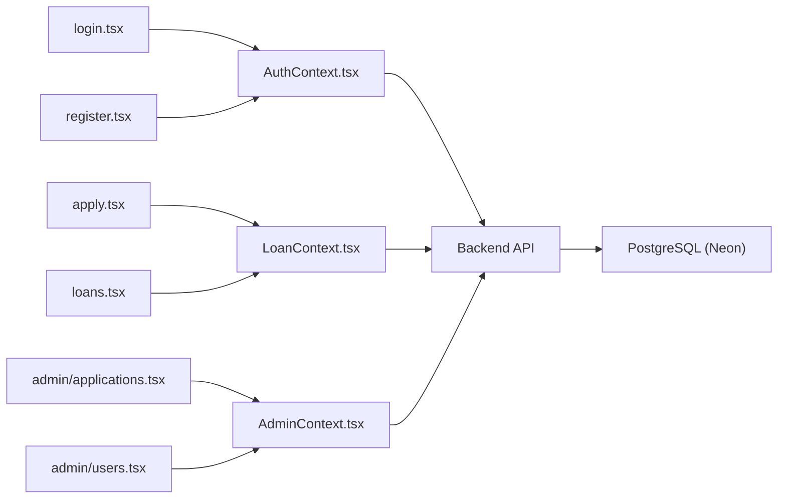

# Introduction and Purpose

<cite>
**Referenced Files in This Document**
- [README.md](file://README.md)
- [app/_layout.tsx](file://app/_layout.tsx)
- [app/index.tsx](file://app/index.tsx)
- [app/auth/login.tsx](file://app/auth/login.tsx)
- [app/auth/register.tsx](file://app/auth/register.tsx)
- [app/(tabs)/apply.tsx](file://app/(tabs)/apply.tsx)
- [app/(tabs)/loans.tsx](file://app/(tabs)/loans.tsx)
- [contexts/LoanContext.tsx](file://contexts/LoanContext.tsx)
- [contexts/AuthContext.tsx](file://contexts/AuthContext.tsx)
- [contexts/AdminContext.tsx](file://contexts/AdminContext.tsx)
- [app/admin/(tabs)/applications.tsx](file://app/admin/(tabs)/applications.tsx)
- [app/admin/(tabs)/users.tsx](file://app/admin/(tabs)/users.tsx)
- [backend/README.md](file://backend/README.md)
</cite>

## Table of Contents
1. [Introduction](#introduction)
2. [Project Structure](#project-structure)
3. [Core Components](#core-components)
4. [Architecture Overview](#architecture-overview)
5. [Detailed Component Analysis](#detailed-component-analysis)
6. [Dependency Analysis](#dependency-analysis)
7. [Performance Considerations](#performance-considerations)
8. [Troubleshooting Guide](#troubleshooting-guide)
9. [Conclusion](#conclusion)

## Introduction
PHOENIX is a modern microfinance loan management application tailored for the Malawian market. Its mission is to transform loan experiences through a beautiful, mobile-first design and rich functionality that brings transparency, accessibility, and convenience to borrowers and administrators alike. Built with React Native and Expo, PHOENIX leverages a secure backend powered by Hono and PostgreSQL to deliver a seamless digital lending ecosystem.

Key goals:
- Financial inclusion: Lower barriers to accessing small personal loans using mobile technology.
- User-centric design: Intuitive, responsive UI with thoughtful interactions and accessibility.
- Operational excellence: Streamlined admin workflows for approvals, monitoring, and user management.
- Security and trust: End-to-end encryption, biometric support, and robust JWT-based authentication.

## Project Structure
At a high level, PHOENIX consists of:
- Frontend (React Native + Expo): Handles user and admin experiences, navigation, and state management.
- Backend (Hono + PostgreSQL): Provides APIs for authentication, loan lifecycle, user management, and notifications.
- Shared contexts: Centralized state for authentication, loan lifecycle, and admin operations.
- Admin panel: Dedicated screens for managing users, reviewing applications, and configuring system settings.

**Diagram sources**
- [app/_layout.tsx:31-82](file://app/_layout.tsx#L31-L82)
- [app/index.tsx:6-22](file://app/index.tsx#L6-L22)
- [app/auth/login.tsx:80-134](file://app/auth/login.tsx#L80-L134)
- [app/auth/register.tsx:178-250](file://app/auth/register.tsx#L178-L250)
- [app/(tabs)/apply.tsx](file://app/(tabs)/apply.tsx#L125-L255)
- [app/(tabs)/loans.tsx](file://app/(tabs)/loans.tsx#L309-L440)
- [contexts/AuthContext.tsx:31-126](file://contexts/AuthContext.tsx#L31-L126)
- [contexts/LoanContext.tsx:82-329](file://contexts/LoanContext.tsx#L82-L329)
- [contexts/AdminContext.tsx:135-521](file://contexts/AdminContext.tsx#L135-L521)
- [app/admin/(tabs)/applications.tsx](file://app/admin/(tabs)/applications.tsx#L155-L327)
- [app/admin/(tabs)/users.tsx](file://app/admin/(tabs)/users.tsx#L278-L398)
- [backend/README.md:1-176](file://backend/README.md#L1-L176)

**Section sources**
- [README.md:1-348](file://README.md#L1-L348)
- [app/_layout.tsx:31-82](file://app/_layout.tsx#L31-L82)
- [app/index.tsx:6-22](file://app/index.tsx#L6-L22)
- [contexts/AuthContext.tsx:31-126](file://contexts/AuthContext.tsx#L31-L126)
- [contexts/LoanContext.tsx:82-329](file://contexts/LoanContext.tsx#L82-L329)
- [contexts/AdminContext.tsx:135-521](file://contexts/AdminContext.tsx#L135-L521)
- [backend/README.md:1-176](file://backend/README.md#L1-L176)

## Core Components
- Authentication and user onboarding:
  - Login and registration flows with validation and animated feedback.
  - Role-aware routing after login (user vs admin).
- Loan lifecycle management:
  - Application wizard with guided steps, instant eligibility checks, and repayment preview.
  - Live tracking of statuses, due dates, and actionable reminders.
- Admin operations:
  - Application review, disbursement, and completion workflows.
  - User management, KYC verification, credit scoring, and blacklisting.
- Notifications:
  - Real-time push notifications for status updates and reminders.

Practical examples:
- A borrower applies for a loan, selects a duration, enters personal details, chooses a disbursement method, and submits. They receive immediate feedback and a status timeline.
- An admin reviews pending applications, approves or rejects them, marks disbursements, and tracks repayment completion.

**Section sources**
- [app/auth/login.tsx:80-134](file://app/auth/login.tsx#L80-L134)
- [app/auth/register.tsx:178-250](file://app/auth/register.tsx#L178-L250)
- [app/(tabs)/apply.tsx](file://app/(tabs)/apply.tsx#L125-L255)
- [app/(tabs)/loans.tsx](file://app/(tabs)/loans.tsx#L309-L440)
- [contexts/LoanContext.tsx:198-261](file://contexts/LoanContext.tsx#L198-L261)
- [contexts/AdminContext.tsx:311-413](file://contexts/AdminContext.tsx#L311-L413)
- [app/admin/(tabs)/applications.tsx](file://app/admin/(tabs)/applications.tsx#L155-L327)
- [app/admin/(tabs)/users.tsx](file://app/admin/(tabs)/users.tsx#L278-L398)

## Architecture Overview
PHOENIX follows a clean separation of concerns:
- Frontend (Expo + React Native) renders UI, manages user sessions, and orchestrates API calls.
- Backend (Hono) exposes REST endpoints secured with JWT and validates requests with Zod.
- Database (PostgreSQL via Neon) stores users, loans, applications, and notifications.
- Contexts encapsulate cross-cutting concerns like authentication, loan state, and admin settings.

**Diagram sources**
- [contexts/AuthContext.tsx:31-126](file://contexts/AuthContext.tsx#L31-L126)
- [contexts/LoanContext.tsx:82-329](file://contexts/LoanContext.tsx#L82-L329)
- [contexts/AdminContext.tsx:135-521](file://contexts/AdminContext.tsx#L135-L521)
- [backend/README.md:150-176](file://backend/README.md#L150-L176)

**Section sources**
- [backend/README.md:1-176](file://backend/README.md#L1-L176)
- [contexts/AuthContext.tsx:31-126](file://contexts/AuthContext.tsx#L31-L126)
- [contexts/LoanContext.tsx:82-329](file://contexts/LoanContext.tsx#L82-L329)
- [contexts/AdminContext.tsx:135-521](file://contexts/AdminContext.tsx#L135-L521)

## Detailed Component Analysis

### User Authentication and Onboarding
- Login and registration screens enforce validation, provide animated feedback, and persist tokens and user data locally.
- Role detection redirects users to either the main tabs or admin tabs upon successful login.

**Diagram sources**
- [app/auth/login.tsx:101-134](file://app/auth/login.tsx#L101-L134)
- [contexts/AuthContext.tsx:56-79](file://contexts/AuthContext.tsx#L56-L79)
- [backend/README.md:74-76](file://backend/README.md#L74-L76)

**Section sources**
- [app/auth/login.tsx:80-134](file://app/auth/login.tsx#L80-L134)
- [app/auth/register.tsx:178-250](file://app/auth/register.tsx#L178-L250)
- [contexts/AuthContext.tsx:31-126](file://contexts/AuthContext.tsx#L31-L126)
- [backend/README.md:74-96](file://backend/README.md#L74-L96)

### Loan Application and Tracking
- The application wizard guides users through amount selection, duration, personal details, and disbursement preferences.
- LoanContext handles backend submissions, local caching, and real-time status updates with notifications.

**Diagram sources**
- [app/(tabs)/apply.tsx](file://app/(tabs)/apply.tsx#L125-L255)
- [contexts/LoanContext.tsx:198-261](file://contexts/LoanContext.tsx#L198-L261)
- [app/(tabs)/loans.tsx](file://app/(tabs)/loans.tsx#L309-L440)

**Section sources**
- [app/(tabs)/apply.tsx](file://app/(tabs)/apply.tsx#L125-L255)
- [contexts/LoanContext.tsx:198-261](file://contexts/LoanContext.tsx#L198-L261)
- [app/(tabs)/loans.tsx](file://app/(tabs)/loans.tsx#L309-L440)

### Admin Operations and Workflows
- Admins can review applications, approve/reject, mark disbursements, and finalize repayments.
- User management includes KYC verification, credit score adjustments, loan limit changes, and blacklisting.

**Diagram sources**
- [app/admin/(tabs)/applications.tsx](file://app/admin/(tabs)/applications.tsx#L155-L327)
- [contexts/AdminContext.tsx:311-386](file://contexts/AdminContext.tsx#L311-L386)
- [backend/README.md:85-90](file://backend/README.md#L85-L90)

**Section sources**
- [app/admin/(tabs)/applications.tsx](file://app/admin/(tabs)/applications.tsx#L155-L327)
- [contexts/AdminContext.tsx:311-386](file://contexts/AdminContext.tsx#L311-L386)
- [backend/README.md:72-96](file://backend/README.md#L72-L96)

## Dependency Analysis
- Frontend depends on:
  - Navigation and providers for routing and global state.
  - Contexts for authentication, loan lifecycle, and admin operations.
  - Backend APIs for user actions and admin tasks.
- Backend depends on:
  - Hono for routing and middleware.
  - Drizzle ORM for schema and queries.
  - Zod for input validation.
  - PostgreSQL (Neon) for persistence.

**Diagram sources**
- [contexts/AuthContext.tsx:31-126](file://contexts/AuthContext.tsx#L31-L126)
- [contexts/LoanContext.tsx:82-329](file://contexts/LoanContext.tsx#L82-L329)
- [contexts/AdminContext.tsx:135-521](file://contexts/AdminContext.tsx#L135-L521)
- [app/auth/login.tsx:80-134](file://app/auth/login.tsx#L80-L134)
- [app/auth/register.tsx:178-250](file://app/auth/register.tsx#L178-L250)
- [app/(tabs)/apply.tsx](file://app/(tabs)/apply.tsx#L125-L255)
- [app/(tabs)/loans.tsx](file://app/(tabs)/loans.tsx#L309-L440)
- [app/admin/(tabs)/applications.tsx](file://app/admin/(tabs)/applications.tsx#L155-L327)
- [app/admin/(tabs)/users.tsx](file://app/admin/(tabs)/users.tsx#L278-L398)
- [backend/README.md:1-176](file://backend/README.md#L1-L176)

**Section sources**
- [contexts/AuthContext.tsx:31-126](file://contexts/AuthContext.tsx#L31-L126)
- [contexts/LoanContext.tsx:82-329](file://contexts/LoanContext.tsx#L82-L329)
- [contexts/AdminContext.tsx:135-521](file://contexts/AdminContext.tsx#L135-L521)
- [backend/README.md:1-176](file://backend/README.md#L1-L176)

## Performance Considerations
- Startup and rendering:
  - Optimized bundle sizes and minimal dependencies for fast startup.
  - Smooth animations and transitions using Reanimated and gesture handlers.
- Network:
  - Local caching of loans and notifications reduces redundant network calls.
  - Batched refreshes and optimistic UI updates improve perceived responsiveness.
- Backend:
  - Lightweight Hono server with efficient middleware and Zod validation.
  - PostgreSQL-backed schema optimized for read-heavy loan and user workflows.

[No sources needed since this section provides general guidance]

## Troubleshooting Guide
Common issues and resolutions:
- Authentication failures:
  - Validate credentials and ensure the backend is reachable.
  - Confirm JWT token storage and automatic refresh behavior.
- Loan submission errors:
  - Verify network connectivity and backend endpoints.
  - Check local cache fallback and retry logic.
- Admin operations:
  - Confirm admin credentials and session persistence.
  - Use refresh mechanisms to reload data from the backend.

**Section sources**
- [contexts/AuthContext.tsx:56-79](file://contexts/AuthContext.tsx#L56-L79)
- [contexts/LoanContext.tsx:198-261](file://contexts/LoanContext.tsx#L198-L261)
- [contexts/AdminContext.tsx:287-302](file://contexts/AdminContext.tsx#L287-L302)

## Conclusion
PHOENIX delivers a modern, mobile-first microfinance solution that lowers barriers to financial services in Malawi. By combining a beautiful, accessible UI with robust backend APIs and intelligent admin workflows, it empowers users to manage their loans confidently while equipping administrators to operate efficiently and securely. The application’s focus on real-time updates, notifications, and streamlined processes positions it as a scalable platform for financial inclusion.