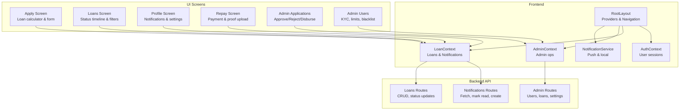
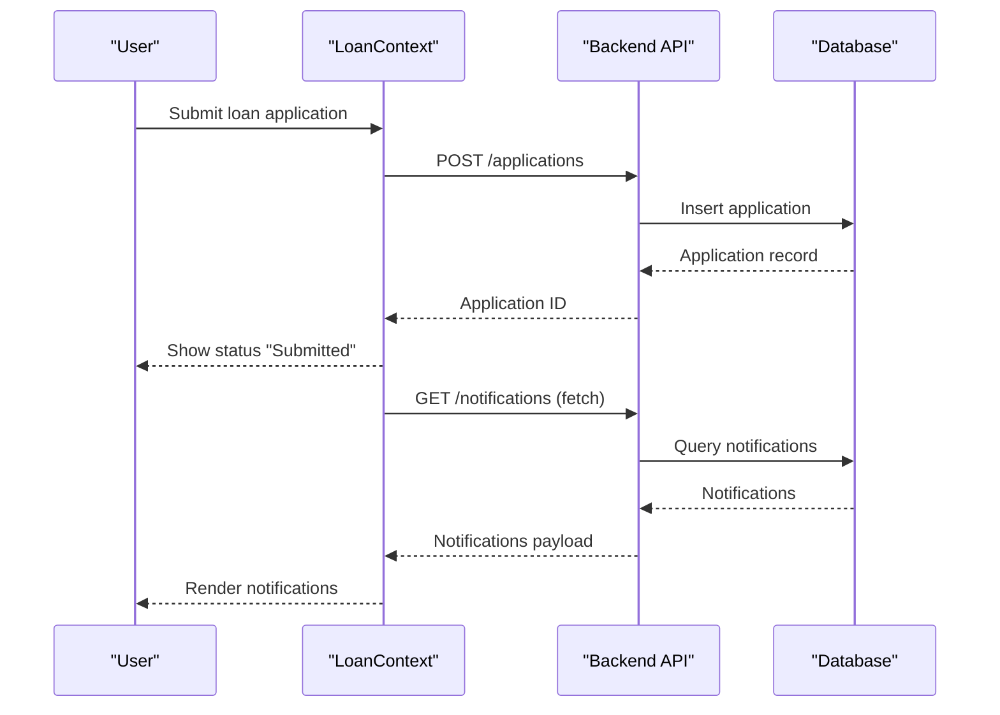
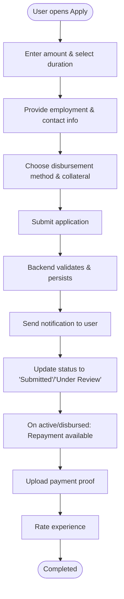
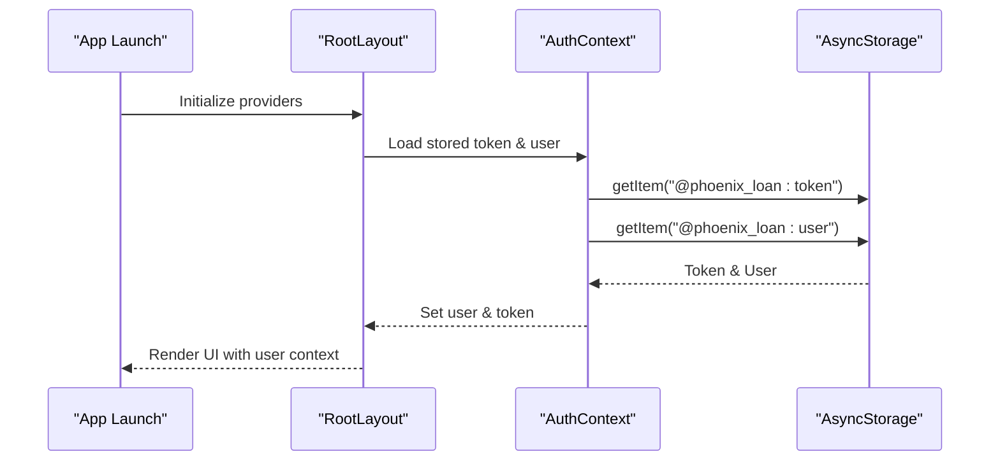
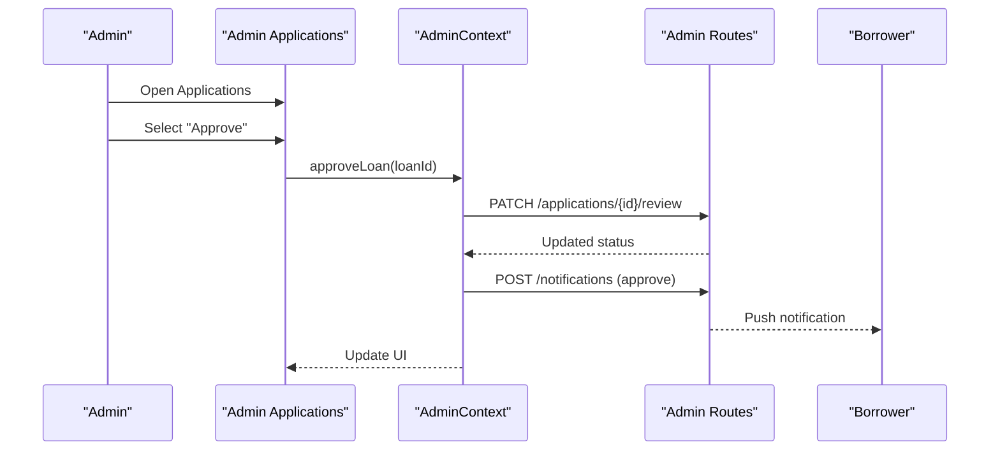
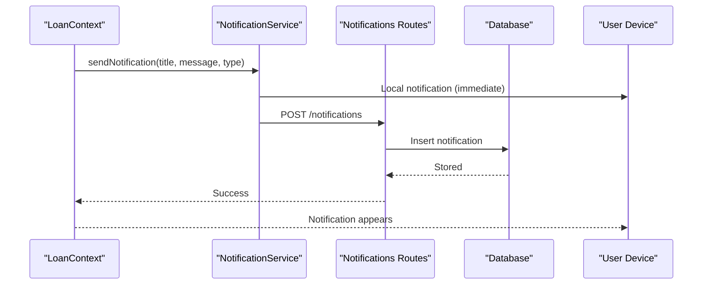
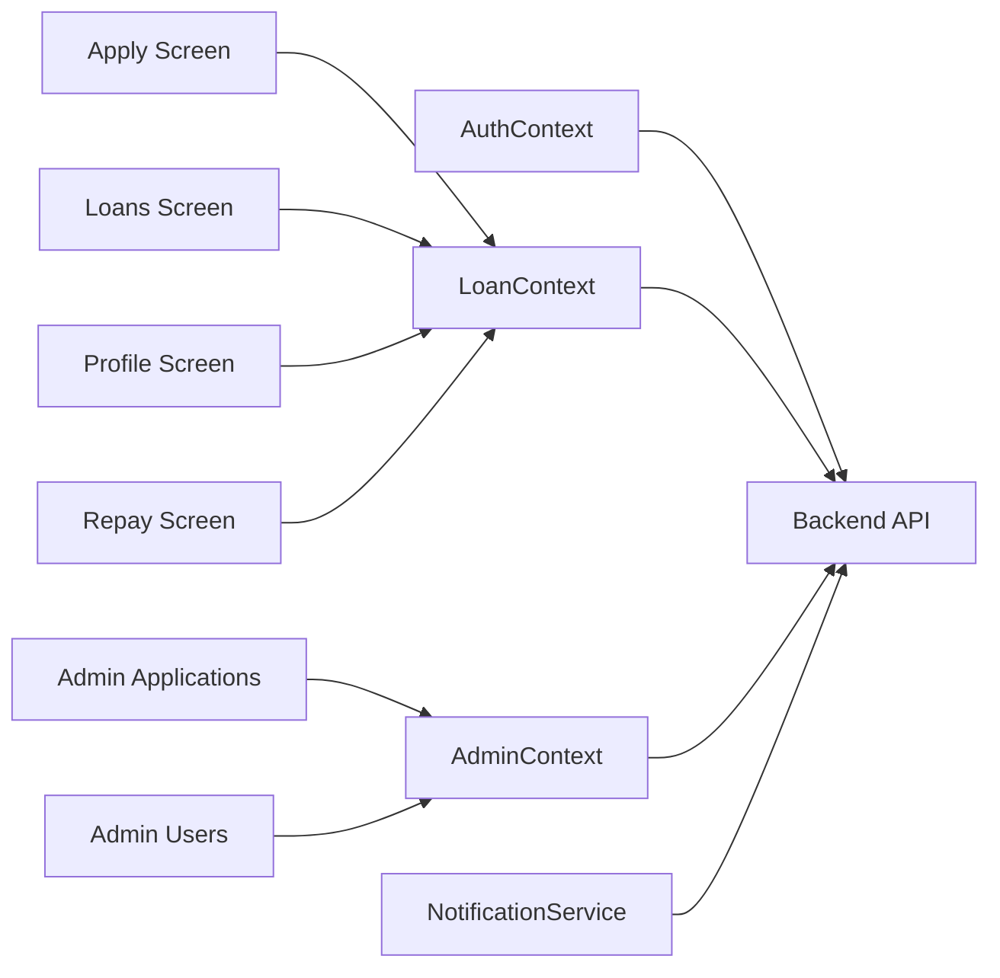

# Key Features Showcase

<cite>
**Referenced Files in This Document**
- [RootLayout](file://app/_layout.tsx)
- [AuthContext](file://contexts/AuthContext.tsx)
- [AdminContext](file://contexts/AdminContext.tsx)
- [LoanContext](file://contexts/LoanContext.tsx)
- [NotificationService](file://services/NotificationService.ts)
- [Apply Screen](file://app/(tabs)/apply.tsx)
- [Loans Screen](file://app/(tabs)/loans.tsx)
- [Profile Screen](file://app/(tabs)/profile.tsx)
- [Repay Screen](file://app/(tabs)/repay.tsx)
- [Admin Applications Screen](file://app/admin/(tabs)/applications.tsx)
- [Admin Users Screen](file://app/admin/(tabs)/users.tsx)
- [Admin Routes](file://backend/src/routes/admin.ts)
- [Notifications Routes](file://backend/src/routes/notifications.ts)
- [Loans Routes](file://backend/src/routes/loans.ts)
</cite>

## Table of Contents
1. [Introduction](#introduction)
2. [Project Structure](#project-structure)
3. [Core Components](#core-components)
4. [Architecture Overview](#architecture-overview)
5. [Detailed Feature Analysis](#detailed-feature-analysis)
6. [Dependency Analysis](#dependency-analysis)
7. [Performance Considerations](#performance-considerations)
8. [Troubleshooting Guide](#troubleshooting-guide)
9. [Conclusion](#conclusion)

## Introduction
This document presents PHOENIX as a modern, secure, and intelligent microfinance platform designed to streamline personal lending from application to repayment. It showcases four core feature categories:
- Loan Management System with complete lifecycle automation
- User Authentication with security-first approach
- Admin Dashboard with comprehensive operational controls
- Smart Notifications with intelligent alert system

Each feature is explained with capabilities, user benefits, technical implementation, and real-world use cases. Interactive demonstrations and screenshots are described to help stakeholders visualize workflows and outcomes.

## Project Structure
PHOENIX follows a modular architecture:
- Frontend: React Native with Expo Router for navigation, TanStack Query for caching, and custom React Context providers for global state
- Backend: Hono-based API with Drizzle ORM for database operations
- Services: Push notification orchestration via Expo Notifications and local persistence

**Diagram sources**
- [RootLayout:31-82](file://app/_layout.tsx#L31-L82)
- [AuthContext:31-126](file://contexts/AuthContext.tsx#L31-L126)
- [LoanContext:82-329](file://contexts/LoanContext.tsx#L82-L329)
- [AdminContext:135-521](file://contexts/AdminContext.tsx#L135-L521)
- [NotificationService:26-69](file://services/NotificationService.ts#L26-L69)
- [Apply Screen](file://app/(tabs)/apply.tsx#L125-L255)
- [Loans Screen](file://app/(tabs)/loans.tsx#L309-L440)
- [Profile Screen](file://app/(tabs)/profile.tsx#L127-L434)
- [Repay Screen](file://app/(tabs)/repay.tsx#L225-L449)
- [Admin Applications Screen](file://app/admin/(tabs)/applications.tsx#L155-L327)
- [Admin Users Screen](file://app/admin/(tabs)/users.tsx#L278-L398)
- [Admin Routes:8-94](file://backend/src/routes/admin.ts#L8-L94)
- [Notifications Routes:8-33](file://backend/src/routes/notifications.ts#L8-L33)
- [Loans Routes:92-138](file://backend/src/routes/loans.ts#L92-L138)

**Section sources**
- [RootLayout:1-83](file://app/_layout.tsx#L1-L83)
- [AuthContext:1-135](file://contexts/AuthContext.tsx#L1-L135)
- [LoanContext:1-336](file://contexts/LoanContext.tsx#L1-L336)
- [AdminContext:1-528](file://contexts/AdminContext.tsx#L1-L528)
- [NotificationService:1-135](file://services/NotificationService.ts#L1-L135)

## Core Components
- AuthContext: Manages user login, registration, logout, and persistent token storage
- LoanContext: Centralizes loan lifecycle operations, notifications, and local caching
- AdminContext: Provides administrative controls, loan/user management, and settings persistence
- NotificationService: Handles push notification registration, local alerts, and backend persistence

Benefits:
- Consistent state across screens
- Offline resilience with AsyncStorage fallbacks
- Real-time notifications with hybrid push/local delivery
- Secure token-based authentication

**Section sources**
- [AuthContext:31-126](file://contexts/AuthContext.tsx#L31-L126)
- [LoanContext:82-329](file://contexts/LoanContext.tsx#L82-L329)
- [AdminContext:135-521](file://contexts/AdminContext.tsx#L135-L521)
- [NotificationService:26-69](file://services/NotificationService.ts#L26-L69)

## Architecture Overview
PHOENIX integrates frontend and backend through typed APIs and context providers. The system emphasizes:
- Security-first authentication with token persistence
- Intelligent notifications with dual-channel delivery
- Admin-driven lifecycle control with audit-friendly status transitions
- Responsive UI with animated feedback and haptic cues

**Diagram sources**
- [LoanContext:198-261](file://contexts/LoanContext.tsx#L198-L261)
- [Loans Routes:170-197](file://backend/src/routes/loans.ts#L170-L197)
- [Notifications Routes:8-33](file://backend/src/routes/notifications.ts#L8-L33)

## Detailed Feature Analysis

### Loan Management System: Complete Lifecycle
Capabilities:
- Loan calculator with dynamic rates and repayment breakdown
- Multi-step application form with validation and haptic feedback
- Real-time status tracking with visual timeline and overdue alerts
- Repayment initiation with proof upload and rating collection
- Local caching with AsyncStorage fallbacks for offline usability

User Benefits:
- Transparent pricing and due-date visibility
- Seamless application-to-disbursement-to-repayment journey
- Immediate status updates and overdue reminders
- Post-repayment feedback loop for continuous improvement

Technical Implementation:
- LoanContext orchestrates application submission, status updates, and notifications
- Apply Screen computes interest and totals based on duration and amount
- Loans Screen displays status timeline and overdue banners
- Repay Screen supports multiple payment channels and proof uploads

Interactive Demonstrations:
- Loan Calculator: Adjust amount and duration to see repayment totals and due dates
- Application Form: Progress through steps with inline validation and error hints
- Status Timeline: Swipe to expand loan details and actions
- Repayment: Choose payment method, upload proof, and rate experience

Real-World Use Cases:
- Small business owner needs MWK 100,000 for 3 weeks with MWK 40,000 total repayment
- Employee applies with monthly income and next-of-kin details
- Borrower receives overdue alerts and completes repayment with screenshot upload

**Diagram sources**
- [Apply Screen](file://app/(tabs)/apply.tsx#L125-L255)
- [LoanContext:198-273](file://contexts/LoanContext.tsx#L198-L273)
- [Loans Screen](file://app/(tabs)/loans.tsx#L309-L440)
- [Repay Screen](file://app/(tabs)/repay.tsx#L225-L449)

**Section sources**
- [Apply Screen](file://app/(tabs)/apply.tsx#L125-L255)
- [Loans Screen](file://app/(tabs)/loans.tsx#L309-L440)
- [Repay Screen](file://app/(tabs)/repay.tsx#L225-L449)
- [LoanContext:82-329](file://contexts/LoanContext.tsx#L82-L329)

### User Authentication: Security-First Approach
Capabilities:
- Secure login and registration with token persistence
- Automatic session restoration on app launch
- Logout with token removal from storage
- Role-aware navigation and protected routes

User Benefits:
- Fast, secure access without re-entering credentials
- Persistent session across app restarts
- Clean separation of user and admin experiences

Technical Implementation:
- AuthContext manages user state and token storage
- RootLayout initializes providers and registers for push notifications
- Protected routes enforced by context usage

**Diagram sources**
- [RootLayout:31-82](file://app/_layout.tsx#L31-L82)
- [AuthContext:31-54](file://contexts/AuthContext.tsx#L31-L54)

**Section sources**
- [AuthContext:31-126](file://contexts/AuthContext.tsx#L31-L126)
- [RootLayout:31-82](file://app/_layout.tsx#L31-L82)

### Admin Dashboard: Comprehensive Controls
Capabilities:
- Approve/reject loan applications with immediate notifications
- Mark loans as disbursed and repaid with audit trails
- Manage user profiles: KYC verification, loan limits, credit scores, blacklist
- Configure system settings: interest rates, disbursement channels, processing fee, penalties
- Real-time statistics and filtering

User Benefits:
- Streamlined operational oversight with actionable insights
- Rapid decision-making with contextual user and loan data
- Transparent audit trail for compliance and reporting

Technical Implementation:
- AdminContext centralizes admin operations and settings
- Admin Applications Screen displays actionable cards with status-specific controls
- Admin Users Screen enables quick edits with modal forms and search

**Diagram sources**
- [Admin Applications Screen](file://app/admin/(tabs)/applications.tsx#L155-L250)
- [AdminContext:311-335](file://contexts/AdminContext.tsx#L311-L335)
- [Admin Routes:49-94](file://backend/src/routes/admin.ts#L49-L94)

**Section sources**
- [Admin Applications Screen](file://app/admin/(tabs)/applications.tsx#L155-L327)
- [Admin Users Screen](file://app/admin/(tabs)/users.tsx#L278-L398)
- [AdminContext:135-521](file://contexts/AdminContext.tsx#L135-L521)
- [Admin Routes:8-171](file://backend/src/routes/admin.ts#L8-L171)

### Smart Notifications: Intelligent Alert System
Capabilities:
- Dual-channel delivery: push notifications (when supported) and local alerts
- Backend persistence with read/unread tracking
- Context-aware messaging for approvals, rejections, status changes, and overdue warnings
- Foreground notification listeners and badge updates

User Benefits:
- Proactive alerts for critical loan events
- Reliable delivery even without push permissions
- Easy management of notification preferences

Technical Implementation:
- NotificationService handles registration, channel setup, and hybrid delivery
- LoanContext and AdminContext trigger notifications for lifecycle events
- Notifications Routes provide CRUD operations and read marking

**Diagram sources**
- [LoanContext:183-196](file://contexts/LoanContext.tsx#L183-L196)
- [NotificationService:116-134](file://services/NotificationService.ts#L116-L134)
- [Notifications Routes:72-90](file://backend/src/routes/notifications.ts#L72-L90)

**Section sources**
- [NotificationService:26-135](file://services/NotificationService.ts#L26-L135)
- [LoanContext:183-196](file://contexts/LoanContext.tsx#L183-L196)
- [Notifications Routes:8-105](file://backend/src/routes/notifications.ts#L8-L105)

## Dependency Analysis
PHOENIX exhibits low coupling and high cohesion:
- UI screens depend on context providers rather than direct API calls
- Contexts encapsulate network logic and state synchronization
- Backend routes are modular and reusable across contexts

**Diagram sources**
- [AuthContext:31-126](file://contexts/AuthContext.tsx#L31-L126)
- [LoanContext:82-329](file://contexts/LoanContext.tsx#L82-L329)
- [AdminContext:135-521](file://contexts/AdminContext.tsx#L135-L521)
- [NotificationService:26-69](file://services/NotificationService.ts#L26-L69)
- [Apply Screen](file://app/(tabs)/apply.tsx#L125-L255)
- [Loans Screen](file://app/(tabs)/loans.tsx#L309-L440)
- [Profile Screen](file://app/(tabs)/profile.tsx#L127-L434)
- [Repay Screen](file://app/(tabs)/repay.tsx#L225-L449)
- [Admin Applications Screen](file://app/admin/(tabs)/applications.tsx#L155-L327)
- [Admin Users Screen](file://app/admin/(tabs)/users.tsx#L278-L398)

**Section sources**
- [AuthContext:31-126](file://contexts/AuthContext.tsx#L31-L126)
- [LoanContext:82-329](file://contexts/LoanContext.tsx#L82-L329)
- [AdminContext:135-521](file://contexts/AdminContext.tsx#L135-L521)
- [NotificationService:26-69](file://services/NotificationService.ts#L26-L69)

## Performance Considerations
- Caching: AsyncStorage keys for loans and notifications reduce redundant network calls
- Pagination: Backend routes support pagination to prevent large payloads
- Optimistic updates: UI reflects immediate state changes while background syncs
- Offline-first: Local caches populate UI even when backend is unavailable

## Troubleshooting Guide
Common issues and resolutions:
- Push notifications not received:
  - Verify device permissions and channel configuration
  - Confirm backend connectivity for push token registration
- Application submission fails:
  - Check network connectivity and backend reachability
  - Validate user session and stored token
- Admin actions not reflected:
  - Refresh data from AdminContext
  - Confirm backend routes are reachable and authenticated

**Section sources**
- [NotificationService:26-69](file://services/NotificationService.ts#L26-L69)
- [LoanContext:91-176](file://contexts/LoanContext.tsx#L91-L176)
- [AdminContext:480-491](file://contexts/AdminContext.tsx#L480-L491)

## Conclusion
PHOENIX delivers a cohesive, secure, and intelligent microfinance experience. Its four feature pillars—comprehensive loan lifecycle, robust authentication, powerful admin controls, and smart notifications—work together to provide transparency, efficiency, and trust. The modular architecture ensures maintainability, while the hybrid notification system guarantees reliable communication. These capabilities collectively position PHOENIX as a modern alternative to traditional loan management systems, emphasizing user-centric design and operational excellence.