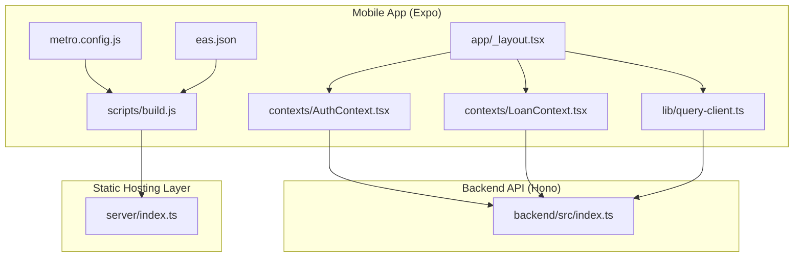
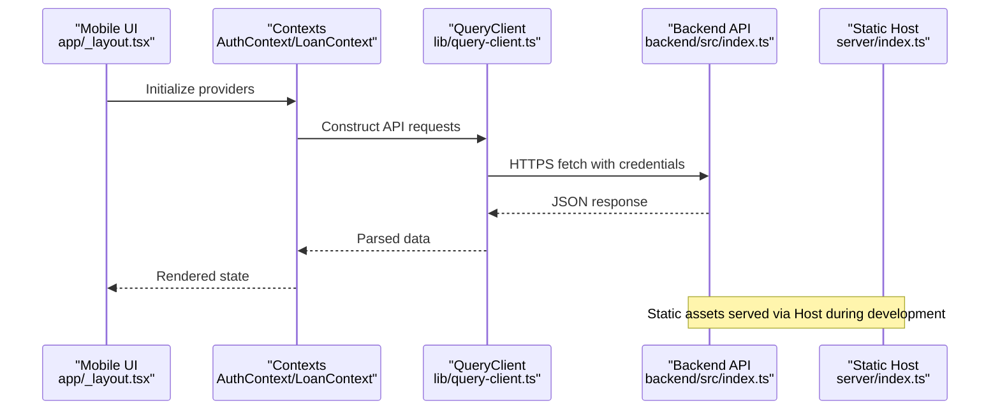
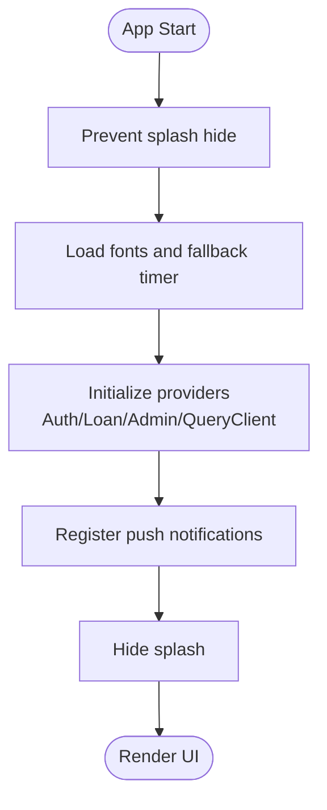
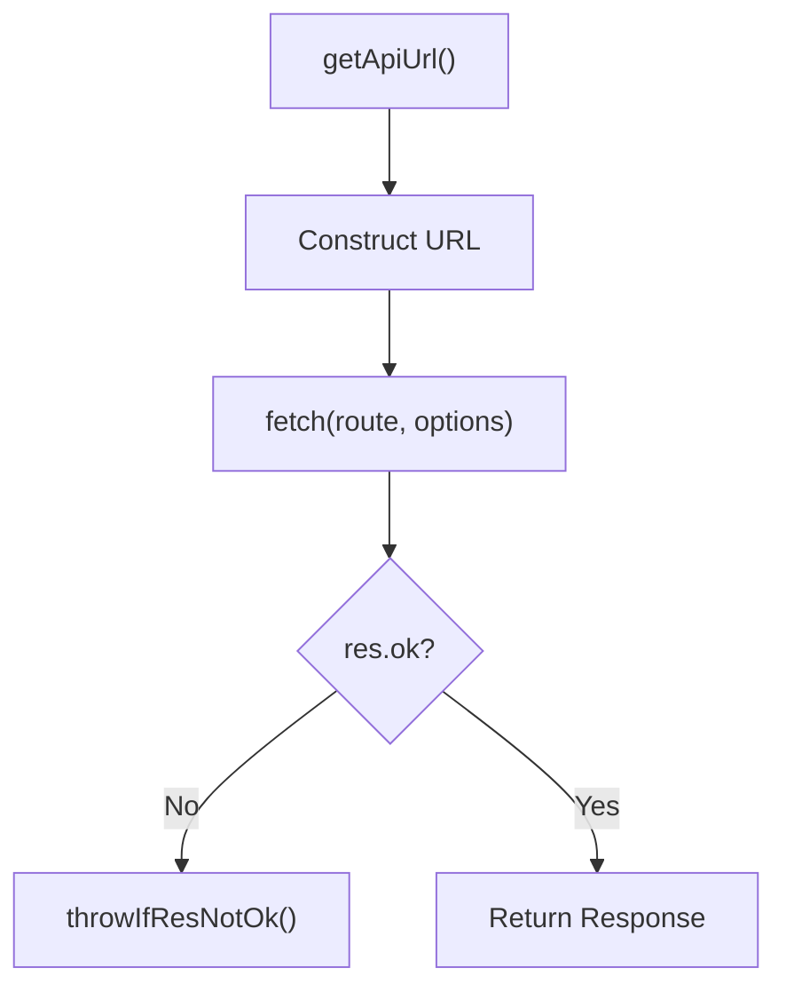
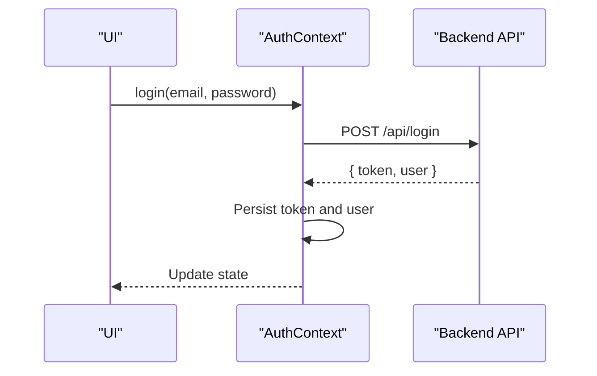
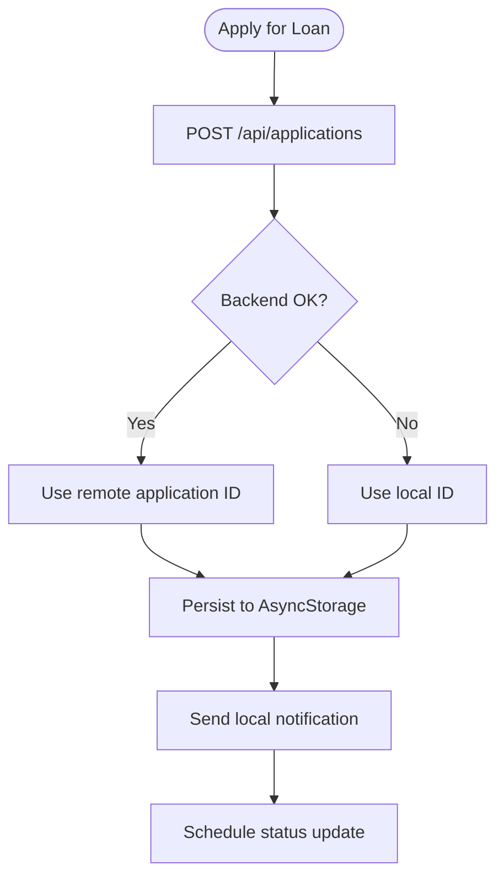
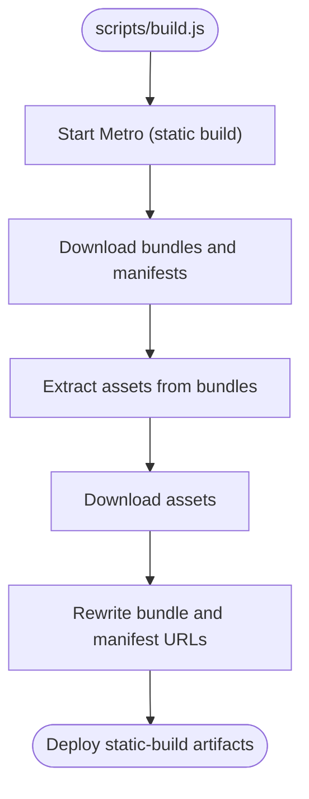
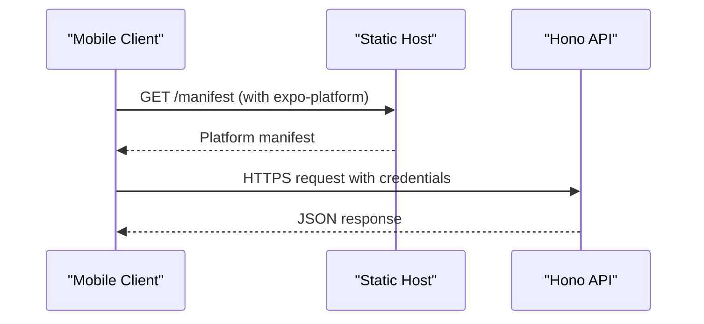
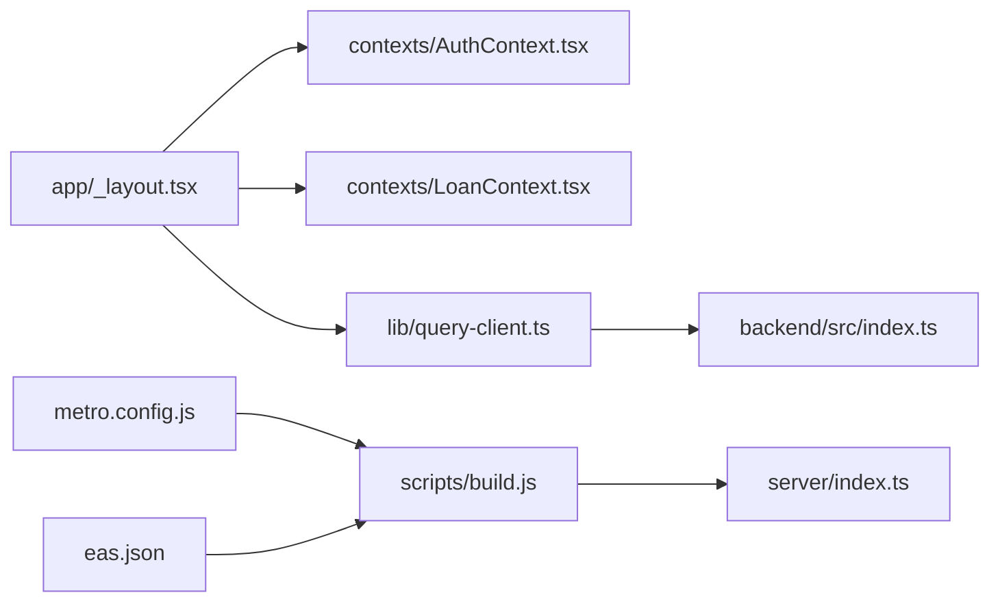

# Performance Metrics

<cite>
**Referenced Files in This Document**
- [package.json](file://package.json)
- [app.json](file://app.json)
- [metro.config.js](file://metro.config.js)
- [eas.json](file://eas.json)
- [scripts/build.js](file://scripts/build.js)
- [server/index.ts](file://server/index.ts)
- [backend/src/index.ts](file://backend/src/index.ts)
- [lib/query-client.ts](file://lib/query-client.ts)
- [contexts/AuthContext.tsx](file://contexts/AuthContext.tsx)
- [contexts/LoanContext.tsx](file://contexts/LoanContext.tsx)
- [app/_layout.tsx](file://app/_layout.tsx)
- [README.md](file://README.md)
</cite>

## Table of Contents
1. [Introduction](#introduction)
2. [Project Structure](#project-structure)
3. [Core Components](#core-components)
4. [Architecture Overview](#architecture-overview)
5. [Detailed Component Analysis](#detailed-component-analysis)
6. [Dependency Analysis](#dependency-analysis)
7. [Performance Considerations](#performance-considerations)
8. [Troubleshooting Guide](#troubleshooting-guide)
9. [Conclusion](#conclusion)
10. [Appendices](#appendices)

## Introduction
This document defines the PHOENIX application’s performance metrics and optimization strategies across mobile app and backend API domains. It consolidates explicit performance goals from the repository with practical implementation patterns present in the codebase to guide benchmarking, monitoring, and continuous improvement.

- Mobile app performance targets:
  - Startup time: < 2 seconds
  - Bundle size: < 50 MB
  - Battery usage: optimized
  - Memory usage: < 100 MB average
- API performance targets:
  - Response time: < 200 ms average
  - Security: JWT + HTTPS
  - Uptime: 99.9%
  - Auto-scaling readiness: configured for horizontal scaling

These targets are explicitly documented in the repository’s top-level README and are reflected in the current architecture and build configuration.

**Section sources**
- [README.md:237-249](file://README.md#L237-L249)

## Project Structure
The repository follows a dual-package structure:
- Frontend (Expo + React Native) under the root, with:
  - Application shell and routing in app/
  - Shared contexts and query client in contexts/ and lib/
  - Static build pipeline in scripts/build.js
  - Metro bundler configuration in metro.config.js
  - EAS build configuration in eas.json
- Backend (Hono + Node) under backend/, with:
  - Server entry and routes in backend/src/
  - Express-based landing page and Expo manifest proxy in server/index.ts

**Diagram sources**
- [app/_layout.tsx:1-83](file://app/_layout.tsx#L1-L83)
- [contexts/AuthContext.tsx:1-135](file://contexts/AuthContext.tsx#L1-L135)
- [contexts/LoanContext.tsx:1-336](file://contexts/LoanContext.tsx#L1-L336)
- [lib/query-client.ts:1-81](file://lib/query-client.ts#L1-L81)
- [scripts/build.js:1-564](file://scripts/build.js#L1-L564)
- [metro.config.js:1-18](file://metro.config.js#L1-L18)
- [eas.json:1-22](file://eas.json#L1-L22)
- [backend/src/index.ts:1-76](file://backend/src/index.ts#L1-L76)
- [server/index.ts:1-251](file://server/index.ts#L1-L251)

**Section sources**
- [package.json:1-84](file://package.json#L1-L84)
- [app.json:1-77](file://app.json#L1-L77)
- [scripts/build.js:1-564](file://scripts/build.js#L1-L564)
- [server/index.ts:1-251](file://server/index.ts#L1-L251)
- [backend/src/index.ts:1-76](file://backend/src/index.ts#L1-L76)

## Core Components
This section maps performance-critical components and their roles in meeting the stated targets.

- Application shell and providers:
  - Root layout orchestrates providers and splash screen timing, impacting startup perception.
- Authentication and loan contexts:
  - Centralized state and persistence reduce redundant network calls and improve responsiveness.
- Query client:
  - Centralized API access with controlled caching and retries supports predictable performance.
- Static build pipeline:
  - Automated Metro bundling and asset extraction enable reproducible, minified deployments.
- Backend server:
  - Hono-based API with logging and CORS supports low-latency responses and secure cross-origin access.

**Section sources**
- [app/_layout.tsx:19-82](file://app/_layout.tsx#L19-L82)
- [contexts/AuthContext.tsx:31-126](file://contexts/AuthContext.tsx#L31-L126)
- [contexts/LoanContext.tsx:82-329](file://contexts/LoanContext.tsx#L82-L329)
- [lib/query-client.ts:67-81](file://lib/query-client.ts#L67-L81)
- [scripts/build.js:500-555](file://scripts/build.js#L500-L555)
- [backend/src/index.ts:17-76](file://backend/src/index.ts#L17-L76)

## Architecture Overview
The runtime architecture ties the mobile app to the backend via a centralized API client and a static hosting layer that serves prebuilt assets and manifests.

**Diagram sources**
- [app/_layout.tsx:31-82](file://app/_layout.tsx#L31-L82)
- [contexts/AuthContext.tsx:56-79](file://contexts/AuthContext.tsx#L56-L79)
- [contexts/LoanContext.tsx:198-261](file://contexts/LoanContext.tsx#L198-L261)
- [lib/query-client.ts:27-44](file://lib/query-client.ts#L27-L44)
- [backend/src/index.ts:54-61](file://backend/src/index.ts#L54-L61)
- [server/index.ts:163-205](file://server/index.ts#L163-L205)

## Detailed Component Analysis

### Mobile Startup and Rendering Pipeline
- Splash screen and font loading:
  - Prevents premature hide and ensures fonts are ready before rendering, contributing to perceived startup time.
- Provider composition:
  - Gesture, keyboard, error boundary, and query client providers encapsulated at root level.
- Push notifications:
  - Registration and foreground listener initialization occur early to avoid blocking render.

**Diagram sources**
- [app/_layout.tsx:17-48](file://app/_layout.tsx#L17-L48)
- [app/_layout.tsx:50-61](file://app/_layout.tsx#L50-L61)

**Section sources**
- [app/_layout.tsx:17-82](file://app/_layout.tsx#L17-L82)

### API Client and Network Behavior
- Base URL resolution:
  - Uses environment variable for HTTPS endpoint.
- Request construction:
  - Includes credentials and optional JSON body.
- Error handling:
  - Throws on non-OK responses with status and text.
- Query defaults:
  - Infinite stale time, disabled refetch on window focus, and no retry to stabilize performance.

**Diagram sources**
- [lib/query-client.ts:8-18](file://lib/query-client.ts#L8-L18)
- [lib/query-client.ts:35-44](file://lib/query-client.ts#L35-L44)
- [lib/query-client.ts:20-25](file://lib/query-client.ts#L20-L25)

**Section sources**
- [lib/query-client.ts:1-81](file://lib/query-client.ts#L1-L81)

### Authentication Flow and Persistence
- Login and registration:
  - Calls backend endpoints with JSON payload and stores token/user in persistent storage.
- Token usage:
  - Subsequent requests rely on stored token and credentials for session continuity.

**Diagram sources**
- [contexts/AuthContext.tsx:56-79](file://contexts/AuthContext.tsx#L56-L79)
- [contexts/AuthContext.tsx:73-74](file://contexts/AuthContext.tsx#L73-L74)

**Section sources**
- [contexts/AuthContext.tsx:1-135](file://contexts/AuthContext.tsx#L1-L135)

### Loan Application and Offline-Ready Patterns
- Local-first approach:
  - Maintains local state in persistent storage and augments with backend data when available.
- Notifications:
  - Immediate local updates with eventual backend synchronization.
- Simulated status transitions:
  - Local timers simulate backend progress to improve perceived responsiveness.

**Diagram sources**
- [contexts/LoanContext.tsx:198-261](file://contexts/LoanContext.tsx#L198-L261)
- [contexts/LoanContext.tsx:248-258](file://contexts/LoanContext.tsx#L248-L258)

**Section sources**
- [contexts/LoanContext.tsx:82-329](file://contexts/LoanContext.tsx#L82-L329)

### Static Build and Asset Delivery
- Build orchestration:
  - Starts Metro, downloads bundles and manifests, extracts and downloads assets, updates URLs, and writes platform manifests.
- Minification and lazy loading:
  - Build script requests minified bundles suitable for production distribution.
- Hosting layer:
  - Serves Expo manifests and static assets, enabling offline-capable deployments.

**Diagram sources**
- [scripts/build.js:500-555](file://scripts/build.js#L500-L555)
- [scripts/build.js:244-284](file://scripts/build.js#L244-L284)
- [scripts/build.js:355-417](file://scripts/build.js#L355-L417)
- [scripts/build.js:419-497](file://scripts/build.js#L419-L497)

**Section sources**
- [scripts/build.js:1-564](file://scripts/build.js#L1-L564)
- [server/index.ts:163-205](file://server/index.ts#L163-L205)

### Backend API Performance and Security
- Routing and middleware:
  - Centralized routes under /api with CORS allowing credentials and specific headers.
- Logging:
  - Request logging with response capture and timing for observability.
- Health and docs:
  - Health check endpoint and Swagger UI for API documentation.

**Diagram sources**
- [server/index.ts:163-205](file://server/index.ts#L163-L205)
- [backend/src/index.ts:54-61](file://backend/src/index.ts#L54-L61)
- [backend/src/index.ts:17-26](file://backend/src/index.ts#L17-L26)

**Section sources**
- [backend/src/index.ts:1-76](file://backend/src/index.ts#L1-L76)
- [server/index.ts:67-98](file://server/index.ts#L67-L98)

## Dependency Analysis
The following diagram shows how performance-critical modules depend on each other and external systems.

**Diagram sources**
- [app/_layout.tsx:1-83](file://app/_layout.tsx#L1-L83)
- [contexts/AuthContext.tsx:1-135](file://contexts/AuthContext.tsx#L1-L135)
- [contexts/LoanContext.tsx:1-336](file://contexts/LoanContext.tsx#L1-L336)
- [lib/query-client.ts:1-81](file://lib/query-client.ts#L1-L81)
- [backend/src/index.ts:1-76](file://backend/src/index.ts#L1-L76)
- [scripts/build.js:1-564](file://scripts/build.js#L1-L564)
- [server/index.ts:1-251](file://server/index.ts#L1-L251)
- [metro.config.js:1-18](file://metro.config.js#L1-L18)
- [eas.json:1-22](file://eas.json#L1-L22)

**Section sources**
- [package.json:22-69](file://package.json#L22-L69)

## Performance Considerations

### Mobile App Targets and Implementation Notes
- Startup time < 2 seconds:
  - Ensure splash screen is hidden only after fonts are loaded and providers initialized.
  - Keep initial route stack minimal; defer heavy work to background.
- Bundle size < 50 MB:
  - Leverage the build pipeline’s minified bundles and asset extraction.
  - Audit dependencies and remove unused assets.
- Battery usage optimization:
  - Avoid synchronous heavy work on main thread; use background tasks judiciously.
  - Limit frequent polling; prefer event-driven updates.
- Memory usage < 100 MB average:
  - Use React.memo and useMemo where appropriate.
  - Avoid large image decoding on main thread; use native components.

### API Targets and Implementation Notes
- Response time < 200 ms average:
  - Use efficient database queries and indexing; avoid N+1 queries.
  - Enable compression and keep payloads small.
- Security: JWT + HTTPS:
  - Enforce HTTPS in production and validate JWT tokens server-side.
- Uptime 99.9%:
  - Implement health checks, circuit breakers, and graceful degradation.
- Auto-scaling readiness:
  - Stateless backend design with externalized state (database).
  - Container-friendly configuration and environment variables.

### Monitoring and Observability
- Request logging:
  - The backend captures request durations and response bodies for inspection.
- Static hosting:
  - The hosting layer logs request timings and responses for static assets.

**Section sources**
- [server/index.ts:67-98](file://server/index.ts#L67-L98)
- [backend/src/index.ts:28-31](file://backend/src/index.ts#L28-L31)

### Performance Testing Methodologies
- Mobile:
  - Measure startup time across cold and warm starts; use profiler traces.
  - Benchmark bundle size and analyze asset composition.
- Backend:
  - Run load tests with realistic concurrency; measure p95/p99 latencies.
  - Validate JWT and CORS behavior under load.

### Optimization Techniques
- Mobile:
  - Lazy-load non-critical screens and images.
  - Use Expo’s built-in optimizations (e.g., React Compiler).
- Backend:
  - Use prepared statements and connection pooling.
  - Cache read-heavy data with invalidation strategies.

### Continuous Improvement Processes
- Instrument endpoints with latency histograms and error rates.
- Track bundle size trends over releases.
- Establish SLOs aligned with targets and alert on breaches.

[No sources needed since this section provides general guidance]

## Troubleshooting Guide
- Startup delays:
  - Verify splash hide conditions and provider initialization order.
- Network errors:
  - Confirm environment variable for API base URL is set and reachable.
- Build failures:
  - Check Metro health and logs; ensure download timeouts are not exceeded.
- CORS issues:
  - Validate allowed origins and credentials configuration.

**Section sources**
- [app/_layout.tsx:44-48](file://app/_layout.tsx#L44-L48)
- [lib/query-client.ts:8-18](file://lib/query-client.ts#L8-L18)
- [scripts/build.js:97-152](file://scripts/build.js#L97-L152)
- [backend/src/index.ts:21-26](file://backend/src/index.ts#L21-L26)

## Conclusion
The PHOENIX repository defines clear performance targets and exposes architectural patterns that support them. The mobile app’s startup and rendering pipeline, combined with a robust static build and hosting layer, provide a foundation for meeting the stated goals. The backend’s logging, CORS, and route structure support low-latency, secure, and scalable operations. Adopting the recommended monitoring, testing, and optimization practices will help sustain and improve performance over time.

[No sources needed since this section summarizes without analyzing specific files]

## Appendices

### Configuration References
- Environment variables and build scripts:
  - EXPO_PUBLIC_DOMAIN drives API base URL and static build domain.
  - Build script orchestrates Metro, downloads assets, and writes manifests.
- App metadata and experiments:
  - New architecture and React Compiler flags are enabled.

**Section sources**
- [lib/query-client.ts:8-18](file://lib/query-client.ts#L8-L18)
- [scripts/build.js:41-59](file://scripts/build.js#L41-L59)
- [app.json:63-66](file://app.json#L63-L66)