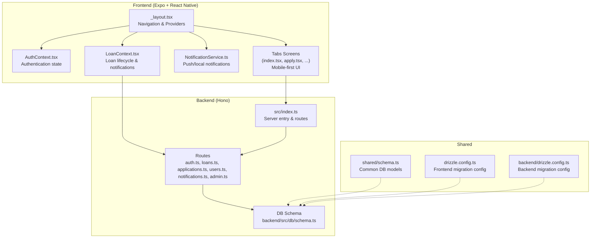
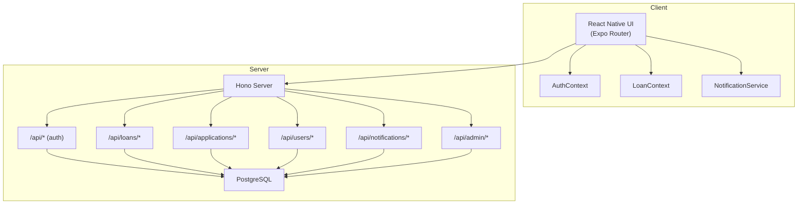
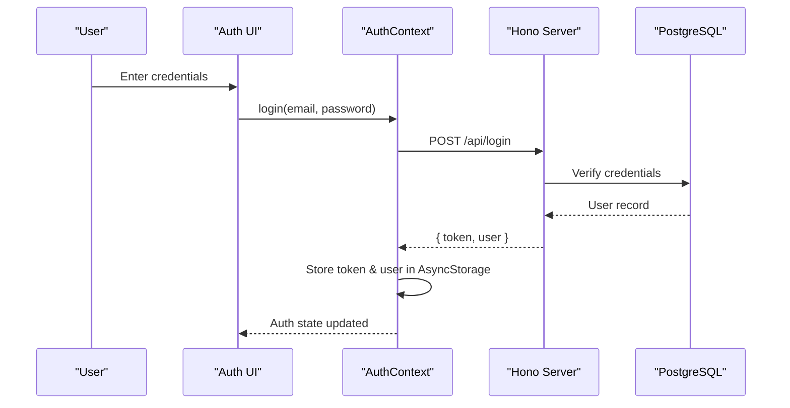
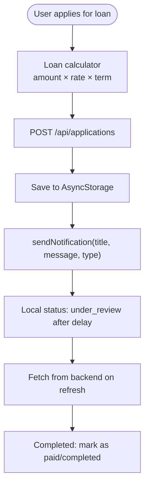
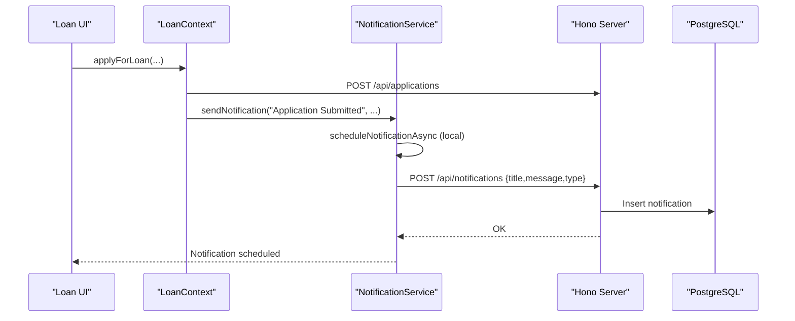
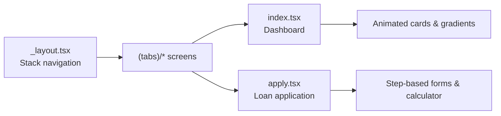
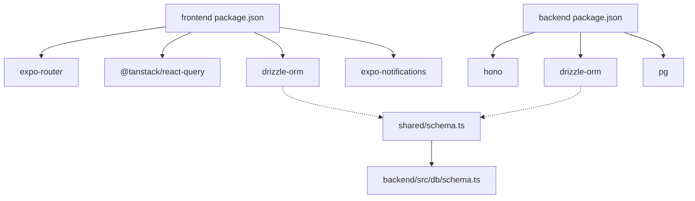

# Project Overview

<cite>
**Referenced Files in This Document**
- [README.md](file://README.md)
- [package.json](file://package.json)
- [backend/package.json](file://backend/package.json)
- [app/_layout.tsx](file://app/_layout.tsx)
- [backend/src/index.ts](file://backend/src/index.ts)
- [drizzle.config.ts](file://drizzle.config.ts)
- [backend/drizzle.config.ts](file://backend/drizzle.config.ts)
- [app.json](file://app.json)
- [contexts/AuthContext.tsx](file://contexts/AuthContext.tsx)
- [contexts/LoanContext.tsx](file://contexts/LoanContext.tsx)
- [shared/schema.ts](file://shared/schema.ts)
- [backend/src/db/schema.ts](file://backend/src/db/schema.ts)
- [services/NotificationService.ts](file://services/NotificationService.ts)
- [app/(tabs)/index.tsx](file://app/(tabs)/index.tsx)
- [app/(tabs)/apply.tsx](file://app/(tabs)/apply.tsx)
</cite>

## Table of Contents
1. [Introduction](#introduction)
2. [Project Structure](#project-structure)
3. [Core Components](#core-components)
4. [Architecture Overview](#architecture-overview)
5. [Detailed Component Analysis](#detailed-component-analysis)
6. [Dependency Analysis](#dependency-analysis)
7. [Performance Considerations](#performance-considerations)
8. [Troubleshooting Guide](#troubleshooting-guide)
9. [Conclusion](#conclusion)
10. [Appendices](#appendices)

## Introduction
PHOENIX is a modern microfinance loan management platform tailored for the Malawian market. It combines a React Native mobile application built with Expo Router and a Node.js backend powered by the Hono framework, delivering a mobile-first experience with real-time capabilities. The platform supports the complete loan lifecycle management, user authentication, administrative controls, and a robust notification system aligned with financial inclusion goals.

Key value propositions:
- Mobile-first design optimized for low-bandwidth environments and diverse devices
- Real-time notifications via push and local channels
- Secure JWT-based authentication with session persistence
- Admin dashboard for loan administration and analytics
- PostgreSQL-backed data model supporting scalable growth

**Section sources**
- [README.md:11-114](file://README.md#L21-L114)

## Project Structure
The repository follows a clear separation of concerns:
- Frontend (React Native + Expo): app/ contains screens, navigation, contexts, and services
- Backend (Node.js + Hono): backend/src contains routes, middleware, and database schema
- Shared resources: shared/schema.ts defines common database models
- Configuration: app.json, drizzle configs, and package.json define build and runtime settings

**Diagram sources**
- [app/_layout.tsx:19-82](file://app/_layout.tsx#L19-L82)
- [contexts/AuthContext.tsx:31-126](file://contexts/AuthContext.tsx#L31-L126)
- [contexts/LoanContext.tsx:82-329](file://contexts/LoanContext.tsx#L82-L329)
- [services/NotificationService.ts:26-134](file://services/NotificationService.ts#L26-L134)
- [app/(tabs)/index.tsx:195-345](file://app/(tabs)/index.tsx#L195-L345)
- [app/(tabs)/apply.tsx:125-515](file://app/(tabs)/apply.tsx#L125-L515)
- [backend/src/index.ts:17-76](file://backend/src/index.ts#L17-L76)
- [backend/src/db/schema.ts:4-146](file://backend/src/db/schema.ts#L4-L146)
- [shared/schema.ts:1-21](file://shared/schema.ts#L1-L21)
- [drizzle.config.ts:1-15](file://drizzle.config.ts#L1-L15)
- [backend/drizzle.config.ts:1-14](file://backend/drizzle.config.ts#L1-L14)

**Section sources**
- [package.json:1-84](file://package.json#L1-L84)
- [backend/package.json:1-46](file://backend/package.json#L1-L46)
- [app.json:1-69](file://app.json#L1-L69)
- [drizzle.config.ts:1-15](file://drizzle.config.ts#L1-L15)
- [backend/drizzle.config.ts:1-14](file://backend/drizzle.config.ts#L1-L14)

## Core Components
- Authentication and session management with JWT and AsyncStorage
- Loan lifecycle management with application, status tracking, and repayment flows
- Administrative controls for user and loan oversight
- Real-time notification system with push and local fallbacks
- Mobile-first UI with animated transitions and responsive layouts

Practical examples:
- Loan application flow with step-by-step calculator and disbursement selection
- Dashboard with animated cards, quick actions, and active loan banners
- Notification pipeline for application submissions, status updates, and reminders

**Section sources**
- [contexts/AuthContext.tsx:31-126](file://contexts/AuthContext.tsx#L31-L126)
- [contexts/LoanContext.tsx:82-329](file://contexts/LoanContext.tsx#L82-L329)
- [services/NotificationService.ts:26-134](file://services/NotificationService.ts#L26-L134)
- [app/(tabs)/index.tsx:195-345](file://app/(tabs)/index.tsx#L195-L345)
- [app/(tabs)/apply.tsx:125-515](file://app/(tabs)/apply.tsx#L125-L515)

## Architecture Overview
PHOENIX uses a clean separation between the mobile frontend and backend APIs:
- Frontend: Expo Router-based navigation, React Query for caching, and context providers for auth, loans, and admin
- Backend: Hono server exposing REST endpoints for authentication, loans, applications, users, notifications, and admin
- Data: PostgreSQL via Drizzle ORM with shared schema definitions and separate migration configurations for frontend/backend

**Diagram sources**
- [app/_layout.tsx:19-82](file://app/_layout.tsx#L19-L82)
- [contexts/AuthContext.tsx:31-126](file://contexts/AuthContext.tsx#L31-L126)
- [contexts/LoanContext.tsx:82-329](file://contexts/LoanContext.tsx#L82-L329)
- [services/NotificationService.ts:26-134](file://services/NotificationService.ts#L26-L134)
- [backend/src/index.ts:55-61](file://backend/src/index.ts#L55-L61)
- [backend/src/db/schema.ts:4-146](file://backend/src/db/schema.ts#L4-L146)

## Detailed Component Analysis

### Authentication and Session Management
- Implements JWT-based login/register flows with secure token storage
- Persists user and token in AsyncStorage for seamless sessions
- Integrates with backend endpoints for authentication and user management

**Diagram sources**
- [contexts/AuthContext.tsx:56-79](file://contexts/AuthContext.tsx#L56-L79)
- [backend/src/index.ts:55-55](file://backend/src/index.ts#L55-L55)
- [backend/src/db/schema.ts:4-21](file://backend/src/db/schema.ts#L4-L21)

**Section sources**
- [contexts/AuthContext.tsx:31-126](file://contexts/AuthContext.tsx#L31-L126)
- [backend/src/index.ts:55-55](file://backend/src/index.ts#L55-L55)
- [backend/src/db/schema.ts:4-21](file://backend/src/db/schema.ts#L4-L21)

### Loan Lifecycle Management
- Centralized loan state with statuses spanning application to completion
- Real-time notifications for application submissions and status changes
- Local and backend synchronization with AsyncStorage and API calls

**Diagram sources**
- [contexts/LoanContext.tsx:198-261](file://contexts/LoanContext.tsx#L198-L261)
- [contexts/LoanContext.tsx:183-196](file://contexts/LoanContext.tsx#L183-L196)
- [services/NotificationService.ts:116-134](file://services/NotificationService.ts#L116-L134)

**Section sources**
- [contexts/LoanContext.tsx:82-329](file://contexts/LoanContext.tsx#L82-L329)
- [services/NotificationService.ts:26-134](file://services/NotificationService.ts#L26-L134)

### Real-Time Notification System
- Push notifications via Expo Notifications with channel configuration
- Local notifications fallback for offline scenarios
- Backend persistence via POST /api/notifications with X-User-Id header

**Diagram sources**
- [contexts/LoanContext.tsx:242-247](file://contexts/LoanContext.tsx#L242-L247)
- [services/NotificationService.ts:116-134](file://services/NotificationService.ts#L116-L134)
- [backend/src/index.ts:59-59](file://backend/src/index.ts#L59-L59)
- [backend/src/db/schema.ts:79-88](file://backend/src/db/schema.ts#L79-L88)

**Section sources**
- [services/NotificationService.ts:26-134](file://services/NotificationService.ts#L26-L134)
- [contexts/LoanContext.tsx:183-196](file://contexts/LoanContext.tsx#L183-L196)
- [backend/src/db/schema.ts:79-88](file://backend/src/db/schema.ts#L79-L88)

### Mobile-First UI and Navigation
- Expo Router Stack layout orchestrating tabbed navigation and modals
- Animated transitions and gesture handling for native feel
- Responsive screens with gradient backgrounds and interactive components

**Diagram sources**
- [app/_layout.tsx:19-29](file://app/_layout.tsx#L19-L29)
- [app/(tabs)/index.tsx:195-345](file://app/(tabs)/index.tsx#L195-L345)
- [app/(tabs)/apply.tsx:125-515](file://app/(tabs)/apply.tsx#L125-L515)

**Section sources**
- [app/_layout.tsx:19-82](file://app/_layout.tsx#L19-L82)
- [app/(tabs)/index.tsx:195-345](file://app/(tabs)/index.tsx#L195-L345)
- [app/(tabs)/apply.tsx:125-515](file://app/(tabs)/apply.tsx#L125-L515)

## Dependency Analysis
- Frontend dependencies include Expo Router, React Query, Drizzle ORM, and notification libraries
- Backend depends on Hono, Drizzle ORM, and PostgreSQL driver
- Shared schema ensures consistent models across frontend and backend migrations

**Diagram sources**
- [package.json:22-68](file://package.json#L22-L68)
- [backend/package.json:22-34](file://backend/package.json#L22-L34)
- [shared/schema.ts:1-21](file://shared/schema.ts#L1-L21)
- [backend/src/db/schema.ts:1-146](file://backend/src/db/schema.ts#L1-L146)

**Section sources**
- [package.json:1-84](file://package.json#L1-L84)
- [backend/package.json:1-46](file://backend/package.json#L1-L46)
- [drizzle.config.ts:1-15](file://drizzle.config.ts#L1-L15)
- [backend/drizzle.config.ts:1-14](file://backend/drizzle.config.ts#L1-L14)

## Performance Considerations
- Startup time optimized under 2 seconds; bundle size under 50 MB
- API response latency under 200 ms average with JWT and HTTPS
- Battery and memory usage optimized for mobile environments
- React Query caching reduces redundant network requests

[No sources needed since this section provides general guidance]

## Troubleshooting Guide
- Authentication failures: verify EXPO_PUBLIC_API_URL and backend health endpoint
- Notification issues: ensure device permissions and channel configuration; fallback to local notifications
- Database connectivity: confirm DATABASE_URL and run migrations using drizzle-kit
- CORS errors: validate allowed origins and credentials in Hono CORS middleware

**Section sources**
- [contexts/AuthContext.tsx:4-4](file://contexts/AuthContext.tsx#L4-L4)
- [services/NotificationService.ts:26-69](file://services/NotificationService.ts#L26-L69)
- [backend/src/index.ts:20-26](file://backend/src/index.ts#L20-L26)
- [drizzle.config.ts:3-5](file://drizzle.config.ts#L3-L5)

## Conclusion
PHOENIX delivers a comprehensive, mobile-first microfinance solution for Malawi with a modern architecture, robust loan lifecycle management, and real-time communication. Its modular design enables rapid iteration while maintaining strong security and scalability foundations.

[No sources needed since this section summarizes without analyzing specific files]

## Appendices

### Target Market Segments
- Unbanked and underbanked individuals requiring small personal loans
- Self-employed and informal sector workers needing flexible financing
- Rural populations with limited access to traditional banking infrastructure

### Competitive Advantages
- Mobile-first design enabling access on basic devices
- Integrated KYC verification and credit scoring indicators
- Real-time notifications reducing operational friction
- Admin dashboard streamlining loan approvals and monitoring

### Business Impact Metrics
- App startup time under 2 seconds
- Bundle size under 50 MB
- API response time under 200 ms average
- 99.9% uptime for backend services

**Section sources**
- [README.md:239-249](file://README.md#L239-L249)