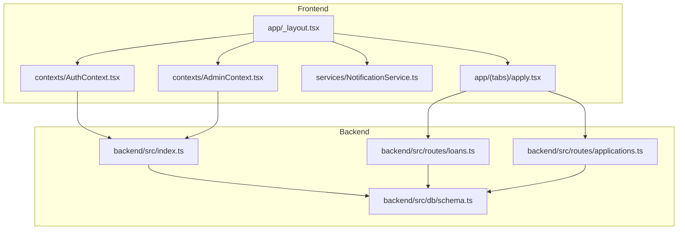
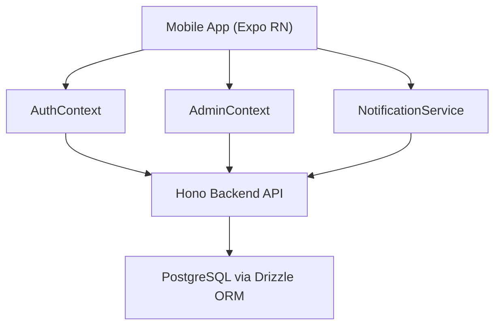
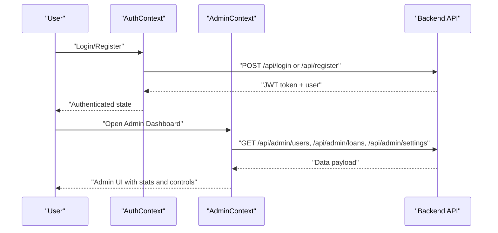
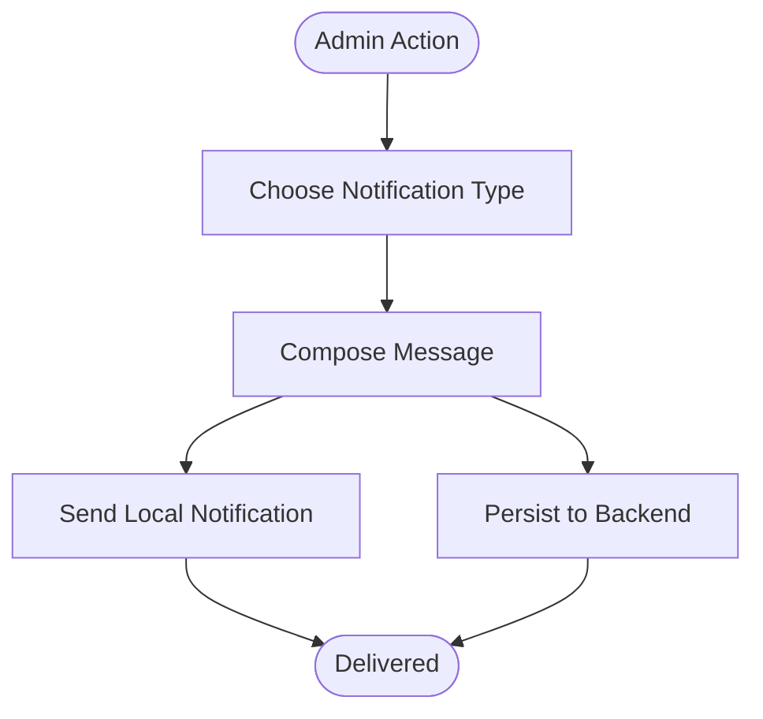
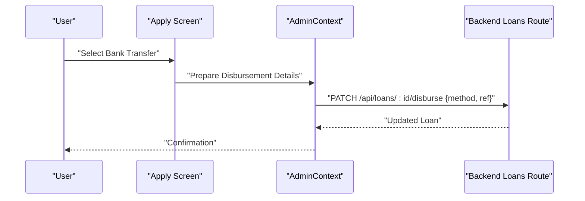
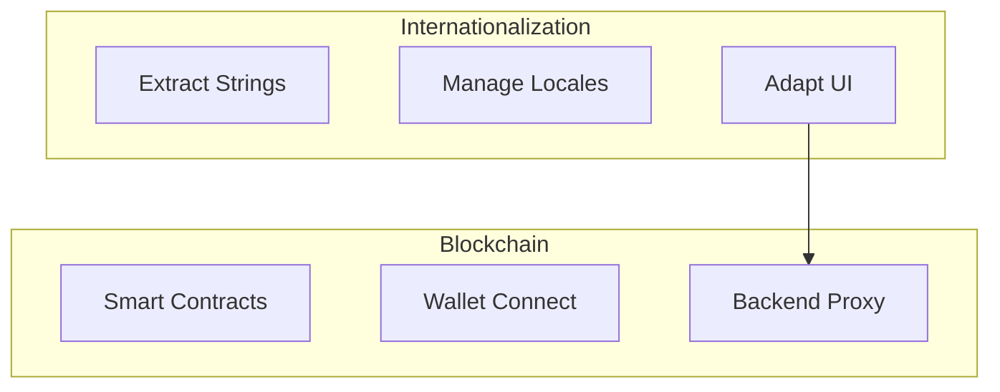
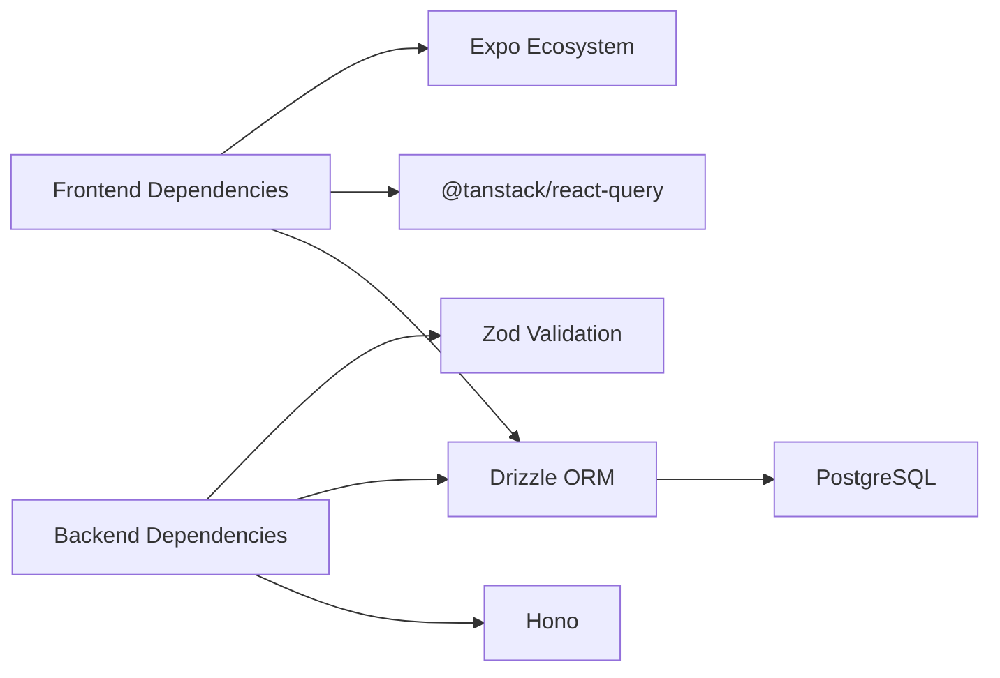

# Roadmap and Future Plans

<cite>
**Referenced Files in This Document**
- [README.md](file://README.md)
- [package.json](file://package.json)
- [backend/package.json](file://backend/package.json)
- [app/_layout.tsx](file://app/_layout.tsx)
- [app/admin/_layout.tsx](file://app/admin/_layout.tsx)
- [app/auth/_layout.tsx](file://app/auth/_layout.tsx)
- [contexts/AuthContext.tsx](file://contexts/AuthContext.tsx)
- [contexts/AdminContext.tsx](file://contexts/AdminContext.tsx)
- [services/NotificationService.ts](file://services/NotificationService.ts)
- [backend/src/index.ts](file://backend/src/index.ts)
- [backend/src/db/schema.ts](file://backend/src/db/schema.ts)
- [backend/src/routes/loans.ts](file://backend/src/routes/loans.ts)
- [backend/src/routes/applications.ts](file://backend/src/routes/applications.ts)
- [app/(tabs)/apply.tsx](file://app/(tabs)/apply.tsx)
</cite>

## Table of Contents
1. [Introduction](#introduction)
2. [Project Structure](#project-structure)
3. [Core Components](#core-components)
4. [Architecture Overview](#architecture-overview)
5. [Detailed Component Analysis](#detailed-component-analysis)
6. [Dependency Analysis](#dependency-analysis)
7. [Performance Considerations](#performance-considerations)
8. [Troubleshooting Guide](#troubleshooting-guide)
9. [Conclusion](#conroduction)
10. [Appendices](#appendices)

## Introduction
This document outlines the PHOENIX application roadmap and future development plans. It consolidates the official roadmap, current architecture, and implementation readiness to present a realistic, prioritized plan spanning Q1 2024 through Q4 2024. The plan covers bank integration for direct bank connections, AI assistant for smart loan recommendations, advanced analytics with predictive insights, multi-language international support, and blockchain integration for smart contracts. It also includes quarterly milestones, feature prioritization, resource allocation considerations, dependency mapping, innovation pipeline ideas, strategic partnerships, and community engagement processes.

## Project Structure
PHOENIX is a modern React Native mobile application with an integrated backend API and database. The frontend uses Expo Router for navigation, React Context for state management, and Drizzle ORM for database operations. The backend is built with Hono, TypeScript, and PostgreSQL via Drizzle ORM. The repository includes:
- Frontend app with user and admin areas
- Backend API with routes for authentication, loans, applications, users, notifications, and admin
- Database schema supporting users, loans, applications, repayments, and notifications
- Shared configuration and scripts for building, exporting, and running the app

**Diagram sources**
- [app/_layout.tsx:1-83](file://app/_layout.tsx#L1-L83)
- [contexts/AuthContext.tsx:1-135](file://contexts/AuthContext.tsx#L1-L135)
- [contexts/AdminContext.tsx:1-603](file://contexts/AdminContext.tsx#L1-L603)
- [services/NotificationService.ts:1-135](file://services/NotificationService.ts#L1-L135)
- [app/(tabs)/apply.tsx:1-456](file://app/(tabs)/apply.tsx#L1-L456)
- [backend/src/index.ts:1-76](file://backend/src/index.ts#L1-L76)
- [backend/src/routes/loans.ts:1-320](file://backend/src/routes/loans.ts#L1-L320)
- [backend/src/routes/applications.ts:1-168](file://backend/src/routes/applications.ts#L1-L168)
- [backend/src/db/schema.ts:1-151](file://backend/src/db/schema.ts#L1-L151)

**Section sources**
- [README.md:294-313](file://README.md#L294-L313)
- [package.json:1-84](file://package.json#L1-L84)
- [backend/package.json:1-46](file://backend/package.json#L1-L46)

## Core Components
- Authentication and user lifecycle: JWT-based login/register, session persistence, and user roles.
- Admin dashboard: Centralized control for managing users, reviewing applications, configuring rates and channels, and monitoring statistics.
- Notifications: Push and local notifications with backend persistence and delivery tracking.
- Loan lifecycle: Application submission, review, disbursement, repayment tracking, and completion.
- Data model: PostgreSQL tables for users, loans, applications, repayments, and notifications with relational integrity.

Key implementation indicators:
- Authentication endpoints and context provider are implemented and integrated.
- Admin context exposes CRUD-like actions and integrates with backend admin routes.
- Notifications service supports both local and backend-persisted notifications.
- Backend routes cover loan and application lifecycles with proper validation and database updates.

**Section sources**
- [contexts/AuthContext.tsx:1-135](file://contexts/AuthContext.tsx#L1-L135)
- [contexts/AdminContext.tsx:1-603](file://contexts/AdminContext.tsx#L1-L603)
- [services/NotificationService.ts:1-135](file://services/NotificationService.ts#L1-L135)
- [backend/src/routes/loans.ts:1-320](file://backend/src/routes/loans.ts#L1-L320)
- [backend/src/routes/applications.ts:1-168](file://backend/src/routes/applications.ts#L1-L168)
- [backend/src/db/schema.ts:1-151](file://backend/src/db/schema.ts#L1-L151)

## Architecture Overview
The system follows a client-server architecture:
- Frontend (React Native) handles UI, navigation, and state via contexts.
- Backend (Hono) serves REST endpoints, validates requests, and interacts with PostgreSQL via Drizzle ORM.
- Notifications span local device alerts and backend-stored records.

**Diagram sources**
- [app/_layout.tsx:1-83](file://app/_layout.tsx#L1-L83)
- [contexts/AuthContext.tsx:1-135](file://contexts/AuthContext.tsx#L1-L135)
- [contexts/AdminContext.tsx:1-603](file://contexts/AdminContext.tsx#L1-L603)
- [services/NotificationService.ts:1-135](file://services/NotificationService.ts#L1-L135)
- [backend/src/index.ts:1-76](file://backend/src/index.ts#L1-L76)
- [backend/src/db/schema.ts:1-151](file://backend/src/db/schema.ts#L1-L151)

## Detailed Component Analysis

### Q1 2024: Core App and Admin Dashboard
- Status: The core app and admin dashboard are largely implemented and integrated.
- Evidence:
  - Navigation stack includes user tabs and admin routes.
  - Admin context initializes defaults for interest rates, disbursement channels, and loan parameters.
  - Backend routes expose admin endpoints for users, loans, applications, and settings.
  - Authentication context supports login/register flows.
- Risk: Some endpoints currently rely on temporary headers for user identity; authentication middleware should be implemented for production.

**Diagram sources**
- [contexts/AuthContext.tsx:56-112](file://contexts/AuthContext.tsx#L56-L112)
- [contexts/AdminContext.tsx:199-285](file://contexts/AdminContext.tsx#L199-L285)
- [backend/src/index.ts:54-61](file://backend/src/index.ts#L54-L61)

**Section sources**
- [app/_layout.tsx:19-29](file://app/_layout.tsx#L19-L29)
- [app/admin/_layout.tsx:1-12](file://app/admin/_layout.tsx#L1-L12)
- [contexts/AdminContext.tsx:119-143](file://contexts/AdminContext.tsx#L119-L143)
- [backend/src/routes/loans.ts:92-138](file://backend/src/routes/loans.ts#L92-L138)
- [backend/src/routes/applications.ts:24-53](file://backend/src/routes/applications.ts#L24-L53)

### Q2 2024: Push Notifications and Analytics
- Push Notifications:
  - Implemented local and backend-persisted notifications with channel configuration and permission handling.
  - Admin can trigger notifications for user loan updates.
- Analytics:
  - Admin context computes stats (pending approvals, revenue, totals) from loaded datasets.
  - Backend maintains notifications and loan tables suitable for reporting.

**Diagram sources**
- [services/NotificationService.ts:71-134](file://services/NotificationService.ts#L71-L134)
- [contexts/AdminContext.tsx:311-361](file://contexts/AdminContext.tsx#L311-L361)
- [backend/src/db/schema.ts:84-93](file://backend/src/db/schema.ts#L84-L93)

**Section sources**
- [services/NotificationService.ts:1-135](file://services/NotificationService.ts#L1-L135)
- [contexts/AdminContext.tsx:568-583](file://contexts/AdminContext.tsx#L568-L583)
- [backend/src/db/schema.ts:1-151](file://backend/src/db/schema.ts#L1-L151)

### Q3 2024: Bank Integration and AI Features
- Bank Integration:
  - Current disbursement channels include mobile money and several banks; the UI supports selecting bank transfer options.
  - Backend supports adding disbursement metadata to loans.
  - Next steps: Integrate with external bank APIs for direct transfers and account verification.
- AI Assistant:
  - Recommended approach: Use a hosted LLM service (e.g., OpenAI, Claude) via a backend proxy to provide personalized loan recommendations based on user data and historical patterns.
  - Implementation pattern: Add a new route in the backend to accept user queries and return curated recommendations.

**Diagram sources**
- [app/(tabs)/apply.tsx:25-33](file://app/(tabs)/apply.tsx#L25-L33)
- [contexts/AdminContext.tsx:363-396](file://contexts/AdminContext.tsx#L363-L396)
- [backend/src/routes/loans.ts:224-250](file://backend/src/routes/loans.ts#L224-L250)

**Section sources**
- [app/(tabs)/apply.tsx:25-33](file://app/(tabs)/apply.tsx#L25-L33)
- [contexts/AdminContext.tsx:126-133](file://contexts/AdminContext.tsx#L126-L133)
- [backend/src/routes/loans.ts:10-79](file://backend/src/routes/loans.ts#L10-L79)

### Q4 2024: International Expansion and Blockchain
- International Expansion:
  - Multi-language support requires i18n libraries and locale-aware components.
  - Localization strategy: Extract strings, manage pluralization, and adapt date/time formats.
- Blockchain Integration:
  - Smart contracts can automate loan terms, collateral escrow, and repayment verification.
  - Recommended approach: Use a Layer 2 or sidechain for cost-effective transactions, integrate with wallet providers (e.g., WalletConnect), and expose contract interactions via backend endpoints.

[No sources needed since this diagram shows conceptual workflow, not actual code structure]

**Section sources**
- [README.md:298-302](file://README.md#L298-L302)

## Dependency Analysis
- Frontend dependencies include React Query for caching, Drizzle ORM for database operations, and Expo ecosystem packages for notifications and routing.
- Backend dependencies include Hono for routing, Drizzle ORM for database operations, and Zod for validation.
- Database schema defines relationships among users, loans, applications, repayments, and notifications.

**Diagram sources**
- [package.json:22-68](file://package.json#L22-L68)
- [backend/package.json:22-34](file://backend/package.json#L22-L34)
- [backend/src/db/schema.ts:1-151](file://backend/src/db/schema.ts#L1-L151)

**Section sources**
- [package.json:1-84](file://package.json#L1-L84)
- [backend/package.json:1-46](file://backend/package.json#L1-L46)
- [backend/src/db/schema.ts:1-151](file://backend/src/db/schema.ts#L1-L151)

## Performance Considerations
- Current performance targets include fast startup, optimized bundle size, and efficient memory usage.
- Recommendations:
  - Lazy-load heavy screens and modules.
  - Optimize database queries with appropriate indexes and pagination.
  - Use React Query caching strategically to reduce network calls.
  - Implement background sync for offline-capable features.

[No sources needed since this section provides general guidance]

## Troubleshooting Guide
- Authentication failures:
  - Verify API base URL and endpoint availability.
  - Check token persistence and AsyncStorage keys.
- Admin dashboard issues:
  - Confirm admin credentials and session persistence.
  - Validate backend admin routes and CORS configuration.
- Notifications:
  - Ensure permissions are granted and device-specific channels are configured.
  - Check backend notification persistence and delivery logs.

**Section sources**
- [contexts/AuthContext.tsx:40-54](file://contexts/AuthContext.tsx#L40-L54)
- [contexts/AdminContext.tsx:146-162](file://contexts/AdminContext.tsx#L146-L162)
- [services/NotificationService.ts:26-69](file://services/NotificationService.ts#L26-L69)

## Conclusion
PHOENIX is well-positioned to deliver a robust financial platform with a strong foundation in Q1 2024. The roadmap builds incrementally on existing capabilities: Q2 focuses on notifications and analytics, Q3 introduces bank integration and AI assistance, and Q4 expands globally with internationalization and blockchain automation. By maintaining clean separation of concerns, leveraging the current backend routes, and adopting modular integrations, the team can achieve predictable, high-quality releases aligned with user needs.

## Appendices

### Quarterly Milestones and Prioritization
- Q1 2024: Core app and admin dashboard (implemented)
- Q2 2024: Push notifications and analytics (implemented)
- Q3 2024: Bank integration and AI features (planned)
- Q4 2024: International expansion and blockchain (planned)

**Section sources**
- [README.md:304-312](file://README.md#L304-L312)

### Innovation Pipeline and Emerging Technologies
- AI/ML: Personalized recommendations via hosted LLMs with backend proxies.
- Blockchain: Layer 2 smart contracts for automated loan terms and collateral.
- Observability: Add structured logging and metrics collection.
- Accessibility: Expand WCAG compliance and assistive tech support.

[No sources needed since this section provides general guidance]

### Strategic Partnerships
- Banking: Partner with regional banks for ACH/bank transfer APIs.
- Payments: Collaborate with mobile money providers for seamless disbursements.
- AI/ML: Engage with AI vendors for recommendation engines.
- Legal/RegTech: Consult with compliance partners for regulatory readiness.

[No sources needed since this section provides general guidance]

### Community Feedback and Beta Programs
- Channels: GitHub issues, Discord, email, and social media.
- Beta program: Invite selective users to test new features and collect feedback.
- User-driven development: Use feature requests and voting systems to prioritize enhancements.

**Section sources**
- [README.md:315-330](file://README.md#L315-L330)