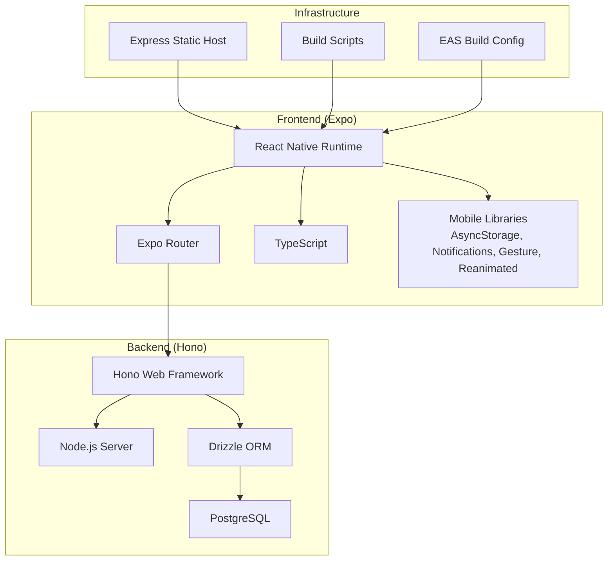
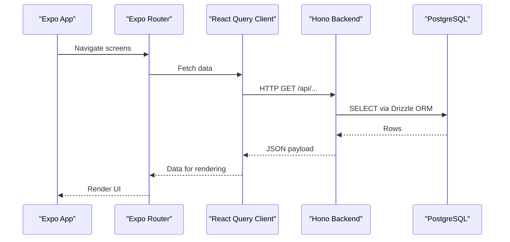
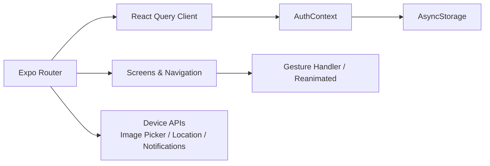
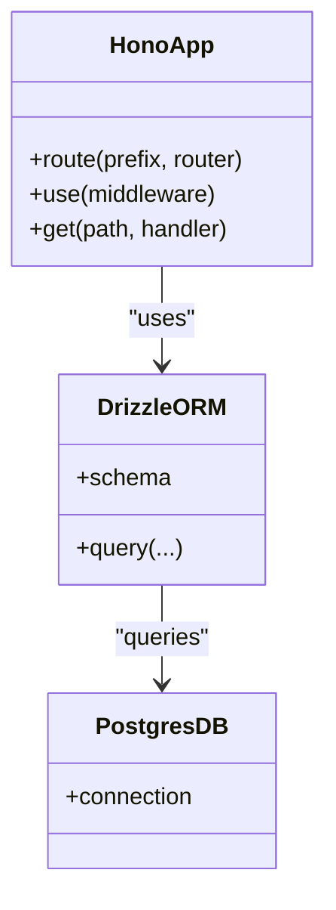
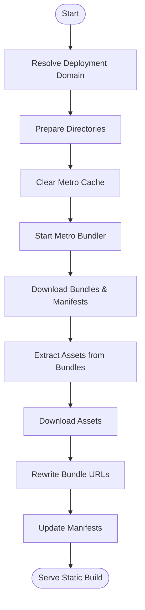
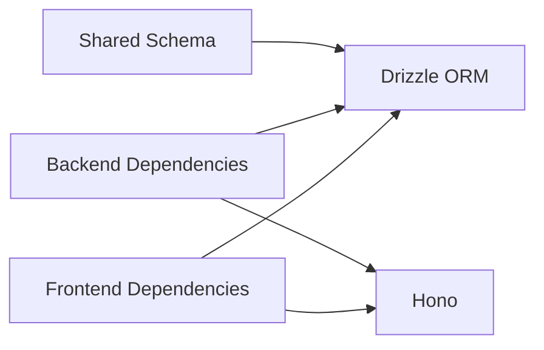

# Technology Stack

<cite>
**Referenced Files in This Document**
- [package.json](file://package.json)
- [backend/package.json](file://backend/package.json)
- [app.json](file://app.json)
- [tsconfig.json](file://tsconfig.json)
- [drizzle.config.ts](file://drizzle.config.ts)
- [metro.config.js](file://metro.config.js)
- [babel.config.js](file://babel.config.js)
- [eas.json](file://eas.json)
- [eslint.config.js](file://eslint.config.js)
- [scripts/build.js](file://scripts/build.js)
- [server/index.ts](file://server/index.ts)
- [backend/src/index.ts](file://backend/src/index.ts)
- [shared/schema.ts](file://shared/schema.ts)
- [contexts/AuthContext.tsx](file://contexts/AuthContext.tsx)
- [lib/query-client.ts](file://lib/query-client.ts)
</cite>

## Table of Contents
1. [Introduction](#introduction)
2. [Project Structure](#project-structure)
3. [Core Components](#core-components)
4. [Architecture Overview](#architecture-overview)
5. [Detailed Component Analysis](#detailed-component-analysis)
6. [Dependency Analysis](#dependency-analysis)
7. [Performance Considerations](#performance-considerations)
8. [Troubleshooting Guide](#troubleshooting-guide)
9. [Conclusion](#conclusion)
10. [Appendices](#appendices)

## Introduction
This document provides a comprehensive technology stack overview for the PHOENIX project. It covers the frontend (React Native, Expo Router, TypeScript, and mobile-specific libraries), the backend (Node.js, Hono framework, PostgreSQL, and Drizzle ORM), and the cross-platform deployment pipeline. It also documents build processes, deployment considerations, security posture, monitoring approaches, and maintenance strategies. Version compatibility and upgrade paths are included to guide future evolution.

## Project Structure
The repository is organized into a frontend application (Expo + React Native), a backend API (Hono + Node.js), a shared schema layer (Drizzle + Zod), and supporting infrastructure (Express-based static hosting, build scripts, and configuration).

**Diagram sources**
- [package.json:22-68](file://package.json#L22-L68)
- [backend/package.json:22-34](file://backend/package.json#L22-L34)
- [drizzle.config.ts:1-15](file://drizzle.config.ts#L1-L15)
- [server/index.ts:1-251](file://server/index.ts#L1-L251)
- [scripts/build.js:1-564](file://scripts/build.js#L1-L564)
- [eas.json:1-22](file://eas.json#L1-L22)

**Section sources**
- [package.json:1-84](file://package.json#L1-L84)
- [backend/package.json:1-46](file://backend/package.json#L1-L46)
- [app.json:1-77](file://app.json#L1-L77)
- [tsconfig.json:1-22](file://tsconfig.json#L1-L22)
- [drizzle.config.ts:1-15](file://drizzle.config.ts#L1-L15)
- [metro.config.js:1-18](file://metro.config.js#L1-L18)
- [babel.config.js:1-7](file://babel.config.js#L1-L7)
- [eas.json:1-22](file://eas.json#L1-L22)
- [eslint.config.js:1-10](file://eslint.config.js#L1-L10)

## Core Components
- Frontend: React Native with Expo, TypeScript, and a curated set of mobile-focused libraries for navigation, gestures, animations, notifications, and device capabilities.
- Backend: Hono microframework on Node.js, with Drizzle ORM for schema modeling and migrations, and PostgreSQL as the datastore.
- Shared Layer: A shared schema module using Drizzle and Zod for type-safe database models and validation.
- Deployment Pipeline: A custom build script orchestrating Metro bundling, manifest extraction, asset downloading, and static hosting via Express.

**Section sources**
- [package.json:22-68](file://package.json#L22-L68)
- [backend/package.json:22-34](file://backend/package.json#L22-L34)
- [shared/schema.ts:1-21](file://shared/schema.ts#L1-L21)
- [scripts/build.js:1-564](file://scripts/build.js#L1-L564)
- [server/index.ts:1-251](file://server/index.ts#L1-L251)

## Architecture Overview
The frontend communicates with the backend through REST endpoints exposed by the Hono server. The backend persists data in PostgreSQL using Drizzle ORM. A thin Express server serves prebuilt static assets and manifests for Expo Go deployments, enabling offline-capable, cross-platform distribution.

**Diagram sources**
- [contexts/AuthContext.tsx:1-135](file://contexts/AuthContext.tsx#L1-L135)
- [lib/query-client.ts:1-81](file://lib/query-client.ts#L1-L81)
- [backend/src/index.ts:1-76](file://backend/src/index.ts#L1-L76)
- [shared/schema.ts:1-21](file://shared/schema.ts#L1-L21)

## Detailed Component Analysis

### Frontend Stack: React Native, Expo Router, TypeScript, Mobile Libraries
- React Native and Expo: The project uses React Native 0.81.5 and Expo 54.x with Expo Router for file-based routing. The app.json config defines platform metadata, plugins, and experiments such as typed routes and React Compiler.
- TypeScript: Strict mode is enabled with custom path aliases and includes for generated types.
- Mobile Libraries:
  - Authentication and persistence: Async Storage for tokens and user profiles.
  - Navigation and UX: Gesture Handler, Reanimated, Safe Area Context, Screens, SVG.
  - Device and media: Image Picker, Location, Haptics, Web Browser, Symbols, Glass Effect.
  - Notifications: Expo Notifications configured with channels and sounds.
  - Networking: React Query for caching and optimistic updates; a custom fetch wrapper enforces credentials and error handling.
- Metro and Babel: Metro config extends Expo defaults and adds font asset extensions; Babel preset aligns with Expo’s runtime.

**Diagram sources**
- [package.json:22-68](file://package.json#L22-L68)
- [app.json:35-66](file://app.json#L35-L66)
- [contexts/AuthContext.tsx:1-135](file://contexts/AuthContext.tsx#L1-L135)
- [lib/query-client.ts:1-81](file://lib/query-client.ts#L1-L81)
- [metro.config.js:1-18](file://metro.config.js#L1-L18)
- [babel.config.js:1-7](file://babel.config.js#L1-L7)

**Section sources**
- [package.json:22-68](file://package.json#L22-L68)
- [app.json:1-77](file://app.json#L1-L77)
- [tsconfig.json:1-22](file://tsconfig.json#L1-L22)
- [metro.config.js:1-18](file://metro.config.js#L1-L18)
- [babel.config.js:1-7](file://babel.config.js#L1-L7)
- [contexts/AuthContext.tsx:1-135](file://contexts/AuthContext.tsx#L1-L135)
- [lib/query-client.ts:1-81](file://lib/query-client.ts#L1-L81)

### Backend Stack: Node.js, Hono, PostgreSQL, Drizzle ORM
- Hono: Minimalist web framework for routing, CORS, logging, and Swagger UI generation. The server exposes health checks, OpenAPI docs, and modular route groups.
- Node.js: Runs the Hono server with @hono/node-server and supports environment-driven configuration.
- PostgreSQL: Datastore accessed via Drizzle ORM with Zod validation for inserts.
- Drizzle: Schema definition and migrations are centralized in a shared module and configured via drizzle.config.ts.

**Diagram sources**
- [backend/src/index.ts:1-76](file://backend/src/index.ts#L1-L76)
- [drizzle.config.ts:1-15](file://drizzle.config.ts#L1-L15)
- [shared/schema.ts:1-21](file://shared/schema.ts#L1-L21)

**Section sources**
- [backend/src/index.ts:1-76](file://backend/src/index.ts#L1-L76)
- [backend/package.json:22-34](file://backend/package.json#L22-L34)
- [drizzle.config.ts:1-15](file://drizzle.config.ts#L1-L15)
- [shared/schema.ts:1-21](file://shared/schema.ts#L1-L21)

### Shared Schema and Validation
- The shared schema module defines a users table with UUID primary key, unique username, and password field. It pairs Drizzle tables with Zod insert schemas for runtime validation.
- This pattern ensures type safety across frontend and backend boundaries and simplifies migration generation and enforcement.

**Section sources**
- [shared/schema.ts:1-21](file://shared/schema.ts#L1-L21)
- [drizzle.config.ts:1-15](file://drizzle.config.ts#L1-L15)

### Build and Deployment Pipeline
- Static Build Script: Orchestrates Metro startup, bundle and manifest downloads, asset extraction, URL rewriting, and manifest updates. It supports iOS and Android outputs and writes to a timestamped directory for safe deployments.
- Express Static Hosting: Serves static Expo artifacts and dynamically routes manifests based on the expo-platform header. It also renders a landing page template with dynamic base URLs.
- EAS Build: Internal distribution and auto-incremented production builds are configured in eas.json.

**Diagram sources**
- [scripts/build.js:1-564](file://scripts/build.js#L1-L564)
- [server/index.ts:163-205](file://server/index.ts#L163-L205)
- [eas.json:1-22](file://eas.json#L1-22)

**Section sources**
- [scripts/build.js:1-564](file://scripts/build.js#L1-L564)
- [server/index.ts:1-251](file://server/index.ts#L1-L251)
- [eas.json:1-22](file://eas.json#L1-L22)

### Mobile-First Design and Cross-Platform Compatibility
- Mobile-first UI primitives: Gesture Handler, Reanimated, Safe Area Context, and Screens are used to ensure smooth, native-like interactions.
- Cross-platform: Expo Router and React Native enable code reuse across iOS and Android with platform-specific configurations in app.json.
- Web support: React Native Web and Expo Web Browser are included for browser targets.

**Section sources**
- [package.json:56-63](file://package.json#L56-L63)
- [app.json:16-34](file://app.json#L16-L34)

## Dependency Analysis
- Frontend dependencies include React Native, Expo ecosystem packages, Drizzle ORM, Zod, React Query, and device-related libraries.
- Backend dependencies include Hono, @hono/node-server, Drizzle ORM, Zod, Neon driver, bcrypt, JWT, and TypeScript tooling.
- Shared dependencies: Drizzle and Zod connect frontend and backend through a shared schema.

**Diagram sources**
- [package.json:22-68](file://package.json#L22-L68)
- [backend/package.json:22-34](file://backend/package.json#L22-L34)
- [shared/schema.ts:1-21](file://shared/schema.ts#L1-L21)

**Section sources**
- [package.json:22-68](file://package.json#L22-L68)
- [backend/package.json:22-34](file://backend/package.json#L22-L34)
- [shared/schema.ts:1-21](file://shared/schema.ts#L1-L21)

## Performance Considerations
- Frontend:
  - React Compiler and typed routes improve render performance and reduce runtime errors.
  - Metro asset handling and inlining are tuned for fast iteration and reduced bundle sizes.
- Backend:
  - Hono’s minimal overhead and streaming JSON responses keep latency low.
  - Drizzle ORM’s compile-time SQL generation reduces runtime parsing costs.
- Build:
  - Static builds decouple runtime from bundling, enabling CDN-friendly deployments and faster cold starts.

[No sources needed since this section provides general guidance]

## Troubleshooting Guide
- Build Failures:
  - Verify deployment domain environment variables and network connectivity to Metro.
  - Check Metro status endpoint and clear caches if bundling fails.
- Runtime Errors:
  - Inspect Express request logs for API calls and error payloads.
  - Confirm CORS settings and origin allowances for local and hosted environments.
- Authentication:
  - Ensure EXPO_PUBLIC_API_URL is set and matches the backend origin.
  - Validate AsyncStorage keys and token lifecycle.

**Section sources**
- [scripts/build.js:97-152](file://scripts/build.js#L97-L152)
- [server/index.ts:67-98](file://server/index.ts#L67-L98)
- [contexts/AuthContext.tsx:4-4](file://contexts/AuthContext.tsx#L4-L4)
- [lib/query-client.ts:8-18](file://lib/query-client.ts#L8-L18)

## Conclusion
PHOENIX leverages a modern, mobile-first stack with React Native and Expo for rapid cross-platform development, Hono for a lightweight backend, and Drizzle ORM for robust data modeling. The build and deployment pipeline enables efficient, repeatable releases with static hosting and manifest routing. The shared schema and strict TypeScript configuration promote reliability and maintainability across the stack.

[No sources needed since this section summarizes without analyzing specific files]

## Appendices

### Version Compatibility and Upgrade Paths
- React Native: 0.81.5
- Expo: ~54.0.27
- Expo Router: ~6.0.17
- TypeScript: ~5.9.2
- Hono: ^4.6.16
- Drizzle ORM: ^0.39.3
- Drizzle Kit: ^0.31.x
- Node.js: Align with Hono’s runtime support
- PostgreSQL: Standard SQL with Drizzle dialect

Upgrade strategy:
- Pin major versions in package.json and increment minor/patch for security fixes.
- Test Metro bundling and backend migrations after each upgrade.
- Validate typed routes and React Compiler behavior post-upgrade.

**Section sources**
- [package.json:54-68](file://package.json#L54-L68)
- [backend/package.json:23-34](file://backend/package.json#L23-L34)
- [drizzle.config.ts:1-15](file://drizzle.config.ts#L1-L15)

### Security Considerations
- Environment Variables:
  - Store DATABASE_URL, JWT secrets, and API domains in secure environment files.
- CORS:
  - Restrict origins to trusted hosts and enforce credentials where required.
- Authentication:
  - Use HTTPS-only cookies and secure token storage via AsyncStorage.
- Input Validation:
  - Enforce Zod schemas on all endpoints and form submissions.

**Section sources**
- [backend/src/index.ts:21-26](file://backend/src/index.ts#L21-L26)
- [contexts/AuthContext.tsx:4-4](file://contexts/AuthContext.tsx#L4-L4)
- [shared/schema.ts:14-17](file://shared/schema.ts#L14-L17)

### Monitoring Approaches
- Backend:
  - Enable Hono logger middleware for request tracing.
  - Expose health endpoints and document them via Swagger/OpenAPI.
- Frontend:
  - Wrap fetch calls with React Query to centralize error handling and retries.
- Infrastructure:
  - Log API requests and responses in Express for debugging and audit trails.

**Section sources**
- [backend/src/index.ts:19-31](file://backend/src/index.ts#L19-L31)
- [lib/query-client.ts:46-81](file://lib/query-client.ts#L46-L81)
- [server/index.ts:67-98](file://server/index.ts#L67-L98)

### Maintenance Strategies
- Dependency Updates:
  - Regularly audit lockfiles and update devDependencies alongside prod dependencies.
- Linting and Formatting:
  - Use ESLint with Expo configs to maintain code quality.
- Migrations:
  - Use Drizzle Kit for schema changes and generate SQL diffs before applying.

**Section sources**
- [package.json:70-81](file://package.json#L70-L81)
- [eslint.config.js:1-10](file://eslint.config.js#L1-L10)
- [drizzle.config.ts:1-15](file://drizzle.config.ts#L1-L15)