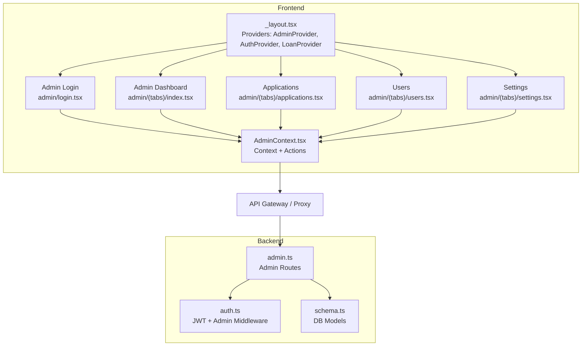
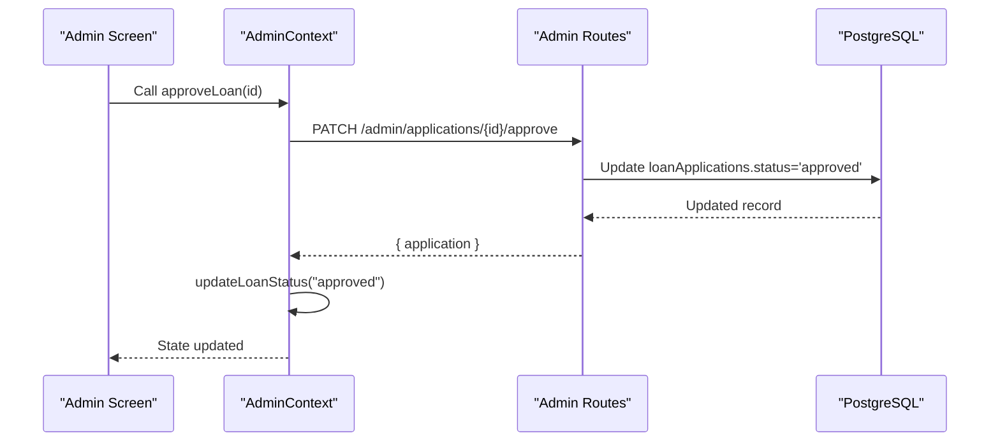
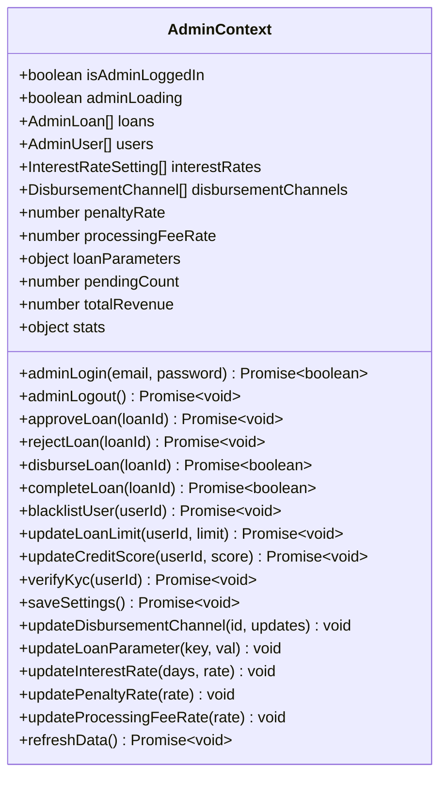
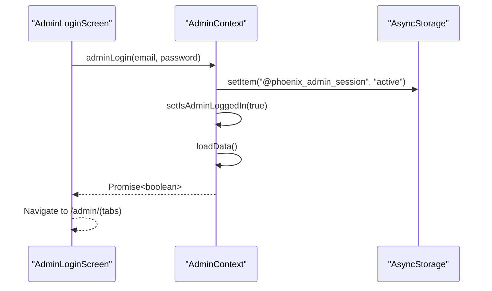
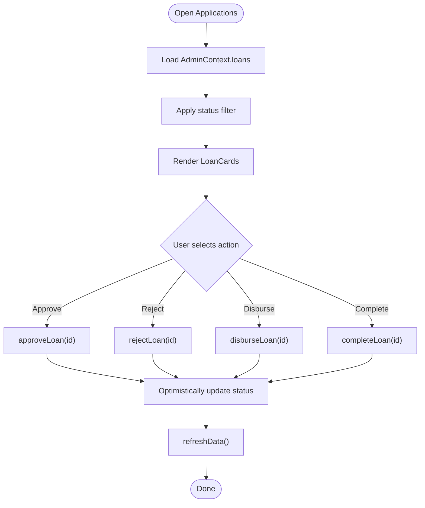
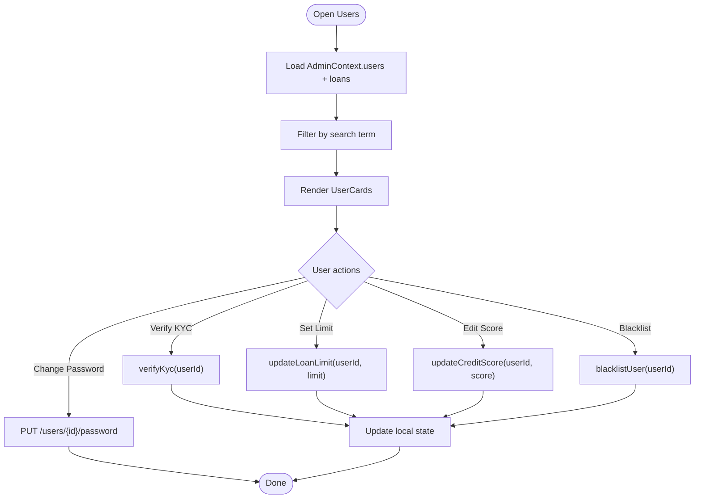
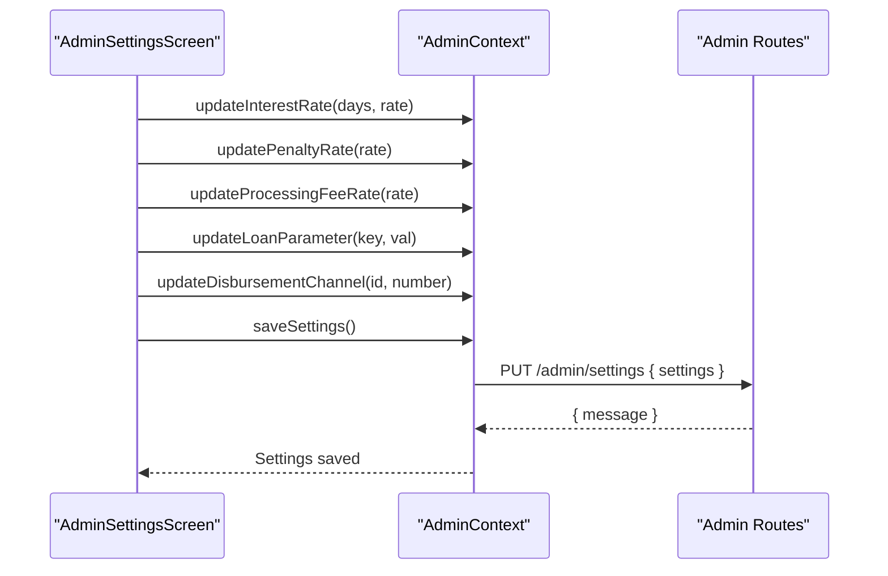
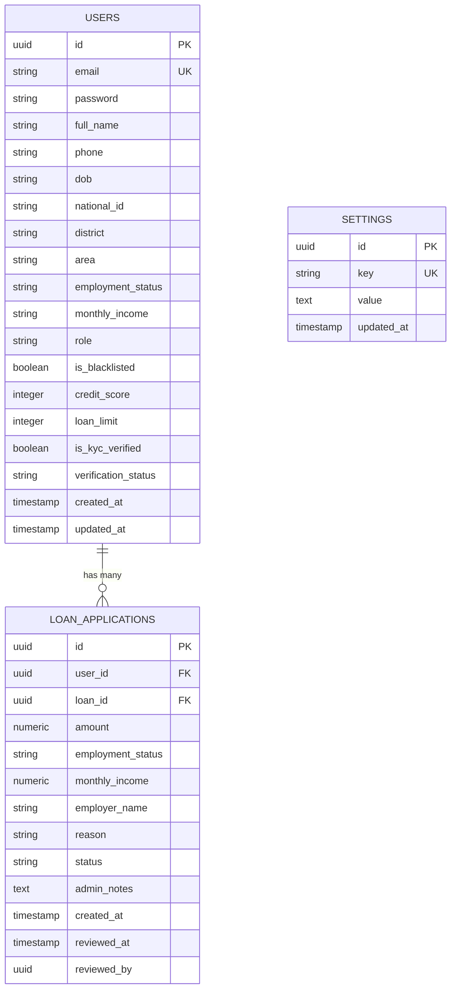
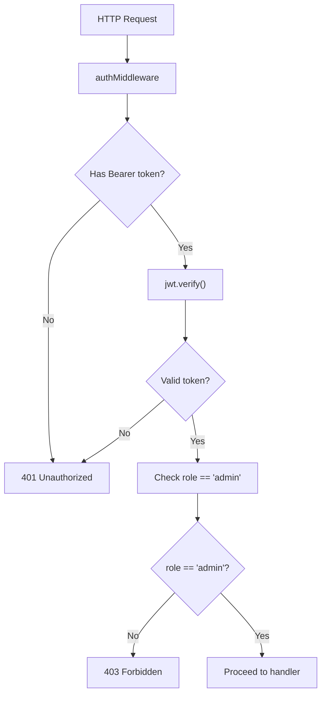
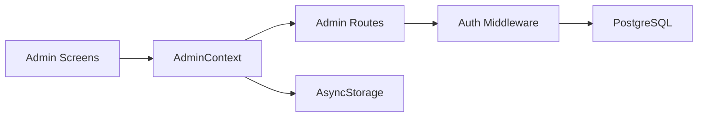

# Administrative Context

<cite>
**Referenced Files in This Document**
- [AdminContext.tsx](file://contexts/AdminContext.tsx)
- [admin.ts](file://backend/src/routes/admin.ts)
- [schema.ts](file://backend/src/db/schema.ts)
- [auth.ts](file://backend/src/middleware/auth.ts)
- [_layout.tsx](file://app/_layout.tsx)
- [admin/_layout.tsx](file://app/admin/_layout.tsx)
- [admin/login.tsx](file://app/admin/login.tsx)
- [admin/(tabs)/index.tsx](file://app/admin/(tabs)/index.tsx)
- [admin/(tabs)/applications.tsx](file://app/admin/(tabs)/applications.tsx)
- [admin/(tabs)/users.tsx](file://app/admin/(tabs)/users.tsx)
- [admin/(tabs)/settings.tsx](file://app/admin/(tabs)/settings.tsx)
- [AuthContext.tsx](file://contexts/AuthContext.tsx)
</cite>

## Table of Contents
1. [Introduction](#introduction)
2. [Project Structure](#project-structure)
3. [Core Components](#core-components)
4. [Architecture Overview](#architecture-overview)
5. [Detailed Component Analysis](#detailed-component-analysis)
6. [Dependency Analysis](#dependency-analysis)
7. [Performance Considerations](#performance-considerations)
8. [Troubleshooting Guide](#troubleshooting-guide)
9. [Conclusion](#conclusion)

## Introduction
This document explains the Administrative Context implementation that powers the Phoenix Loan admin portal. It covers how administrative state is managed for loan officers, including user management, application review workflows, system controls, and integration with admin-specific API endpoints. It also documents data visualization patterns, permission checks, and security considerations for role-based access control.

## Project Structure
The admin system spans three layers:
- Frontend React Native application with a dedicated AdminProvider that exposes administrative state and actions.
- Backend Hono server with admin routes for users, applications, settings, and system controls.
- Database schema modeling users, loan applications, and settings.

**Diagram sources**
- [_layout.tsx:65-79](file://app/_layout.tsx#L65-L79)
- [admin/_layout.tsx:4-11](file://app/admin/_layout.tsx#L4-L11)
- [admin/login.tsx:17-164](file://app/admin/login.tsx#L17-L164)
- [admin/(tabs)/index.tsx](file://app/admin/(tabs)/index.tsx#L121-L298)
- [admin/(tabs)/applications.tsx](file://app/admin/(tabs)/applications.tsx#L155-L336)
- [admin/(tabs)/users.tsx](file://app/admin/(tabs)/users.tsx#L278-L399)
- [admin/(tabs)/settings.tsx](file://app/admin/(tabs)/settings.tsx#L174-L407)
- [AdminContext.tsx:135-541](file://contexts/AdminContext.tsx#L135-L541)
- [admin.ts:1-543](file://backend/src/routes/admin.ts#L1-L543)
- [auth.ts:10-47](file://backend/src/middleware/auth.ts#L10-L47)
- [schema.ts:1-151](file://backend/src/db/schema.ts#L1-L151)

**Section sources**
- [_layout.tsx:65-79](file://app/_layout.tsx#L65-L79)
- [admin/_layout.tsx:4-11](file://app/admin/_layout.tsx#L4-L11)

## Core Components
- AdminProvider: Central administrative state container with user and loan data, system settings, and administrative actions (approve, reject, disburse, complete, blacklist, update limits/scores, verify KYC, save settings, refresh).
- AdminContext: Typed React Context exposing state and actions to admin screens.
- Admin Screens: Applications, Users, Settings, and Overview dashboards that consume AdminContext.
- Backend Admin Routes: Endpoints for users, applications, settings, and administrative controls.
- Authentication and Authorization: JWT middleware and admin-only guard.

Key responsibilities:
- State management: Loans, users, interest rates, disbursement channels, penalties, processing fee, loan parameters.
- Workflows: Application review lifecycle, disbursement, completion, user management (KYC, limits, scores, blacklist), settings persistence.
- UI integration: Dashboards, cards, modals, and forms driven by AdminContext actions.

**Section sources**
- [AdminContext.tsx:77-115](file://contexts/AdminContext.tsx#L77-L115)
- [AdminContext.tsx:135-541](file://contexts/AdminContext.tsx#L135-L541)
- [admin.ts:8-49](file://backend/src/routes/admin.ts#L8-L49)
- [admin.ts:51-96](file://backend/src/routes/admin.ts#L51-L96)
- [admin.ts:129-170](file://backend/src/routes/admin.ts#L129-L170)

## Architecture Overview
The admin portal follows a layered architecture:
- UI Layer: Admin screens render dashboards and forms.
- Context Layer: AdminContext encapsulates state and actions.
- API Layer: Admin routes expose CRUD and administrative operations.
- Persistence Layer: PostgreSQL via Drizzle ORM.

**Diagram sources**
- [AdminContext.tsx:311-335](file://contexts/AdminContext.tsx#L311-L335)
- [admin.ts:273-305](file://backend/src/routes/admin.ts#L273-L305)

**Section sources**
- [AdminContext.tsx:304-335](file://contexts/AdminContext.tsx#L304-L335)
- [admin.ts:172-204](file://backend/src/routes/admin.ts#L172-L204)

## Detailed Component Analysis

### AdminContext: State and Actions
AdminContext manages:
- Authentication state and session persistence.
- Data loading from admin endpoints with fallback to AsyncStorage.
- Administrative actions for applications and users.
- System settings management and persistence.
- Computed statistics and totals.

**Diagram sources**
- [AdminContext.tsx:77-115](file://contexts/AdminContext.tsx#L77-L115)
- [AdminContext.tsx:135-541](file://contexts/AdminContext.tsx#L135-L541)

Key behaviors:
- Session management: Stores an admin session marker in AsyncStorage and loads cached data on startup.
- Data synchronization: Loads users, loans, and settings concurrently; merges server data with local cache; falls back gracefully.
- Application lifecycle: Approve, reject, disburse, and complete with optimistic UI updates and server-side persistence.
- User management: Update credit score, loan limit, KYC verification, and blacklist toggling.
- Settings: Update interest rates, penalty rate, processing fee, loan parameters, and disbursement channels; persist via PUT to settings endpoint.
- Statistics: Computes counts and totals for dashboards.

**Section sources**
- [AdminContext.tsx:146-162](file://contexts/AdminContext.tsx#L146-L162)
- [AdminContext.tsx:199-285](file://contexts/AdminContext.tsx#L199-L285)
- [AdminContext.tsx:304-335](file://contexts/AdminContext.tsx#L304-L335)
- [AdminContext.tsx:337-361](file://contexts/AdminContext.tsx#L337-L361)
- [AdminContext.tsx:363-396](file://contexts/AdminContext.tsx#L363-L396)
- [AdminContext.tsx:398-433](file://contexts/AdminContext.tsx#L398-L433)
- [AdminContext.tsx:435-460](file://contexts/AdminContext.tsx#L435-L460)
- [AdminContext.tsx:462-498](file://contexts/AdminContext.tsx#L462-L498)
- [AdminContext.tsx:500-511](file://contexts/AdminContext.tsx#L500-L511)
- [AdminContext.tsx:513-528](file://contexts/AdminContext.tsx#L513-L528)

### Admin Login Flow
The login screen validates credentials and transitions to the admin dashboard after a successful session.

**Diagram sources**
- [admin/login.tsx:42-59](file://app/admin/login.tsx#L42-L59)
- [AdminContext.tsx:287-295](file://contexts/AdminContext.tsx#L287-L295)
- [AdminContext.tsx:146-162](file://contexts/AdminContext.tsx#L146-L162)

**Section sources**
- [admin/login.tsx:42-59](file://app/admin/login.tsx#L42-L59)
- [AdminContext.tsx:287-295](file://contexts/AdminContext.tsx#L287-L295)

### Applications Dashboard
The Applications screen displays loan cards with status badges, amounts, and action buttons. It supports filtering by status and refresh via pull-to-refresh.

**Diagram sources**
- [admin/(tabs)/applications.tsx](file://app/admin/(tabs)/applications.tsx#L155-L336)
- [AdminContext.tsx:311-335](file://contexts/AdminContext.tsx#L311-L335)
- [AdminContext.tsx:337-361](file://contexts/AdminContext.tsx#L337-L361)
- [AdminContext.tsx:363-396](file://contexts/AdminContext.tsx#L363-L396)
- [AdminContext.tsx:398-433](file://contexts/AdminContext.tsx#L398-L433)
- [AdminContext.tsx:500-511](file://contexts/AdminContext.tsx#L500-L511)

**Section sources**
- [admin/(tabs)/applications.tsx](file://app/admin/(tabs)/applications.tsx#L155-L336)
- [AdminContext.tsx:311-335](file://contexts/AdminContext.tsx#L311-L335)
- [AdminContext.tsx:337-361](file://contexts/AdminContext.tsx#L337-L361)
- [AdminContext.tsx:363-396](file://contexts/AdminContext.tsx#L363-L396)
- [AdminContext.tsx:398-433](file://contexts/AdminContext.tsx#L398-L433)
- [AdminContext.tsx:500-511](file://contexts/AdminContext.tsx#L500-L511)

### Users Dashboard
The Users screen supports searching by name, email, or phone, and provides administrative actions per user.

**Diagram sources**
- [admin/(tabs)/users.tsx](file://app/admin/(tabs)/users.tsx#L278-L399)
- [AdminContext.tsx:435-460](file://contexts/AdminContext.tsx#L435-L460)
- [AdminContext.tsx:447-455](file://contexts/AdminContext.tsx#L447-L455)
- [AdminContext.tsx:452-455](file://contexts/AdminContext.tsx#L452-L455)
- [admin.ts:424-462](file://backend/src/routes/admin.ts#L424-L462)

**Section sources**
- [admin/(tabs)/users.tsx](file://app/admin/(tabs)/users.tsx#L278-L399)
- [AdminContext.tsx:435-460](file://contexts/AdminContext.tsx#L435-L460)
- [AdminContext.tsx:447-455](file://contexts/AdminContext.tsx#L447-L455)
- [AdminContext.tsx:452-455](file://contexts/AdminContext.tsx#L452-L455)
- [admin.ts:424-462](file://backend/src/routes/admin.ts#L424-L462)

### Settings Dashboard
The Settings screen allows administrators to adjust interest rates, penalties, processing fees, loan parameters, and disbursement channel numbers. Changes are persisted via a single PUT to settings.

**Diagram sources**
- [admin/(tabs)/settings.tsx](file://app/admin/(tabs)/settings.tsx#L174-L407)
- [AdminContext.tsx:462-498](file://contexts/AdminContext.tsx#L462-L498)
- [AdminContext.tsx:482-498](file://contexts/AdminContext.tsx#L482-L498)
- [admin.ts:148-170](file://backend/src/routes/admin.ts#L148-L170)

**Section sources**
- [admin/(tabs)/settings.tsx](file://app/admin/(tabs)/settings.tsx#L174-L407)
- [AdminContext.tsx:462-498](file://contexts/AdminContext.tsx#L462-L498)
- [AdminContext.tsx:482-498](file://contexts/AdminContext.tsx#L482-L498)
- [admin.ts:148-170](file://backend/src/routes/admin.ts#L148-L170)

### Backend Admin Routes and Data Model
The backend defines admin endpoints for users, applications, settings, and administrative controls. The database schema models users, loan applications, and settings.

**Diagram sources**
- [schema.ts:4-26](file://backend/src/db/schema.ts#L4-L26)
- [schema.ts:53-68](file://backend/src/db/schema.ts#L53-L68)
- [schema.ts:95-101](file://backend/src/db/schema.ts#L95-L101)

Admin endpoints:
- GET /admin/users, /admin/loans, /admin/stats, /admin/settings
- PATCH /admin/applications/:id/{approve,reject,disburse,complete}
- PATCH /admin/users/:id/{verify-kyc,credit-score,loan-limit,blacklist,password}
- PUT /admin/settings

**Section sources**
- [admin.ts:8-49](file://backend/src/routes/admin.ts#L8-L49)
- [admin.ts:51-96](file://backend/src/routes/admin.ts#L51-L96)
- [admin.ts:98-127](file://backend/src/routes/admin.ts#L98-L127)
- [admin.ts:129-170](file://backend/src/routes/admin.ts#L129-L170)
- [admin.ts:172-204](file://backend/src/routes/admin.ts#L172-L204)
- [admin.ts:206-237](file://backend/src/routes/admin.ts#L206-L237)
- [admin.ts:239-271](file://backend/src/routes/admin.ts#L239-L271)
- [admin.ts:273-305](file://backend/src/routes/admin.ts#L273-L305)
- [admin.ts:307-500](file://backend/src/routes/admin.ts#L307-L500)
- [schema.ts:4-26](file://backend/src/db/schema.ts#L4-L26)
- [schema.ts:53-68](file://backend/src/db/schema.ts#L53-L68)
- [schema.ts:95-101](file://backend/src/db/schema.ts#L95-L101)

### Security and Role-Based Access Control
- Admin-only routes: The backend enforces admin-only access via middleware.
- JWT-based authentication: Requests include Authorization: Bearer tokens; invalid or missing tokens are rejected.
- Admin context: Frontend stores an admin session marker to gate admin UI and actions.

**Diagram sources**
- [auth.ts:10-47](file://backend/src/middleware/auth.ts#L10-L47)

**Section sources**
- [auth.ts:10-47](file://backend/src/middleware/auth.ts#L10-L47)
- [AdminContext.tsx:287-295](file://contexts/AdminContext.tsx#L287-L295)

## Dependency Analysis
AdminContext depends on:
- AsyncStorage for session and cache persistence.
- Admin routes for data and administrative operations.
- Backend middleware for authentication and authorization.

**Diagram sources**
- [AdminContext.tsx:1-6](file://contexts/AdminContext.tsx#L1-L6)
- [AdminContext.tsx:146-162](file://contexts/AdminContext.tsx#L146-L162)
- [AdminContext.tsx:201-205](file://contexts/AdminContext.tsx#L201-L205)
- [admin.ts:1-6](file://backend/src/routes/admin.ts#L1-L6)
- [auth.ts:10-47](file://backend/src/middleware/auth.ts#L10-L47)

**Section sources**
- [AdminContext.tsx:1-6](file://contexts/AdminContext.tsx#L1-L6)
- [AdminContext.tsx:146-162](file://contexts/AdminContext.tsx#L146-L162)
- [AdminContext.tsx:201-205](file://contexts/AdminContext.tsx#L201-L205)
- [admin.ts:1-6](file://backend/src/routes/admin.ts#L1-L6)
- [auth.ts:10-47](file://backend/src/middleware/auth.ts#L10-L47)

## Performance Considerations
- Concurrent data loading: AdminContext fetches users, loans, and settings in parallel to reduce latency.
- Local caching: Uses AsyncStorage to cache loans and users for offline resilience and faster reloads.
- Optimistic updates: Application status updates occur immediately in the UI before confirming with the server.
- Pagination: Backend endpoints support pagination to limit payload sizes for users and loans.
- Computed stats: Stats and totals are computed via useMemo to avoid unnecessary recalculations.

[No sources needed since this section provides general guidance]

## Troubleshooting Guide
Common issues and resolutions:
- Login failures: Ensure demo credentials are used; verify AsyncStorage session key and network connectivity.
- Data not loading: Check backend endpoints availability; confirm AsyncStorage cache integrity.
- Application actions failing: Inspect network errors and server responses; verify admin routes are reachable.
- Settings not saving: Confirm PUT to /admin/settings succeeds; check for malformed JSON in settings payload.
- Authorization errors: Verify JWT token presence and validity; ensure role is admin.

**Section sources**
- [admin/login.tsx:42-59](file://app/admin/login.tsx#L42-L59)
- [AdminContext.tsx:199-285](file://contexts/AdminContext.tsx#L199-L285)
- [AdminContext.tsx:311-335](file://contexts/AdminContext.tsx#L311-L335)
- [AdminContext.tsx:482-498](file://contexts/AdminContext.tsx#L482-L498)
- [auth.ts:10-47](file://backend/src/middleware/auth.ts#L10-L47)

## Conclusion
The AdminContext provides a cohesive administrative layer for Phoenix Loan’s admin portal. It centralizes state, integrates with admin-specific backend endpoints, and offers robust UI dashboards for reviewing applications, managing users, and configuring system settings. With AsyncStorage-backed caching, optimistic UI updates, and strict admin-only access control, it balances responsiveness, reliability, and security.