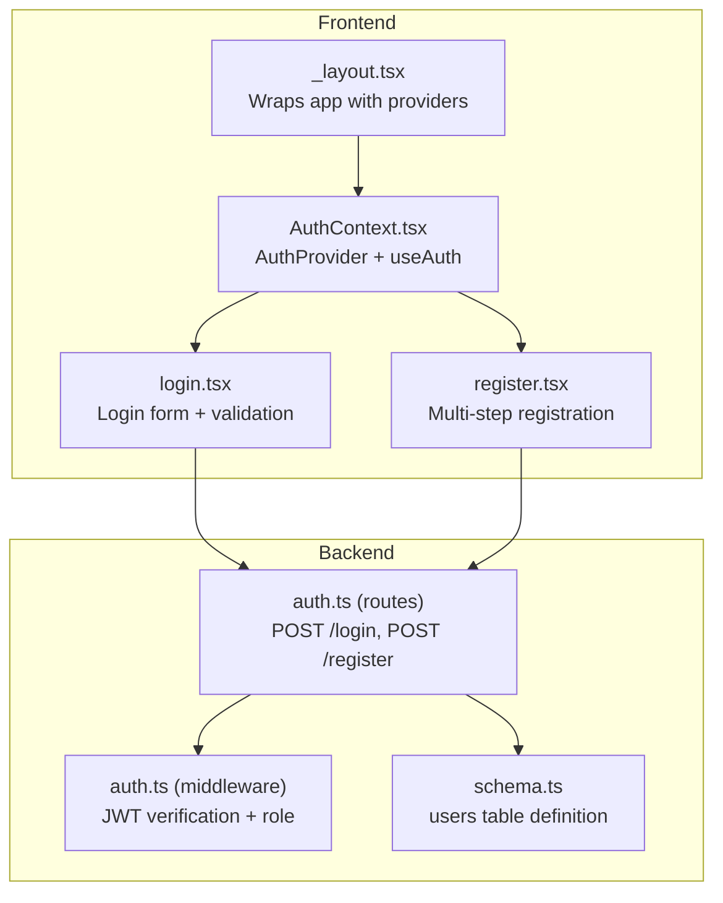
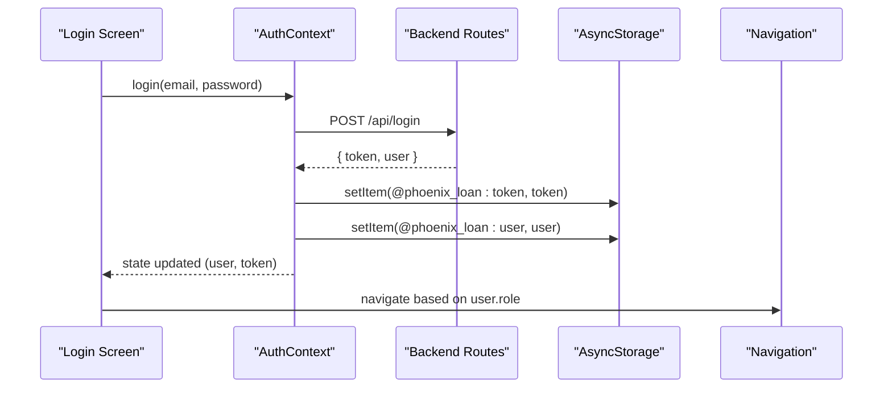
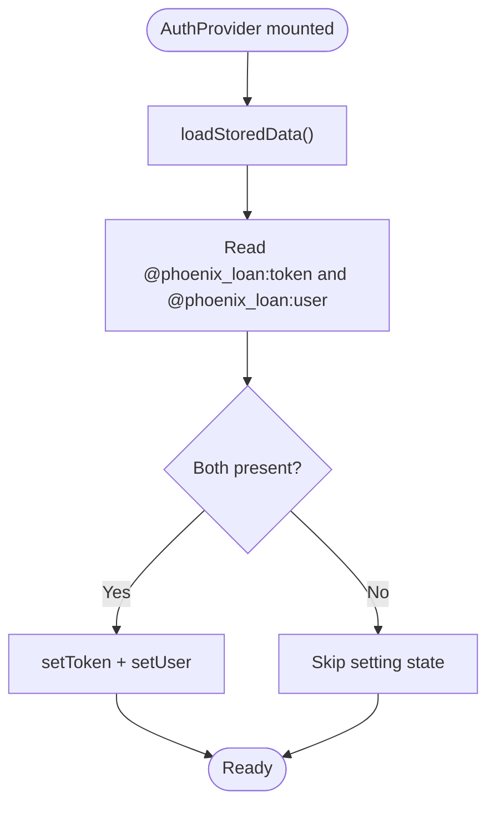
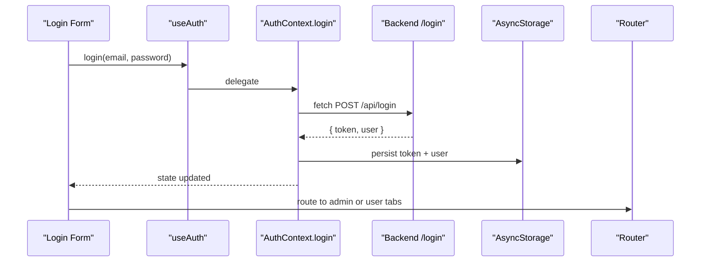
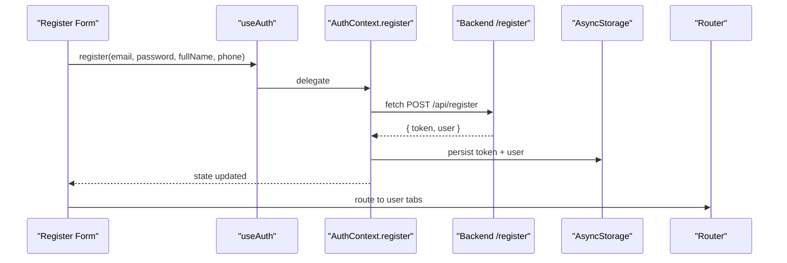
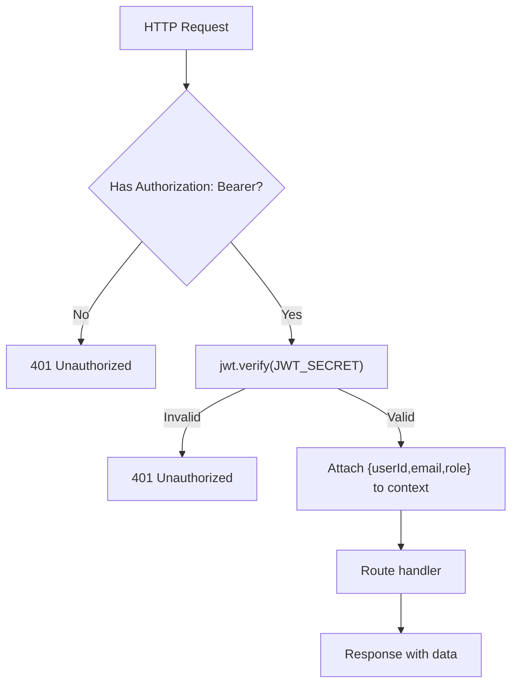
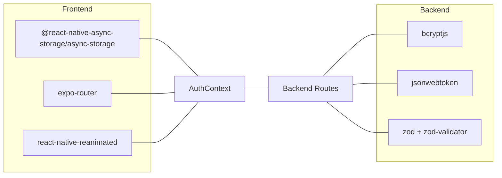

# Authentication Context

<cite>
**Referenced Files in This Document**
- [AuthContext.tsx](file://contexts/AuthContext.tsx)
- [login.tsx](file://app/auth/login.tsx)
- [register.tsx](file://app/auth/register.tsx)
- [_layout.tsx](file://app/_layout.tsx)
- [auth.ts](file://backend/src/routes/auth.ts)
- [auth.ts](file://backend/src/middleware/auth.ts)
- [schema.ts](file://backend/src/db/schema.ts)
- [package.json](file://package.json)
</cite>

## Table of Contents
1. [Introduction](#introduction)
2. [Project Structure](#project-structure)
3. [Core Components](#core-components)
4. [Architecture Overview](#architecture-overview)
5. [Detailed Component Analysis](#detailed-component-analysis)
6. [Dependency Analysis](#dependency-analysis)
7. [Performance Considerations](#performance-considerations)
8. [Troubleshooting Guide](#troubleshooting-guide)
9. [Conclusion](#conclusion)

## Introduction
This document provides comprehensive documentation for the AuthContext implementation, focusing on authentication state management, JWT token handling, and persistent storage using AsyncStorage. It explains the provider pattern, login and registration flows, logout behavior, and security considerations. It also includes practical usage examples with the useAuth hook, component integration patterns, and troubleshooting guidance.

## Project Structure
The authentication system spans frontend React Native components and backend Hono routes. The AuthContext provider wraps the application, exposing authentication state and actions to all screens. Login and registration screens consume the context to perform authentication operations against the backend API.

**Diagram sources**
- [_layout.tsx:66-79](file://app/_layout.tsx#L66-L79)
- [AuthContext.tsx:31-126](file://contexts/AuthContext.tsx#L31-L126)
- [login.tsx:80-134](file://app/auth/login.tsx#L80-L134)
- [register.tsx:178-250](file://app/auth/register.tsx#L178-L250)
- [auth.ts:95-143](file://backend/src/routes/auth.ts#L95-L143)
- [auth.ts:10-47](file://backend/src/middleware/auth.ts#L10-L47)
- [schema.ts:4-21](file://backend/src/db/schema.ts#L4-L21)

**Section sources**
- [_layout.tsx:66-79](file://app/_layout.tsx#L66-L79)
- [AuthContext.tsx:31-126](file://contexts/AuthContext.tsx#L31-L126)

## Core Components
- AuthProvider: Manages authentication state (user, token, loading), loads persisted data on startup, and exposes login, register, and logout functions.
- useAuth: Hook to access authentication state and actions from any component.
- Login Screen: Validates inputs, calls login, handles redirects based on role, and displays errors.
- Registration Screen: Multi-step form collecting KYC data, validates inputs, calls register, and redirects to the main app.

Key responsibilities:
- State management: user, token, loading
- Persistence: AsyncStorage keys @phoenix_loan:token and @phoenix_loan:user
- API integration: POST /api/login and POST /api/register
- Role-based routing: redirect to admin or user tabs based on user role

**Section sources**
- [AuthContext.tsx:6-27](file://contexts/AuthContext.tsx#L6-L27)
- [AuthContext.tsx:31-126](file://contexts/AuthContext.tsx#L31-L126)
- [login.tsx:80-134](file://app/auth/login.tsx#L80-L134)
- [register.tsx:178-250](file://app/auth/register.tsx#L178-L250)

## Architecture Overview
The authentication flow integrates AsyncStorage persistence, React Context state, and backend API endpoints secured by JWT middleware.

**Diagram sources**
- [login.tsx:101-134](file://app/auth/login.tsx#L101-L134)
- [AuthContext.tsx:56-79](file://contexts/AuthContext.tsx#L56-L79)
- [auth.ts:95-143](file://backend/src/routes/auth.ts#L95-L143)

## Detailed Component Analysis

### AuthContext Provider
AuthContext manages:
- State: user, token, loading
- Lifecycle: loads persisted data on mount
- Actions: login, register, logout
- Persistence: AsyncStorage keys for token and user

Implementation highlights:
- loadStoredData reads AsyncStorage and sets initial state
- login posts credentials, stores token and user, and updates state
- register posts user data, stores token and user, and updates state
- logout clears state and removes AsyncStorage items

**Diagram sources**
- [AuthContext.tsx:36-54](file://contexts/AuthContext.tsx#L36-L54)

**Section sources**
- [AuthContext.tsx:31-126](file://contexts/AuthContext.tsx#L31-L126)

### Login Screen Integration
The login screen:
- Uses useAuth to access login
- Validates email and password
- Calls login and navigates based on user role
- Handles errors with alerts and haptics

**Diagram sources**
- [login.tsx:80-134](file://app/auth/login.tsx#L80-L134)
- [AuthContext.tsx:56-79](file://contexts/AuthContext.tsx#L56-L79)
- [auth.ts:95-143](file://backend/src/routes/auth.ts#L95-L143)

**Section sources**
- [login.tsx:80-134](file://app/auth/login.tsx#L80-L134)

### Registration Screen Integration
The registration screen:
- Uses useAuth to access register
- Collects KYC data across steps
- Validates each step
- Calls register and navigates to user tabs

**Diagram sources**
- [register.tsx:178-250](file://app/auth/register.tsx#L178-L250)
- [AuthContext.tsx:81-112](file://contexts/AuthContext.tsx#L81-L112)
- [auth.ts:32-93](file://backend/src/routes/auth.ts#L32-L93)

**Section sources**
- [register.tsx:178-250](file://app/auth/register.tsx#L178-L250)

### Backend Authentication Routes and Middleware
Backend endpoints:
- POST /api/login: validates credentials, compares password hash, generates JWT, returns user and token
- POST /api/register: validates input, checks uniqueness, hashes password, creates user with role 'user', generates JWT

Middleware:
- authMiddleware verifies Authorization Bearer token and attaches user info to context
- adminMiddleware restricts access to admin role

**Diagram sources**
- [auth.ts:10-47](file://backend/src/middleware/auth.ts#L10-L47)
- [auth.ts:95-143](file://backend/src/routes/auth.ts#L95-L143)

**Section sources**
- [auth.ts:32-143](file://backend/src/routes/auth.ts#L32-L143)
- [auth.ts:10-47](file://backend/src/middleware/auth.ts#L10-L47)
- [schema.ts:4-21](file://backend/src/db/schema.ts#L4-L21)

## Dependency Analysis
- Frontend dependencies:
  - @react-native-async-storage/async-storage for token and user persistence
  - expo-router for navigation
  - react-native-reanimated for animations
- Backend dependencies:
  - bcryptjs for password hashing
  - jsonwebtoken for JWT signing/verification
  - zod + zod-validator for request validation

**Diagram sources**
- [package.json:25-68](file://package.json#L25-L68)
- [AuthContext.tsx:1-4](file://contexts/AuthContext.tsx#L1-L4)
- [auth.ts:1-10](file://backend/src/routes/auth.ts#L1-L10)

**Section sources**
- [package.json:25-68](file://package.json#L25-L68)

## Performance Considerations
- Asynchronous operations: All network requests and AsyncStorage reads/writes are asynchronous; ensure UI remains responsive by disabling buttons during operations.
- Token lifetime: JWT tokens are configured to expire in 7 days; consider implementing token refresh strategies if long sessions are required.
- Validation overhead: Frontend validation reduces unnecessary network calls; keep validation logic efficient and localized.
- Navigation: Role-based navigation avoids redundant API calls by redirecting immediately after successful login.

## Troubleshooting Guide
Common issues and resolutions:
- Login fails with invalid credentials:
  - Verify email and password meet backend validation requirements.
  - Check backend logs for credential mismatch messages.
- Registration fails:
  - Ensure all required fields are filled and formatted correctly.
  - Confirm email uniqueness and password length constraints.
- AsyncStorage corruption:
  - Clear AsyncStorage keys @phoenix_loan:token and @phoenix_loan:user to reset state.
  - Reinstall app if necessary.
- Navigation after login:
  - Confirm user.role is correctly persisted and read from AsyncStorage.
  - Ensure navigation routes exist for admin and user tabs.
- JWT verification errors:
  - Verify JWT_SECRET environment variable is set on the backend.
  - Ensure Authorization header is present and prefixed with "Bearer ".
- CORS or API URL issues:
  - Confirm EXPO_PUBLIC_API_URL is set and reachable from the device/emulator.

Debugging techniques:
- Enable console logging in AuthContext actions and screens to trace state changes.
- Use AsyncStorage inspection tools to verify token and user persistence.
- Test backend endpoints independently with curl or Postman to isolate frontend issues.

**Section sources**
- [AuthContext.tsx:40-54](file://contexts/AuthContext.tsx#L40-L54)
- [login.tsx:113-134](file://app/auth/login.tsx#L113-L134)
- [register.tsx:239-249](file://app/auth/register.tsx#L239-L249)
- [auth.ts:10-47](file://backend/src/middleware/auth.ts#L10-L47)

## Conclusion
The AuthContext implementation provides a robust, provider-pattern-based authentication system with AsyncStorage persistence, JWT token handling, and role-aware navigation. The login and registration flows integrate seamlessly with backend endpoints, while the useAuth hook simplifies state access across components. Security is enforced through backend JWT middleware and bcrypt password hashing. Proper error handling and debugging techniques ensure reliable operation and easy troubleshooting.