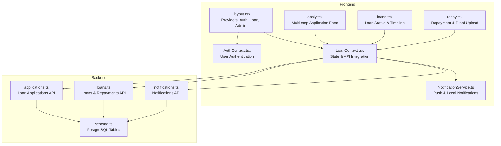
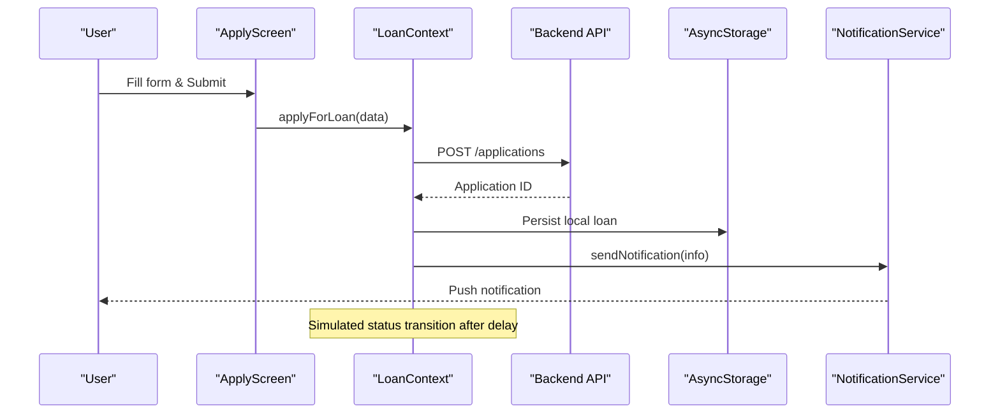
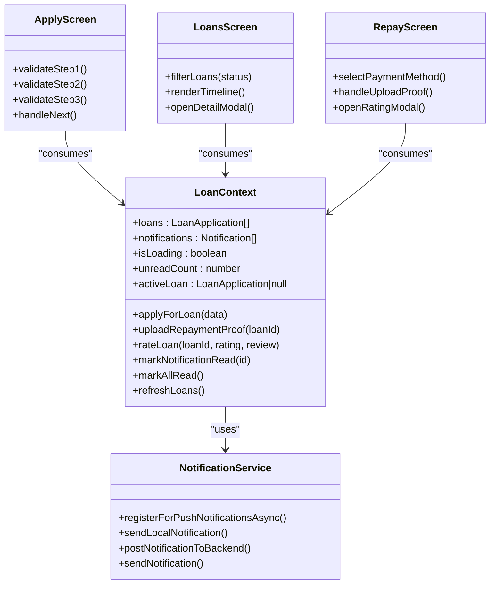

# Loan Management Context

<cite>
**Referenced Files in This Document**
- [LoanContext.tsx](file://contexts/LoanContext.tsx)
- [apply.tsx](file://app/(tabs)/apply.tsx)
- [loans.tsx](file://app/(tabs)/loans.tsx)
- [repay.tsx](file://app/(tabs)/repay.tsx)
- [_layout.tsx](file://app/_layout.tsx)
- [AuthContext.tsx](file://contexts/AuthContext.tsx)
- [applications.ts](file://backend/src/routes/applications.ts)
- [loans.ts](file://backend/src/routes/loans.ts)
- [notifications.ts](file://backend/src/routes/notifications.ts)
- [schema.ts](file://backend/src/db/schema.ts)
- [NotificationService.ts](file://services/NotificationService.ts)
</cite>

## Table of Contents
1. [Introduction](#introduction)
2. [Project Structure](#project-structure)
3. [Core Components](#core-components)
4. [Architecture Overview](#architecture-overview)
5. [Detailed Component Analysis](#detailed-component-analysis)
6. [Dependency Analysis](#dependency-analysis)
7. [Performance Considerations](#performance-considerations)
8. [Troubleshooting Guide](#troubleshooting-guide)
9. [Conclusion](#conclusion)

## Introduction
This document provides comprehensive technical documentation for the LoanContext implementation, focusing on loan application state management, multi-step application workflow, and status tracking. It explains how the context provider manages loan requests, approval processes, and repayment scheduling, while documenting API integration patterns, component communication, data validation, form persistence, and error handling strategies. Guidance is included for extending the context with new loan features and integrating with backend APIs.

## Project Structure
The loan management system spans frontend React Native components, a central LoanContext provider, and backend Hono routes with PostgreSQL via Drizzle ORM. The application is structured around tab-based navigation with dedicated screens for applying, viewing loan status, and making repayments.

**Diagram sources**
- [_layout.tsx:31-82](file://app/_layout.tsx#L31-L82)
- [LoanContext.tsx:82-329](file://contexts/LoanContext.tsx#L82-L329)
- [apply.tsx:125-515](file://app/(tabs)/apply.tsx#L125-L515)
- [loans.tsx:309-441](file://app/(tabs)/loans.tsx#L309-L441)
- [repay.tsx:225-449](file://app/(tabs)/repay.tsx#L225-L449)
- [applications.ts:1-168](file://backend/src/routes/applications.ts#L1-L168)
- [loans.ts:1-320](file://backend/src/routes/loans.ts#L1-L320)
- [notifications.ts:1-106](file://backend/src/routes/notifications.ts#L1-L106)
- [schema.ts:1-146](file://backend/src/db/schema.ts#L1-L146)
- [NotificationService.ts:1-135](file://services/NotificationService.ts#L1-L135)

**Section sources**
- [_layout.tsx:31-82](file://app/_layout.tsx#L31-L82)
- [LoanContext.tsx:82-329](file://contexts/LoanContext.tsx#L82-L329)

## Core Components
- LoanContext Provider: Central state manager for loans, notifications, and loan lifecycle actions (apply, upload repayment proof, rate loan, mark notifications read).
- Multi-step Application Form: Validates and persists form data across three steps, calculates interest and repayment amounts, and submits applications.
- Loan Status Screen: Displays loan timeline, filters, and detailed modals with due dates and repayment status.
- Repayment Screen: Guides users through payment methods, uploads proof of payment, and collects feedback after completion.
- Backend Integration: Hono routes for applications, loans, and notifications with Drizzle ORM schema.

Key responsibilities:
- State synchronization between local AsyncStorage and backend APIs.
- Real-time status updates and simulated transitions for demo purposes.
- Comprehensive validation and error handling across forms and API calls.
- Persistent notifications with local and backend persistence.

**Section sources**
- [LoanContext.tsx:50-62](file://contexts/LoanContext.tsx#L50-L62)
- [apply.tsx:125-255](file://app/(tabs)/apply.tsx#L125-L255)
- [loans.tsx:309-441](file://app/(tabs)/loans.tsx#L309-L441)
- [repay.tsx:225-449](file://app/(tabs)/repay.tsx#L225-L449)

## Architecture Overview
The LoanContext orchestrates loan state across the application. It integrates with backend APIs for fetching applications, notifications, and updating statuses. It also manages local state via AsyncStorage and triggers push notifications for user engagement.

**Diagram sources**
- [apply.tsx:209-250](file://app/(tabs)/apply.tsx#L209-L250)
- [LoanContext.tsx:198-261](file://contexts/LoanContext.tsx#L198-L261)
- [applications.ts:110-138](file://backend/src/routes/applications.ts#L110-L138)
- [NotificationService.ts:116-134](file://services/NotificationService.ts#L116-L134)

## Detailed Component Analysis

### LoanContext Implementation
LoanContext manages:
- Loans array with computed totals and due dates.
- Notifications with read/unread tracking.
- Loading state and refresh capability.
- Core actions: applyForLoan, uploadRepaymentProof, rateLoan, markNotificationRead, markAllRead, refreshLoans.
- Derived values: activeLoan and unreadCount.

Data model highlights:
- LoanApplication includes amount, duration, interest rate, processing fee, total repayment, due date, status, employment details, disbursement method, and collateral fields.
- Notification includes title, message, type, read flag, and creation timestamp.

API integration patterns:
- Uses X-User-Id header for user identification.
- Fetches user applications and notifications on mount.
- Persists local state and syncs with backend when available.

Error handling:
- Graceful fallbacks when backend calls fail.
- Local state remains consistent even if network requests fail.

Extensibility:
- New loan features can be added by extending the LoanApplication interface and adding new context methods.
- Backend routes can be expanded to support additional statuses and operations.

**Section sources**
- [LoanContext.tsx:11-39](file://contexts/LoanContext.tsx#L11-L39)
- [LoanContext.tsx:50-62](file://contexts/LoanContext.tsx#L50-L62)
- [LoanContext.tsx:82-329](file://contexts/LoanContext.tsx#L82-L329)

### Multi-step Application Workflow
The ApplyScreen implements a three-step form:
- Step 1: Loan calculator with amount selection, duration selection, and interest/fee computation.
- Step 2: Employment and personal details validation.
- Step 3: Disbursement method selection, account details, and collateral options.

Validation strategies:
- Step 1 validates minimum amount and user loan limit.
- Step 2 validates employment status, income, and next-of-kin contact.
- Step 3 validates disbursement method, account details, and collateral fields when applicable.

Form persistence:
- Uses AsyncStorage keys for user data and loan state.
- Resets form after successful submission.

Submission flow:
- Calls applyForLoan with computed values.
- Triggers notifications upon submission.

**Section sources**
- [apply.tsx:125-255](file://app/(tabs)/apply.tsx#L125-L255)
- [apply.tsx:163-182](file://app/(tabs)/apply.tsx#L163-L182)
- [apply.tsx:209-250](file://app/(tabs)/apply.tsx#L209-L250)

### Loan Status Tracking and UI
The LoansScreen displays:
- Filtered loan lists by status.
- Timeline visualization of loan stages.
- Detailed modals with repayment breakdown and due date alerts.
- Action buttons for repayment when active.

Key UI behaviors:
- StatusTimeline renders progress based on current status.
- Due banners indicate days remaining or overdue status.
- Refresh control triggers context refresh.

**Section sources**
- [loans.tsx:14-33](file://app/(tabs)/loans.tsx#L14-L33)
- [loans.tsx:35-84](file://app/(tabs)/loans.tsx#L35-L84)
- [loans.tsx:309-441](file://app/(tabs)/loans.tsx#L309-L441)

### Repayment Scheduling and Proof Upload
The RepayScreen handles:
- Active loan summary with countdown and penalty warnings.
- Payment method selection with instructions.
- Photo library integration for proof upload.
- Post-payment rating modal for feedback collection.

Integration points:
- uploadRepaymentProof updates local state and triggers success notifications.
- Rating modal persists user feedback on loans.

**Section sources**
- [repay.tsx:225-449](file://app/(tabs)/repay.tsx#L225-L449)
- [repay.tsx:238-260](file://app/(tabs)/repay.tsx#L238-L260)
- [repay.tsx:144-193](file://app/(tabs)/repay.tsx#L144-L193)

### Backend API Integration
Backend routes provide:
- Applications: create, review, and fetch user applications.
- Loans: create, update status, disburse, mark repaid, and complete.
- Notifications: fetch, mark read, mark all read, create, and delete read.

Schema definitions:
- Users, loans, loan applications, repayments, notifications, and settings tables with relations.

**Section sources**
- [applications.ts:110-138](file://backend/src/routes/applications.ts#L110-L138)
- [loans.ts:170-222](file://backend/src/routes/loans.ts#L170-L222)
- [notifications.ts:8-33](file://backend/src/routes/notifications.ts#L8-L33)
- [schema.ts:23-78](file://backend/src/db/schema.ts#L23-L78)

### Notification System
The NotificationService:
- Registers push tokens and handles permissions.
- Sends local notifications and posts notifications to backend.
- Integrates with LoanContext for immediate user feedback.

**Section sources**
- [NotificationService.ts:26-69](file://services/NotificationService.ts#L26-L69)
- [NotificationService.ts:116-134](file://services/NotificationService.ts#L116-L134)
- [LoanContext.tsx:183-196](file://contexts/LoanContext.tsx#L183-L196)

## Dependency Analysis
LoanContext depends on:
- AsyncStorage for offline-first persistence.
- Backend APIs for real-time state updates.
- NotificationService for user engagement.
- AuthContext for user identity propagation.

**Diagram sources**
- [LoanContext.tsx:50-62](file://contexts/LoanContext.tsx#L50-L62)
- [apply.tsx:125-255](file://app/(tabs)/apply.tsx#L125-L255)
- [loans.tsx:309-441](file://app/(tabs)/loans.tsx#L309-L441)
- [repay.tsx:225-449](file://app/(tabs)/repay.tsx#L225-L449)
- [NotificationService.ts:1-135](file://services/NotificationService.ts#L1-L135)

**Section sources**
- [LoanContext.tsx:82-329](file://contexts/LoanContext.tsx#L82-L329)
- [_layout.tsx:66-79](file://app/_layout.tsx#L66-L79)

## Performance Considerations
- Asynchronous loading and caching reduce UI blocking during initial data fetch.
- Local state updates occur immediately, while backend updates are asynchronous to improve perceived performance.
- Memoization of derived values (activeLoan, unreadCount) prevents unnecessary re-renders.
- Image picker integration for proof uploads should respect device capabilities and memory constraints.

## Troubleshooting Guide
Common issues and resolutions:
- Backend API failures: The context falls back to AsyncStorage and logs errors. Verify API URL and user headers.
- Notification registration: Permission prompts must be granted; Expo Go does not support push tokens.
- Form validation errors: Ensure all required fields meet validation criteria before submission.
- Status transitions: Simulated transitions occur after submission; backend integration can replace simulation.

**Section sources**
- [LoanContext.tsx:132-176](file://contexts/LoanContext.tsx#L132-L176)
- [NotificationService.ts:26-69](file://services/NotificationService.ts#L26-L69)
- [apply.tsx:163-182](file://app/(tabs)/apply.tsx#L163-L182)

## Conclusion
The LoanContext provides a robust foundation for loan application state management, integrating seamlessly with backend APIs and local persistence. Its multi-step application workflow, comprehensive validation, and notification system deliver a cohesive user experience. The modular design allows for straightforward extension to support additional loan features and advanced backend integrations.