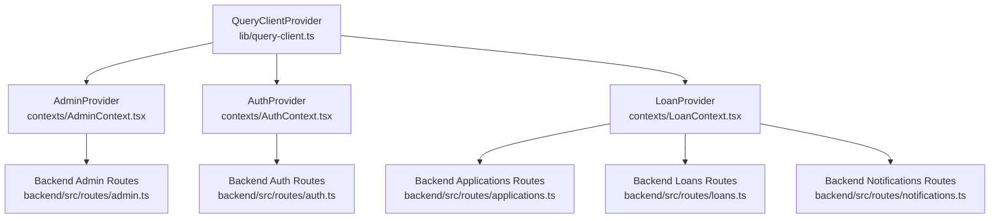
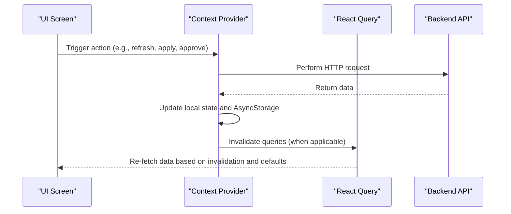
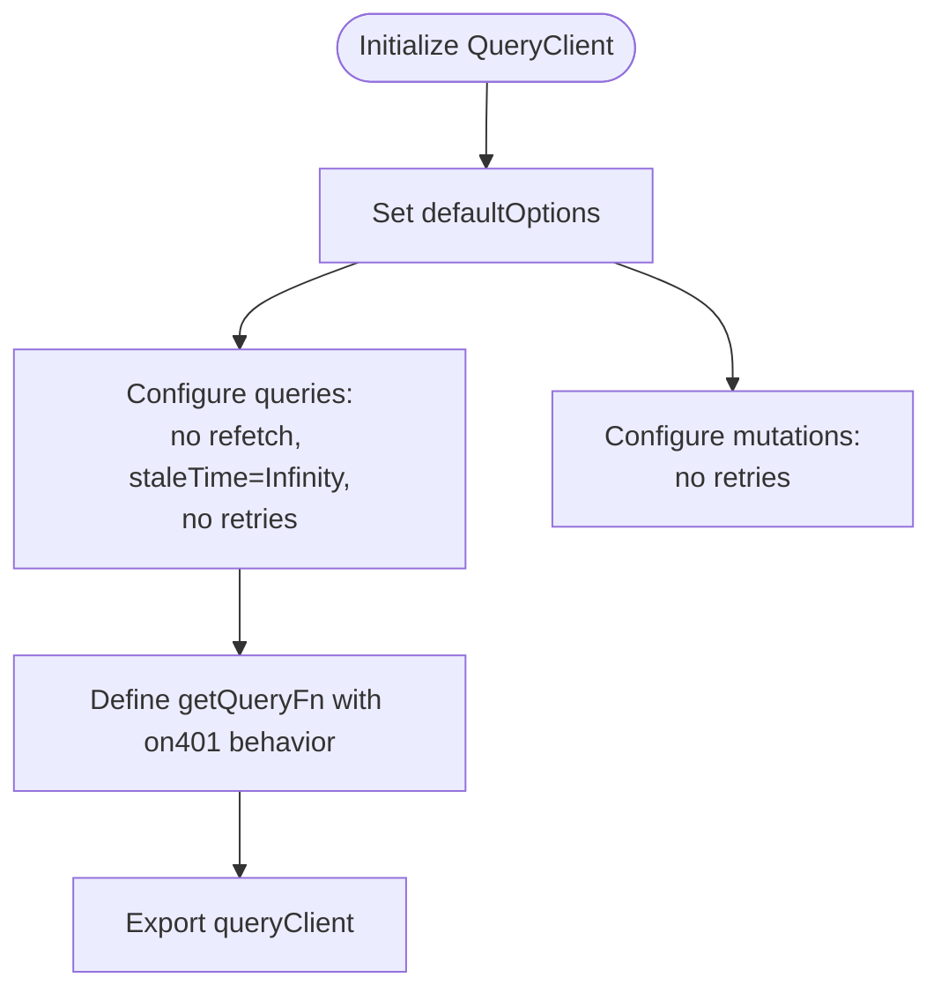
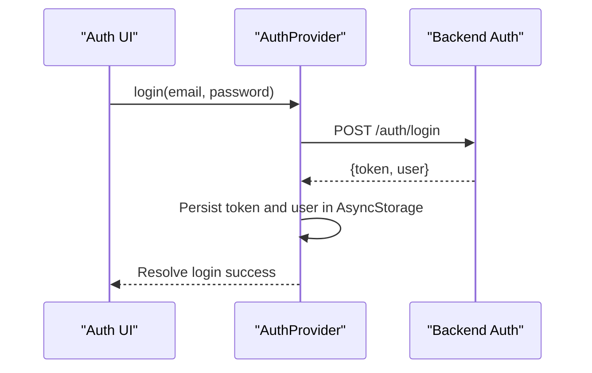
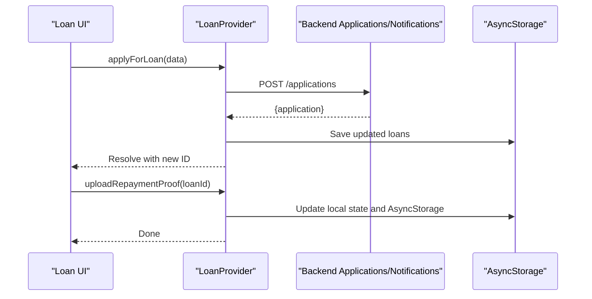
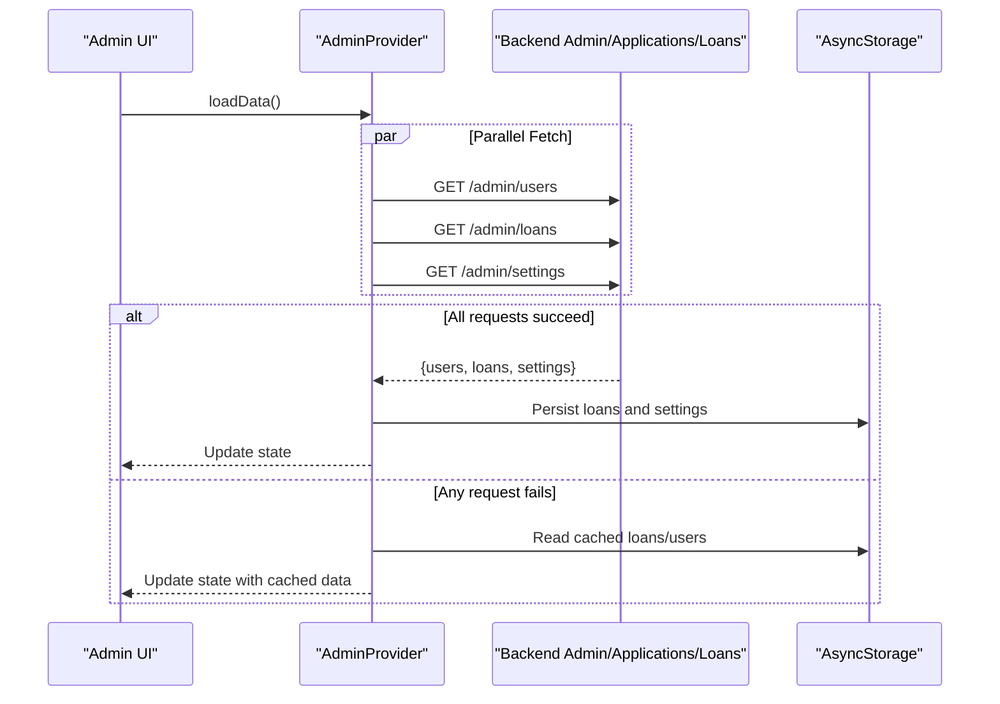
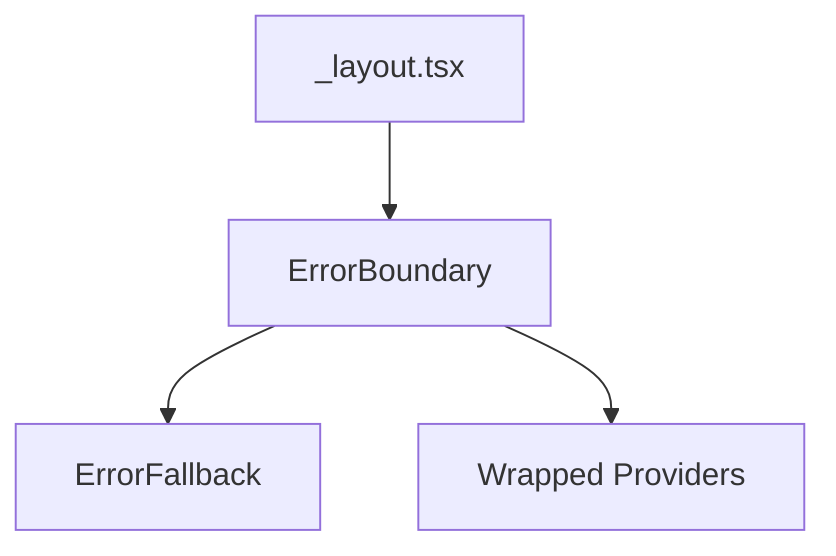
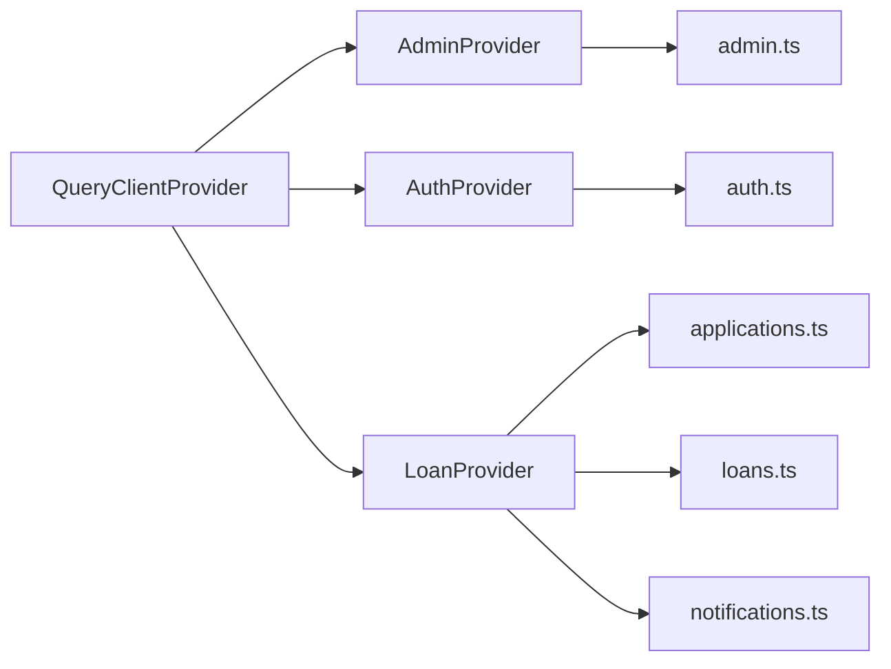

# React Query Integration

<cite>
**Referenced Files in This Document**
- [query-client.ts](file://lib/query-client.ts)
- [_layout.tsx](file://app/_layout.tsx)
- [AuthContext.tsx](file://contexts/AuthContext.tsx)
- [LoanContext.tsx](file://contexts/LoanContext.tsx)
- [AdminContext.tsx](file://contexts/AdminContext.tsx)
- [ErrorBoundary.tsx](file://components/ErrorBoundary.tsx)
- [ErrorFallback.tsx](file://components/ErrorFallback.tsx)
- [auth.ts](file://backend/src/routes/auth.ts)
- [applications.ts](file://backend/src/routes/applications.ts)
- [loans.ts](file://backend/src/routes/loans.ts)
- [users.ts](file://backend/src/routes/users.ts)
- [notifications.ts](file://backend/src/routes/notifications.ts)
- [admin.ts](file://backend/src/routes/admin.ts)
</cite>

## Table of Contents
1. [Introduction](#introduction)
2. [Project Structure](#project-structure)
3. [Core Components](#core-components)
4. [Architecture Overview](#architecture-overview)
5. [Detailed Component Analysis](#detailed-component-analysis)
6. [Dependency Analysis](#dependency-analysis)
7. [Performance Considerations](#performance-considerations)
8. [Troubleshooting Guide](#troubleshooting-guide)
9. [Conclusion](#conclusion)
10. [Appendices](#appendices)

## Introduction
This document explains how React Query integrates with the application’s context providers to manage API data fetching, caching, synchronization, and offline behavior. It covers the query client configuration, caching strategies, data synchronization patterns, and how contexts leverage React Query for automatic refetching and optimistic updates. It also documents query invalidation, mutation handling, error boundary integration, performance optimization, cache management, offline data handling, extension patterns, and debugging techniques.

## Project Structure
The application initializes React Query globally and composes three primary context providers:
- QueryClientProvider wraps the entire app to enable React Query across screens.
- AdminProvider supplies administrative data and actions.
- AuthProvider manages authentication state and persistence.
- LoanProvider handles user loan lifecycle and notifications.

**Diagram sources**
- [_layout.tsx:67-79](file://app/_layout.tsx#L67-L79)
- [query-client.ts:67-81](file://lib/query-client.ts#L67-L81)
- [AdminContext.tsx:135-521](file://contexts/AdminContext.tsx#L135-L521)
- [AuthContext.tsx:31-126](file://contexts/AuthContext.tsx#L31-L126)
- [LoanContext.tsx:82-329](file://contexts/LoanContext.tsx#L82-L329)
- [admin.ts:127-171](file://backend/src/routes/admin.ts#L127-L171)
- [auth.ts:95-146](file://backend/src/routes/auth.ts#L95-L146)
- [applications.ts:110-168](file://backend/src/routes/applications.ts#L110-L168)
- [loans.ts:115-320](file://backend/src/routes/loans.ts#L115-L320)
- [notifications.ts:8-106](file://backend/src/routes/notifications.ts#L8-L106)

**Section sources**
- [_layout.tsx:67-79](file://app/_layout.tsx#L67-L79)
- [query-client.ts:67-81](file://lib/query-client.ts#L67-L81)

## Core Components
- Query client configuration and defaults:
  - Centralized query function built on a shared API request helper.
  - Global defaults disable automatic refetching and retries, and set infinite staleness to maximize manual cache control.
  - Credentials are included for authenticated requests.
- Context providers:
  - AdminProvider orchestrates admin data, settings, and actions with a hybrid online/offline strategy using AsyncStorage.
  - LoanProvider manages user loan applications, notifications, and optimistic updates with fallbacks to AsyncStorage.
  - AuthProvider handles login/logout and persists tokens and user data.

Key responsibilities:
- Caching: React Query caches responses keyed by query keys derived from the URL segments.
- Synchronization: Providers update local state and AsyncStorage while delegating to backend APIs.
- Offline handling: AsyncStorage acts as a last-resort cache when network requests fail.
- Error handling: Class-based ErrorBoundary wraps the app to gracefully handle rendering errors.

**Section sources**
- [query-client.ts:46-81](file://lib/query-client.ts#L46-L81)
- [AdminContext.tsx:199-285](file://contexts/AdminContext.tsx#L199-L285)
- [LoanContext.tsx:91-176](file://contexts/LoanContext.tsx#L91-L176)
- [AuthContext.tsx:36-54](file://contexts/AuthContext.tsx#L36-L54)
- [ErrorBoundary.tsx:16-54](file://components/ErrorBoundary.tsx#L16-L54)

## Architecture Overview
The app uses a single React Query client configured with a custom query function. Providers encapsulate domain-specific data and side effects, while the backend exposes REST endpoints for authentication, applications, loans, users, notifications, and admin settings.

**Diagram sources**
- [query-client.ts:46-81](file://lib/query-client.ts#L46-L81)
- [LoanContext.tsx:198-261](file://contexts/LoanContext.tsx#L198-L261)
- [AdminContext.tsx:311-361](file://contexts/AdminContext.tsx#L311-L361)
- [applications.ts:110-168](file://backend/src/routes/applications.ts#L110-L168)
- [loans.ts:224-290](file://backend/src/routes/loans.ts#L224-L290)

## Detailed Component Analysis

### Query Client Configuration
- Base URL resolution and API request helper:
  - Environment-driven base URL construction.
  - Unified request helper with credential inclusion and error normalization.
- Query function:
  - Accepts a behavior option for unauthorized responses (return null vs throw).
  - Builds URLs from query keys and returns parsed JSON for successful responses.
- Default options:
  - Queries: no refetch intervals, disabled window focus refetch, infinite staleness, no retries.
  - Mutations: no retries.
- Implications:
  - Manual cache control is preferred; rely on explicit invalidation and refetch triggers.
  - Network failures are surfaced as thrown errors; integrate with error boundaries.

**Diagram sources**
- [query-client.ts:67-81](file://lib/query-client.ts#L67-L81)
- [query-client.ts:46-65](file://lib/query-client.ts#L46-L65)

**Section sources**
- [query-client.ts:8-44](file://lib/query-client.ts#L8-L44)
- [query-client.ts:46-81](file://lib/query-client.ts#L46-L81)

### Authentication Context (AuthProvider)
- Responsibilities:
  - Persist tokens and user profiles in AsyncStorage.
  - Provide login, register, and logout flows against backend endpoints.
- Integration with React Query:
  - No direct React Query hooks; relies on imperative fetch calls.
  - Ensures credentials are present for protected backend routes.
- Offline considerations:
  - Uses AsyncStorage to restore persisted session on app load.

**Diagram sources**
- [AuthContext.tsx:56-79](file://contexts/AuthContext.tsx#L56-L79)
- [auth.ts:95-146](file://backend/src/routes/auth.ts#L95-L146)

**Section sources**
- [AuthContext.tsx:31-126](file://contexts/AuthContext.tsx#L31-L126)
- [auth.ts:95-146](file://backend/src/routes/auth.ts#L95-L146)

### Loan Lifecycle Context (LoanProvider)
- Responsibilities:
  - Load user applications and notifications from backend.
  - Provide optimistic updates for application status and repayment proof uploads.
  - Persist data to AsyncStorage for offline access and fallback.
  - Expose refresh mechanism to synchronize with backend.
- Data synchronization pattern:
  - On successful backend calls, update local state and AsyncStorage.
  - On failure, fall back to AsyncStorage to maintain continuity.
- Offline handling:
  - Reads/writes to AsyncStorage keys for loans and notifications.
  - Provides a refresh function to clear AsyncStorage and reload from backend.

**Diagram sources**
- [LoanContext.tsx:198-261](file://contexts/LoanContext.tsx#L198-L261)
- [LoanContext.tsx:263-273](file://contexts/LoanContext.tsx#L263-L273)
- [applications.ts:110-138](file://backend/src/routes/applications.ts#L110-L138)
- [notifications.ts:7-33](file://backend/src/routes/notifications.ts#L7-L33)

**Section sources**
- [LoanContext.tsx:82-329](file://contexts/LoanContext.tsx#L82-L329)
- [applications.ts:55-77](file://backend/src/routes/applications.ts#L55-L77)
- [notifications.ts:8-106](file://backend/src/routes/notifications.ts#L8-L106)

### Admin Management Context (AdminProvider)
- Responsibilities:
  - Load users, loans, and settings from backend.
  - Provide admin actions: approve/reject/disburse/complete loans, blacklist users, update settings.
  - Hybrid online/offline strategy using AsyncStorage for cached data.
- Data synchronization pattern:
  - On successful fetches, update AsyncStorage and local state.
  - On failures, attempt to serve cached data from AsyncStorage.
  - Expose refreshData to clear caches and reload.
- Offline handling:
  - Stores loans and admin users in AsyncStorage for offline availability.

**Diagram sources**
- [AdminContext.tsx:199-285](file://contexts/AdminContext.tsx#L199-L285)
- [admin.ts:8-94](file://backend/src/routes/admin.ts#L8-L94)
- [applications.ts:24-53](file://backend/src/routes/applications.ts#L24-L53)
- [loans.ts:92-113](file://backend/src/routes/loans.ts#L92-L113)

**Section sources**
- [AdminContext.tsx:135-521](file://contexts/AdminContext.tsx#L135-L521)
- [admin.ts:127-171](file://backend/src/routes/admin.ts#L127-L171)

### Error Boundary Integration
- Class-based ErrorBoundary wraps the app to catch rendering errors.
- Provides a fallback UI with error details and a restart option.
- Integrates with development mode to show stack traces.

**Diagram sources**
- [_layout.tsx:66-81](file://app/_layout.tsx#L66-L81)
- [ErrorBoundary.tsx:16-54](file://components/ErrorBoundary.tsx#L16-L54)
- [ErrorFallback.tsx:21-180](file://components/ErrorFallback.tsx#L21-L180)

**Section sources**
- [ErrorBoundary.tsx:16-54](file://components/ErrorBoundary.tsx#L16-L54)
- [ErrorFallback.tsx:21-180](file://components/ErrorFallback.tsx#L21-L180)

## Dependency Analysis
- Provider hierarchy:
  - QueryClientProvider is at the root.
  - AdminProvider -> AuthProvider -> LoanProvider form nested composition.
- Backend dependencies:
  - Auth routes for login/register.
  - Applications routes for loan applications.
  - Loans routes for disbursement and repayment updates.
  - Users routes for profile and blacklist operations.
  - Notifications routes for read/unread and creation.
  - Admin routes for users, loans, settings, and stats.

**Diagram sources**
- [_layout.tsx:67-79](file://app/_layout.tsx#L67-L79)
- [AdminContext.tsx:135-521](file://contexts/AdminContext.tsx#L135-L521)
- [AuthContext.tsx:31-126](file://contexts/AuthContext.tsx#L31-L126)
- [LoanContext.tsx:82-329](file://contexts/LoanContext.tsx#L82-L329)
- [admin.ts:127-171](file://backend/src/routes/admin.ts#L127-L171)
- [auth.ts:95-146](file://backend/src/routes/auth.ts#L95-L146)
- [applications.ts:110-168](file://backend/src/routes/applications.ts#L110-L168)
- [loans.ts:224-290](file://backend/src/routes/loans.ts#L224-L290)
- [notifications.ts:7-33](file://backend/src/routes/notifications.ts#L7-L33)

**Section sources**
- [_layout.tsx:67-79](file://app/_layout.tsx#L67-L79)
- [admin.ts:127-171](file://backend/src/routes/admin.ts#L127-L171)
- [auth.ts:95-146](file://backend/src/routes/auth.ts#L95-L146)
- [applications.ts:110-168](file://backend/src/routes/applications.ts#L110-L168)
- [loans.ts:224-290](file://backend/src/routes/loans.ts#L224-L290)
- [notifications.ts:7-33](file://backend/src/routes/notifications.ts#L7-L33)

## Performance Considerations
- Cache strategy:
  - Infinite staleness reduces unnecessary background refetches; rely on explicit invalidation.
  - Prefer targeted invalidation over broad refetches to minimize network usage.
- Offline-first:
  - AsyncStorage serves as a robust fallback; ensure critical reads occur from cache when network is unavailable.
- Minimizing redundant work:
  - Use memoization for derived stats and computed values in contexts.
  - Batch updates to reduce re-renders.
- Network efficiency:
  - Use Promise.allSettled for independent fetches to avoid blocking on failures.
  - Avoid excessive polling; prefer event-driven updates and cache invalidation.

[No sources needed since this section provides general guidance]

## Troubleshooting Guide
Common issues and remedies:
- Unauthorized responses:
  - The query function supports returning null on 401 when configured; otherwise throws. Adjust behavior per route needs.
- Network errors:
  - Errors are thrown by the query function; wrap UI in ErrorBoundary to prevent app crashes.
- Stale data:
  - Since staleTime is infinite, trigger invalidation after mutations to refresh views.
- Offline data not updating:
  - Use the refresh functions in contexts to clear AsyncStorage and reload from backend.
- Debugging:
  - Use the ErrorFallback modal to inspect error messages and stack traces in development builds.

**Section sources**
- [query-client.ts:20-25](file://lib/query-client.ts#L20-L25)
- [query-client.ts:59-64](file://lib/query-client.ts#L59-L64)
- [ErrorFallback.tsx:46-52](file://components/ErrorFallback.tsx#L46-L52)

## Conclusion
React Query is configured centrally with conservative defaults that favor manual cache control. Context providers implement robust online/offline strategies using AsyncStorage and coordinate with backend endpoints to keep the UI synchronized. By combining explicit invalidation, optimistic updates, and error boundaries, the app achieves predictable data flows, resilient offline behavior, and maintainable extension points for new features.

[No sources needed since this section summarizes without analyzing specific files]

## Appendices

### API Reference Overview
- Authentication
  - POST /auth/login
  - POST /auth/register
- Applications
  - GET /applications/my-applications
  - POST /applications
  - PATCH /applications/:id/review
- Loans
  - GET /loans/my-loans
  - PATCH /loans/:id/disburse
  - PATCH /loans/:id/repaid
  - PATCH /loans/:id/status
- Users
  - GET /users/profile
  - PUT /users/profile
  - PUT /users/:id/blacklist
  - PUT /users/:id/password
- Notifications
  - GET /notifications
  - PATCH /notifications/:id/read
  - PATCH /notifications/read-all
  - POST /notifications
- Admin
  - GET /admin/users
  - GET /admin/loans
  - GET /admin/stats
  - GET /admin/settings
  - PUT /admin/settings

**Section sources**
- [auth.ts:95-146](file://backend/src/routes/auth.ts#L95-L146)
- [applications.ts:55-168](file://backend/src/routes/applications.ts#L55-L168)
- [loans.ts:115-320](file://backend/src/routes/loans.ts#L115-L320)
- [users.ts:42-197](file://backend/src/routes/users.ts#L42-L197)
- [notifications.ts:8-106](file://backend/src/routes/notifications.ts#L8-L106)
- [admin.ts:8-171](file://backend/src/routes/admin.ts#L8-L171)