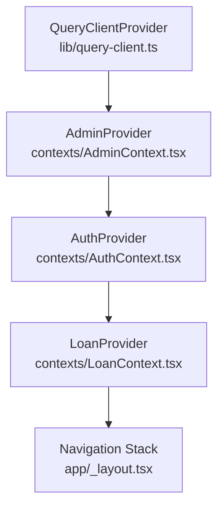
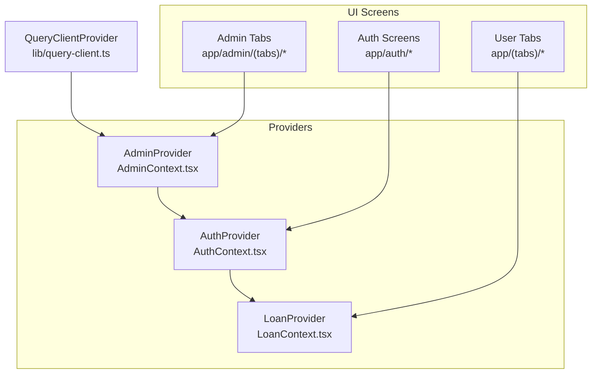
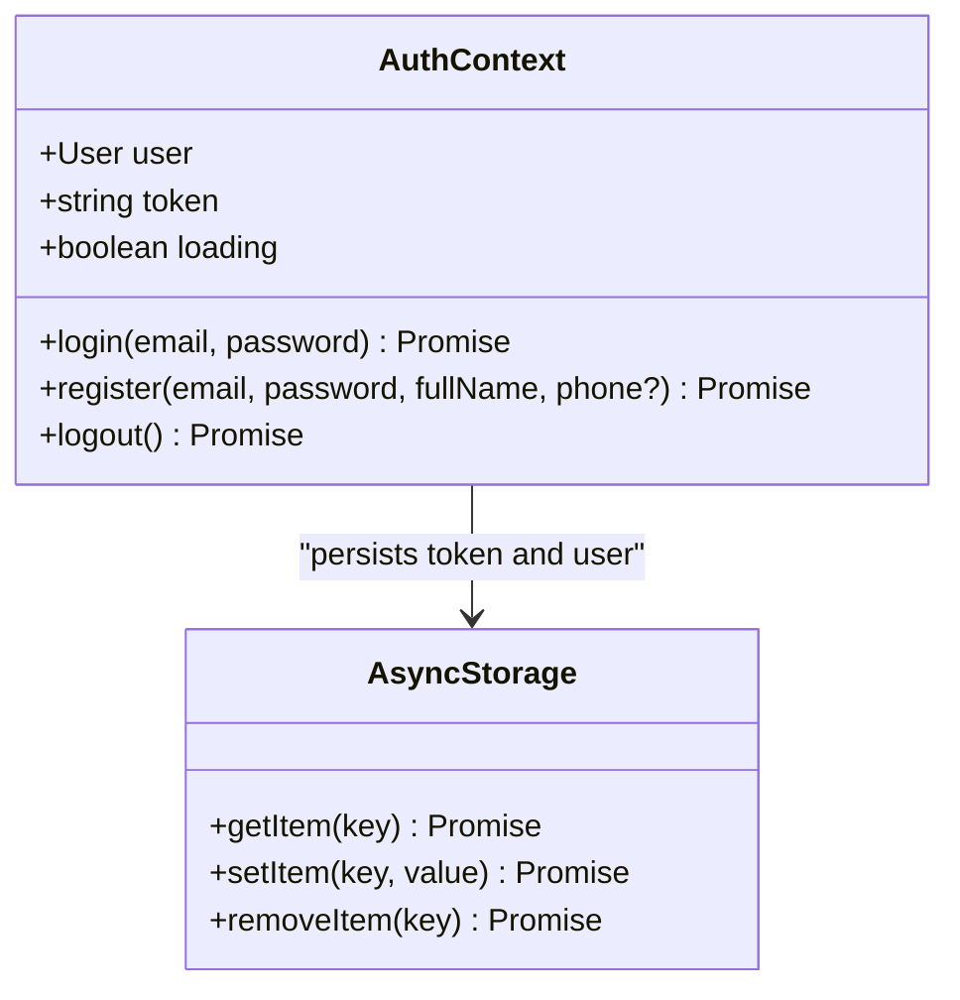
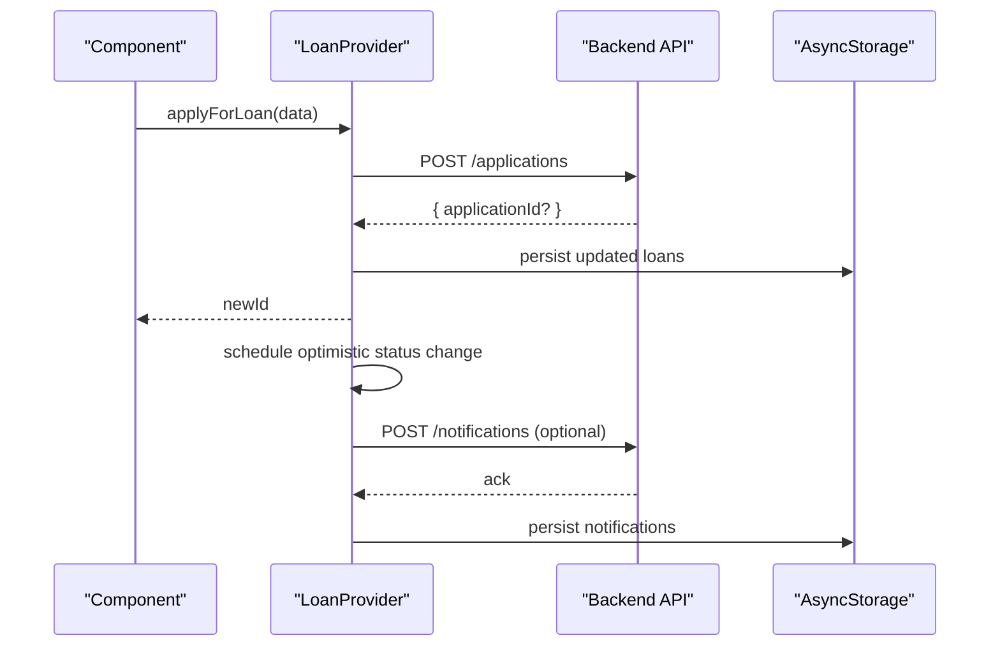
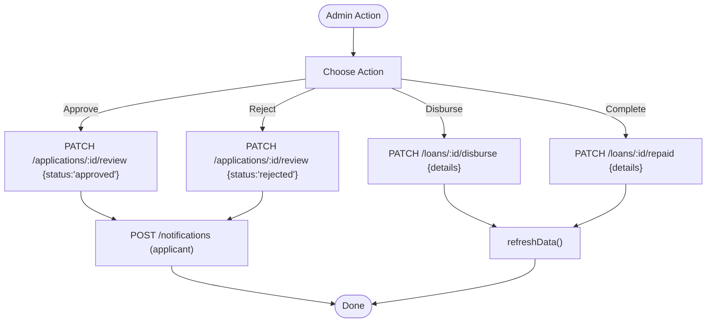
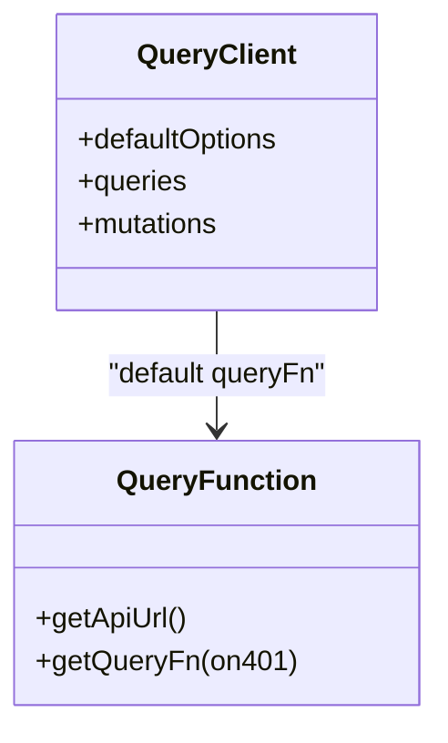
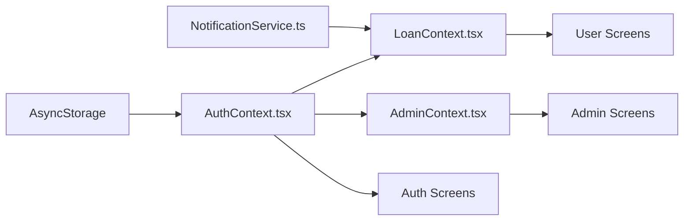

# State Management

<cite>
**Referenced Files in This Document**
- [contexts/AuthContext.tsx](file://contexts/AuthContext.tsx)
- [contexts/LoanContext.tsx](file://contexts/LoanContext.tsx)
- [contexts/AdminContext.tsx](file://contexts/AdminContext.tsx)
- [lib/query-client.ts](file://lib/query-client.ts)
- [services/NotificationService.ts](file://services/NotificationService.ts)
- [app/_layout.tsx](file://app/_layout.tsx)
- [app/admin/_layout.tsx](file://app/admin/_layout.tsx)
- [app/admin/login.tsx](file://app/admin/login.tsx)
- [app/admin/(tabs)/applications.tsx](file://app/admin/(tabs)/applications.tsx)
- [app/auth/login.tsx](file://app/auth/login.tsx)
- [app/(tabs)/apply.tsx](file://app/(tabs)/apply.tsx)
</cite>

## Table of Contents
1. [Introduction](#introduction)
2. [Project Structure](#project-structure)
3. [Core Components](#core-components)
4. [Architecture Overview](#architecture-overview)
5. [Detailed Component Analysis](#detailed-component-analysis)
6. [Dependency Analysis](#dependency-analysis)
7. [Performance Considerations](#performance-considerations)
8. [Troubleshooting Guide](#troubleshooting-guide)
9. [Conclusion](#conclusion)

## Introduction
This document explains the React Context-based state management system powering the Phoenix Loan application. It covers the Provider Pattern implementation, context architecture, and data flow across components. It documents three primary contexts:
- AuthContext: Authentication state and lifecycle
- LoanContext: Loan application management and notifications
- AdminContext: Administrative controls and loan workflows

It also describes integration with React Query for data fetching and caching, optimistic updates, error handling, persistence strategies, memory management, performance optimization, and backend synchronization.

## Project Structure
The application initializes providers at the root layout, wrapping the navigation stack. Providers are layered to ensure proper context availability:
- QueryClientProvider wraps all contexts
- AdminProvider wraps AuthProvider
- AuthProvider wraps LoanProvider
- LoanProvider wraps the navigation

**Diagram sources**
- [app/_layout.tsx:67-79](file://app/_layout.tsx#L67-L79)
- [lib/query-client.ts:67-80](file://lib/query-client.ts#L67-L80)

**Section sources**
- [app/_layout.tsx:19-82](file://app/_layout.tsx#L19-L82)
- [lib/query-client.ts:1-81](file://lib/query-client.ts#L1-L81)

## Core Components
- AuthContext: Manages user identity, JWT token, and login/logout flows. Persists credentials to AsyncStorage and hydrates on startup.
- LoanContext: Centralizes loan application state, notifications, and user-specific calculations. Integrates with backend APIs and AsyncStorage for offline resilience.
- AdminContext: Provides administrative controls, loan approvals/disbursal, user management, and settings. Uses AsyncStorage fallbacks and refresh mechanisms.

Key integration points:
- React Query is configured globally and used for API requests elsewhere in the app (see guidance in the project’s skill docs).
- NotificationService coordinates local and backend notifications, consumed by LoanContext.

**Section sources**
- [contexts/AuthContext.tsx:31-126](file://contexts/AuthContext.tsx#L31-L126)
- [contexts/LoanContext.tsx:82-335](file://contexts/LoanContext.tsx#L82-L335)
- [contexts/AdminContext.tsx:135-527](file://contexts/AdminContext.tsx#L135-L527)
- [services/NotificationService.ts:116-134](file://services/NotificationService.ts#L116-L134)

## Architecture Overview
The state architecture follows a layered Provider pattern with explicit separation of concerns:
- Authentication state is available to all screens via AuthProvider.
- Loan-related state is scoped under LoanProvider and used by user-facing screens.
- Admin state is isolated under AdminProvider and used by admin screens.
- Global QueryClient manages data fetching and caching for API resources.

**Diagram sources**
- [app/_layout.tsx:67-79](file://app/_layout.tsx#L67-L79)
- [contexts/AuthContext.tsx:31-126](file://contexts/AuthContext.tsx#L31-L126)
- [contexts/LoanContext.tsx:82-335](file://contexts/LoanContext.tsx#L82-L335)
- [contexts/AdminContext.tsx:135-527](file://contexts/AdminContext.tsx#L135-L527)

## Detailed Component Analysis

### AuthContext: Authentication State
AuthContext encapsulates:
- User profile and token
- Loading state during hydration
- Login, registration, and logout operations
- AsyncStorage persistence for token and user data

**Diagram sources**
- [contexts/AuthContext.tsx:6-27](file://contexts/AuthContext.tsx#L6-L27)
- [contexts/AuthContext.tsx:40-119](file://contexts/AuthContext.tsx#L40-L119)

Usage patterns:
- Components call useAuth() to access user, token, loading, and lifecycle methods.
- On login, token and user are persisted; on logout, they are removed.

Integration with screens:
- Auth login screen uses useAuth().login() and redirects based on user role.
- Root index screen uses useAuth() to decide initial route.

**Section sources**
- [contexts/AuthContext.tsx:31-126](file://contexts/AuthContext.tsx#L31-L126)
- [app/auth/login.tsx:80-134](file://app/auth/login.tsx#L80-L134)
- [app/index.tsx:6-22](file://app/index.tsx#L6-L22)

### LoanContext: Loan Application and Notifications
LoanContext manages:
- Loan applications with computed fields and status transitions
- Local notifications and backend synchronization
- Active loan derivation and unread notification counts
- Optimistic updates with AsyncStorage and delayed status simulation

**Diagram sources**
- [contexts/LoanContext.tsx:198-261](file://contexts/LoanContext.tsx#L198-L261)
- [contexts/LoanContext.tsx:183-196](file://contexts/LoanContext.tsx#L183-L196)
- [services/NotificationService.ts:116-134](file://services/NotificationService.ts#L116-L134)

Key behaviors:
- applyForLoan performs backend submission and optimistic local insertion.
- uploadRepaymentProof marks a loan as repaid and triggers a success notification.
- markNotificationRead updates local state and attempts backend sync.
- refreshLoans reloads data from backend and AsyncStorage.

**Section sources**
- [contexts/LoanContext.tsx:82-335](file://contexts/LoanContext.tsx#L82-L335)
- [app/(tabs)/apply.tsx:125-255](file://app/(tabs)/apply.tsx#L125-L255)

### AdminContext: Administrative Controls
AdminContext provides:
- Admin session management and credential checks
- Loans and users lists with derived statistics
- Approve/reject/disburse/complete loan actions
- Settings management (interest rates, channels, penalties, processing fee)
- Offline-first data loading with AsyncStorage fallbacks

**Diagram sources**
- [contexts/AdminContext.tsx:311-413](file://contexts/AdminContext.tsx#L311-L413)
- [contexts/AdminContext.tsx:480-491](file://contexts/AdminContext.tsx#L480-L491)

Admin usage:
- Admin login screen uses useAdmin().adminLogin() and navigates on success.
- Admin applications screen uses useAdmin() to filter, approve, reject, disburse, and complete loans.

**Section sources**
- [contexts/AdminContext.tsx:135-527](file://contexts/AdminContext.tsx#L135-L527)
- [app/admin/login.tsx:17-59](file://app/admin/login.tsx#L17-L59)
- [app/admin/(tabs)/applications.tsx:155-328](file://app/admin/(tabs)/applications.tsx#L155-L328)

### Integration with React Query
React Query is configured globally with a centralized query function and default options. While the contexts primarily use native fetch, the project’s guidance encourages using the shared query client for API operations elsewhere.

**Diagram sources**
- [lib/query-client.ts:47-65](file://lib/query-client.ts#L47-L65)
- [lib/query-client.ts:67-80](file://lib/query-client.ts#L67-L80)

Guidance:
- Use getApiUrl() and apiRequest() for consistent domain handling.
- Prefer array query keys for hierarchical resources.
- Invalidate or update cache after mutations to keep UI in sync.

**Section sources**
- [lib/query-client.ts:1-81](file://lib/query-client.ts#L1-L81)

## Dependency Analysis
Provider hierarchy and cross-context dependencies:
- AuthProvider depends on AsyncStorage for token and user persistence.
- LoanProvider depends on Auth user ID for backend requests and on NotificationService for push/local notifications.
- AdminProvider depends on AsyncStorage for session and cached data, and on backend APIs for admin operations.

**Diagram sources**
- [contexts/AuthContext.tsx:40-54](file://contexts/AuthContext.tsx#L40-L54)
- [contexts/LoanContext.tsx:95-176](file://contexts/LoanContext.tsx#L95-L176)
- [contexts/AdminContext.tsx:150-162](file://contexts/AdminContext.tsx#L150-L162)
- [services/NotificationService.ts:116-134](file://services/NotificationService.ts#L116-L134)

**Section sources**
- [contexts/AuthContext.tsx:1-135](file://contexts/AuthContext.tsx#L1-L135)
- [contexts/LoanContext.tsx:1-336](file://contexts/LoanContext.tsx#L1-L336)
- [contexts/AdminContext.tsx:1-528](file://contexts/AdminContext.tsx#L1-L528)
- [services/NotificationService.ts:1-135](file://services/NotificationService.ts#L1-L135)

## Performance Considerations
- Minimize re-renders:
  - Use useMemo for derived values (e.g., unreadCount, activeLoan, stats).
  - Wrap context values with useMemo to prevent unnecessary prop drilling churn.
- Persistence and caching:
  - Persist critical state to AsyncStorage to reduce network calls and improve startup time.
  - Use offline-first strategies with AsyncStorage fallbacks for admin and loan data.
- Network efficiency:
  - Avoid redundant fetches by leveraging memoization and local state updates.
  - Use optimistic updates for immediate feedback, followed by server sync.
- Memory management:
  - Clean up timers and subscriptions in effects.
  - Avoid storing large objects in context; prefer normalized structures.

[No sources needed since this section provides general guidance]

## Troubleshooting Guide
Common issues and debugging techniques:
- Context not wrapped:
  - Error thrown when useAuth/useLoan/useAdmin is used outside its Provider indicates missing provider nesting.
  - Verify provider order in app/_layout.tsx.
- Hydration mismatch:
  - Auth loading spinner indicates AsyncStorage hydration; ensure AsyncStorage keys exist and are parsable.
- Backend errors:
  - Inspect thrown errors in login/register and admin actions; surface user-friendly alerts.
- Notifications not appearing:
  - Confirm NotificationService permissions and platform support; note limitations in Expo Go.
- Stale data:
  - Use refreshData() in AdminContext or manual reload in LoanContext to force server sync.

**Section sources**
- [contexts/AuthContext.tsx:128-134](file://contexts/AuthContext.tsx#L128-L134)
- [contexts/LoanContext.tsx:311-313](file://contexts/LoanContext.tsx#L311-L313)
- [contexts/AdminContext.tsx:523-527](file://contexts/AdminContext.tsx#L523-L527)
- [services/NotificationService.ts:26-69](file://services/NotificationService.ts#L26-L69)

## Conclusion
The Phoenix Loan application employs a robust, layered Provider pattern with React Context to manage authentication, user loan workflows, and administrative controls. Combined with AsyncStorage for persistence and NotificationService for user communication, the system delivers responsive, offline-capable experiences. While the contexts primarily use native fetch, the project’s guidance encourages adopting the shared React Query client for standardized data fetching and caching across the app.