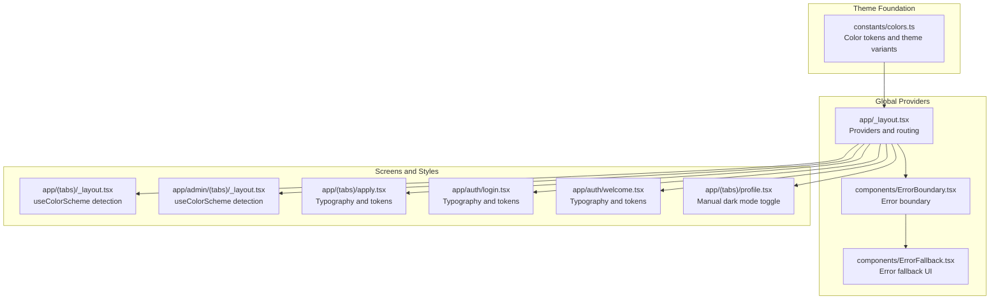
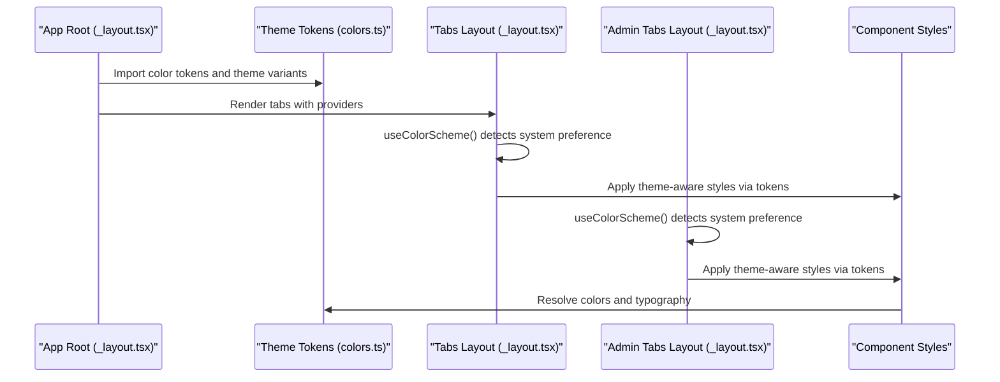
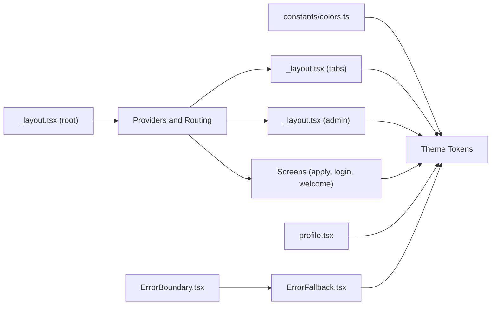

# Styling and Theming

<cite>
**Referenced Files in This Document**
- [colors.ts](file://constants/colors.ts)
- [_layout.tsx](file://app/_layout.tsx)
- [apply.tsx](file://app/(tabs)/apply.tsx)
- [login.tsx](file://app/auth/login.tsx)
- [welcome.tsx](file://app/auth/welcome.tsx)
- [profile.tsx](file://app/(tabs)/profile.tsx)
- [_layout.tsx](file://app/(tabs)/_layout.tsx)
- [_layout.tsx](file://app/admin/(tabs)/_layout.tsx)
- [ErrorBoundary.tsx](file://components/ErrorBoundary.tsx)
- [ErrorFallback.tsx](file://components/ErrorFallback.tsx)
- [SKILL.md](file://.local/skills/expo/SKILL.md)
- [design_and_aesthetics.md](file://.local/skills/expo/references/design_and_aesthetics.md)
</cite>

## Table of Contents
1. [Introduction](#introduction)
2. [Project Structure](#project-structure)
3. [Core Components](#core-components)
4. [Architecture Overview](#architecture-overview)
5. [Detailed Component Analysis](#detailed-component-analysis)
6. [Dependency Analysis](#dependency-analysis)
7. [Performance Considerations](#performance-considerations)
8. [Troubleshooting Guide](#troubleshooting-guide)
9. [Conclusion](#conclusion)
10. [Appendices](#appendices)

## Introduction
This document explains the styling and theming system of the Phoenix project. It covers the design system foundation (color palette, typography, and spacing), theme configuration and dark mode support, responsive design patterns, and practical examples of customization and brand adaptation. It also documents the integration between design tokens, component styling, platform-specific considerations, accessibility, cross-platform consistency, and performance optimization. Finally, it addresses the relationship between theming and user preferences, system appearance detection, and dynamic theme switching.

## Project Structure
The styling and theming system is primarily driven by:
- A centralized color palette and theme tokens exported from a single file
- Global layout providers that initialize fonts, error boundaries, and routing
- Component-level styles that consume the color tokens and typography variables
- Manual dark mode toggles in specific views
- Utility references for safe area handling and mobile UI best practices

**Diagram sources**
- [colors.ts:1-64](file://constants/colors.ts#L1-L64)
- [_layout.tsx:1-83](file://app/_layout.tsx#L1-L83)
- [_layout.tsx](file://app/(tabs)/_layout.tsx#L1-L45)
- [_layout.tsx](file://app/admin/(tabs)/_layout.tsx#L1-L12)
- [apply.tsx](file://app/(tabs)/apply.tsx#L612-L671)
- [login.tsx:253-313](file://app/auth/login.tsx#L253-L313)
- [welcome.tsx:328-355](file://app/auth/welcome.tsx#L328-L355)
- [profile.tsx](file://app/(tabs)/profile.tsx#L135-L380)
- [ErrorBoundary.tsx:1-55](file://components/ErrorBoundary.tsx#L1-L55)
- [ErrorFallback.tsx:1-40](file://components/ErrorFallback.tsx#L1-L40)

**Section sources**
- [colors.ts:1-64](file://constants/colors.ts#L1-L64)
- [_layout.tsx:1-83](file://app/_layout.tsx#L1-L83)

## Core Components
- Color palette and theme tokens: Centralized color definitions and theme variants (light/dark) enable consistent theming across components.
- Typography: Fonts are loaded globally and referenced by name in component styles.
- Dark mode: Detected via system preference in tabs layouts and manually toggled in profile.
- Responsive patterns: Safe area handling and layout adjustments are guided by project references.

Practical implications:
- Replace or extend color tokens to adapt brand colors.
- Use typography tokens consistently to maintain readability and rhythm.
- Combine system appearance detection with manual toggles for flexible user control.

**Section sources**
- [colors.ts:1-64](file://constants/colors.ts#L1-L64)
- [_layout.tsx:12-36](file://app/_layout.tsx#L12-L36)
- [_layout.tsx](file://app/(tabs)/_layout.tsx#L1-L45)
- [_layout.tsx](file://app/admin/(tabs)/_layout.tsx#L1-L12)
- [profile.tsx](file://app/(tabs)/profile.tsx#L135-L380)

## Architecture Overview
The theming architecture integrates design tokens with component-level styles and global providers. System appearance detection influences default theme selection, while manual toggles allow user-driven overrides.

**Diagram sources**
- [_layout.tsx:1-83](file://app/_layout.tsx#L1-L83)
- [colors.ts:1-64](file://constants/colors.ts#L1-L64)
- [_layout.tsx](file://app/(tabs)/_layout.tsx#L1-L45)
- [_layout.tsx](file://app/admin/(tabs)/_layout.tsx#L1-L12)

## Detailed Component Analysis

### Color Palette and Theme Tokens
- Purpose: Provide a single source of truth for colors and theme variants.
- Structure: Includes semantic roles (text, background, borders), status colors (success/warning/error/info), gradients, and dark mode variants.
- Theme variants: Exports light and dark themes keyed by role names used by navigation and UI.

How components consume:
- Components import color tokens and reference roles (e.g., text, background, primary, secondary).
- Typography families are referenced by name for consistent hierarchy.

Customization tips:
- Extend the palette with brand-specific hues while preserving semantic roles.
- Keep dark mode variants aligned with light mode contrast and accessibility thresholds.

**Section sources**
- [colors.ts:1-64](file://constants/colors.ts#L1-L64)

### Typography Hierarchy and Font Loading
- Global font loading: The root layout loads three weights of a font family to ensure consistent typography across screens.
- Component styles: Typography sizes and weights are applied using named font families, ensuring readability and rhythm.

Best practices:
- Use a limited set of weights and sizes to maintain consistency.
- Test typography scaling on small screens and adjust sizes accordingly.

**Section sources**
- [_layout.tsx:12-36](file://app/_layout.tsx#L12-L36)
- [apply.tsx](file://app/(tabs)/apply.tsx#L612-L671)
- [login.tsx:253-313](file://app/auth/login.tsx#L253-L313)
- [welcome.tsx:328-355](file://app/auth/welcome.tsx#L328-L355)

### Dark Mode Support and System Appearance Detection
- System detection: Tabs layouts use system appearance detection to select default theme.
- Manual override: Profile screen includes a toggle to switch dark mode independently of system preference.
- Error fallback: The error boundary’s fallback component uses system appearance for consistent theming.

Integration points:
- Combine system detection with user preference to offer dynamic theme switching.
- Ensure all interactive elements and backgrounds adapt to both modes.

**Section sources**
- [_layout.tsx](file://app/(tabs)/_layout.tsx#L1-L45)
- [_layout.tsx](file://app/admin/(tabs)/_layout.tsx#L1-L12)
- [profile.tsx](file://app/(tabs)/profile.tsx#L135-L380)
- [ErrorFallback.tsx:1-40](file://components/ErrorFallback.tsx#L1-L40)

### Component Styling Patterns
- Style composition: Styles are composed using tokens for colors, typography, and spacing.
- Consistency: Components consistently reference the same tokens, ensuring uniform appearance.
- Accessibility: Maintain sufficient contrast between text and backgrounds across both light and dark themes.

Examples:
- Apply screen: Uses tokens for labels, values, borders, and active states.
- Login screen: Applies tokens for headings, subtitles, dividers, and interactive elements.
- Welcome screen: Uses tokens for stats and muted text.

**Section sources**
- [apply.tsx](file://app/(tabs)/apply.tsx#L612-L671)
- [login.tsx:253-313](file://app/auth/login.tsx#L253-L313)
- [welcome.tsx:328-355](file://app/auth/welcome.tsx#L328-L355)

### Practical Examples of Theme Customization and Brand Adaptation
- Brand colors: Replace primary, secondary, and accent tokens to align with brand identity while keeping semantic roles intact.
- Status tokens: Adjust success, warning, error, and info tokens to match brand messaging and accessibility guidelines.
- Typography: If changing fonts, update the global loader and ensure all components reference the new family names.
- Dark mode: Extend dark variants to ensure adequate contrast and readability.

Guidance:
- Preserve contrast ratios and readable sizes across modes.
- Test on real devices with varying brightness and ambient lighting.

**Section sources**
- [colors.ts:1-64](file://constants/colors.ts#L1-L64)
- [design_and_aesthetics.md:1-41](file://.local/skills/expo/references/design_and_aesthetics.md#L1-L41)

### Responsive Design Patterns
- Safe area handling: Use safe area utilities to position content correctly across devices with notches and varying heights.
- Layout decisions: Prefer fixed layouts for single-screen UIs and scroll containers only when content overflows.
- Keyboard handling: Use recommended utilities for consistent behavior across iOS and Android.

**Section sources**
- [SKILL.md:138-148](file://.local/skills/expo/SKILL.md#L138-L148)
- [SKILL.md:154-165](file://.local/skills/expo/SKILL.md#L154-L165)

## Dependency Analysis
The theming system depends on:
- Centralized tokens for colors and theme variants
- Global providers for fonts and routing
- System appearance detection in tabs layouts
- Manual toggles in profile for user-driven theme switching
- Error boundary fallback leveraging system appearance

**Diagram sources**
- [colors.ts:1-64](file://constants/colors.ts#L1-L64)
- [_layout.tsx:1-83](file://app/_layout.tsx#L1-L83)
- [_layout.tsx](file://app/(tabs)/_layout.tsx#L1-L45)
- [_layout.tsx](file://app/admin/(tabs)/_layout.tsx#L1-L12)
- [apply.tsx](file://app/(tabs)/apply.tsx#L612-L671)
- [login.tsx:253-313](file://app/auth/login.tsx#L253-L313)
- [welcome.tsx:328-355](file://app/auth/welcome.tsx#L328-L355)
- [profile.tsx](file://app/(tabs)/profile.tsx#L135-L380)
- [ErrorBoundary.tsx:1-55](file://components/ErrorBoundary.tsx#L1-L55)
- [ErrorFallback.tsx:1-40](file://components/ErrorFallback.tsx#L1-L40)

**Section sources**
- [colors.ts:1-64](file://constants/colors.ts#L1-L64)
- [_layout.tsx:1-83](file://app/_layout.tsx#L1-L83)
- [_layout.tsx](file://app/(tabs)/_layout.tsx#L1-L45)
- [_layout.tsx](file://app/admin/(tabs)/_layout.tsx#L1-L12)
- [apply.tsx](file://app/(tabs)/apply.tsx#L612-L671)
- [login.tsx:253-313](file://app/auth/login.tsx#L253-L313)
- [welcome.tsx:328-355](file://app/auth/welcome.tsx#L328-L355)
- [profile.tsx](file://app/(tabs)/profile.tsx#L135-L380)
- [ErrorBoundary.tsx:1-55](file://components/ErrorBoundary.tsx#L1-L55)
- [ErrorFallback.tsx:1-40](file://components/ErrorFallback.tsx#L1-L40)

## Performance Considerations
- Minimize re-renders by deriving theme-dependent values from system appearance and memoizing computed styles.
- Avoid inline style computations in hot paths; precompute styles using tokens.
- Keep font loading efficient by limiting the number of weights and families.
- Use platform-specific safe area utilities to prevent unnecessary layout thrashing.

[No sources needed since this section provides general guidance]

## Troubleshooting Guide
Common issues and resolutions:
- Contrast problems in dark mode: Verify dark variant tokens meet accessibility thresholds; adjust alpha overlays and borders as needed.
- Typography inconsistencies: Ensure all components reference the same font family names and weights; confirm global font loading completes before rendering.
- Dynamic theme switching: Combine system detection with manual toggles; persist user preference and reconcile with system changes.
- Error boundary theming: Confirm the fallback leverages system appearance for consistent visuals during crashes.

**Section sources**
- [colors.ts:1-64](file://constants/colors.ts#L1-L64)
- [_layout.tsx:12-36](file://app/_layout.tsx#L12-L36)
- [_layout.tsx](file://app/(tabs)/_layout.tsx#L1-L45)
- [profile.tsx](file://app/(tabs)/profile.tsx#L135-L380)
- [ErrorBoundary.tsx:1-55](file://components/ErrorBoundary.tsx#L1-L55)
- [ErrorFallback.tsx:1-40](file://components/ErrorFallback.tsx#L1-L40)

## Conclusion
The Phoenix theming system centers on a unified color palette and theme tokens, with global providers ensuring consistent typography and routing. System appearance detection provides sensible defaults, while manual toggles enable user-driven customization. By adhering to token-based styling, maintaining contrast and readability, and following responsive patterns, teams can achieve a cohesive, accessible, and performant design system across platforms.

[No sources needed since this section summarizes without analyzing specific files]

## Appendices

### Accessibility Compliance Checklist
- Contrast ratios: Ensure text meets minimum contrast thresholds in both light and dark modes.
- Touch targets: Maintain adequate sizing for interactive elements.
- Readability: Use appropriate font sizes and weights; test on small screens.
- Motion: Limit or disable motion for vestibular conditions; respect user preferences.

[No sources needed since this section provides general guidance]

### Cross-Platform Consistency Tips
- Use system appearance detection to align with OS-level themes.
- Leverage safe area utilities to handle notches and varying screen sizes.
- Test on multiple devices and orientations; validate typography scaling and spacing.

[No sources needed since this section provides general guidance]