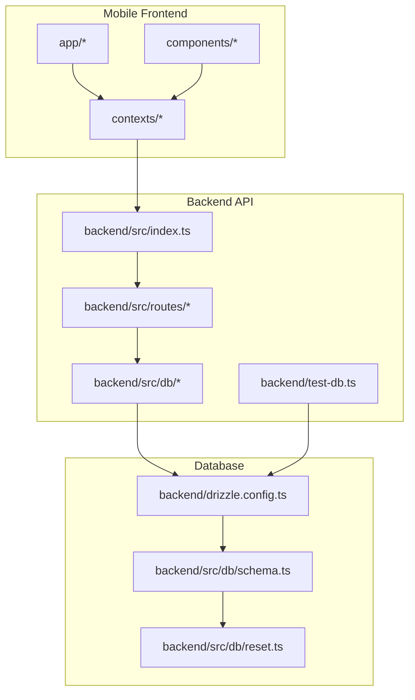
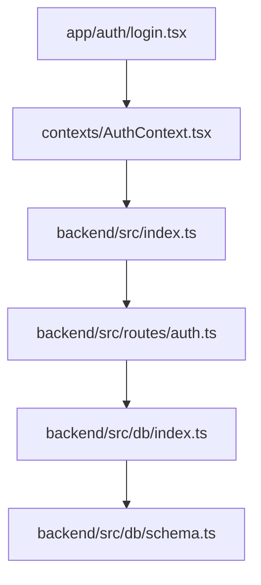
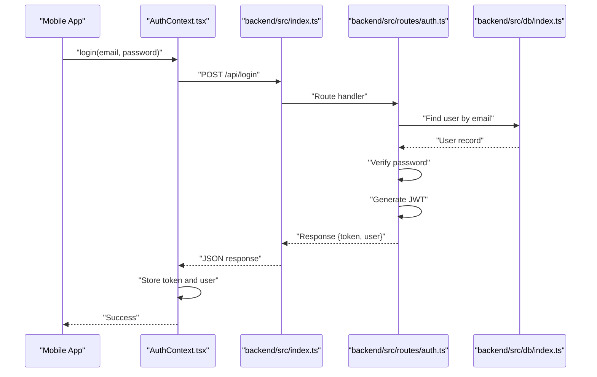
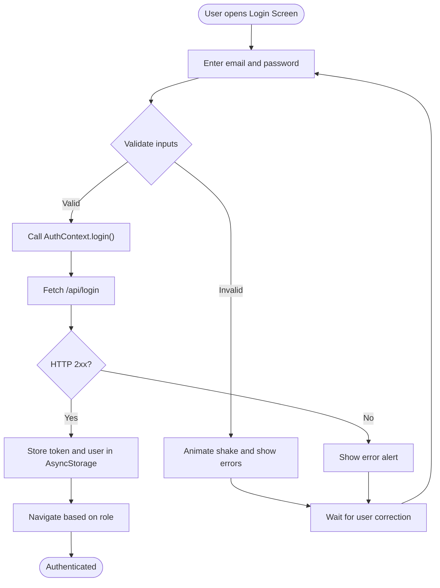
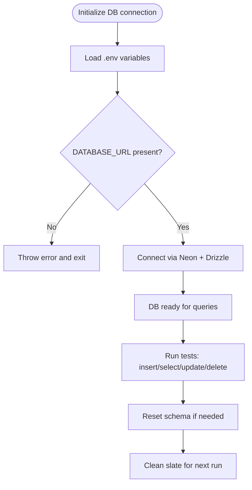
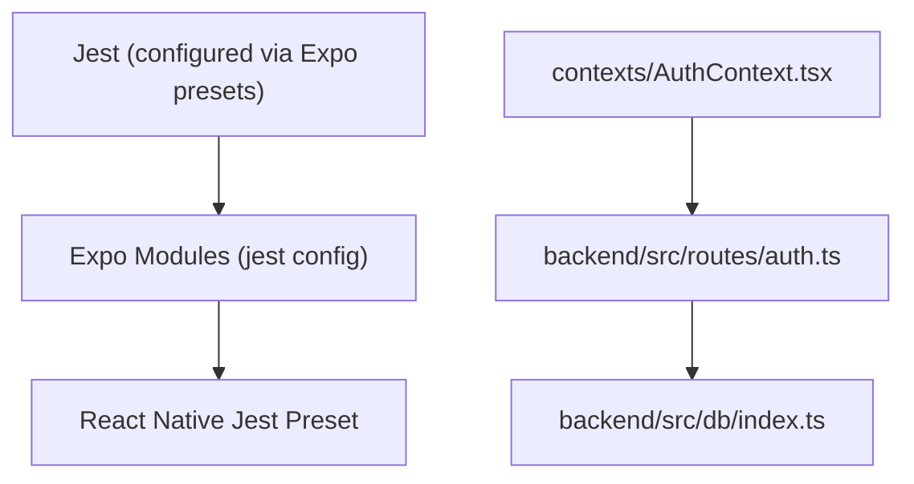

# Testing Strategy

<cite>
**Referenced Files in This Document**
- [backend/src/index.ts](file://backend/src/index.ts)
- [backend/src/routes/auth.ts](file://backend/src/routes/auth.ts)
- [backend/src/db/index.ts](file://backend/src/db/index.ts)
- [backend/src/db/reset.ts](file://backend/src/db/reset.ts)
- [backend/test-db.ts](file://backend/test-db.ts)
- [backend/package.json](file://backend/package.json)
- [package.json](file://package.json)
- [contexts/AuthContext.tsx](file://contexts/AuthContext.tsx)
- [app/auth/login.tsx](file://app/auth/login.tsx)
- [backend/drizzle.config.ts](file://backend/drizzle.config.ts)
- [drizzle.config.ts](file://drizzle.config.ts)
</cite>

## Table of Contents
1. [Introduction](#introduction)
2. [Project Structure](#project-structure)
3. [Core Components](#core-components)
4. [Architecture Overview](#architecture-overview)
5. [Detailed Component Analysis](#detailed-component-analysis)
6. [Dependency Analysis](#dependency-analysis)
7. [Performance Considerations](#performance-considerations)
8. [Troubleshooting Guide](#troubleshooting-guide)
9. [Conclusion](#conclusion)
10. [Appendices](#appendices)

## Introduction
This document defines the testing strategy and approach for the Phoenix Loan application. It covers unit testing methodologies, integration testing patterns, and API testing procedures. It also documents the test database setup, test data management, and automated testing workflows. Concrete examples demonstrate testing mobile components, backend services, and database operations. Best practices for mocks, test environments, performance/load testing, and mobile-specific considerations are included. Continuous integration, automation, and quality assurance processes are outlined, along with guidance for writing effective tests, debugging failures, and maintaining test suites.

## Project Structure
The Phoenix project comprises:
- Mobile frontend built with Expo and React Native, organized under app/, components/, contexts/, and services/.
- Backend API written in TypeScript using Hono, located under backend/src/ with routing, database schema, and migrations.
- Database layer using Drizzle ORM with PostgreSQL via Neon serverless driver.
- Shared configuration and scripts for development, building, and database operations.

**Diagram sources**
- [backend/src/index.ts:1-76](file://backend/src/index.ts#L1-L76)
- [backend/src/routes/auth.ts:1-146](file://backend/src/routes/auth.ts#L1-L146)
- [backend/src/db/index.ts:1-44](file://backend/src/db/index.ts#L1-L44)
- [backend/src/db/reset.ts:1-26](file://backend/src/db/reset.ts#L1-L26)
- [backend/test-db.ts:1-28](file://backend/test-db.ts#L1-L28)
- [backend/drizzle.config.ts](file://backend/drizzle.config.ts)
- [drizzle.config.ts](file://drizzle.config.ts)

**Section sources**
- [backend/src/index.ts:1-76](file://backend/src/index.ts#L1-L76)
- [backend/src/db/index.ts:1-44](file://backend/src/db/index.ts#L1-L44)
- [backend/src/db/reset.ts:1-26](file://backend/src/db/reset.ts#L1-L26)
- [backend/test-db.ts:1-28](file://backend/test-db.ts#L1-L28)
- [backend/package.json:1-46](file://backend/package.json#L1-L46)
- [package.json:1-84](file://package.json#L1-L84)

## Core Components
This section outlines the primary testing targets and their roles in the testing strategy.

- Authentication service and routes: Handles user registration and login, password hashing, JWT generation, and user retrieval. This is a critical integration target for unit and API tests.
- Database connectivity and schema: Drizzle ORM connects to a PostgreSQL-compatible database via Neon serverless driver. Schema definitions and reset utilities support deterministic test environments.
- Mobile authentication flow: The login screen and AuthContext orchestrate network requests, local storage, and navigation. These components are prime candidates for unit and integration tests.
- Backend server: Hono-based server with CORS, logging, health checks, and Swagger UI for documentation. Useful for API contract and integration tests.

Key testing responsibilities:
- Unit tests: Validate route handlers, database queries, and context logic in isolation.
- Integration tests: Verify end-to-end flows across mobile UI, AuthContext, backend routes, and database.
- API tests: Validate HTTP contracts, error handling, and response schemas.
- Database tests: Confirm schema correctness, migration safety, and data integrity.

**Section sources**
- [backend/src/routes/auth.ts:1-146](file://backend/src/routes/auth.ts#L1-L146)
- [backend/src/db/index.ts:1-44](file://backend/src/db/index.ts#L1-L44)
- [contexts/AuthContext.tsx:1-135](file://contexts/AuthContext.tsx#L1-L135)
- [app/auth/login.tsx:1-314](file://app/auth/login.tsx#L1-L314)
- [backend/src/index.ts:1-76](file://backend/src/index.ts#L1-L76)

## Architecture Overview
The testing architecture spans three layers:
- Mobile layer: UI components and context manage authentication state and network calls.
- Backend layer: Hono routes implement business logic and interact with the database.
- Database layer: Drizzle ORM manages schema, migrations, and connections.

**Diagram sources**
- [app/auth/login.tsx:1-314](file://app/auth/login.tsx#L1-L314)
- [contexts/AuthContext.tsx:1-135](file://contexts/AuthContext.tsx#L1-L135)
- [backend/src/index.ts:1-76](file://backend/src/index.ts#L1-L76)
- [backend/src/routes/auth.ts:1-146](file://backend/src/routes/auth.ts#L1-L146)
- [backend/src/db/index.ts:1-44](file://backend/src/db/index.ts#L1-L44)
- [backend/src/db/schema.ts:1-146](file://backend/src/db/schema.ts#L1-L146)

## Detailed Component Analysis

### Authentication API Testing
This component focuses on validating registration and login endpoints, including request validation, password hashing, and JWT issuance.

**Diagram sources**
- [contexts/AuthContext.tsx:56-79](file://contexts/AuthContext.tsx#L56-L79)
- [backend/src/index.ts:54-61](file://backend/src/index.ts#L54-L61)
- [backend/src/routes/auth.ts:95-143](file://backend/src/routes/auth.ts#L95-L143)
- [backend/src/db/index.ts:40-43](file://backend/src/db/index.ts#L40-L43)

**Section sources**
- [backend/src/routes/auth.ts:1-146](file://backend/src/routes/auth.ts#L1-L146)
- [contexts/AuthContext.tsx:56-79](file://contexts/AuthContext.tsx#L56-L79)
- [backend/src/index.ts:54-61](file://backend/src/index.ts#L54-L61)

### Mobile Authentication Flow Testing
This component validates the login screen’s UI interactions, input validation, animations, and navigation behavior.

**Diagram sources**
- [app/auth/login.tsx:93-134](file://app/auth/login.tsx#L93-L134)
- [contexts/AuthContext.tsx:56-79](file://contexts/AuthContext.tsx#L56-L79)

**Section sources**
- [app/auth/login.tsx:1-314](file://app/auth/login.tsx#L1-L314)
- [contexts/AuthContext.tsx:1-135](file://contexts/AuthContext.tsx#L1-L135)

### Database Operations Testing
This component ensures schema correctness, connection reliability, and safe reset procedures for test environments.

**Diagram sources**
- [backend/src/db/index.ts:9-43](file://backend/src/db/index.ts#L9-L43)
- [backend/src/db/reset.ts:6-23](file://backend/src/db/reset.ts#L6-L23)
- [backend/test-db.ts:11-25](file://backend/test-db.ts#L11-L25)

**Section sources**
- [backend/src/db/index.ts:1-44](file://backend/src/db/index.ts#L1-L44)
- [backend/src/db/reset.ts:1-26](file://backend/src/db/reset.ts#L1-L26)
- [backend/test-db.ts:1-28](file://backend/test-db.ts#L1-L28)

## Dependency Analysis
Testing dependencies and their relationships:

**Diagram sources**
- [contexts/AuthContext.tsx:1-135](file://contexts/AuthContext.tsx#L1-L135)
- [backend/src/routes/auth.ts:1-146](file://backend/src/routes/auth.ts#L1-L146)
- [backend/src/db/index.ts:1-44](file://backend/src/db/index.ts#L1-L44)

**Section sources**
- [contexts/AuthContext.tsx:1-135](file://contexts/AuthContext.tsx#L1-L135)
- [backend/src/routes/auth.ts:1-146](file://backend/src/routes/auth.ts#L1-L146)
- [backend/src/db/index.ts:1-44](file://backend/src/db/index.ts#L1-L44)

## Performance Considerations
- API latency: Monitor response times for authentication endpoints under varying loads.
- Database timeouts: The database connection sets a fetch timeout; tune for production and CI environments.
- Mobile rendering: Excessive animations or frequent re-renders in login screens can degrade UX under load.
- CORS and middleware overhead: Keep middleware minimal in test environments to reduce latency.

[No sources needed since this section provides general guidance]

## Troubleshooting Guide
Common issues and resolutions:
- Database connection failures: Ensure DATABASE_URL is present and reachable. The DB initializer logs connection attempts and throws if missing.
- Environment variable loading: The backend DB module reads .env manually; verify the path and format.
- Authentication errors: Validate JWT secret presence and route validation schemas.
- Mobile auth failures: Inspect AsyncStorage keys and network requests in AuthContext.

**Section sources**
- [backend/src/db/index.ts:31-38](file://backend/src/db/index.ts#L31-L38)
- [contexts/AuthContext.tsx:56-79](file://contexts/AuthContext.tsx#L56-L79)
- [backend/src/routes/auth.ts:13-30](file://backend/src/routes/auth.ts#L13-L30)

## Conclusion
The Phoenix testing strategy emphasizes robust unit, integration, and API tests aligned with the mobile-first architecture. By leveraging Drizzle ORM, Hono routes, and React Native components, teams can achieve reliable coverage. The documented database setup, environment configuration, and flow diagrams provide a blueprint for maintaining high-quality tests across development and CI.

[No sources needed since this section summarizes without analyzing specific files]

## Appendices

### Test Database Setup and Management
- Connection initialization: Loads environment variables and establishes a Neon + Drizzle connection with a fetch timeout.
- Reset utility: Drops dependent tables in reverse order to ensure clean state before schema push or tests.
- Test script utility: A small script lists users for quick verification of test data.

Best practices:
- Use the reset utility to guarantee a clean schema per test run.
- Keep DATABASE_URL consistent across local and CI environments.
- Prefer schema push over destructive migrations during tests.

**Section sources**
- [backend/src/db/index.ts:9-43](file://backend/src/db/index.ts#L9-L43)
- [backend/src/db/reset.ts:6-23](file://backend/src/db/reset.ts#L6-L23)
- [backend/test-db.ts:11-25](file://backend/test-db.ts#L11-L25)

### Automated Testing Workflows
- Scripts: The backend exposes dev, build, start, and database commands. The root project includes server and build scripts for the monorepo-like setup.
- Migration and schema: Drizzle configuration files define schema and migration settings for both backend and root projects.

Recommendations:
- Integrate database push and reset steps into CI jobs.
- Run API tests against a dedicated test database endpoint.
- Use Expo’s Jest configuration for mobile unit tests.

**Section sources**
- [backend/package.json:7-13](file://backend/package.json#L7-L13)
- [package.json:5-20](file://package.json#L5-L20)
- [backend/drizzle.config.ts](file://backend/drizzle.config.ts)
- [drizzle.config.ts](file://drizzle.config.ts)

### API Testing Procedures
- Endpoint coverage: Validate /api/login and /api/register for authentication.
- Request validation: Ensure Zod schemas enforce field constraints and return appropriate errors.
- Response handling: Confirm successful login returns token and user; unsuccessful attempts return 4xx with error messages.
- Health and docs: Use /health and /docs for operational checks and documentation validation.

**Section sources**
- [backend/src/routes/auth.ts:33-93](file://backend/src/routes/auth.ts#L33-L93)
- [backend/src/routes/auth.ts:95-143](file://backend/src/routes/auth.ts#L95-L143)
- [backend/src/index.ts:28-52](file://backend/src/index.ts#L28-L52)

### Mobile Component Testing Guidance
- UI interactions: Simulate typing, tapping, and navigation in the login screen.
- State updates: Verify error states, loading indicators, and haptic feedback.
- Context integration: Mock fetch responses and AsyncStorage to isolate component logic.
- Navigation: Assert route transitions based on user roles.

**Section sources**
- [app/auth/login.tsx:93-134](file://app/auth/login.tsx#L93-L134)
- [contexts/AuthContext.tsx:56-79](file://contexts/AuthContext.tsx#L56-L79)

### Backend Service Testing Guidance
- Route handlers: Unit-test validation, hashing, and JWT generation.
- Database queries: Mock Drizzle operations to test success and failure paths.
- Middleware: Validate CORS and logging behavior in test environments.

**Section sources**
- [backend/src/routes/auth.ts:1-146](file://backend/src/routes/auth.ts#L1-L146)
- [backend/src/db/index.ts:1-44](file://backend/src/db/index.ts#L1-L44)

### Database Operation Testing Guidance
- Schema correctness: Compare generated schema with expectations.
- Reset safety: Confirm cascade drops remove dependent records.
- Data integrity: Insert test users and verify selection and filtering.

**Section sources**
- [backend/src/db/schema.ts:1-146](file://backend/src/db/schema.ts#L1-L146)
- [backend/src/db/reset.ts:15-19](file://backend/src/db/reset.ts#L15-L19)
- [backend/test-db.ts:13-21](file://backend/test-db.ts#L13-L21)

### Performance and Load Testing Considerations
- Measure endpoint latency and error rates under simulated load.
- Monitor database query performance and connection pooling.
- Validate mobile UI responsiveness during concurrent network requests.

[No sources needed since this section provides general guidance]

### Mobile-Specific Testing Considerations
- Platform differences: Account for iOS/Android variations in keyboard handling and haptics.
- Storage persistence: Validate AsyncStorage keys and lifecycle events.
- Navigation stacks: Ensure deep linking and route guards behave consistently.

[No sources needed since this section provides general guidance]

### Continuous Integration and Quality Assurance
- Pre-commit hooks: Enforce linting and basic checks.
- CI pipeline: Build backend, run database push/reset, execute API and mobile tests, and publish artifacts.
- Coverage reporting: Track unit and integration test coverage.

[No sources needed since this section provides general guidance]

### Writing Effective Tests and Debugging Failures
- Isolation: Use mocks and test doubles to minimize external dependencies.
- Assertions: Prefer explicit assertions on status codes, response bodies, and AsyncStorage writes.
- Debugging: Log intermediate states, network payloads, and database records during test runs.
- Maintenance: Refactor shared fixtures and helpers; keep tests readable and fast.

[No sources needed since this section provides general guidance]