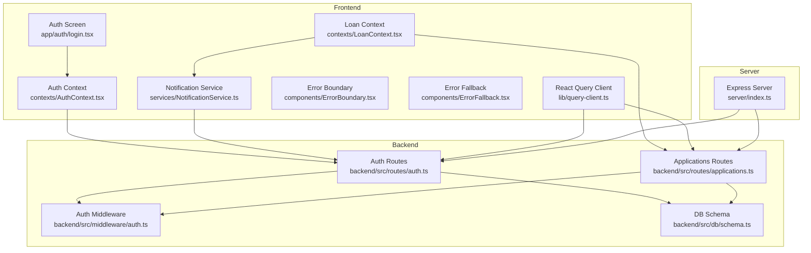
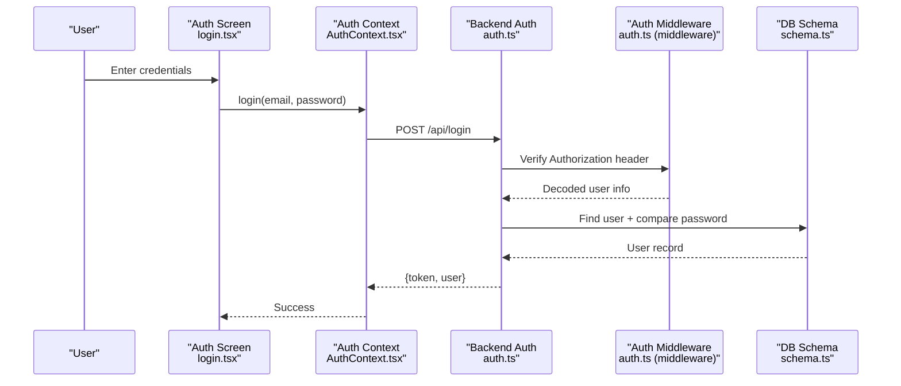
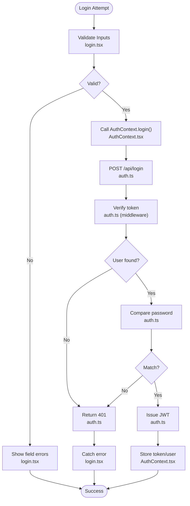
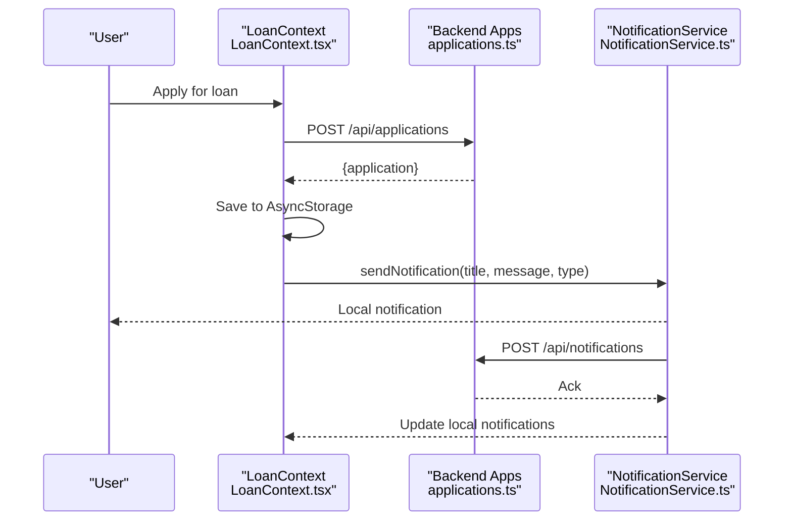
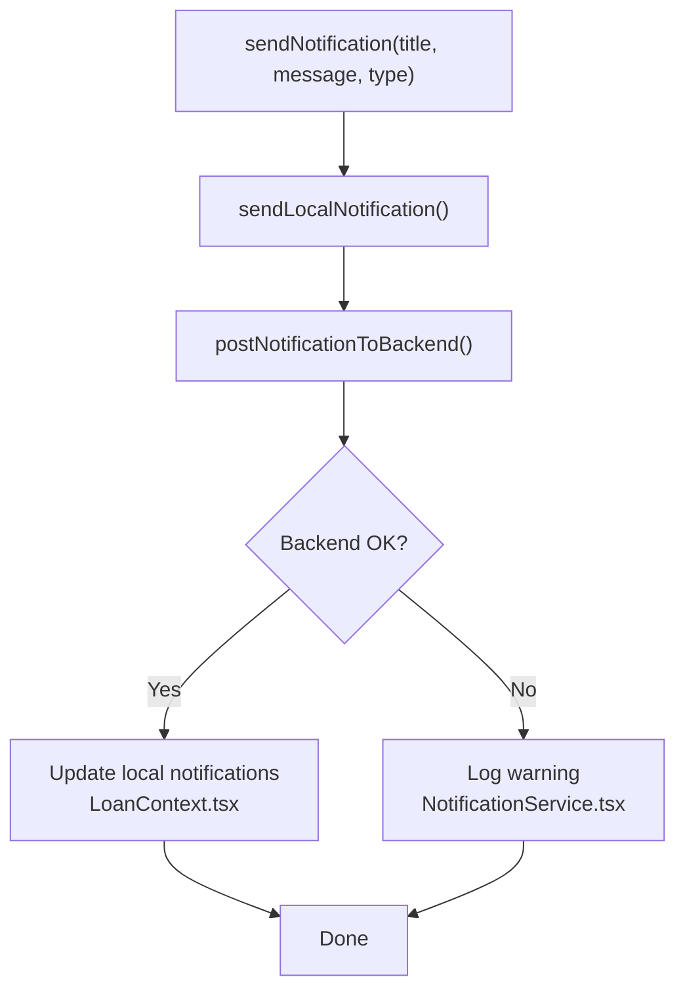
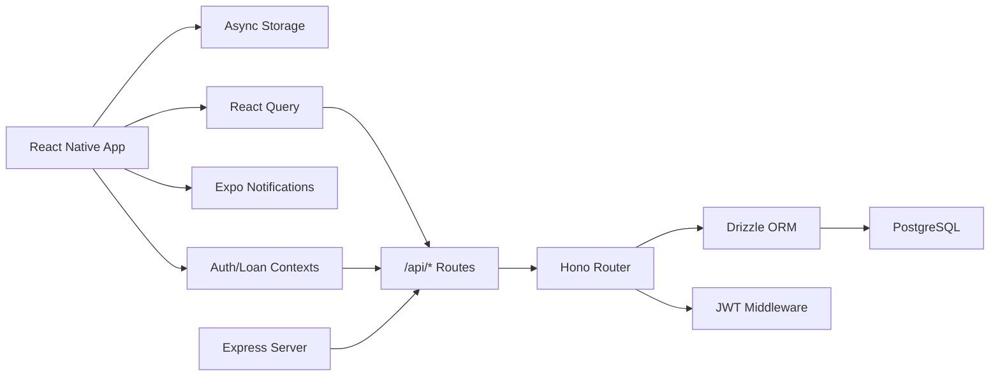

# Troubleshooting

<cite>
**Referenced Files in This Document**
- [login.tsx](file://app/auth/login.tsx)
- [AuthContext.tsx](file://contexts/AuthContext.tsx)
- [auth.ts](file://backend/src/routes/auth.ts)
- [auth.ts (middleware)](file://backend/src/middleware/auth.ts)
- [applications.ts](file://backend/src/routes/applications.ts)
- [LoanContext.tsx](file://contexts/LoanContext.tsx)
- [NotificationService.ts](file://services/NotificationService.ts)
- [ErrorBoundary.tsx](file://components/ErrorBoundary.tsx)
- [ErrorFallback.tsx](file://components/ErrorFallback.tsx)
- [query-client.ts](file://lib/query-client.ts)
- [debug-notifications.js](file://debug-notifications.js)
- [schema.ts](file://backend/src/db/schema.ts)
- [index.ts (server)](file://server/index.ts)
- [package.json](file://package.json)
</cite>

## Table of Contents
1. [Introduction](#introduction)
2. [Project Structure](#project-structure)
3. [Core Components](#core-components)
4. [Architecture Overview](#architecture-overview)
5. [Detailed Component Analysis](#detailed-component-analysis)
6. [Dependency Analysis](#dependency-analysis)
7. [Performance Considerations](#performance-considerations)
8. [Troubleshooting Guide](#troubleshooting-guide)
9. [Conclusion](#conclusion)
10. [Appendices](#appendices)

## Introduction
This document provides comprehensive troubleshooting guidance for the Phoenix Loan application. It focuses on diagnosing and resolving common issues across three primary areas:
- Authentication problems (login, registration, tokens)
- Loan application errors (submission, retrieval, status updates)
- Notification delivery failures (local and backend persistence)

It also covers debugging techniques for React Native development, backend API debugging, and database query optimization, along with platform-specific considerations, environment configuration pitfalls, escalation procedures, and preventive monitoring strategies.

## Project Structure
The Phoenix project follows a clear separation of concerns:
- Frontend (React Native) with screens, contexts, services, and error boundaries
- Backend (Hono + Drizzle ORM) with routes, middleware, and database schema
- Shared libraries for API requests and React Query configuration
- Server-side logging and CORS helpers

**Diagram sources**
- [login.tsx:80-134](file://app/auth/login.tsx#L80-L134)
- [AuthContext.tsx:56-112](file://contexts/AuthContext.tsx#L56-L112)
- [LoanContext.tsx:198-261](file://contexts/LoanContext.tsx#L198-L261)
- [NotificationService.ts:93-134](file://services/NotificationService.ts#L93-L134)
- [ErrorBoundary.tsx:16-54](file://components/ErrorBoundary.tsx#L16-L54)
- [ErrorFallback.tsx:21-104](file://components/ErrorFallback.tsx#L21-L104)
- [query-client.ts:67-80](file://lib/query-client.ts#L67-L80)
- [auth.ts:95-143](file://backend/src/routes/auth.ts#L95-L143)
- [applications.ts:110-138](file://backend/src/routes/applications.ts#L110-L138)
- [auth.ts (middleware):10-36](file://backend/src/middleware/auth.ts#L10-L36)
- [schema.ts:4-88](file://backend/src/db/schema.ts#L4-L88)
- [index.ts (server):44-98](file://server/index.ts#L44-L98)

**Section sources**
- [login.tsx:1-314](file://app/auth/login.tsx#L1-L314)
- [AuthContext.tsx:1-135](file://contexts/AuthContext.tsx#L1-L135)
- [LoanContext.tsx:1-336](file://contexts/LoanContext.tsx#L1-L336)
- [NotificationService.ts:1-135](file://services/NotificationService.ts#L1-L135)
- [ErrorBoundary.tsx:1-55](file://components/ErrorBoundary.tsx#L1-L55)
- [ErrorFallback.tsx:1-287](file://components/ErrorFallback.tsx#L1-L287)
- [query-client.ts:1-81](file://lib/query-client.ts#L1-L81)
- [auth.ts:1-146](file://backend/src/routes/auth.ts#L1-L146)
- [applications.ts:1-168](file://backend/src/routes/applications.ts#L1-L168)
- [auth.ts (middleware):1-48](file://backend/src/middleware/auth.ts#L1-L48)
- [schema.ts:1-146](file://backend/src/db/schema.ts#L1-L146)
- [index.ts (server):44-100](file://server/index.ts#L44-L100)

## Core Components
- Authentication flow: frontend login screen invokes AuthContext, which posts to backend auth routes, verifies credentials, generates JWT, and persists tokens.
- Loan application flow: LoanContext submits applications via backend routes, retrieves applications and notifications, and triggers notifications locally and remotely.
- Notifications: NotificationService handles local scheduling and backend persistence; fallbacks occur when backend fails.
- Error handling: ErrorBoundary and ErrorFallback provide graceful degradation and detailed error reporting in development.
- API client: React Query client centralizes request logic and error handling.

**Section sources**
- [login.tsx:80-134](file://app/auth/login.tsx#L80-L134)
- [AuthContext.tsx:56-112](file://contexts/AuthContext.tsx#L56-L112)
- [auth.ts:95-143](file://backend/src/routes/auth.ts#L95-L143)
- [LoanContext.tsx:198-261](file://contexts/LoanContext.tsx#L198-L261)
- [NotificationService.ts:93-134](file://services/NotificationService.ts#L93-L134)
- [ErrorBoundary.tsx:16-54](file://components/ErrorBoundary.tsx#L16-L54)
- [ErrorFallback.tsx:21-104](file://components/ErrorFallback.tsx#L21-L104)
- [query-client.ts:67-80](file://lib/query-client.ts#L67-L80)

## Architecture Overview
The system integrates frontend and backend with explicit error logging and request/response tracing.

**Diagram sources**
- [login.tsx:101-134](file://app/auth/login.tsx#L101-L134)
- [AuthContext.tsx:56-79](file://contexts/AuthContext.tsx#L56-L79)
- [auth.ts:95-143](file://backend/src/routes/auth.ts#L95-L143)
- [auth.ts (middleware):10-36](file://backend/src/middleware/auth.ts#L10-L36)
- [schema.ts:4-21](file://backend/src/db/schema.ts#L4-L21)

## Detailed Component Analysis

### Authentication Troubleshooting
Common symptoms:
- Login fails with generic message
- Registration throws validation errors
- Token missing or expired leads to 401

Diagnosis steps:
- Inspect frontend validation and error propagation in the login screen and AuthContext.
- Verify backend auth routes and middleware for Authorization header parsing and JWT verification.
- Confirm database user existence and password hashing.

**Diagram sources**
- [login.tsx:93-134](file://app/auth/login.tsx#L93-L134)
- [AuthContext.tsx:56-79](file://contexts/AuthContext.tsx#L56-L79)
- [auth.ts:95-143](file://backend/src/routes/auth.ts#L95-L143)
- [auth.ts (middleware):10-36](file://backend/src/middleware/auth.ts#L10-L36)

**Section sources**
- [login.tsx:93-134](file://app/auth/login.tsx#L93-L134)
- [AuthContext.tsx:56-79](file://contexts/AuthContext.tsx#L56-L79)
- [auth.ts:95-143](file://backend/src/routes/auth.ts#L95-L143)
- [auth.ts (middleware):10-36](file://backend/src/middleware/auth.ts#L10-L36)

### Loan Application Troubleshooting
Symptoms:
- Application submission succeeds locally but not on backend
- Notifications not persisted or not delivered
- Status updates not reflected

Diagnosis steps:
- Check LoanContext application submission flow and backend route.
- Verify NotificationService for local and backend posting.
- Confirm AsyncStorage fallbacks and error handling.

**Diagram sources**
- [LoanContext.tsx:198-261](file://contexts/LoanContext.tsx#L198-L261)
- [applications.ts:110-138](file://backend/src/routes/applications.ts#L110-L138)
- [NotificationService.ts:116-134](file://services/NotificationService.ts#L116-L134)

**Section sources**
- [LoanContext.tsx:198-261](file://contexts/LoanContext.tsx#L198-L261)
- [applications.ts:110-138](file://backend/src/routes/applications.ts#L110-L138)
- [NotificationService.ts:116-134](file://services/NotificationService.ts#L116-L134)

### Notification Delivery Troubleshooting
Symptoms:
- Local notifications show but backend persistence fails
- Push tokens unsupported in Expo Go
- Permission denied or device-only limitation

Diagnosis steps:
- Use the notification debug script to validate local scheduling.
- Check NotificationService for permission checks, channel creation, and backend posting.
- Validate AsyncStorage-backed fallbacks in LoanContext.

**Diagram sources**
- [NotificationService.ts:116-134](file://services/NotificationService.ts#L116-L134)
- [LoanContext.tsx:183-196](file://contexts/LoanContext.tsx#L183-L196)

**Section sources**
- [NotificationService.ts:26-69](file://services/NotificationService.ts#L26-L69)
- [NotificationService.ts:93-134](file://services/NotificationService.ts#L93-L134)
- [LoanContext.tsx:183-196](file://contexts/LoanContext.tsx#L183-L196)
- [debug-notifications.js:1-32](file://debug-notifications.js#L1-L32)

## Dependency Analysis
Key dependencies and their roles:
- Frontend
  - React Navigation and contexts for state management
  - Async storage for offline-first UX
  - Expo Notifications for local and remote notifications
  - React Query for API caching and error handling
- Backend
  - Hono for routing and zod validation
  - Drizzle ORM for database schema and queries
  - JWT for authentication middleware
- Server
  - Express with request logging and CORS helpers

**Diagram sources**
- [package.json:22-68](file://package.json#L22-L68)
- [AuthContext.tsx:4-4](file://contexts/AuthContext.tsx#L4-L4)
- [LoanContext.tsx:5-6](file://contexts/LoanContext.tsx#L5-L6)
- [NotificationService.ts:1-7](file://services/NotificationService.ts#L1-L7)
- [auth.ts:1-10](file://backend/src/routes/auth.ts#L1-L10)
- [applications.ts:1-8](file://backend/src/routes/applications.ts#L1-L8)
- [schema.ts:1-4](file://backend/src/db/schema.ts#L1-L4)
- [auth.ts (middleware):1-8](file://backend/src/middleware/auth.ts#L1-L8)
- [index.ts (server):44-52](file://server/index.ts#L44-L52)

**Section sources**
- [package.json:22-68](file://package.json#L22-L68)
- [AuthContext.tsx:4-4](file://contexts/AuthContext.tsx#L4-L4)
- [LoanContext.tsx:5-6](file://contexts/LoanContext.tsx#L5-L6)
- [NotificationService.ts:1-7](file://services/NotificationService.ts#L1-L7)
- [auth.ts:1-10](file://backend/src/routes/auth.ts#L1-L10)
- [applications.ts:1-8](file://backend/src/routes/applications.ts#L1-L8)
- [schema.ts:1-4](file://backend/src/db/schema.ts#L1-L4)
- [auth.ts (middleware):1-8](file://backend/src/middleware/auth.ts#L1-L8)
- [index.ts (server):44-52](file://server/index.ts#L44-L52)

## Performance Considerations
- Network latency and timeouts
  - Use React Query’s retry and staleTime to minimize redundant requests.
  - Prefer local state updates with optimistic UI and sync with backend polling.
- Database queries
  - Ensure proper indexing on frequently queried columns (e.g., user ID, timestamps).
  - Use pagination and ordering to avoid large result sets.
- Memory leaks
  - Avoid retaining references to large arrays or objects in contexts.
  - Unsubscribe from subscriptions and timers when components unmount.
- Notifications
  - Limit concurrent local notifications and batch backend writes.
  - Respect device permissions and channel importance to reduce overhead.

[No sources needed since this section provides general guidance]

## Troubleshooting Guide

### Authentication Problems
Common issues and resolutions:
- Invalid credentials
  - Symptoms: 401 Unauthorized on login; message indicates invalid credentials.
  - Resolution: Verify email format and password length; confirm user exists and password hash matches.
  - Evidence: Backend route logs and middleware token verification.
- Missing Authorization header
  - Symptoms: 401 Unauthorized on protected routes.
  - Resolution: Ensure frontend sends Authorization: Bearer <token>; verify token storage and retrieval.
- JWT signature mismatch
  - Symptoms: 401 Invalid token.
  - Resolution: Confirm JWT_SECRET environment variable is consistent across frontend and backend.

Diagnostic references:
- [login.tsx:127-134](file://app/auth/login.tsx#L127-L134)
- [AuthContext.tsx:56-79](file://contexts/AuthContext.tsx#L56-L79)
- [auth.ts:95-143](file://backend/src/routes/auth.ts#L95-L143)
- [auth.ts (middleware):10-36](file://backend/src/middleware/auth.ts#L10-L36)

### Loan Application Errors
Common issues and resolutions:
- Submission fails silently
  - Symptoms: No backend application ID returned; local save succeeds.
  - Resolution: Inspect backend application route for X-User-Id header and validation; check for database insert errors.
- Status not updating
  - Symptoms: Local status transitions but backend remains unchanged.
  - Resolution: Implement periodic refresh and reconcile local state with backend.
- Notification not persisted
  - Symptoms: Local notification fires but backend fails.
  - Resolution: Validate backend notification endpoint and AsyncStorage fallback logic.

Diagnostic references:
- [LoanContext.tsx:198-261](file://contexts/LoanContext.tsx#L198-L261)
- [applications.ts:110-138](file://backend/src/routes/applications.ts#L110-L138)
- [NotificationService.ts:116-134](file://services/NotificationService.ts#L116-L134)

### Notification Delivery Failures
Common issues and resolutions:
- Local notifications work but backend fails
  - Symptoms: Console warnings about backend failure; local notifications still show.
  - Resolution: Retry mechanism and fallback to AsyncStorage; verify API endpoint availability.
- Push tokens unsupported in Expo Go
  - Symptoms: Null token returned; notifications require development builds.
  - Resolution: Use development builds for push token registration; local notifications remain functional.
- Permission denied
  - Symptoms: No notifications shown; permission status not granted.
  - Resolution: Prompt user to grant permissions; handle non-granted status gracefully.

Diagnostic references:
- [NotificationService.ts:26-69](file://services/NotificationService.ts#L26-L69)
- [NotificationService.ts:93-134](file://services/NotificationService.ts#L93-L134)
- [debug-notifications.js:1-32](file://debug-notifications.js#L1-L32)

### Debugging Techniques
- React Native debugging
  - Use ErrorBoundary and ErrorFallback to capture and present errors with stack traces.
  - Enable __DEV__ mode to expose error details modal.
- Backend API debugging
  - Inspect server request logging for method, path, status, and response payload.
  - Use middleware to enforce Authorization and role checks.
- Database query optimization
  - Review schema relationships and ensure appropriate indices on foreign keys and timestamps.
  - Use ORDER BY and LIMIT to constrain result sets.

Diagnostic references:
- [ErrorBoundary.tsx:16-54](file://components/ErrorBoundary.tsx#L16-L54)
- [ErrorFallback.tsx:21-104](file://components/ErrorFallback.tsx#L21-L104)
- [index.ts (server):67-98](file://server/index.ts#L67-L98)
- [schema.ts:4-88](file://backend/src/db/schema.ts#L4-L88)

### Environment Configuration Errors
Common issues and resolutions:
- API URL misconfiguration
  - Symptoms: Requests to incorrect host or port.
  - Resolution: Set EXPO_PUBLIC_API_URL consistently across environments; verify runtime value.
- JWT secret mismatch
  - Symptoms: 401 Invalid token across environments.
  - Resolution: Ensure JWT_SECRET is identical on frontend and backend.
- Domain not set
  - Symptoms: API client throws when EXPO_PUBLIC_DOMAIN is unset.
  - Resolution: Define EXPO_PUBLIC_DOMAIN and ensure HTTPS URL construction.

Diagnostic references:
- [AuthContext.tsx:4-4](file://contexts/AuthContext.tsx#L4-L4)
- [query-client.ts:8-18](file://lib/query-client.ts#L8-L18)
- [auth.ts (middleware):20-27](file://backend/src/middleware/auth.ts#L20-L27)

### Platform-Specific Issues
- Expo Go limitations
  - Push tokens are not supported; use development builds for push notifications.
- Device-only behavior
  - Notifications require a physical device; emulators may not receive push notifications.
- Web vs native differences
  - Some APIs behave differently on web; test on target platforms.

Diagnostic references:
- [NotificationService.ts:26-36](file://services/NotificationService.ts#L26-L36)

### Escalation Procedures, Support Resources, and Community Help
Escalation:
- Capture detailed logs from both frontend and backend.
- Provide environment variables and request/response samples.
- Include error stack traces from ErrorFallback modal.

Support resources:
- Community forums and GitHub Discussions for the Phoenix project.
- Expo forums for platform-specific issues.
- Backend framework documentation for Hono and Drizzle ORM.

[No sources needed since this section provides general guidance]

### Preventive Measures, Monitoring Setup, and Proactive Detection
Preventive measures:
- Enforce input validation on both frontend and backend.
- Implement circuit breakers for external services.
- Use structured logging with correlation IDs.

Monitoring setup:
- Backend: Add request duration histograms and error counters.
- Frontend: Track API error rates and retry counts via React Query Devtools.

Proactive detection:
- Health checks for database connectivity and JWT signing.
- Alert on repeated 4xx/5xx responses from critical endpoints.

[No sources needed since this section provides general guidance]

## Conclusion
This guide consolidates actionable troubleshooting steps for authentication, loan applications, and notifications, backed by concrete references to the codebase. By leveraging built-in error boundaries, server request logging, and service-specific diagnostics, teams can quickly isolate and resolve issues while establishing robust monitoring and preventive controls.

[No sources needed since this section summarizes without analyzing specific files]

## Appendices

### Quick Reference: Common Error Codes and Causes
- 400 Bad Request
  - Cause: Validation errors or malformed requests.
  - Evidence: Route-level validation and response messages.
  - References: [auth.ts:33-93](file://backend/src/routes/auth.ts#L33-L93), [applications.ts:110-138](file://backend/src/routes/applications.ts#L110-L138)
- 401 Unauthorized
  - Cause: Missing or invalid Authorization header/token.
  - Evidence: Middleware token verification and response.
  - References: [auth.ts (middleware):14-31](file://backend/src/middleware/auth.ts#L14-L31)
- 403 Forbidden
  - Cause: Admin-only access required.
  - Evidence: Role check in middleware.
  - References: [auth.ts (middleware):39-47](file://backend/src/middleware/auth.ts#L39-L47)
- 404 Not Found
  - Cause: Resource not found.
  - Evidence: Route handlers returning 404.
  - References: [applications.ts:99-101](file://backend/src/routes/applications.ts#L99-L101)
- 500 Internal Server Error
  - Cause: Unexpected server-side exceptions.
  - Evidence: Route-level try/catch blocks.
  - References: [auth.ts:89-92](file://backend/src/routes/auth.ts#L89-L92), [applications.ts:135-137](file://backend/src/routes/applications.ts#L135-L137)

### Useful Scripts and Tools
- Notification debug script
  - Purpose: Validate local notification scheduling.
  - Usage: Run the script to schedule a test notification.
  - References: [debug-notifications.js:1-32](file://debug-notifications.js#L1-L32)

[No sources needed since this section provides general guidance]