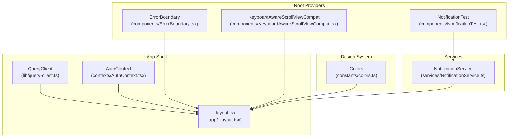
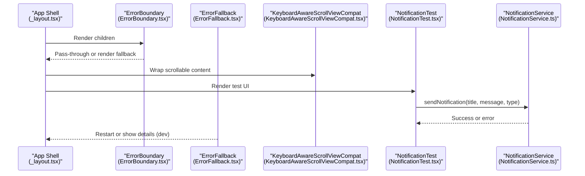
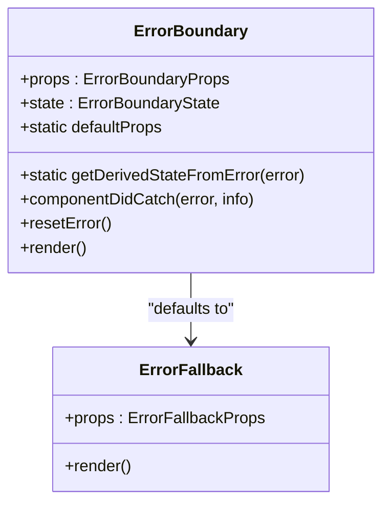
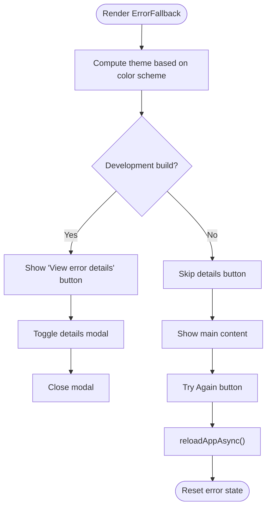
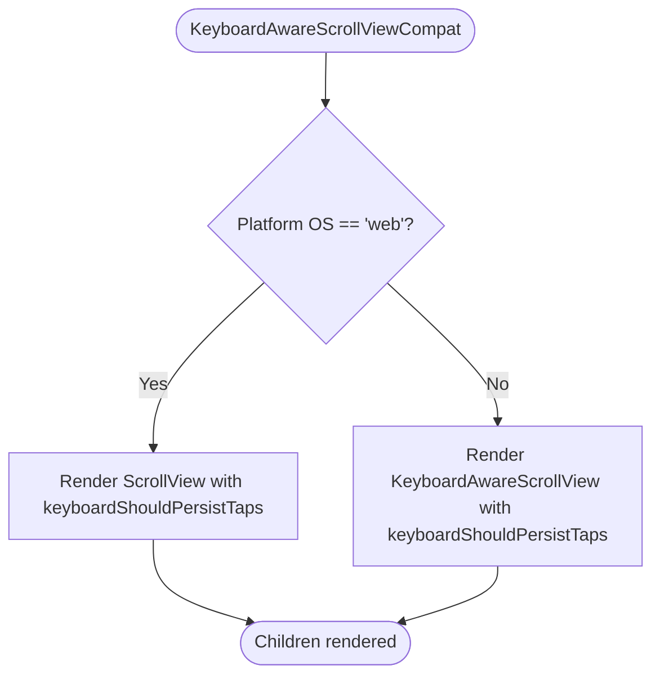
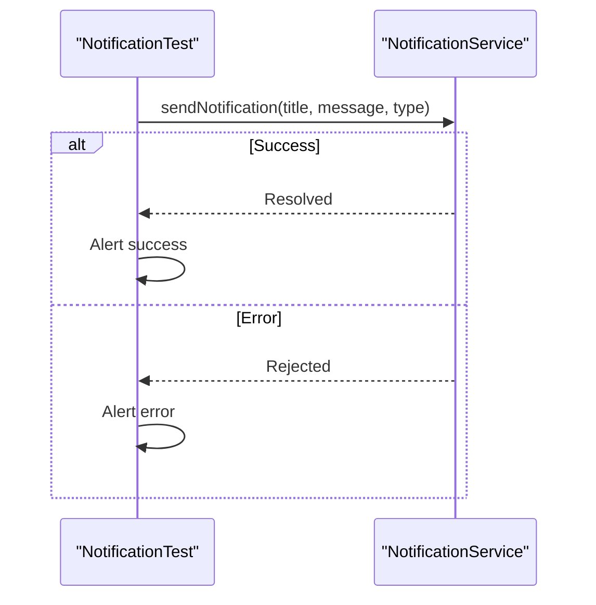
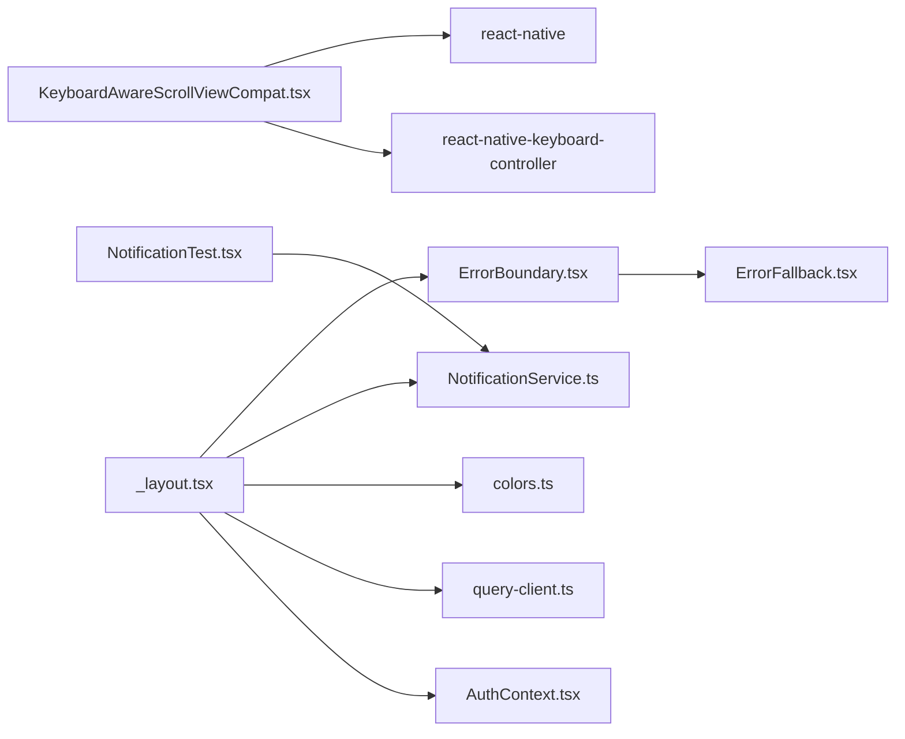

# UI Components

<cite>
**Referenced Files in This Document**
- [ErrorBoundary.tsx](file://components/ErrorBoundary.tsx)
- [ErrorFallback.tsx](file://components/ErrorFallback.tsx)
- [KeyboardAwareScrollViewCompat.tsx](file://components/KeyboardAwareScrollViewCompat.tsx)
- [NotificationTest.tsx](file://components/NotificationTest.tsx)
- [NotificationService.ts](file://services/NotificationService.ts)
- [colors.ts](file://constants/colors.ts)
- [AuthContext.tsx](file://contexts/AuthContext.tsx)
- [_layout.tsx](file://app/_layout.tsx)
- [query-client.ts](file://lib/query-client.ts)
- [package.json](file://package.json)
</cite>

## Table of Contents
1. [Introduction](#introduction)
2. [Project Structure](#project-structure)
3. [Core Components](#core-components)
4. [Architecture Overview](#architecture-overview)
5. [Detailed Component Analysis](#detailed-component-analysis)
6. [Dependency Analysis](#dependency-analysis)
7. [Performance Considerations](#performance-considerations)
8. [Troubleshooting Guide](#troubleshooting-guide)
9. [Conclusion](#conclusion)
10. [Appendices](#appendices)

## Introduction
This document describes the shared UI component library used across the Phoenix application. It focuses on the error boundary, keyboard-aware scroll view, and notification testing components, and explains how they integrate with the broader design system and runtime providers. It also covers component composition patterns, styling integration, accessibility, cross-platform compatibility, performance, and testing strategies.

## Project Structure
The shared UI components live under the components directory and are consumed by the root layout and screens. They rely on platform-specific libraries and design tokens for consistent visuals.

**Diagram sources**
- [ErrorBoundary.tsx:1-55](file://components/ErrorBoundary.tsx#L1-L55)
- [KeyboardAwareScrollViewCompat.tsx:1-31](file://components/KeyboardAwareScrollViewCompat.tsx#L1-L31)
- [NotificationTest.tsx:1-29](file://components/NotificationTest.tsx#L1-L29)
- [NotificationService.ts:1-135](file://services/NotificationService.ts#L1-L135)
- [colors.ts:1-64](file://constants/colors.ts#L1-L64)
- [_layout.tsx:1-83](file://app/_layout.tsx#L1-L83)
- [query-client.ts:1-81](file://lib/query-client.ts#L1-L81)
- [AuthContext.tsx:1-135](file://contexts/AuthContext.tsx#L1-L135)

**Section sources**
- [_layout.tsx:65-81](file://app/_layout.tsx#L65-L81)
- [package.json:22-68](file://package.json#L22-L68)

## Core Components
- ErrorBoundary: A class-based error boundary that catches rendering errors and renders a fallback UI.
- ErrorFallback: A themed fallback component with restart and details disclosure for development.
- KeyboardAwareScrollViewCompat: A cross-platform wrapper around a keyboard-aware scroll view for iOS/Android and a plain ScrollView for web.
- NotificationTest: A simple UI component to trigger local notifications via the NotificationService.

**Section sources**
- [ErrorBoundary.tsx:1-55](file://components/ErrorBoundary.tsx#L1-L55)
- [ErrorFallback.tsx:1-287](file://components/ErrorFallback.tsx#L1-L287)
- [KeyboardAwareScrollViewCompat.tsx:1-31](file://components/KeyboardAwareScrollViewCompat.tsx#L1-L31)
- [NotificationTest.tsx:1-29](file://components/NotificationTest.tsx#L1-L29)

## Architecture Overview
The root layout composes providers and the ErrorBoundary at the top level. The ErrorBoundary wraps the entire app shell, ensuring unhandled errors are caught and presented gracefully. Keyboard-aware scrolling is normalized via a compatibility component. Notifications are handled by a service that integrates with Expo Notifications and optionally posts to the backend.

**Diagram sources**
- [_layout.tsx:65-81](file://app/_layout.tsx#L65-L81)
- [ErrorBoundary.tsx:16-54](file://components/ErrorBoundary.tsx#L16-L54)
- [ErrorFallback.tsx:21-179](file://components/ErrorFallback.tsx#L21-L179)
- [KeyboardAwareScrollViewCompat.tsx:10-30](file://components/KeyboardAwareScrollViewCompat.tsx#L10-L30)
- [NotificationTest.tsx:5-28](file://components/NotificationTest.tsx#L5-L28)
- [NotificationService.ts:116-134](file://services/NotificationService.ts#L116-L134)

## Detailed Component Analysis

### Error Boundary
- Purpose: Catches rendering errors anywhere below it and displays a fallback UI.
- Props:
  - children: Wrapped content.
  - FallbackComponent: Optional custom fallback component type.
  - onError: Optional callback receiving error and stack trace.
- Behavior:
  - Uses static getDerivedStateFromError to flip to fallback state.
  - Calls onError in componentDidCatch.
  - Exposes resetError to clear the error state.
- Composition:
  - Defaults to ErrorFallback if none provided.
  - Used at the root to protect the entire app.

**Diagram sources**
- [ErrorBoundary.tsx:16-54](file://components/ErrorBoundary.tsx#L16-L54)
- [ErrorFallback.tsx:21-180](file://components/ErrorFallback.tsx#L21-L180)

**Section sources**
- [ErrorBoundary.tsx:4-54](file://components/ErrorBoundary.tsx#L4-L54)
- [ErrorFallback.tsx:16-180](file://components/ErrorFallback.tsx#L16-L180)

### Error Fallback
- Purpose: Present a friendly UI when an error occurs, with restart and dev details.
- Features:
  - Dark/light theme support via useColorScheme.
  - Safe area insets handling.
  - Restart action via reloadAppAsync.
  - Modal with formatted error details in development.
- Accessibility:
  - Buttons include accessibilityLabel and accessibilityRole.
  - Modal uses onRequestClose and close affordance.

**Diagram sources**
- [ErrorFallback.tsx:21-179](file://components/ErrorFallback.tsx#L21-L179)

**Section sources**
- [ErrorFallback.tsx:21-179](file://components/ErrorFallback.tsx#L21-L179)

### Keyboard-Aware Scroll View Compatibility
- Purpose: Normalize keyboard-aware scrolling across platforms.
- Behavior:
  - On web: renders a plain ScrollView with keyboardShouldPersistTaps default handling.
  - On native: renders a keyboard-aware ScrollView from react-native-keyboard-controller.
- Props:
  - Accepts all ScrollView props plus keyboardShouldPersistTaps with a sensible default.

**Diagram sources**
- [KeyboardAwareScrollViewCompat.tsx:10-30](file://components/KeyboardAwareScrollViewCompat.tsx#L10-L30)

**Section sources**
- [KeyboardAwareScrollViewCompat.tsx:8-30](file://components/KeyboardAwareScrollViewCompat.tsx#L8-L30)

### Notification Testing Component
- Purpose: Provide a UI to trigger a local notification and surface feedback.
- Behavior:
  - Calls sendNotification with title, message, and type.
  - Displays success/error alerts based on outcome.
- Integration:
  - Uses NotificationService to schedule a local notification and optionally persist to backend.

**Diagram sources**
- [NotificationTest.tsx:5-28](file://components/NotificationTest.tsx#L5-L28)
- [NotificationService.ts:116-134](file://services/NotificationService.ts#L116-L134)

**Section sources**
- [NotificationTest.tsx:1-29](file://components/NotificationTest.tsx#L1-L29)
- [NotificationService.ts:71-91](file://services/NotificationService.ts#L71-L91)

## Dependency Analysis
- ErrorBoundary depends on ErrorFallback for rendering fallback UI.
- ErrorFallback uses platform primitives (reloadAppAsync, useColorScheme, Modal, Safe Area).
- KeyboardAwareScrollViewCompat depends on react-native-keyboard-controller and react-native.
- NotificationTest depends on NotificationService for scheduling and persistence.
- Root layout composes ErrorBoundary, providers, and routing; it also registers for push notifications.

**Diagram sources**
- [ErrorBoundary.tsx:1-2](file://components/ErrorBoundary.tsx#L1-L2)
- [ErrorFallback.tsx:1-14](file://components/ErrorFallback.tsx#L1-L14)
- [KeyboardAwareScrollViewCompat.tsx:2-6](file://components/KeyboardAwareScrollViewCompat.tsx#L2-L6)
- [NotificationTest.tsx:2-3](file://components/NotificationTest.tsx#L2-L3)
- [NotificationService.ts:1-5](file://services/NotificationService.ts#L1-L5)
- [_layout.tsx:6-14](file://app/_layout.tsx#L6-L14)
- [colors.ts:1-64](file://constants/colors.ts#L1-L64)
- [query-client.ts:1-81](file://lib/query-client.ts#L1-L81)
- [AuthContext.tsx:1-2](file://contexts/AuthContext.tsx#L1-L2)

**Section sources**
- [package.json:22-68](file://package.json#L22-L68)

## Performance Considerations
- ErrorBoundary is lightweight and only active on error paths; overhead is minimal.
- KeyboardAwareScrollViewCompat avoids unnecessary wrappers on web, reducing render tree depth.
- NotificationService schedules local notifications immediately and defers backend posting; failures do not block UI.
- Root providers are initialized once at startup; consider lazy initialization for heavy services if needed.

[No sources needed since this section provides general guidance]

## Troubleshooting Guide
- ErrorBoundary not catching errors:
  - Ensure the component is placed at the root and not wrapped inside another boundary unintentionally.
  - Confirm componentDidCatch is invoked by checking the onError callback.
- ErrorFallback not appearing:
  - Verify the child component throws during render.
  - Check that FallbackComponent is not overridden to null.
- Keyboard-aware scroll not working on web:
  - Confirm platform detection logic and that the component renders ScrollView on web.
- NotificationTest does nothing:
  - Verify NotificationService.sendNotification is reachable and not blocked by permissions or backend errors.
  - Check that the Alert flow executes after promise resolution.

**Section sources**
- [ErrorBoundary.tsx:32-36](file://components/ErrorBoundary.tsx#L32-L36)
- [ErrorFallback.tsx:37-44](file://components/ErrorFallback.tsx#L37-L44)
- [KeyboardAwareScrollViewCompat.tsx:15-21](file://components/KeyboardAwareScrollViewCompat.tsx#L15-L21)
- [NotificationTest.tsx:6-17](file://components/NotificationTest.tsx#L6-L17)
- [NotificationService.ts:116-134](file://services/NotificationService.ts#L116-L134)

## Conclusion
The shared UI component library centers on robust error handling, cross-platform keyboard-aware scrolling, and a simple notification testing UI. These components integrate cleanly with the root layout and design system tokens, enabling consistent UX across platforms while maintaining performance and accessibility.

[No sources needed since this section summarizes without analyzing specific files]

## Appendices

### Prop and Usage References
- ErrorBoundary props:
  - children: Required.
  - FallbackComponent: Optional component type.
  - onError: Optional callback with signature (error, stackTrace).
- ErrorFallback props:
  - error: Error instance.
  - resetError: Function to clear error state.
- KeyboardAwareScrollViewCompat props:
  - keyboardShouldPersistTaps: Default "handled".
  - All ScrollView props are forwarded.
- NotificationTest:
  - Renders a button that triggers sendNotification and shows an alert.

**Section sources**
- [ErrorBoundary.tsx:4-7](file://components/ErrorBoundary.tsx#L4-L7)
- [ErrorFallback.tsx:16-19](file://components/ErrorFallback.tsx#L16-L19)
- [KeyboardAwareScrollViewCompat.tsx:8-14](file://components/KeyboardAwareScrollViewCompat.tsx#L8-L14)
- [NotificationTest.tsx:5-28](file://components/NotificationTest.tsx#L5-L28)

### Design System Integration
- Color tokens are centralized and consumed by components and screens for consistent theming.
- Fonts and provider setup are managed at the root layout.

**Section sources**
- [colors.ts:5-63](file://constants/colors.ts#L5-L63)
- [_layout.tsx:32-36](file://app/_layout.tsx#L32-L36)

### Cross-Platform Notes
- Web vs native behavior is explicitly handled in KeyboardAwareScrollViewCompat.
- ErrorFallback uses platform-specific APIs only in development mode checks.

**Section sources**
- [KeyboardAwareScrollViewCompat.tsx:15-21](file://components/KeyboardAwareScrollViewCompat.tsx#L15-L21)
- [ErrorFallback.tsx:60-78](file://components/ErrorFallback.tsx#L60-L78)

### Accessibility Compliance Notes
- Buttons include accessibilityLabel and accessibilityRole.
- Modal includes close affordances and handles onRequestClose.
- Color scheme awareness supports dark mode contrast.

**Section sources**
- [ErrorFallback.tsx:65-77](file://components/ErrorFallback.tsx#L65-L77)
- [ErrorFallback.tsx:133-143](file://components/ErrorFallback.tsx#L133-L143)

### Testing Strategies
- NotificationTest provides a manual smoke-check for local notifications.
- For automated testing, use the documented runTest guidance to validate end-to-end flows.

**Section sources**
- [NotificationTest.tsx:5-28](file://components/NotificationTest.tsx#L5-L28)
- [.local skills testing reference:45-61](file://.local/skills/testing/SKILL.md#L45-L61)